# Project Design Document: Gradle Shadow Plugin

**Version:** 1.1
**Date:** October 26, 2023
**Author:** AI Software Architect

## 1. Introduction

This document provides an enhanced design overview of the Gradle Shadow plugin, a widely used Gradle plugin for creating shaded JAR files (also known as Uber JARs or fat JARs). This iteration builds upon the previous version, offering greater detail and clarity, particularly focusing on aspects relevant for security threat modeling. The aim is to provide a robust understanding of the plugin's architecture, components, and data flow to facilitate comprehensive security analysis.

## 2. Goals and Scope

The primary goal remains to clearly articulate the design of the Gradle Shadow plugin to facilitate security analysis and threat identification. The scope of this document includes:

*   A detailed overview of the plugin's functionality and its role within the Gradle build process.
*   In-depth identification and description of key architectural components, emphasizing their security-relevant functions.
*   A refined description of the data flow within the plugin and its interaction with the Gradle build process, highlighting potential points of vulnerability.
*   Expanded preliminary identification of potential security considerations, providing more context and examples.

This document continues to exclude:

*   In-depth implementation details of the Gradle core.
*   Exhaustive enumeration of all configuration options, though key configuration areas impacting security will be addressed.
*   Detailed code-level analysis of the plugin's source code.
*   The actual threat model document itself; this document serves as a foundational input for that process.

## 3. Overview of the Gradle Shadow Plugin

The Gradle Shadow plugin streamlines the creation of self-contained executable JAR files by bundling project outputs and their dependencies. This involves several critical steps:

*   **Comprehensive Dependency Resolution:** Leveraging Gradle's dependency management to identify all necessary libraries, including transitive dependencies.
*   **Selective Relocation (Shading):**  Renaming packages of chosen dependencies to prevent class name collisions when multiple libraries contain identically named classes. This is a core function with significant security implications.
*   **Resource Aggregation and Merging:** Combining resources (e.g., property files, configuration files) from the project and its dependencies, requiring careful conflict resolution.
*   **Manifest Manipulation:**  Modifying the JAR's manifest file to specify the main class and other attributes for execution.
*   **Final JAR Assembly:**  Creating the ultimate shaded JAR file containing the project's code, shaded dependencies, and merged resources.

The plugin integrates seamlessly into the Gradle build lifecycle, introducing specific tasks and configurations that extend the standard Java plugin's capabilities.

## 4. Architectural Design

The Gradle Shadow plugin operates within the broader context of the Gradle build. The following diagram provides a more detailed view of the key components and their interactions, emphasizing data flow:

```mermaid
graph LR
    subgraph "Gradle Build Environment"
        A("Project Source Code") --> B("build.gradle Configuration");
        B --> C("Gradle Core Engine");
        C --> D{"Dependency Resolution"};
        D -- "Dependency Metadata" --> E("Dependency Cache");
        E --> D;
        D -- "Resolved Dependencies" --> F("Compile Tasks");
        F -- "Project Classes & Resources" --> G("Project Output (JAR)");
    end

    subgraph "Shadow Plugin Activities"
        H("Shadow Plugin Configuration") --> I("Shadow Task Invocation");
        I -- "Project JAR & Dependencies" --> J{"Dependency Analysis"};
        J -- "Selected Dependencies & Shading Rules" --> K{"Transformation Engine"};
        K -- "Transformed Classes" --> L{"Resource Aggregation & Merging"};
        L -- "Merged Resources" --> M{"Manifest Modification"};
        M -- "Modified Manifest" --> N("Shaded JAR Output");
    end

    G --> I;
    D --> J;

    style A fill:#f9f,stroke:#333,stroke-width:2px
    style B fill:#ccf,stroke:#333,stroke-width:2px
    style C fill:#ccf,stroke:#333,stroke-width:2px
    style D fill:#ccf,stroke:#333,stroke-width:2px
    style E fill:#ccf,stroke:#333,stroke-width:2px
    style F fill:#ccf,stroke:#333,stroke-width:2px
    style G fill:#ccf,stroke:#333,stroke-width:2px
    style H fill:#aaf,stroke:#333,stroke-width:2px
    style I fill:#aaf,stroke:#333,stroke-width:2px
    style J fill:#aaf,stroke:#333,stroke-width:2px
    style K fill:#aaf,stroke:#333,stroke-width:2px
    style L fill:#aaf,stroke:#333,stroke-width:2px
    style M fill:#aaf,stroke:#333,stroke-width:2px
    style N fill:#aaf,stroke:#333,stroke-width:2px
```

### 4.1. Key Components (Enhanced Descriptions)

*   **Project Source Code:** The codebase of the application being built. This is the initial input and not directly managed by the Shadow plugin but is the reason for its existence.
*   **`build.gradle` Configuration:**  The Gradle build script containing the Shadow plugin's configuration details, including shading rules, dependency inclusions/exclusions, and resource merging strategies. This is a critical point for security configuration.
*   **Gradle Core Engine:** The heart of the Gradle build system, responsible for interpreting the build script, managing tasks, and orchestrating the build process.
*   **Dependency Resolution:**  Gradle's process of determining the exact versions and locations of all project dependencies, including transitive ones. This is a crucial stage where malicious dependencies could be introduced.
*   **Dependency Cache:**  A local cache where Gradle stores downloaded dependencies. The integrity of this cache is important.
*   **Compile Tasks:** Standard Gradle tasks that compile the project's source code into bytecode and package resources into a standard JAR.
*   **Project Output (JAR):** The standard, non-shaded JAR file produced by the project's compilation and packaging tasks. This serves as the primary input for the Shadow plugin.
*   **Shadow Plugin Configuration:**  The specific settings within the `build.gradle` file that dictate how the Shadow plugin operates. Incorrect or malicious configuration here can have significant security implications.
*   **Shadow Task Invocation:** The execution of the `shadowJar` task (or a custom-named shadow task), which triggers the plugin's core functionality.
*   **Dependency Analysis:** The Shadow plugin examines the project's dependencies (obtained from Gradle's resolution) and the plugin's configuration to determine which dependencies to include and whether they need to be shaded.
*   **Transformation Engine:** The core of the shading process. This component uses bytecode manipulation libraries (like ASM) to rename packages of selected dependencies. Errors or vulnerabilities in this engine could lead to corrupted or exploitable bytecode.
*   **Resource Aggregation & Merging:**  This component gathers resource files from the project and its dependencies. It applies configured merging strategies (e.g., replacing, appending, or erroring on conflicts) to create a unified set of resources for the shaded JAR. Improper merging can lead to security vulnerabilities.
*   **Manifest Modification:** The Shadow plugin updates the manifest file of the shaded JAR. This includes setting the `Main-Class` attribute and potentially other attributes. Malicious modification here could lead to unintended execution behavior.
*   **Shaded JAR Output:** The final, self-contained JAR file produced by the Shadow plugin, containing the project's code, shaded dependencies, and merged resources. The integrity of this output is paramount.

## 5. Data Flow (Refined)

The data flow within the Shadow plugin, with a focus on security-relevant transformations, is as follows:

1. **Gradle initiates the build:**  The build process starts based on the instructions in `build.gradle`.
2. **Dependencies are resolved:** Gradle resolves all project dependencies, retrieving metadata and potentially downloading artifacts. This is a point where dependency poisoning could occur.
3. **Compilation and initial packaging:** The project's source code is compiled, and resources are packaged into the initial project JAR.
4. **Shadow task is invoked:** The `shadowJar` task is executed, receiving the project's output JAR and the resolved dependencies as input.
5. **Configuration is loaded:** The Shadow plugin reads its configuration from `build.gradle`, including crucial shading rules and resource merging strategies. The security of this configuration is vital.
6. **Dependencies are analyzed:** The plugin analyzes the dependencies based on the configuration, determining which to include and potentially shade. Incorrect analysis could lead to the inclusion of unwanted or vulnerable libraries.
7. **Bytecode transformation (Shading):** The transformation engine modifies the bytecode of selected dependencies according to the configured shading rules. This is a complex process where errors could introduce vulnerabilities or break functionality. The integrity of the bytecode manipulation library is critical here.
8. **Resources are aggregated and merged:** Resources from the project and its dependencies are combined. Conflict resolution strategies are applied. Vulnerabilities can arise from incorrect merging, such as overwriting critical project resources with dependency resources.
9. **Manifest is modified:** The JAR's manifest file is updated, potentially setting the main class and other attributes. Malicious modification here could lead to the execution of unintended code.
10. **Shaded JAR is packaged:** The transformed classes, merged resources, and the project's own classes are packaged into the final shaded JAR. The integrity of this packaging process is important.
11. **Shaded JAR is output:** The final shaded JAR file is written to the specified output directory. Securing the output directory and the artifact itself is essential.

## 6. Security Considerations (Expanded)

Building upon the initial considerations, here are more detailed security aspects to consider during threat modeling:

*   **Malicious Dependency Introduction:**  Attackers could attempt to inject malicious dependencies into the project's dependency graph. The Shadow plugin would then bundle this malicious code into the shaded JAR. Supply chain security practices are crucial here.
*   **Shading Logic Vulnerabilities:** Errors in the shading configuration (e.g., incorrect package relocation) or vulnerabilities within the transformation engine itself could lead to:
    *   **Classloading issues:**  Preventing the application from starting or functioning correctly.
    *   **Bypass of security mechanisms:** If security-sensitive classes are incorrectly shaded, it might weaken security boundaries.
    *   **Introduction of new conflicts:**  Improper shading could inadvertently create new class name conflicts, leading to unpredictable behavior.
*   **Resource Merging Exploits:**
    *   **Resource Overwriting:** A malicious dependency could contain resources that overwrite critical configuration files in the project, leading to privilege escalation or other attacks.
    *   **Information Disclosure:**  Sensitive information from dependencies might be unintentionally included in the merged resources.
    *   **Denial of Service:**  Conflicting resources could lead to errors that prevent the application from starting.
*   **Shaded JAR Tampering:** After the shaded JAR is created, attackers might attempt to modify it to inject malicious code or alter its behavior. Code signing and integrity checks are important mitigation strategies.
*   **Exposure of Internal Dependency APIs:** While shading aims to avoid conflicts, bundling all dependencies can expose internal APIs not intended for public use. Attackers could exploit these internal APIs if they are not properly secured.
*   **`build.gradle` Security:** The `build.gradle` file, containing the Shadow plugin's configuration, is a critical security artifact. Unauthorized modification could lead to the inclusion of malicious dependencies or incorrect shading configurations. Access control and version control are important here.
*   **Shadow Plugin Integrity:** The Shadow plugin itself is a dependency. Compromise of the plugin artifact in a repository could lead to malicious modifications being introduced into the shading process across many projects. Using checksum verification and trusted repositories is crucial.
*   **Vulnerabilities in Bytecode Manipulation Libraries:** The transformation engine relies on bytecode manipulation libraries like ASM. Vulnerabilities in these libraries could be exploited through the Shadow plugin. Keeping these dependencies up-to-date is important.

## 7. Dependencies (Specific Examples)

The Gradle Shadow plugin relies on the following key dependencies:

*   **Gradle API:**  Specific interfaces and classes from the Gradle API for task creation, configuration, and dependency management integration (e.g., `org.gradle.api.Plugin`, `org.gradle.api.tasks.TaskAction`).
*   **ASM (or a similar bytecode manipulation library):**  Used extensively for bytecode reading, modification, and writing during the shading process (e.g., `org.objectweb.asm.ClassVisitor`, `org.objectweb.asm.ClassReader`, `org.objectweb.asm.ClassWriter`).
*   **JAR manipulation libraries:** Libraries for reading and writing JAR files (e.g., classes within the `java.util.jar` package).
*   **Possibly other utility libraries:** For file manipulation, logging, and other common tasks.

## 8. Deployment

The Gradle Shadow plugin is deployed and configured through:

*   **Plugin Application:** Declaring the plugin in the `plugins` block of the `build.gradle` file: `id 'com.github.johnrengelman.shadow' version '...'`. Specifying the version is crucial for reproducibility and security.
*   **Task Configuration:** Configuring the `shadowJar` task (or custom shadow tasks) within the `build.gradle` file. This includes:
    *   **Shading rules:** Defining package relocations using the `relocate` closure. Incorrectly defined rules can introduce vulnerabilities.
    *   **Dependency inclusion/exclusion:** Specifying which dependencies to include or exclude from the shaded JAR. Incorrect exclusions might leave out necessary security patches.
    *   **Resource merging strategies:** Configuring how resources from different dependencies are merged. Insecure merging strategies can lead to vulnerabilities.
    *   **Manifest customizations:**  Modifying the manifest file.
*   **Repository Configuration:** Gradle's repository configuration determines where the Shadow plugin and its dependencies are downloaded from. Using trusted and secure repositories is essential.

## 9. Future Considerations

Potential future enhancements for the plugin, which could also have security implications, include:

*   **More granular control over resource merging:**  Allowing more fine-grained control over how specific resources are merged, potentially mitigating resource overwriting attacks.
*   **Improved error reporting and validation of shading rules:**  Providing better feedback to developers about potential issues in their shading configuration.
*   **Integration with security scanning tools:**  Providing hooks or APIs that allow security scanners to analyze the shading process and the resulting shaded JAR.
*   **Support for more advanced bytecode transformations:**  While powerful, this also increases the potential for introducing vulnerabilities.

This enhanced design document provides a more detailed and security-focused overview of the Gradle Shadow plugin. This information is crucial for conducting thorough threat modeling and identifying potential vulnerabilities within systems that utilize this plugin.