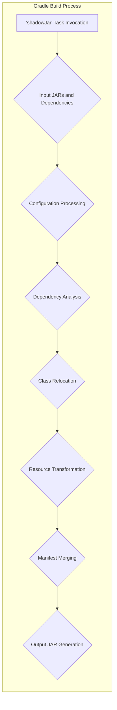
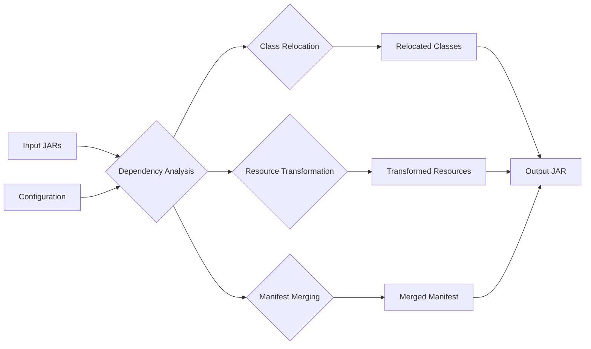

# Project Design Document: Gradle Shadow Plugin

**Version:** 1.1
**Date:** October 26, 2023
**Author:** AI Software Architect

## 1. Introduction

This document provides an enhanced and detailed design overview of the Gradle Shadow plugin, a crucial tool for creating relocatable JARs (also known as "shaded" or "fat" JARs) for Java libraries and applications. The primary goal of this document is to offer a comprehensive understanding of the plugin's architecture, individual components, and the flow of data during its operation. This detailed understanding is essential for effectively conducting thorough threat modeling activities.

## 2. Project Overview

The Gradle Shadow plugin streamlines the process of packaging a Java application or library, along with its dependencies, into a single, self-contained JAR file. This is accomplished by relocating the classes of the dependencies to a unique package namespace within the output JAR. This crucial step prevents class name conflicts that can arise when the library is used as a dependency in other projects. The plugin is designed to integrate seamlessly within the Gradle build system, offering a declarative and efficient way to configure the shading process.

## 3. Goals

*   Present a clear, detailed, and improved description of the Gradle Shadow plugin's architecture and its core functionalities.
*   Thoroughly identify the key components of the plugin, detailing their specific responsibilities and interactions.
*   Precisely outline the data flow throughout the shading process, highlighting potential points of interest for security analysis.
*   Establish a robust and comprehensive foundation for conducting in-depth threat modeling exercises.

## 4. System Architecture

The Gradle Shadow plugin functions as a custom task within the established Gradle build lifecycle. Its core operation revolves around the manipulation of the contents of Java Archive (JAR) files.

### 4.1. Key Components

*   **`shadowJar` Task:** This is the primary Gradle task provided by the plugin and serves as the entry point for the shading process. It is responsible for orchestrating the execution of all other components.
*   **Input JARs and Dependencies:** This refers to the collection of JAR files that are the subject of the shading process. This includes the project's own compiled class files and all of its declared dependencies.
*   **Configuration:** This component represents the user-defined settings that govern the behavior of the shading process. These settings are typically defined in the `build.gradle` file and include:
    *   **Relocation Rules:** Specifications for renaming packages of dependencies to avoid conflicts.
    *   **Exclusion Rules:** Definitions of specific packages or classes that should be omitted from the shaded JAR.
    *   **Resource Transformation Rules:** Instructions for modifying the content of resources (e.g., property files, XML files) to reflect relocated package names.
    *   **Manifest Merging Strategies:** Rules for how to combine manifest files from different JARs.
*   **Dependency Analysis:** This component is responsible for examining the input JARs and their dependencies to create a comprehensive list of all classes and resources that need to be included in the final shaded JAR. This involves traversing the dependency graph.
*   **Class Relocation Engine:** This is the core component that performs the actual renaming of classes within the dependency JARs. It operates by modifying the bytecode of the classes to change package declarations and references.
*   **Resource Transformation Engine:** This component handles the modification of non-code resources. It applies the configured transformation rules to update resource files to align with the relocated package structure.
*   **Manifest Merging Engine:** This component is responsible for combining the `META-INF/MANIFEST.MF` files from all the input JARs into a single manifest file for the output JAR. It uses the defined merging strategies to resolve potential conflicts between entries.
*   **Output JAR Generator:** This component takes the relocated classes, transformed resources, and the merged manifest and assembles them into the final shaded JAR file.

## 5. Data Flow

The shading process involves a distinct flow of data through the various components:

1. **Task Invocation:** The process begins when a user executes the `shadowJar` Gradle task, initiating the shading operation.
2. **Input Collection:** The plugin gathers all necessary input, including the project's compiled class files and the JAR files of its declared dependencies.
3. **Configuration Loading:** The plugin reads and parses the user-defined configuration settings from the `build.gradle` file. These settings dictate how the shading will be performed.
4. **Dependency Analysis:** The plugin analyzes the input JARs to construct a complete graph representing all classes and resources that need to be included in the shaded output.
5. **Relocation Application:** Based on the loaded configuration, the Class Relocation Engine modifies the bytecode of the dependency classes, renaming their packages according to the defined relocation rules.
6. **Resource Transformation:** The Resource Transformation Engine processes the resources, modifying their content as specified in the configuration to reflect the package relocations.
7. **Manifest Processing:** The Manifest Merging Engine combines the `META-INF/MANIFEST.MF` files from the input JARs, applying the configured merge strategies to resolve any conflicts.
8. **Output Assembly:** The Output JAR Generator takes the relocated classes, transformed resources, and the merged manifest and packages them into the final shaded JAR file.
9. **Output Storage:** The generated shaded JAR file is then written to the designated output directory.

## 6. Components Details

### 6.1. `shadowJar` Task

*   **Responsibility:** Serves as the central orchestrator of the shading process, managing the execution of other components.
*   **Inputs:** Project's compiled classes, dependency JAR files, user-defined configuration.
*   **Outputs:** The final shaded JAR file.
*   **Security Relevance:** As the entry point, vulnerabilities here could compromise the entire shading process. Improper handling of input could lead to injection attacks or denial of service.

### 6.2. Input JARs and Dependencies

*   **Responsibility:** Provide the raw materials (compiled code and resources) for the shading process.
*   **Types:** Standard JAR files containing compiled Java bytecode and associated resources.
*   **Security Relevance:** These inputs are a primary attack vector. Malicious or compromised JARs could introduce vulnerabilities into the shaded output.

### 6.3. Configuration

*   **Responsibility:** Defines the rules and parameters that govern the shading process.
*   **Source:** Typically the `build.gradle` file.
*   **Key Elements:**
    *   `relocate`: Specifies package renaming rules using patterns and target packages. Incorrectly configured relocations can lead to runtime errors or expose internal APIs.
    *   `exclude`: Defines patterns for excluding specific packages or classes. Improper exclusions might omit necessary components or unintentionally include vulnerable code.
    *   `transform`: Allows for custom modification of resources. Malicious transformations could inject harmful content.
    *   `mergeServiceFiles`: Controls how service provider interface (SPI) files are merged. Incorrect merging can lead to unexpected behavior or security issues.
    *   `manifest`: Configures how manifest files are merged. Improper merging can lead to incorrect application metadata or security vulnerabilities.
*   **Security Relevance:** The configuration is a critical point for security. Vulnerabilities in how the configuration is parsed or applied could be exploited.

### 6.4. Dependency Analysis

*   **Responsibility:**  Identifies all necessary classes and resources by analyzing the dependencies of the input JARs.
*   **Process:**  Recursively traverses the dependency graph, identifying transitive dependencies.
*   **Security Relevance:**  Flaws in dependency analysis could lead to the inclusion of unintended or vulnerable dependencies in the shaded JAR.

### 6.5. Class Relocation Engine

*   **Responsibility:** Modifies the bytecode of classes to rename packages according to the configured relocation rules.
*   **Mechanism:** Employs bytecode manipulation libraries (e.g., ASM) to rewrite class references and package declarations.
*   **Security Relevance:**  Bugs in the relocation engine could lead to corrupted bytecode, causing runtime errors or security vulnerabilities. Improper handling of reflection or native code during relocation could also introduce risks.

### 6.6. Resource Transformation Engine

*   **Responsibility:** Modifies the content of resources based on the defined transformation rules.
*   **Examples:** Updating package names in property files, XML configurations, or other text-based resources.
*   **Security Relevance:**  Vulnerabilities in the transformation engine could allow for the injection of malicious content into resource files.

### 6.7. Manifest Merging Engine

*   **Responsibility:** Combines the `META-INF/MANIFEST.MF` files from the input JARs into a single manifest for the output JAR.
*   **Strategies:** Offers various strategies for handling conflicting entries, such as merging, overwriting, or appending.
*   **Security Relevance:** Incorrect manifest merging could lead to vulnerabilities related to permissions, code signing, or other manifest attributes.

### 6.8. Output JAR Generator

*   **Responsibility:** Creates the final shaded JAR file by packaging the relocated classes, transformed resources, and the merged manifest.
*   **Process:**  Assembles the components into a standard ZIP archive with a `.jar` extension.
*   **Security Relevance:**  Vulnerabilities in the JAR generation process could lead to corrupted or malformed JAR files, potentially causing issues during deployment or execution.

## 7. Security Considerations (Detailed for Threat Modeling)

This section expands on the initial security considerations, providing more specific examples and potential threats relevant to each component and stage of the process.

*   **Malicious Dependencies:**
    *   **Threat:** Inclusion of compromised dependencies containing malware or vulnerabilities.
    *   **Impact:**  The shaded JAR will inherit these vulnerabilities, potentially leading to application compromise.
    *   **Mitigation:** Employ dependency scanning tools, verify dependency integrity, and use trusted repositories.
*   **Configuration Vulnerabilities:**
    *   **Threat:**  Injection of malicious configuration through build scripts or external sources.
    *   **Impact:**  Could lead to arbitrary code execution during the shading process or the generation of a backdoored JAR.
    *   **Mitigation:** Secure build environments, validate configuration inputs, and restrict access to build scripts.
    *   **Threat:**  Incorrectly configured relocation rules leading to classloading issues or exposure of internal APIs.
    *   **Impact:**  Runtime errors, unexpected behavior, or security vulnerabilities due to exposed internal functionality.
    *   **Mitigation:** Thoroughly test relocation rules and follow least privilege principles.
*   **Resource Transformation Risks:**
    *   **Threat:**  Malicious transformations injecting harmful content into resource files (e.g., modifying configuration files to point to malicious servers).
    *   **Impact:**  Application compromise or data breaches.
    *   **Mitigation:**  Carefully review and control resource transformation rules, and sanitize inputs.
*   **Manifest Manipulation:**
    *   **Threat:**  Incorrect manifest merging leading to missing security attributes or the inclusion of malicious attributes.
    *   **Impact:**  Bypassing security checks, incorrect application identification, or other security issues.
    *   **Mitigation:**  Use well-defined manifest merging strategies and validate the final manifest.
*   **Supply Chain Security:**
    *   **Threat:**  Compromise of the Gradle Shadow plugin itself or its dependencies.
    *   **Impact:**  Introduction of vulnerabilities or backdoors into projects using the plugin.
    *   **Mitigation:**  Use trusted sources for the plugin, verify its integrity, and monitor for updates and vulnerabilities.
*   **Information Disclosure:**
    *   **Threat:**  Accidental inclusion of sensitive information (e.g., API keys, credentials) from dependencies in the shaded JAR.
    *   **Impact:**  Exposure of sensitive data.
    *   **Mitigation:**  Carefully review dependencies and use exclusion rules to remove sensitive information.
*   **Denial of Service:**
    *   **Threat:**  Configuration that leads to excessively large output JARs or long processing times, potentially causing build failures or resource exhaustion.
    *   **Impact:**  Disruption of the build process or deployment issues.
    *   **Mitigation:**  Optimize shading configuration and monitor build performance.

## 8. Deployment and Usage

The Gradle Shadow plugin is integrated into a Java project's build process managed by Gradle. Developers add the plugin dependency to their `build.gradle` file and configure the shading rules within the same file. When the `shadowJar` task is executed as part of the Gradle build, the plugin performs the shading process according to the defined configuration and generates the output JAR in the specified location.

## 9. Assumptions and Constraints

*   It is assumed that users possess a fundamental understanding of Java packaging conventions and dependency management principles.
*   The plugin's functionality relies on the accuracy and integrity of the dependency information provided by the Gradle build system.
*   The plugin is designed to operate on standard, well-formed JAR file formats.
*   The performance of the plugin can be influenced by the size and complexity of the project's dependencies.

## 10. Future Considerations

*   Enhanced integration with Software Composition Analysis (SCA) tools to automatically scan dependencies for known vulnerabilities before the shading process.
*   Improved reporting mechanisms to provide detailed insights into the shading process, including comprehensive lists of relocated classes and transformed resources.
*   Support for more advanced resource transformation techniques and manifest merging strategies.

This enhanced document provides a more detailed and comprehensive design overview of the Gradle Shadow plugin, specifically tailored to facilitate thorough threat modeling activities. It offers a deeper understanding of the plugin's inner workings and highlights potential areas of security concern.