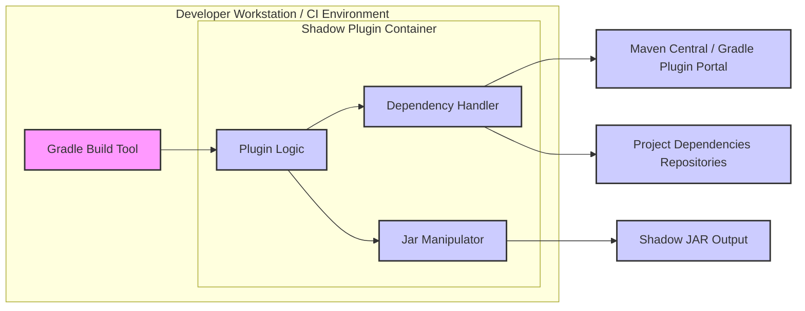
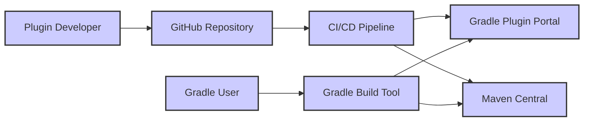
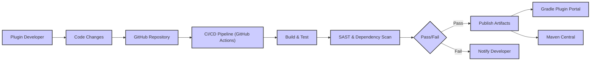

# BUSINESS POSTURE

This project, the Shadow Gradle Plugin, aims to simplify the distribution and execution of Java and Kotlin applications by creating a single, self-contained JAR file (shadow JAR) that includes all application dependencies. This addresses the common problem of managing complex dependency trees and potential conflicts during deployment.

- Business Priorities:
  - Simplify application deployment process.
  - Reduce dependency conflicts and runtime errors related to classpath issues.
  - Potentially improve application startup time by reducing classpath scanning.
  - Streamline the distribution of applications, especially libraries and command-line tools.

- Business Risks:
  - Dependency confusion: Incorrectly packaging dependencies could lead to runtime issues or unexpected behavior.
  - Vulnerabilities in included dependencies: Packaging all dependencies into a single JAR increases the attack surface if vulnerable dependencies are included.
  - Increased JAR size: Shadow JARs can be significantly larger than traditional JARs, potentially impacting storage and download times.
  - Build complexity: Introducing a new build plugin adds complexity to the build process and requires developer understanding.

# SECURITY POSTURE

The Shadow Gradle Plugin itself is a build tool component. Security considerations primarily revolve around the secure development and distribution of the plugin, and the security implications of using the plugin to build applications.

- Security Controls:
  - security control: Source code hosted on GitHub, leveraging GitHub's security features for repository access control and vulnerability scanning. (Implemented: GitHub)
  - security control: Gradle build system is used for building and publishing the plugin. (Implemented: build.gradle.kts)
  - security control: Plugin distributed through Maven Central or Gradle Plugin Portal. (Implemented: Publishing process)

- Accepted Risks:
  - accepted risk: Reliance on the security of third-party dependencies used by the plugin itself.
  - accepted risk: Potential for vulnerabilities in the plugin code itself.
  - accepted risk: Security of the build environment where the plugin is used is outside the scope of the plugin itself.

- Recommended Security Controls:
  - security control: Implement automated vulnerability scanning of the plugin's dependencies during development and release process.
  - security control: Integrate static analysis security testing (SAST) tools into the plugin's build process to identify potential code vulnerabilities.
  - security control: Generate Software Bill of Materials (SBOM) for the plugin releases to enhance transparency and allow users to assess dependency risks.
  - security control: Provide documentation and guidance to users on secure usage of the plugin, including dependency management best practices and vulnerability scanning of generated shadow JARs.

- Security Requirements:
  - Authentication:
    - Access to the plugin's source code repository on GitHub should be controlled via GitHub's authentication mechanisms.
    - Publishing to Maven Central or Gradle Plugin Portal requires appropriate credentials and secure publishing processes.
  - Authorization:
    - Access to the plugin's source code repository should be granted based on the principle of least privilege.
    - Publishing rights should be restricted to authorized individuals or systems.
  - Input Validation:
    - The plugin should validate inputs from Gradle build scripts to prevent unexpected behavior or vulnerabilities due to malicious configurations. This includes validating dependency configurations, relocation rules, and other plugin parameters.
  - Cryptography:
    - Cryptography is not directly a core requirement for the plugin itself. However, if the plugin handles sensitive data or implements features requiring secure communication in the future, appropriate cryptographic measures should be implemented. For now, reliance on HTTPS for dependency downloads and plugin distribution is sufficient.

# DESIGN

The Shadow Gradle Plugin is a Gradle plugin that operates within the Gradle build environment. Its primary function is to manipulate the build process to create a shadow JAR.

## C4 CONTEXT

```mermaid
flowchart LR
    subgraph "Build Environment"
        A["Gradle Build Tool"]
        B["Shadow Plugin"]
    end
    C["Java/Kotlin Developer"] --> A
    A --> B
    B --> D["Maven Central / Gradle Plugin Portal"]
    B --> E["Project Dependencies (Maven Central, etc.)"]
    F["Shadow JAR Artifact"] <-- B
    style A fill:#f9f,stroke:#333,stroke-width:2px
    style B fill:#ccf,stroke:#333,stroke-width:2px
    style C fill:#ccf,stroke:#333,stroke-width:2px
    style D fill:#ccf,stroke:#333,stroke-width:2px
    style E fill:#ccf,stroke:#333,stroke-width:2px
    style F fill:#ccf,stroke:#333,stroke-width:2px
```

- Context Diagram Elements:
  - - Name: "Java/Kotlin Developer"
    - Type: Person
    - Description: Software developers who use Gradle to build Java or Kotlin applications and want to use the Shadow Plugin to create shadow JARs.
    - Responsibilities: Configures Gradle build scripts, applies the Shadow Plugin, and uses the generated shadow JAR.
    - Security controls: Authentication to developer workstations, secure coding practices.
  - - Name: "Gradle Build Tool"
    - Type: Software System
    - Description: The Gradle build automation system, which executes build scripts and manages the build process.
    - Responsibilities: Executes build tasks, applies plugins, manages dependencies, and invokes the Shadow Plugin.
    - Security controls: Access control to Gradle build environment, secure configuration of Gradle, dependency verification.
  - - Name: "Shadow Plugin"
    - Type: Software System
    - Description: The Gradle Shadow Plugin, which modifies the Gradle build process to create shadow JARs by packaging dependencies.
    - Responsibilities: Intercepts the JAR creation process, relocates classes, packages dependencies, and creates the final shadow JAR artifact.
    - Security controls: Input validation of plugin configuration, secure handling of dependencies, vulnerability scanning of plugin dependencies.
  - - Name: "Maven Central / Gradle Plugin Portal"
    - Type: Software System
    - Description: Repositories for distributing Java libraries and Gradle plugins, including the Shadow Plugin itself.
    - Responsibilities: Hosts and distributes the Shadow Plugin and project dependencies.
    - Security controls: Repository security controls, secure publishing processes, vulnerability scanning of hosted artifacts.
  - - Name: "Project Dependencies (Maven Central, etc.)"
    - Type: Software System
    - Description: External libraries and dependencies required by the Java/Kotlin project being built, typically downloaded from repositories like Maven Central.
    - Responsibilities: Provides necessary code and functionality for the project.
    - Security controls: Dependency management and verification, vulnerability scanning of dependencies.
  - - Name: "Shadow JAR Artifact"
    - Type: Software System
    - Description: The final output of the Shadow Plugin, a self-contained JAR file containing the application and all its dependencies.
    - Responsibilities: Executable artifact for deploying and running the application.
    - Security controls: Vulnerability scanning of the generated JAR, secure storage and distribution of the JAR.

## C4 CONTAINER



- Container Diagram Elements:
  - - Name: "Gradle Build Tool"
    - Type: Container - Build Tool
    - Description: The Gradle build automation system, providing the execution environment for the Shadow Plugin.
    - Responsibilities: Executes build scripts, manages plugin lifecycle, provides access to project configuration and dependencies.
    - Security controls: Gradle security features, access control to build environment, secure Gradle configuration.
  - - Name: "Plugin Logic"
    - Type: Container - Software Component
    - Description: Core logic of the Shadow Plugin, responsible for orchestrating the shadow JAR creation process.
    - Responsibilities: Reads plugin configuration, invokes dependency handler and JAR manipulator, manages plugin lifecycle within Gradle.
    - Security controls: Input validation, secure coding practices, vulnerability scanning of plugin dependencies.
  - - Name: "Dependency Handler"
    - Type: Container - Software Component
    - Description: Component responsible for resolving and managing project dependencies, including downloading and processing dependencies for inclusion in the shadow JAR.
    - Responsibilities: Resolves dependencies from configured repositories, handles dependency exclusions and relocations, manages dependency versions.
    - Security controls: Dependency verification, secure dependency resolution, handling of dependency vulnerabilities.
  - - Name: "Jar Manipulator"
    - Type: Container - Software Component
    - Description: Component responsible for manipulating JAR files, including merging, relocating classes, and creating the final shadow JAR.
    - Responsibilities: Reads and writes JAR files, performs class relocation and merging, creates the final shadow JAR artifact.
    - Security controls: Secure JAR processing, prevention of JAR manipulation vulnerabilities.
  - - Name: "Maven Central / Gradle Plugin Portal"
    - Type: External System
    - Description: Repositories for downloading the Shadow Plugin and potentially project dependencies.
    - Responsibilities: Provides plugin and dependency artifacts.
    - Security controls: Repository security controls.
  - - Name: "Project Dependencies Repositories"
    - Type: External System
    - Description: Repositories (e.g., Maven Central, custom repositories) where project dependencies are downloaded from.
    - Responsibilities: Provides project dependency artifacts.
    - Security controls: Repository security controls.
  - - Name: "Shadow JAR Output"
    - Type: Artifact
    - Description: The resulting shadow JAR file generated by the plugin.
    - Responsibilities: Deployable artifact containing the application and its dependencies.
    - Security controls: Vulnerability scanning of generated JAR, secure storage and distribution.

## DEPLOYMENT

The Shadow Gradle Plugin itself is not deployed as an application. It is deployed as a Gradle plugin to be used within Gradle build environments.

- Deployment Architecture: Plugin Distribution



- Deployment Diagram Elements:
  - - Name: "Plugin Developer"
    - Type: Person
    - Description: Developer responsible for developing and releasing the Shadow Gradle Plugin.
    - Responsibilities: Writes plugin code, tests plugin, manages releases.
    - Security controls: Secure development practices, access control to development environment.
  - - Name: "GitHub Repository"
    - Type: Code Repository
    - Description: Source code repository for the Shadow Gradle Plugin.
    - Responsibilities: Stores and manages plugin source code, version control.
    - Security controls: Access control, branch protection, vulnerability scanning.
  - - Name: "CI/CD Pipeline"
    - Type: Automation System
    - Description: Automated pipeline for building, testing, and publishing the Shadow Gradle Plugin.
    - Responsibilities: Automates build process, runs tests, publishes plugin artifacts.
    - Security controls: Secure pipeline configuration, access control, secrets management.
  - - Name: "Gradle Plugin Portal"
    - Type: Plugin Repository
    - Description: Public repository for distributing Gradle plugins.
    - Responsibilities: Hosts and distributes the Shadow Gradle Plugin.
    - Security controls: Repository security controls, secure publishing process.
  - - Name: "Maven Central"
    - Type: Artifact Repository
    - Description: Public repository for distributing Java artifacts, including Gradle plugins.
    - Responsibilities: Hosts and distributes the Shadow Gradle Plugin.
    - Security controls: Repository security controls, secure publishing process.
  - - Name: "Gradle User"
    - Type: Person
    - Description: Developers who use Gradle and want to use the Shadow Plugin in their projects.
    - Responsibilities: Applies the Shadow Plugin to their Gradle projects.
    - Security controls: Secure development practices, dependency management.
  - - Name: "Gradle Build Tool"
    - Type: Build Tool
    - Description: Gradle build system used by developers to build their projects and apply plugins.
    - Responsibilities: Executes build scripts, downloads and applies plugins.
    - Security controls: Gradle security features, secure build environment.

## BUILD

The build process for the Shadow Gradle Plugin involves compiling the plugin code, running tests, and publishing the plugin artifacts to repositories.



- Build Process Elements:
  - - Name: "Plugin Developer"
    - Type: Person
    - Description: Developer making changes to the plugin code.
    - Responsibilities: Writes code, commits changes, initiates build process.
    - Security controls: Secure development workstation, code review.
  - - Name: "Code Changes"
    - Type: Data
    - Description: Modifications to the plugin source code.
    - Responsibilities: Represents code changes to be built.
    - Security controls: Version control, code review.
  - - Name: "GitHub Repository"
    - Type: Code Repository
    - Description: Hosts the plugin source code and triggers CI/CD pipeline.
    - Responsibilities: Stores code, manages versions, triggers builds.
    - Security controls: Access control, branch protection, audit logs.
  - - Name: "CI/CD Pipeline (GitHub Actions)"
    - Type: Automation System
    - Description: GitHub Actions workflow automating the build, test, and publish process.
    - Responsibilities: Automates build steps, runs tests, performs security checks, publishes artifacts.
    - Security controls: Secure workflow definition, secrets management, access control to pipeline.
  - - Name: "Build & Test"
    - Type: Build Stage
    - Description: Compiles the plugin code and executes unit and integration tests.
    - Responsibilities: Compiles code, runs tests, generates build artifacts.
    - Security controls: Secure build environment, dependency management, test isolation.
  - - Name: "SAST & Dependency Scan"
    - Type: Security Check
    - Description: Static analysis security testing and dependency vulnerability scanning performed during the build.
    - Responsibilities: Identifies potential code vulnerabilities and dependency vulnerabilities.
    - Security controls: SAST tool configuration, vulnerability database updates, reporting mechanisms.
  - - Name: "Pass/Fail"
    - Type: Decision Point
    - Description: Determines if the build process and security checks were successful.
    - Responsibilities: Evaluates build and test results, security scan findings.
    - Security controls: Defined success criteria, automated checks.
  - - Name: "Publish Artifacts"
    - Type: Publish Stage
    - Description: Publishes the plugin artifacts to Gradle Plugin Portal and Maven Central.
    - Responsibilities: Packages and uploads plugin artifacts to repositories.
    - Security controls: Secure publishing credentials, artifact signing, repository access control.
  - - Name: "Gradle Plugin Portal"
    - Type: Plugin Repository
    - Description: Public repository for Gradle plugins.
    - Responsibilities: Hosts and distributes the Shadow Gradle Plugin.
    - Security controls: Repository security controls.
  - - Name: "Maven Central"
    - Type: Artifact Repository
    - Description: Public repository for Java artifacts.
    - Responsibilities: Hosts and distributes the Shadow Gradle Plugin.
    - Security controls: Repository security controls.
  - - Name: "Notify Developer"
    - Type: Notification
    - Description: Informs the developer about build failures or security issues.
    - Responsibilities: Provides feedback to developers.
    - Security controls: Secure notification channels.

# RISK ASSESSMENT

- Critical Business Processes:
  - Software development and build process for projects using the Shadow Gradle Plugin.
  - Distribution of software artifacts built with the Shadow Gradle Plugin.

- Data to Protect:
  - Plugin source code (Sensitivity: Confidential, Integrity: High, Availability: High).
  - Plugin build artifacts (Sensitivity: Public, Integrity: High, Availability: High).
  - Dependencies of the plugin (Sensitivity: Public, Integrity: High, Availability: High).
  - Configuration of the plugin and build process (Sensitivity: Confidential, Integrity: High, Availability: High).

- Data Sensitivity:
  - Plugin source code is considered confidential as it represents intellectual property and potential vulnerabilities could be exploited if exposed.
  - Plugin build artifacts are intended for public distribution but integrity is critical to ensure users are not downloading compromised or malicious versions.
  - Dependencies are generally public but their integrity and availability are crucial for the build process.
  - Configuration details can be sensitive if they expose internal infrastructure or security practices.

# QUESTIONS & ASSUMPTIONS

- Questions:
  - What are the specific security requirements of projects that will use the Shadow Gradle Plugin? (e.g., compliance requirements, industry standards).
  - What is the intended deployment environment for applications built with the Shadow Gradle Plugin? (e.g., cloud, on-premise, containers).
  - Are there any specific organizational security policies or guidelines that need to be considered for the plugin development and distribution?
  - What is the process for reporting and handling security vulnerabilities found in the Shadow Gradle Plugin?

- Assumptions:
  - The primary goal of using the Shadow Gradle Plugin is to simplify deployment and dependency management for Java/Kotlin applications.
  - Security is a secondary but important consideration for the plugin and its users.
  - Users of the plugin are expected to have a basic understanding of Gradle and Java/Kotlin build processes.
  - The plugin will be distributed through public repositories (Gradle Plugin Portal and Maven Central).
  - The development and build process will leverage GitHub and GitHub Actions.