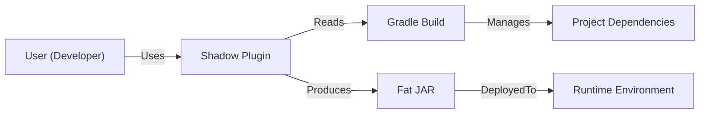
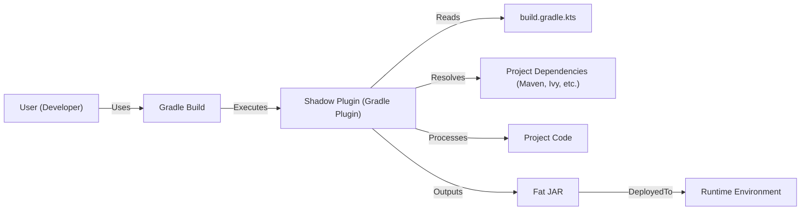
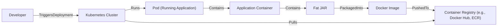
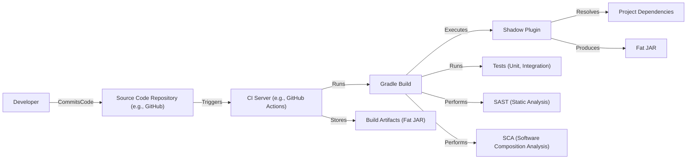

# BUSINESS POSTURE

Business Priorities and Goals:

*   Provide a user-friendly and efficient way to create fat JARs (uber-JARs) for Java/JVM applications.
*   Minimize the complexity of configuring and managing dependencies when building deployable artifacts.
*   Offer a solution that integrates seamlessly with the Gradle build system.
*   Reduce the size of the resulting JAR by allowing users to specify which dependencies and files should be included or excluded.
*   Support relocation of packages to avoid conflicts between different versions of libraries used by the application and its dependencies.
*   Provide a well-maintained and documented open-source project.

Most Important Business Risks:

*   Vulnerabilities in the shadow plugin itself could be exploited to compromise applications that use it.
*   Incorrect configuration of the shadow plugin could lead to the inclusion of unnecessary or vulnerable dependencies, increasing the attack surface of applications.
*   Failure to properly relocate packages could lead to runtime conflicts and application instability.
*   Lack of maintenance or updates to the shadow plugin could leave users vulnerable to known security issues in its dependencies.
*   Lack of proper documentation and support could lead to misuse of the plugin and introduce security vulnerabilities.

# SECURITY POSTURE

Existing Security Controls:

*   security control: The project is open-source, allowing for community review and contributions to identify and address security issues. (GitHub repository)
*   security control: The project uses GitHub Actions for continuous integration, which includes automated testing. (GitHub Actions workflows)
*   security control: The project has a Code of Conduct. (CODE_OF_CONDUCT.md)
*   security control: The project has contribution guide. (CONTRIBUTING.md)

Accepted Risks:

*   accepted risk: The plugin relies on the security of the Gradle build system and its underlying dependencies.
*   accepted risk: Users are responsible for properly configuring the plugin and ensuring the security of their own application code and dependencies.
*   accepted risk: The plugin's functionality to relocate packages could potentially introduce unexpected behavior if not used carefully.

Recommended Security Controls:

*   security control: Implement static analysis security testing (SAST) in the CI pipeline to automatically detect potential vulnerabilities in the plugin's code.
*   security control: Implement software composition analysis (SCA) to identify and track dependencies, and to alert on known vulnerabilities in those dependencies.
*   security control: Regularly review and update dependencies to address known security issues.
*   security control: Provide security documentation and guidelines for users on how to securely configure and use the shadow plugin.
*   security control: Establish a security vulnerability disclosure process.
*   security control: Consider using a dependency minimization strategy to reduce the plugin's own attack surface.

Security Requirements:

*   Authentication: Not directly applicable to this plugin, as it's a build tool.
*   Authorization: Not directly applicable, but the plugin should operate within the permissions granted to the Gradle build process.
*   Input Validation: The plugin should validate user-provided configuration (e.g., include/exclude patterns, relocation rules) to prevent potential injection vulnerabilities or unexpected behavior.
*   Cryptography: Not directly applicable, unless the plugin is used to handle cryptographic keys or materials (which it shouldn't be). The plugin should not interfere with the cryptographic operations of the built application.

# DESIGN

## C4 CONTEXT

Element Description:

*   User (Developer)
    *   Name: User (Developer)
    *   Type: Person
    *   Description: A software developer who uses the Shadow plugin to build fat JARs.
    *   Responsibilities: Configures the Shadow plugin, runs the Gradle build, and deploys the resulting fat JAR.
    *   Security controls: Uses a secure development environment, follows secure coding practices.

*   Shadow Plugin
    *   Name: Shadow Plugin
    *   Type: Software System
    *   Description: The Gradle Shadow plugin, used for creating fat JARs.
    *   Responsibilities: Processes Gradle build configuration, manages dependencies, creates fat JARs.
    *   Security controls: Input validation of configuration, dependency management, SAST, SCA.

*   Gradle Build
    *   Name: Gradle Build
    *   Type: Software System
    *   Description: The Gradle build system used to build the Java/JVM project.
    *   Responsibilities: Manages project dependencies, compiles code, runs tests, executes plugins.
    *   Security controls: Secure configuration, dependency management.

*   Project Dependencies
    *   Name: Project Dependencies
    *   Type: Software System
    *   Description: The libraries and frameworks that the project depends on.
    *   Responsibilities: Provide functionality used by the project.
    *   Security controls: SCA, dependency updates.

*   Fat JAR
    *   Name: Fat JAR
    *   Type: Artifact
    *   Description: The resulting fat JAR file containing the application and its dependencies.
    *   Responsibilities: Executable package for deployment.
    *   Security controls: Integrity checks, secure deployment process.

*   Runtime Environment
    *   Name: Runtime Environment
    *   Type: Environment
    *   Description: The environment where the fat JAR is deployed and executed (e.g., server, cloud platform).
    *   Responsibilities: Provides resources for running the application.
    *   Security controls: Secure configuration, access controls, monitoring.

## C4 CONTAINER

Element Description:

*   User (Developer)
    *   Name: User (Developer)
    *   Type: Person
    *   Description: A software developer.
    *   Responsibilities: Writes code, configures build, runs build.
    *   Security controls: Secure development environment.

*   Gradle Build
    *   Name: Gradle Build
    *   Type: Software System
    *   Description: Gradle build process.
    *   Responsibilities: Executes build scripts, manages dependencies.
    *   Security controls: Secure configuration.

*   Shadow Plugin (Gradle Plugin)
    *   Name: Shadow Plugin (Gradle Plugin)
    *   Type: Container: Gradle Plugin
    *   Description: The Shadow plugin, running within the Gradle process.
    *   Responsibilities: Creates fat JARs based on configuration.
    *   Security controls: Input validation, SAST, SCA.

*   build.gradle.kts
    *   Name: build.gradle.kts
    *   Type: Configuration File
    *   Description: Gradle build configuration file.
    *   Responsibilities: Defines project settings, dependencies, and Shadow plugin configuration.
    *   Security controls: Secure configuration, access control.

*   Project Dependencies (Maven, Ivy, etc.)
    *   Name: Project Dependencies (Maven, Ivy, etc.)
    *   Type: External Dependencies
    *   Description: External libraries and frameworks.
    *   Responsibilities: Provide functionality to the project.
    *   Security controls: SCA, dependency updates.

*   Project Code
    *   Name: Project Code
    *   Type: Codebase
    *   Description: The source code of the project being built.
    *   Responsibilities: Implements application logic.
    *   Security controls: Secure coding practices, SAST, code reviews.

*   Fat JAR
    *   Name: Fat JAR
    *   Type: Artifact
    *   Description: The resulting fat JAR file.
    *   Responsibilities: Executable package.
    *   Security controls: Integrity checks.

*   Runtime Environment
    *   Name: Runtime Environment
    *   Type: Environment
    *   Description: Where the fat JAR is deployed.
    *   Responsibilities: Runs the application.
    *   Security controls: Secure configuration, access controls.

## DEPLOYMENT

Possible Deployment Solutions:

1.  Manual deployment to a server (e.g., copying the fat JAR to a server and running it with `java -jar`).
2.  Deployment to a cloud platform (e.g., AWS, Azure, GCP) using platform-specific tools (e.g., AWS Elastic Beanstalk, Azure App Service, Google App Engine).
3.  Containerized deployment using Docker and Kubernetes.
4.  Deployment to a serverless platform (e.g. AWS Lambda).

Chosen Solution (for detailed description): Containerized deployment using Docker and Kubernetes.

Element Description:

*   Fat JAR
    *   Name: Fat JAR
    *   Type: Artifact
    *   Description: The built fat JAR file.
    *   Responsibilities: Executable package.
    *   Security controls: Integrity checks.

*   Docker Image
    *   Name: Docker Image
    *   Type: Container Image
    *   Description: A Docker image containing the fat JAR and a JRE.
    *   Responsibilities: Provides a consistent runtime environment.
    *   Security controls: Minimal base image, vulnerability scanning.

*   Container Registry (e.g., Docker Hub, ECR)
    *   Name: Container Registry
    *   Type: Repository
    *   Description: A registry for storing and managing Docker images.
    *   Responsibilities: Stores and serves Docker images.
    *   Security controls: Access control, vulnerability scanning.

*   Developer
    *   Name: Developer
    *   Type: Person
    *   Description: Initiates the deployment process.
    *   Responsibilities: Triggers deployment to Kubernetes.
    *   Security controls: Secure development environment, access control.

*   Kubernetes Cluster
    *   Name: Kubernetes Cluster
    *   Type: Orchestration Platform
    *   Description: A Kubernetes cluster for managing containerized applications.
    *   Responsibilities: Orchestrates container deployment, scaling, and management.
    *   Security controls: Secure configuration, network policies, RBAC.

*   Pod (Running Application)
    *   Name: Pod (Running Application)
    *   Type: Kubernetes Pod
    *   Description: A pod running the application container.
    *   Responsibilities: Runs the application.
    *   Security controls: Resource limits, security context.

*  Application Container
    *   Name: Application Container
    *   Type: Container
    *   Description: Container running application.
    *   Responsibilities: Runs application code.
    *   Security controls: Least privilege.

## BUILD

Element Description:

*   Developer: Initiates the build process by committing code.
*   Source Code Repository (e.g., GitHub): Stores the project's source code and triggers the CI server.
*   CI Server (e.g., GitHub Actions): Automates the build process, including running tests, SAST, SCA, and producing the fat JAR.
*   Gradle Build: Executes the build script, including the Shadow plugin.
*   Shadow Plugin: Creates the fat JAR.
*   Dependencies: External libraries and frameworks.
*   Tests (Unit, Integration): Verify the correctness of the code.
*   SAST (Static Analysis): Analyzes the source code for potential vulnerabilities.
*   SCA (Software Composition Analysis): Analyzes dependencies for known vulnerabilities.
*   Fat JAR: The resulting fat JAR file.
*   Build Artifacts (Fat JAR): The final output of the build process, stored by the CI server.

Security Controls in Build Process:

*   Source Code Repository: Access control, branch protection rules.
*   CI Server: Secure configuration, limited access, audit logs.
*   Gradle Build: Secure configuration, dependency management.
*   Tests: Ensure code quality and prevent regressions.
*   SAST: Identifies potential vulnerabilities in the source code.
*   SCA: Identifies known vulnerabilities in dependencies.
*   Build Artifacts: Secure storage, integrity checks.

# RISK ASSESSMENT

Critical Business Processes:

*   Building and deploying Java/JVM applications.
*   Managing dependencies for Java/JVM projects.

Data to Protect:

*   Source code of the Shadow plugin (sensitivity: medium - could contain vulnerabilities).
*   Source code of applications using the Shadow plugin (sensitivity: varies depending on the application).
*   Configuration files (sensitivity: medium - could contain sensitive information like API keys or credentials if misused, but Shadow itself doesn't handle these).
*   Dependencies (sensitivity: medium - vulnerable dependencies could be exploited).
*   Build artifacts (fat JARs) (sensitivity: varies depending on the application).

# QUESTIONS & ASSUMPTIONS

Questions:

*   Are there any specific compliance requirements (e.g., PCI DSS, HIPAA) that applications built with Shadow need to meet?
*   What is the expected frequency of updates and releases for the Shadow plugin?
*   What is the process for reporting and addressing security vulnerabilities in the Shadow plugin?
*   Are there any specific security concerns or past incidents related to the Shadow plugin or similar tools?

Assumptions:

*   BUSINESS POSTURE: The primary goal is to provide a secure and reliable tool for building fat JARs. Security is a high priority.
*   SECURITY POSTURE: Users are responsible for the security of their own applications and the overall deployment environment. The Shadow plugin itself is assumed to be used in a secure build environment.
*   DESIGN: The deployment environment is assumed to be a Kubernetes cluster, but other deployment scenarios are possible. The build process is assumed to be automated using a CI server like GitHub Actions.