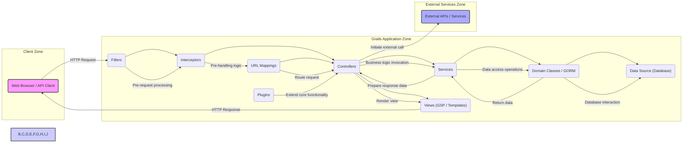
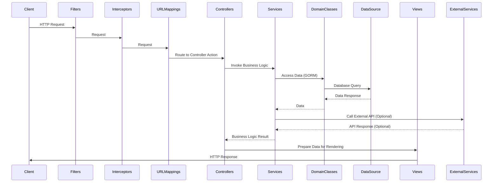

# Project Design Document: Grails Web Application Framework

**Version:** 1.1
**Date:** October 26, 2023
**Author:** AI Software Architect

## 1. Introduction

This document provides a detailed architectural overview of the Grails web application framework, focusing on aspects relevant to security threat modeling. It outlines the key components, their interactions, and the flow of data within the framework. This document is intended to serve as a comprehensive resource for identifying potential security vulnerabilities and designing appropriate mitigation strategies. The target project is the open-source Grails framework, as found in the provided GitHub repository: [https://github.com/grails/grails](https://github.com/grails/grails).

## 2. Goals and Objectives

The primary goals of the Grails framework are to:

*   Facilitate rapid web application development.
*   Provide a productive environment leveraging the Groovy programming language.
*   Minimize configuration through convention-over-configuration principles.
*   Offer seamless integration with the Java and Spring Boot ecosystems.
*   Support agile development methodologies and iterative refinement.
*   Enable the construction of scalable and maintainable web applications and RESTful APIs.

## 3. High-Level Architecture

The Grails framework adheres to the Model-View-Controller (MVC) architectural pattern, built upon the foundation of the Spring Boot framework. This layered design promotes separation of concerns, enhancing maintainability and testability.

## 4. Detailed Component Description

This section provides a more in-depth look at the key components within the Grails framework, highlighting their roles and responsibilities:

*   **Controllers:**
    *   Responsible for handling incoming HTTP requests from clients.
    *   Act as the initial point of contact for user interactions.
    *   Invoke methods in **Services** to execute business logic.
    *   Prepare data for rendering by **Views**.
    *   May perform request parameter validation.
*   **Services:**
    *   Encapsulate the core business logic of the application.
    *   Typically stateless and designed for reusability.
    *   Orchestrate operations involving **Domain Classes** and data access.
    *   May interact with external **APIs / Services**.
    *   Can be transactional, managing database transactions.
*   **Domain Classes (GORM):**
    *   Represent the persistent data model of the application.
    *   Utilize Grails Object Relational Mapping (GORM) for database interaction.
    *   Map directly to database tables, defining data structure and relationships.
    *   Provide methods for data persistence, retrieval, and manipulation.
    *   Support data validation rules.
*   **Views (GSP / Templates):**
    *   Responsible for rendering the user interface presented to the client.
    *   Utilize Groovy Server Pages (GSP) or other templating engines (e.g., Handlebars, Thymeleaf).
    *   Dynamically generate HTML, JSON, XML, or other output formats based on data provided by **Controllers**.
    *   May contain client-side scripting (JavaScript).
*   **Interceptors:**
    *   Implement cross-cutting concerns that apply to controller actions.
    *   Execute before and after controller action execution.
    *   Common use cases include authentication, authorization, logging, and request/response modification.
    *   Can prevent controller actions from executing based on certain conditions.
*   **Filters:**
    *   Operate at a lower level than interceptors, intercepting all incoming requests before they reach controllers.
    *   Used for global request processing tasks.
    *   Examples include request logging, security checks (e.g., IP filtering), and request attribute modification.
    *   Can short-circuit the request processing pipeline.
*   **URL Mappings:**
    *   Define the routing rules that map incoming URLs to specific **Controller** actions.
    *   Configure how the application responds to different URL patterns.
    *   Can include parameters and constraints for more specific routing.
*   **Data Source (Database):**
    *   The underlying database system used for persistent storage of application data.
    *   Grails supports various relational and NoSQL databases through GORM (e.g., PostgreSQL, MySQL, MongoDB).
    *   Responsible for data integrity, consistency, and availability.
*   **Plugins:**
    *   Extend the core functionality of Grails applications.
    *   Provide reusable components, libraries, and features.
    *   Can add new tag libraries for **Views**, utility **Services**, custom **Controllers**, and more.
    *   Contribute to the overall ecosystem and extensibility of Grails.
*   **External APIs / Services:**
    *   Represent external systems or services that the Grails application interacts with.
    *   Communication can occur over various protocols (e.g., HTTP, REST, SOAP).
    *   May involve authentication and authorization with the external service.

## 5. Data Flow

A typical request lifecycle within a Grails application involves the following steps:

1. A client (web browser or API client) initiates an HTTP request targeting a specific resource within the Grails application.
2. The request is initially intercepted by **Filters**, which perform pre-processing tasks such as logging or security checks.
3. **Interceptors** then handle cross-cutting concerns, potentially performing authentication or authorization checks before the request reaches the intended controller.
4. **URL Mappings** are consulted to determine the appropriate **Controller** and action method to handle the incoming request based on the URL.
5. The designated **Controller** receives the request and may:
    *   Validate request parameters to ensure data integrity and prevent injection attacks.
    *   Invoke methods within **Services** to execute the necessary business logic.
    *   Interact with **Domain Classes** through GORM to retrieve, create, update, or delete data in the **Data Source**.
    *   Communicate with external **APIs or Services** to retrieve or send data.
6. **Services** perform the core business operations, often involving multiple interactions with **Domain Classes** and potentially other **Services**.
7. **Domain Classes** interact with the **Data Source** to persist or retrieve data, translating object operations into database queries.
8. The **Controller** prepares the necessary data to be rendered by a **View**.
9. The **View** (GSP or template) processes the data and generates the response, typically HTML for web browsers or JSON/XML for API clients.
10. **Interceptors** can perform post-processing tasks after the controller action has executed, such as logging or modifying the response.
11. The generated response is sent back to the client.

## 6. Security Considerations (Detailed)

This section expands on potential security considerations, providing more specific examples relevant to threat modeling:

*   **Authentication and Authorization:**
    *   **Threat:** Unauthorized access to application resources and functionalities.
    *   **Considerations:**
        *   Strength of password policies and enforcement.
        *   Vulnerabilities in authentication mechanisms (e.g., session fixation, brute-force attacks).
        *   Proper implementation of role-based or attribute-based access control.
        *   Secure handling of authentication tokens (e.g., JWT).
        *   Risk of privilege escalation.
*   **Input Validation:**
    *   **Threat:** Injection attacks (SQL injection, cross-site scripting, command injection), data corruption.
    *   **Considerations:**
        *   Server-side validation of all user-provided input.
        *   Sanitization and encoding of output data to prevent script injection.
        *   Protection against mass assignment vulnerabilities.
        *   Validation of file uploads to prevent malicious file execution.
*   **Cross-Site Scripting (XSS):**
    *   **Threat:** Injection of malicious scripts into web pages viewed by other users, leading to data theft or session hijacking.
    *   **Considerations:**
        *   Proper output encoding for different contexts (HTML, JavaScript, URLs).
        *   Implementation of Content Security Policy (CSP) to restrict the sources of content.
        *   Use of templating engines that provide automatic escaping.
*   **Cross-Site Request Forgery (CSRF):**
    *   **Threat:** Unauthorized actions performed on behalf of an authenticated user without their knowledge.
    *   **Considerations:**
        *   Use of anti-CSRF tokens synchronized with the user's session.
        *   Proper handling of state-changing requests.
        *   Checking the `Origin` or `Referer` headers (with caution).
*   **Security Misconfiguration:**
    *   **Threat:** Exploitation of default configurations or insecure settings.
    *   **Considerations:**
        *   Secure default settings for the Grails framework, Spring Boot, and underlying libraries.
        *   Regular security updates and patching of dependencies.
        *   Proper configuration of the deployment environment (e.g., web server).
        *   Disabling unnecessary features and endpoints.
*   **Dependency Vulnerabilities:**
    *   **Threat:** Exploitation of known vulnerabilities in third-party libraries.
    *   **Considerations:**
        *   Regularly scanning dependencies for known vulnerabilities using tools like OWASP Dependency-Check.
        *   Keeping dependencies up-to-date with security patches.
        *   Careful selection of dependencies and awareness of their security track record.
*   **Data Protection:**
    *   **Threat:** Unauthorized access, modification, or disclosure of sensitive data.
    *   **Considerations:**
        *   Encryption of sensitive data at rest (e.g., database encryption).
        *   Encryption of data in transit using HTTPS.
        *   Secure storage of sensitive credentials (e.g., using environment variables or secrets management).
        *   Proper handling of personally identifiable information (PII) in compliance with regulations.
*   **Session Management:**
    *   **Threat:** Session hijacking, unauthorized access through compromised sessions.
    *   **Considerations:**
        *   Using secure session cookies with `HttpOnly` and `Secure` flags.
        *   Implementing session timeout mechanisms.
        *   Regenerating session IDs after successful login.
        *   Protecting against session fixation attacks.
*   **Error Handling and Logging:**
    *   **Threat:** Information leakage through verbose error messages, insufficient logging for security auditing.
    *   **Considerations:**
        *   Avoiding the display of sensitive information in error messages.
        *   Implementing comprehensive logging of security-relevant events (e.g., login attempts, access denials).
        *   Securely storing and managing log files.
*   **API Security:**
    *   **Threat:** Unauthorized access or manipulation of API endpoints.
    *   **Considerations:**
        *   Implementing authentication and authorization for API endpoints (e.g., OAuth 2.0, API keys).
        *   Input validation and rate limiting to prevent abuse.
        *   Secure handling of API keys and secrets.
        *   Proper documentation of API endpoints and security requirements.

## 7. Technologies Used

The Grails framework relies on the following core technologies:

*   **Groovy:** The dynamic, object-oriented programming language used for Grails application development.
*   **Spring Boot:** The underlying framework providing features like dependency injection, auto-configuration, and embedded server capabilities.
*   **GORM (Grails Object Relational Mapping):** The data access layer simplifying database interactions.
*   **Gradle:** The build automation tool used for dependency management, building, and testing Grails applications.
*   **Groovy Server Pages (GSP):** The default server-side templating engine for generating dynamic web content.
*   **Java:** The platform on which Groovy and Spring Boot are built and executed.
*   **Servlet Container (e.g., Tomcat, Jetty):**  Used to deploy and run Grails web applications.

## 8. Deployment

Grails applications offer flexible deployment options:

*   **Executable JAR:** Packaging the application as a self-contained JAR file with an embedded servlet container, suitable for microservices and cloud deployments.
*   **WAR File:** Deploying the application as a traditional Web Application Archive (WAR) file to a Java application server.
*   **Cloud Platforms:** Deployment to various cloud platforms like AWS, Azure, and Google Cloud, often leveraging containerization technologies (Docker) or Platform-as-a-Service (PaaS) offerings.

## 9. Future Considerations

This document represents the current architectural design. Future developments and considerations may include:

*   Adoption of newer versions of Groovy and Java to leverage new language features and performance improvements.
*   Enhanced integration with modern front-end JavaScript frameworks (e.g., React, Vue.js, Angular) for richer user interfaces.
*   Evolution of the GORM data access layer to support new database features or paradigms.
*   Refinements to build and deployment processes for improved efficiency and automation.
*   Growth and diversification of the Grails plugin ecosystem, offering more specialized functionalities.

This detailed project design document provides a solid foundation for conducting a comprehensive threat modeling exercise for the Grails web application framework. The identified components, data flows, and security considerations will be further analyzed to identify potential vulnerabilities and design effective security controls.