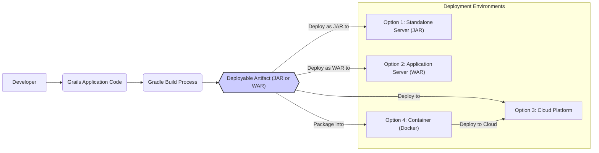

# Project Design Document: Grails Framework (Improved)

**Version:** 1.1
**Date:** October 26, 2023
**Author:** AI Software Architect

## 1. Introduction

This document provides an enhanced architectural overview of the Grails framework, drawing from the project repository at [https://github.com/grails/grails](https://github.com/grails/grails). Its primary purpose is to serve as a robust foundation for subsequent threat modeling exercises by clearly delineating the framework's key components, their interactions, and the underlying technologies. This revised version aims for improved clarity and detail.

## 2. Project Overview

Grails is a high-productivity, open-source web application framework built upon the solid foundation of Spring Boot and leveraging the expressiveness of the Groovy programming language. It champions a convention-over-configuration paradigm, dramatically reducing boilerplate code and accelerating the development lifecycle for building scalable web applications, RESTful APIs, and more.

**Key Characteristics:**

*   Strong adherence to "Convention over Configuration" to minimize explicit setup.
*   Utilizes the dynamic and concise Groovy language, executing on the Java Virtual Machine (JVM).
*   Deep integration with the Spring Boot ecosystem, benefiting from its extensive features and maturity.
*   Employs GORM (Grails Object Relational Mapping), typically with Hibernate as the underlying provider, for simplified data access.
*   Highly extensible architecture through a rich ecosystem of plugins.
*   Comprehensive built-in support for various levels of testing: unit, integration, and functional.
*   Features a powerful Command-Line Interface (CLI), accessible via the `grails` command, for streamlining development tasks.

## 3. System Architecture

The Grails framework adopts a layered architectural pattern, building directly upon the robust infrastructure provided by Spring Boot.

**Core Components:**

*   **Grails Core:**  The foundational libraries and runtime environment essential for all Grails applications.
*   **Grails Web:**  Manages the processing of incoming web requests, request routing, and the rendering of responses.
*   **GORM (Grails Object Relational Mapping):**  Offers a simplified and dynamic approach to data access and persistence operations.
*   **Controllers:**  Serve as the entry points for handling incoming web requests, orchestrating the application's logic in response.
*   **Services:**  Encapsulate core business logic, often implementing transactional behavior.
*   **Domain Classes:**  Represent the application's data model, with instances typically corresponding to records in database tables, managed by GORM.
*   **Views:**  Responsible for generating the user interface, commonly using GSP (Groovy Server Pages) for dynamic content generation.
*   **Interceptors:**  Provide a mechanism for implementing cross-cutting concerns, such as authentication, authorization, logging, and more, applied to request processing.
*   **Tag Libraries:**  Offer reusable UI components and logic that can be embedded within GSP views.
*   **Plugins:**  Extend the base functionality of Grails, providing integrations with other libraries, frameworks, and services.
*   **Spring Boot:**  The underlying framework providing essential features like dependency injection, auto-configuration, and actuator endpoints for monitoring.
*   **Groovy:**  The dynamic, optionally-typed programming language used for developing Grails applications.
*   **Embedded Server:**  Typically utilizes Tomcat, Jetty, or Undertow as the default embedded web server for running the application.

```mermaid
graph LR
    subgraph "Grails Application Runtime"
        direction LR
        A["Client (Browser, API Consumer)"] -- "HTTP Request" --> B("DispatcherServlet (Spring Boot)");
        B -- "Intercepts Request" --> C{"Interceptors"};
        C -- "Routes Request" --> D("Controller");
        D -- "Invokes Logic" --> E("Service Layer");
        E -- "Data Access" --> F("Domain Classes (GORM)");
        F -- "Database Interaction" --> G("Database");
        D -- "Prepares Model" --> H("View (GSP)");
        H -- "Renders Response" --> I["Client (Browser, API Consumer)"];
        style A fill:#f9f,stroke:#333,stroke-width:2px
        style I fill:#f9f,stroke:#333,stroke-width:2px
    end
    subgraph "Grails Framework Components"
        direction TB
        J["Grails Core"]
        K["Grails Web"]
        L["GORM"]
        M["Plugins"]
    end
    subgraph "Underlying Technologies"
        direction TB
        N["Spring Boot"]
        O["Groovy"]
        P["JVM"]
        Q["Embedded Server (Tomcat, Jetty, Undertow)"]
    end
    B -- "Part of" --> K
    K -- "Handles requests via" --> D
    E -- "Utilizes" --> L
    L -- "Manages persistence of" --> F
    J -- "Provides foundation for" --> K
    J -- "Provides foundation for" --> L
    K -- "Built on" --> N
    L -- "Built on" --> N
    N -- "Runs on" --> P
    O -- "Runs on" --> P
    Q -- "Hosts" --> "Grails Application Runtime"
    M -- "Extends functionality of" --> "Grails Application Runtime"
```

## 4. Data Flow

A typical data flow within a Grails application proceeds as follows:

*   A client (e.g., a web browser, a mobile application, or another service) initiates a request to the application.
*   The incoming request is first intercepted by the `DispatcherServlet`, a central component provided by Spring Boot.
*   Configured Interceptors are executed, allowing for the implementation of cross-cutting concerns before the request reaches the Controller.
*   The `DispatcherServlet` determines the appropriate Controller to handle the request based on configured URL mappings.
*   The selected Controller invokes methods within the Service Layer to execute the necessary business logic.
*   Services interact with Domain classes through GORM to perform data access and manipulation operations against the underlying database.
*   The Controller prepares the data required for rendering the response.
*   The designated View (typically a GSP page) processes the data and generates the HTML (or other format) response.
*   The generated response is then sent back to the originating client.
*   For requests targeting RESTful APIs, the Controller typically returns data directly in formats like JSON or XML, bypassing the traditional View rendering process.

## 5. Key Technologies

*   **Primary Programming Language:** Groovy (executing on the JVM).
*   **Core Framework:** Spring Boot.
*   **Object-Relational Mapping (ORM):** GORM (typically backed by Hibernate, but pluggable).
*   **Default Templating Engine:** Groovy Server Pages (GSP), with support for other engines via plugins.
*   **Dependency Injection and Inversion of Control:** Spring Framework.
*   **Build Automation Tool:** Gradle.
*   **Testing Frameworks (Built-in Support):** Spock (for BDD-style testing), JUnit.
*   **Embedded Web Servers (Defaults):** Tomcat, Jetty, Undertow.
*   **Database Support:** Wide range of relational databases (e.g., PostgreSQL, MySQL, H2) and NoSQL databases (via plugins and GORM extensions).

## 6. Security Considerations (Built-in and Common Practices)

Grails applications inherently benefit from the robust security features provided by Spring Security through its plugin ecosystem. Key security considerations include:

*   **Authentication Mechanisms:** Verifying the identity of users accessing the application (e.g., form-based login, OAuth 2.0, SAML).
*   **Authorization Controls:** Determining and enforcing what resources and actions authenticated users are permitted to access.
*   **Secure Session Management:** Protecting user session data to prevent hijacking and unauthorized access.
*   **Cross-Site Request Forgery (CSRF) Protection:** Mitigation strategies to prevent malicious requests originating from other websites.
*   **Clickjacking Defense:** Techniques to prevent attackers from tricking users into unintended actions through UI layering.
*   **Robust Input Validation:**  Sanitizing and validating user-provided input to prevent injection attacks (e.g., SQL injection, Cross-Site Scripting).
*   **Security Defaults:** Leveraging the secure default configurations provided by Spring Boot and Grails.
*   **Dependency Vulnerability Management:**  Regularly monitoring and updating project dependencies to address known security vulnerabilities.
*   **Secure Communication:**  Enforcing the use of HTTPS to encrypt data transmitted between the client and the server.
*   **Protection of Sensitive Data:**  Implementing measures to protect sensitive data at rest (e.g., database encryption) and in transit.
*   **Rate Limiting and Throttling:**  Protecting against denial-of-service attacks by limiting the rate of requests.
*   **Security Headers:**  Configuring appropriate HTTP security headers (e.g., `Strict-Transport-Security`, `X-Content-Type-Options`, `X-Frame-Options`) to enhance browser-side security.

## 7. Deployment Architecture

Grails applications are typically packaged and deployed as either standalone executable JAR files or traditional WAR files.

**Common Deployment Options:**

*   **Executable JAR Deployment:**  Packages the application with an embedded web server, allowing for direct execution using `java -jar`. Simplifies deployment and is suitable for microservices and cloud-native deployments.
*   **WAR File Deployment:**  Deploys the application as a traditional Web Application Archive to a Java application server (e.g., Tomcat, Jetty, WildFly).
*   **Cloud Platform Deployment:**  Deploying to cloud providers like AWS, Azure, Google Cloud Platform, often leveraging services like Elastic Beanstalk, Azure App Service, or Google App Engine.
*   **Containerized Deployment (Docker):**  Packaging the Grails application within a Docker container for consistent and reproducible deployments across various environments. Often orchestrated with Kubernetes.



## 8. Threat Modeling Focus Areas

Based on the Grails framework's architecture and underlying technologies, the following areas warrant significant attention during threat modeling activities:

*   **Web Request Handling and Input Validation:**
    *   Scrutinize Controllers and GSP views for vulnerabilities related to improper input handling, leading to injection attacks (SQL, XSS, Command Injection, etc.).
    *   Analyze URL routing and parameter handling for potential manipulation.
*   **Authentication and Authorization Mechanisms:**
    *   Thoroughly evaluate the implementation of authentication and authorization, especially if custom solutions are employed.
    *   Assess the security of password storage and reset mechanisms.
    *   Examine role-based access control (RBAC) configurations for weaknesses.
*   **Session Management Security:**
    *   Analyze session cookie attributes (e.g., `HttpOnly`, `Secure`, `SameSite`) and session timeout configurations.
    *   Investigate potential vulnerabilities related to session fixation and session hijacking.
*   **Data Access Layer (GORM and Database):**
    *   Assess the security of GORM queries, particularly dynamic finders, for potential SQL injection vulnerabilities.
    *   Review database access controls, user permissions, and connection string security.
    *   Evaluate the implementation of data encryption at rest and in transit.
*   **Third-Party Dependencies and Plugins:**
    *   Conduct a thorough analysis of project dependencies and Grails plugins for known security vulnerabilities.
    *   Establish a process for regularly updating dependencies to patch vulnerabilities.
    *   Evaluate the security implications of plugin permissions and capabilities.
*   **API Security (if applicable):**
    *   If the application exposes RESTful APIs, focus on authentication (e.g., OAuth 2.0), authorization, input validation, and rate limiting for API endpoints.
    *   Assess the security of data serialization and deserialization processes.
*   **Deployment Environment Configuration:**
    *   Evaluate the security configuration of the underlying operating system, web server, and application server.
    *   Review network security configurations, firewall rules, and access controls.
    *   Analyze the management of sensitive credentials (e.g., database passwords, API keys).
*   **Inter-Component Communication:**
    *   If the application interacts with other services or components, assess the security of these communication channels (e.g., using secure protocols, authentication, and authorization).
*   **Error Handling and Logging:**
    *   Examine error handling mechanisms to prevent information leakage through verbose error messages.
    *   Review logging configurations to ensure sensitive information is not inadvertently logged.

## 9. Glossary

*   **GORM:** Grails Object Relational Mapping.
*   **GSP:** Groovy Server Pages.
*   **JVM:** Java Virtual Machine.
*   **ORM:** Object-Relational Mapping.
*   **CSRF:** Cross-Site Request Forgery.
*   **XSS:** Cross-Site Scripting.
*   **RBAC:** Role-Based Access Control.

This improved document provides a more detailed and structured architectural understanding of the Grails framework, enhancing its utility as a foundation for comprehensive threat modeling. The expanded sections on security considerations and threat modeling focus areas offer a more robust framework for identifying and mitigating potential security risks.
