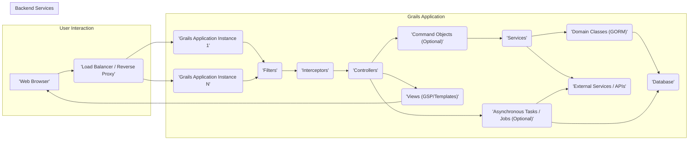
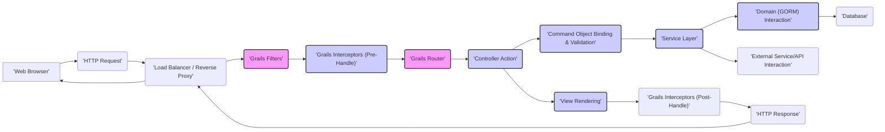

## Project Design Document: Grails Web Application Framework (Improved for Threat Modeling)

**1. Introduction**

This document provides an enhanced architectural design of the Grails web application framework, specifically tailored for threat modeling. It expands upon the previous version by providing more granular detail on key components, data flow, and security considerations. This detailed view is crucial for identifying potential threat vectors and vulnerabilities within the Grails ecosystem.

**2. Goals**

*   Provide a comprehensive and detailed overview of the Grails framework architecture.
*   Identify and describe the responsibilities of major and minor components relevant to security.
*   Illustrate the data flow within a typical Grails application, highlighting potential security checkpoints.
*   Elaborate on key technologies, dependencies, and their security implications.
*   Serve as a robust and informative basis for identifying potential threat vectors, attack surfaces, and vulnerabilities during threat modeling exercises.

**3. High-Level Architecture**

The Grails framework, built on Spring Boot and leveraging the Groovy language, adheres to the Model-View-Controller (MVC) pattern. This diagram provides a high-level view of the system.

**4. Component Breakdown (Detailed)**

*   **Web Browser:** The client application used by users to interact with the Grails application via HTTP requests.
*   **Load Balancer / Reverse Proxy:** Distributes incoming traffic, provides high availability, and can handle security tasks like SSL termination, request filtering, and basic attack mitigation.
*   **Grails Application Instance:** A running instance of the Grails application.
    *   **Filters:** Intercept incoming HTTP requests *before* they reach interceptors or controllers. They are often used for tasks like request logging, authentication checks, and setting up request context.
    *   **Interceptors:**  Handle cross-cutting concerns *around* the execution of controller actions. They can be used for logging, security checks, transaction management, and modifying request/response objects.
    *   **Controllers:** Receive and process incoming HTTP requests, validate input, invoke services, and select the appropriate view for rendering the response.
    *   **Command Objects (Optional):**  Plain Groovy Objects (POGOs) used to encapsulate request parameters for easier handling and validation in controllers and services.
    *   **Services:** Contain the core business logic of the application. They are typically stateless and are injected into controllers and other services.
    *   **Domain Classes (GORM):** Represent the application's data model and are persisted in the database using Grails Object Relational Mapping (GORM). They handle data access and persistence logic.
    *   **Views (GSP/Templates):** Responsible for rendering the user interface, typically using Groovy Server Pages (GSP) or other templating engines. They present data to the user.
    *   **Tag Libraries:** Reusable components that simplify the creation of dynamic web content within views.
    *   **Plugins:** Extend the functionality of the Grails framework, providing features like security (e.g., Spring Security), REST API support, and integration with other technologies. Plugins can introduce their own components and potential vulnerabilities.
    *   **Configuration:** Externalized configuration settings managed through files like `application.yml`, `application.groovy`, or environment variables. Improperly secured configuration can expose sensitive information.
    *   **Asynchronous Tasks / Jobs (Optional):** Mechanisms for executing tasks outside the main request-response cycle, often used for background processing. These can interact with databases and external services.
*   **Database:** The persistent storage for the application's data. Security considerations include access control, encryption, and protection against injection attacks.
*   **External Services / APIs:** Third-party services or APIs that the Grails application interacts with. Security concerns include secure authentication, authorization, and data transmission.

**5. Data Flow (Detailed)**

This diagram illustrates a more detailed request flow, highlighting key components and potential security checkpoints.

**Detailed Data Flow Description:**

*   A user interacts with the **Web Browser**, initiating an **HTTP Request**.
*   The request is routed through the **Load Balancer / Reverse Proxy**.
*   **Grails Filters** intercept the request, performing actions like authentication checks or request logging.
*   **Grails Interceptors (Pre-Handle)** execute before the controller action, potentially performing authorization checks or setting up request attributes.
*   The **Grails Router** maps the request URL to a specific **Controller Action**.
*   The **Controller Action** receives the request. If applicable, **Command Object Binding & Validation** occurs, converting request parameters into a command object and validating its data.
*   The **Controller Action** typically invokes one or more **Services** to handle business logic.
*   **Services** interact with **Domain Classes (GORM)** to access or modify data in the **Database**.
*   **Services** might also interact with **External Services / APIs**.
*   The **Controller Action** prepares data for **View Rendering**.
*   The **View** (GSP or template) renders the HTML response.
*   **Grails Interceptors (Post-Handle)** execute after the controller action, allowing for modifications to the response or cleanup tasks.
*   The **HTTP Response** is sent back through the **Load Balancer / Reverse Proxy** to the **Web Browser**.

**6. Security Considerations (Detailed for Threat Modeling)**

This section expands on potential security concerns, providing more specific context for threat modeling:

*   **Input Security:**
    *   **Injection Attacks (SQL, NoSQL, OS Command, LDAP, Expression Language):**  Insufficient input validation and sanitization in Controllers, Services, and GORM queries can lead to these vulnerabilities.
    *   **Cross-Site Scripting (XSS):** Improper encoding of user-supplied data in Views can allow attackers to inject malicious scripts.
    *   **Request Parameter Tampering:**  Lack of validation can allow attackers to manipulate request parameters to bypass security checks or alter application behavior.
    *   **Mass Assignment Vulnerabilities:**  Careless use of data binding can allow attackers to modify unintended domain object properties.
*   **Authentication and Authorization:**
    *   **Broken Authentication:** Weak password policies, insecure session management, and lack of multi-factor authentication can compromise user accounts.
    *   **Broken Authorization:**  Insufficient checks to ensure users only access resources they are permitted to, potentially leading to privilege escalation. Grails plugins like Spring Security are crucial here.
    *   **Session Fixation/Hijacking:** Vulnerabilities in session management can allow attackers to take over user sessions.
*   **Data Protection:**
    *   **Insecure Data Storage:** Sensitive data stored in the database without encryption or with weak encryption is vulnerable.
    *   **Insecure Communication:**  Lack of HTTPS can expose sensitive data transmitted between the browser and the server.
    *   **Data Leaks:**  Information disclosure through error messages, logging, or insecure API endpoints.
*   **Dependency Management:**
    *   **Vulnerable Dependencies:** Using outdated or vulnerable libraries and plugins can introduce security flaws. Regularly updating dependencies is crucial.
    *   **Transitive Dependencies:**  Vulnerabilities in dependencies of your direct dependencies can also pose a risk.
*   **Grails-Specific Considerations:**
    *   **Plugin Vulnerabilities:**  Security flaws in installed Grails plugins can directly impact the application's security.
    *   **GORM Security:** Understanding potential security implications of GORM features, such as dynamic finders and criteria queries, is important.
    *   **Groovy Meta-programming:** While powerful, misuse of Groovy's meta-programming features can introduce unexpected behavior and potential vulnerabilities.
*   **API Security (if applicable):**
    *   **Lack of Authentication/Authorization:**  Unprotected API endpoints can be accessed by anyone.
    *   **Injection Attacks:** APIs are also susceptible to injection vulnerabilities if input is not properly handled.
    *   **Data Exposure:** APIs might expose more data than intended.
    *   **Rate Limiting:** Lack of rate limiting can lead to denial-of-service attacks.
*   **Error Handling and Logging:**
    *   **Information Disclosure:**  Verbose error messages can reveal sensitive information about the application's internal workings.
    *   **Insufficient Logging:**  Lack of proper logging can hinder incident response and forensic analysis.
*   **Security Misconfiguration:**
    *   **Default Credentials:** Using default credentials for databases or other services.
    *   **Open Ports/Services:** Unnecessary open ports or services can provide attack vectors.
    *   **Improperly Configured Security Headers:** Missing or misconfigured security headers (e.g., Content Security Policy, HTTP Strict Transport Security) can leave the application vulnerable.
*   **Cross-Site Request Forgery (CSRF):**  Lack of CSRF protection can allow attackers to perform unauthorized actions on behalf of authenticated users.
*   **Content Security Policy (CSP):**  Lack of a strong CSP can make the application more vulnerable to XSS attacks.
*   **Rate Limiting and Throttling:**  Absence of mechanisms to limit the number of requests can lead to denial-of-service attacks.

**7. Deployment Considerations (Security Focused)**

The deployment environment significantly impacts security. Key considerations include:

*   **Infrastructure Security:**
    *   **Operating System Hardening:** Securely configuring the underlying operating system.
    *   **Network Segmentation:** Isolating application components and restricting network access.
    *   **Firewall Configuration:** Properly configuring firewalls to allow only necessary traffic.
*   **Cloud Security (if applicable):**
    *   **Cloud Provider Security Best Practices:** Adhering to security recommendations from the cloud provider (e.g., AWS, Azure, GCP).
    *   **Identity and Access Management (IAM):**  Properly managing access to cloud resources.
    *   **Secure Storage:** Utilizing secure storage options provided by the cloud provider.
*   **Containerization Security (e.g., Docker, Kubernetes):**
    *   **Secure Image Creation:** Building secure container images and scanning for vulnerabilities.
    *   **Orchestration Security:** Securely configuring container orchestration platforms.
    *   **Secrets Management:** Securely managing secrets within containers.
*   **Secrets Management:**  Using dedicated secrets management solutions (e.g., HashiCorp Vault, AWS Secrets Manager) to store and manage sensitive credentials. Avoid storing secrets in configuration files or environment variables directly.
*   **Environment Variables:** If using environment variables, ensure they are securely managed and not exposed.
*   **Monitoring and Logging:** Implementing comprehensive security monitoring and logging to detect and respond to security incidents. Centralized logging is recommended.
*   **Regular Security Audits and Penetration Testing:**  Proactively identifying vulnerabilities through regular assessments.

**8. Technologies Used**

*   **Programming Language:** Groovy
*   **Framework:** Spring Boot
*   **ORM:** Grails Object Relational Mapping (GORM)
*   **Templating Engine:** Groovy Server Pages (GSP) or other supported engines (e.g., Handlebars, Thymeleaf)
*   **Build Tool:** Gradle
*   **Dependency Management:** Gradle
*   **Testing Frameworks:** Spock, JUnit
*   **Web Server (Embedded):** Tomcat (default) or Jetty
*   **Possible Databases:** PostgreSQL, MySQL, Oracle, SQL Server, MongoDB, etc.
*   **Possible External Services:** Various REST APIs, message queues, etc.
*   **Security Libraries (Common):** Spring Security

This improved design document provides a more detailed and security-focused view of the Grails framework architecture. This enhanced understanding is essential for conducting effective threat modeling and identifying potential vulnerabilities within Grails applications. The next step involves leveraging this document to systematically analyze potential threats and develop appropriate mitigation strategies.