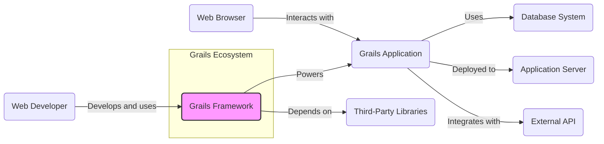
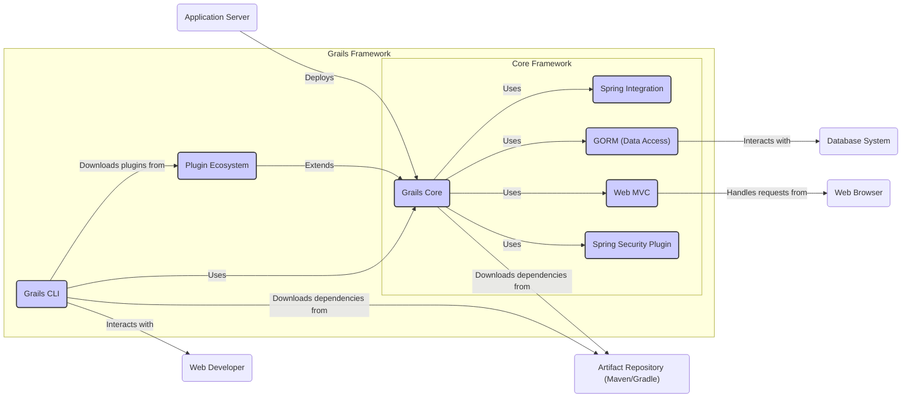
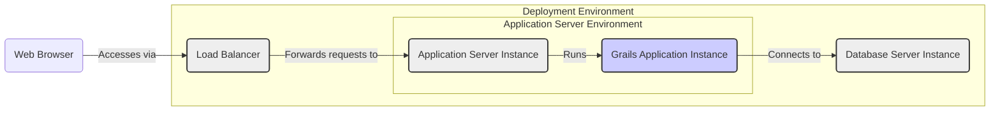
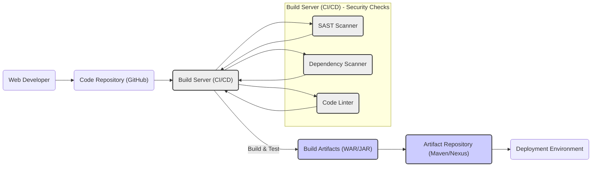

# BUSINESS POSTURE

- Business Priorities and Goals:
  - Grails framework aims to simplify and accelerate web application development on the JVM by providing a convention-over-configuration approach.
  - It targets developers who want to build robust and scalable web applications quickly, leveraging Groovy and the Spring ecosystem.
  - The project prioritizes developer productivity, ease of use, and integration with existing Java and Spring technologies.
  - A key goal is to maintain a vibrant and active open-source community around the framework, ensuring its continued evolution and support.
- Business Risks:
  - Security vulnerabilities in the framework itself could impact all applications built with Grails, leading to widespread security incidents.
  - Lack of adoption or community support could lead to the framework becoming outdated and less secure over time.
  - Compatibility issues with evolving Java and Spring ecosystems could hinder development and introduce security risks.
  - Improper use of the framework by developers could lead to insecure applications, even if the framework itself is secure.

# SECURITY POSTURE

- Existing Security Controls:
  - security control: Framework Security Features: Grails leverages Spring Security for authentication and authorization, providing a robust and widely adopted security foundation. (Implemented within the Grails framework core and plugins)
  - security control: Input Validation: Grails encourages input validation through data binding and domain class constraints, helping developers prevent common input-based vulnerabilities. (Documented in Grails documentation and guides)
  - security control: Output Encoding: Grails uses Groovy Server Pages (GSP) which by default provide some level of output encoding to mitigate Cross-Site Scripting (XSS) attacks. (Implicitly implemented in GSP rendering engine)
  - security control: Dependency Management: Grails uses Gradle for dependency management, allowing for control over included libraries and their versions. (Managed through Gradle build scripts)
  - security control: Secure Defaults: Grails aims to provide secure defaults where possible, reducing the likelihood of developers introducing vulnerabilities through misconfiguration. (Design principle of the framework)
  - accepted risk: Third-Party Dependencies: Grails relies on numerous third-party libraries, including Spring and others. Vulnerabilities in these dependencies could indirectly affect Grails applications. (Acknowledged risk of using open-source ecosystems)
  - accepted risk: Developer Security Practices: The security of applications built with Grails heavily depends on the security awareness and practices of the developers using the framework. (External factor, developer responsibility)

- Recommended Security Controls:
  - security control: Static Application Security Testing (SAST): Integrate SAST tools into the Grails build process to automatically detect potential security vulnerabilities in the framework code and in applications built with Grails.
  - security control: Dependency Scanning: Implement dependency scanning tools to continuously monitor and identify known vulnerabilities in third-party libraries used by Grails and Grails applications.
  - security control: Penetration Testing: Conduct regular penetration testing of Grails framework and example applications to identify and address security weaknesses.
  - security control: Security Code Reviews: Implement mandatory security code reviews for all contributions to the Grails framework to ensure code quality and security.
  - security control: Security Training for Developers: Provide security training and resources for Grails developers to promote secure coding practices and awareness of common web application vulnerabilities.

- Security Requirements:
  - Authentication:
    - Requirement: Grails applications should support various authentication mechanisms, including username/password, OAuth 2.0, and SAML, to accommodate different application needs.
    - Requirement: Authentication mechanisms should be configurable and extensible to allow integration with different identity providers.
    - Requirement: Grails should provide secure session management to protect authenticated user sessions from hijacking and other attacks.
  - Authorization:
    - Requirement: Grails applications should implement fine-grained authorization controls to restrict access to resources and functionalities based on user roles and permissions.
    - Requirement: Authorization policies should be clearly defined and easily manageable.
    - Requirement: Grails should provide mechanisms to enforce the principle of least privilege, granting users only the necessary permissions.
  - Input Validation:
    - Requirement: Grails applications must validate all user inputs to prevent injection attacks (SQL injection, Cross-Site Scripting, etc.) and other input-related vulnerabilities.
    - Requirement: Input validation should be performed on both client-side and server-side to ensure comprehensive protection.
    - Requirement: Grails should provide convenient and robust input validation mechanisms that are easy for developers to use.
  - Cryptography:
    - Requirement: Grails applications should use strong cryptography for protecting sensitive data in transit and at rest.
    - Requirement: Cryptographic operations should be performed using well-vetted and secure cryptographic libraries.
    - Requirement: Grails should provide guidance and best practices for developers on how to properly implement cryptography in their applications.

# DESIGN

## C4 CONTEXT

- Context Diagram Elements:
  - - Name: Grails Framework
    - Type: Software System
    - Description: The Grails framework itself, providing the core functionalities and libraries for building web applications.
    - Responsibilities: Provides the foundation for web application development, including MVC architecture, data access, templating, and security features.
    - Security controls: Security features built into the framework, such as Spring Security integration, input validation mechanisms, and secure defaults.
  - - Name: Web Developer
    - Type: Person
    - Description: Developers who use the Grails framework to build, deploy, and maintain web applications.
    - Responsibilities: Develops applications using Grails, configures and deploys applications, and ensures the security of the applications they build.
    - Security controls: Responsible for secure coding practices, proper configuration of Grails security features, and implementing application-level security controls.
  - - Name: Grails Application
    - Type: Software System
    - Description: Web applications built using the Grails framework.
    - Responsibilities: Provides specific business functionalities to end-users, processes user requests, interacts with databases and external systems.
    - Security controls: Implements application-specific security controls, such as authentication, authorization, input validation, and data protection, leveraging Grails framework features.
  - - Name: Database System
    - Type: External System
    - Description: Relational or NoSQL databases used by Grails applications to store and retrieve data.
    - Responsibilities: Stores application data, provides data persistence, and ensures data integrity and availability.
    - Security controls: Database access controls, encryption at rest and in transit, regular backups, and vulnerability management.
  - - Name: Application Server
    - Type: External System
    - Description: Runtime environment where Grails applications are deployed and executed (e.g., Tomcat, Jetty, Undertow).
    - Responsibilities: Hosts and executes Grails applications, manages application lifecycle, and provides runtime services.
    - Security controls: Application server hardening, access controls, secure configuration, and regular patching.
  - - Name: Web Browser
    - Type: External System
    - Description: Web browsers used by end-users to access and interact with Grails applications.
    - Responsibilities: Renders user interfaces, sends requests to Grails applications, and displays responses.
    - Security controls: Browser security features, such as Content Security Policy (CSP) enforcement, and protection against malicious websites.
  - - Name: External API
    - Type: External System
    - Description: External APIs and services that Grails applications may integrate with to extend functionality or access external data.
    - Responsibilities: Provides external functionalities or data to Grails applications.
    - Security controls: API authentication and authorization, secure communication protocols (HTTPS), and input validation of data received from APIs.
  - - Name: Third-Party Libraries
    - Type: External System
    - Description: External libraries and dependencies used by the Grails framework and Grails applications.
    - Responsibilities: Provides reusable functionalities and components to the Grails framework and applications.
    - Security controls: Dependency scanning, vulnerability management, and ensuring libraries are obtained from trusted sources.

## C4 CONTAINER

- Container Diagram Elements:
  - - Name: Grails Core
    - Type: Container - Web Application Framework
    - Description: The core runtime libraries and components of the Grails framework, providing the foundation for building web applications.
    - Responsibilities: Manages application lifecycle, handles requests, orchestrates components, and provides core functionalities.
    - Security controls: Implements core security features, integrates with Spring Security, and enforces secure defaults.
  - - Name: Spring Integration
    - Type: Container - Library
    - Description: Integration with the Spring Framework, providing dependency injection, AOP, and other Spring features within Grails.
    - Responsibilities: Provides the Spring application context, manages beans, and enables integration with Spring ecosystem.
    - Security controls: Leverages Spring Security features, benefits from Spring's security best practices.
  - - Name: GORM (Data Access)
    - Type: Container - Library
    - Description: Grails Object Relational Mapping (GORM) library, providing data access and persistence capabilities, often based on Hibernate or other ORM implementations.
    - Responsibilities: Maps domain classes to database tables, handles database interactions, and provides data validation.
    - Security controls: Prevents SQL injection through parameterized queries, enforces data validation rules, and manages database connections securely.
  - - Name: Web MVC
    - Type: Container - Library
    - Description: Grails Web MVC framework, handling web requests, routing, controllers, views, and the overall web application flow.
    - Responsibilities: Handles HTTP requests, routes requests to controllers, renders views, and manages web sessions.
    - Security controls: Implements input validation, output encoding, session management, and protection against common web vulnerabilities.
  - - Name: Spring Security Plugin
    - Type: Container - Plugin
    - Description: Grails plugin that integrates Spring Security, providing authentication and authorization functionalities for Grails applications.
    - Responsibilities: Handles user authentication, authorization, access control, and security configuration.
    - Security controls: Implements authentication mechanisms, authorization rules, role-based access control, and protection against authentication and authorization vulnerabilities.
  - - Name: Grails CLI
    - Type: Container - Command Line Interface
    - Description: Command-line interface for Grails, used by developers for creating, building, running, and managing Grails applications.
    - Responsibilities: Provides commands for project creation, code generation, dependency management, build tasks, and application deployment.
    - Security controls: Secure handling of credentials, protection against command injection, and secure communication with artifact repositories.
  - - Name: Plugin Ecosystem
    - Type: Container - Artifact Repository
    - Description: Repository of Grails plugins, extending the functionality of the core framework.
    - Responsibilities: Hosts and distributes Grails plugins, provides plugin metadata and documentation.
    - Security controls: Plugin verification, malware scanning, and secure plugin distribution channels.

## DEPLOYMENT

- Deployment Diagram Elements:
  - - Name: Load Balancer
    - Type: Infrastructure - Load Balancer
    - Description: Distributes incoming web traffic across multiple application server instances for scalability and high availability.
    - Responsibilities: Load balancing, traffic routing, SSL termination, and health checks.
    - Security controls: SSL/TLS encryption, DDoS protection, access control lists, and security hardening.
  - - Name: Application Server Instance
    - Type: Infrastructure - Application Server
    - Description: Individual instances of the application server (e.g., Tomcat, Jetty) running the Grails application.
    - Responsibilities: Hosts and executes Grails application instances, manages application lifecycle, and provides runtime environment.
    - Security controls: Application server hardening, access controls, regular patching, and security monitoring.
  - - Name: Grails Application Instance
    - Type: Container - Web Application
    - Description: A running instance of the deployed Grails web application within an application server.
    - Responsibilities: Handles user requests, executes application logic, interacts with the database, and serves web content.
    - Security controls: Application-level security controls, input validation, authorization checks, session management, and secure coding practices.
  - - Name: Database Server Instance
    - Type: Infrastructure - Database Server
    - Description: Instance of the database server (e.g., PostgreSQL, MySQL) used by the Grails application.
    - Responsibilities: Stores application data, manages data persistence, and provides database services.
    - Security controls: Database access controls, encryption at rest and in transit, regular backups, and database hardening.

## BUILD

- Build Diagram Elements:
  - - Name: Web Developer
    - Type: Person
    - Description: Developer writing and committing code for the Grails framework or applications.
    - Responsibilities: Writes code, performs local builds and tests, and commits code to the repository.
    - Security controls: Secure development environment, code review practices, and security awareness training.
  - - Name: Code Repository (GitHub)
    - Type: Software System - Version Control
    - Description: Git repository (e.g., GitHub) hosting the source code of the Grails framework or applications.
    - Responsibilities: Version control, code collaboration, and source code management.
    - Security controls: Access controls, branch protection, audit logging, and secure repository configuration.
  - - Name: Build Server (CI/CD)
    - Type: Software System - CI/CD Server
    - Description: Continuous Integration/Continuous Delivery server (e.g., Jenkins, GitHub Actions) automating the build, test, and deployment process.
    - Responsibilities: Automated build, testing, security scanning, and artifact creation.
    - Security controls: Secure build pipelines, access controls, secret management, and build environment hardening.
  - - Name: SAST Scanner
    - Type: Software System - Security Tool
    - Description: Static Application Security Testing tool used to analyze source code for potential security vulnerabilities.
    - Responsibilities: Static code analysis, vulnerability detection, and security code review assistance.
    - Security controls: Regularly updated vulnerability rules, secure configuration, and integration with the build pipeline.
  - - Name: Dependency Scanner
    - Type: Software System - Security Tool
    - Description: Tool to scan project dependencies for known vulnerabilities.
    - Responsibilities: Dependency vulnerability scanning, reporting vulnerable dependencies, and suggesting remediation.
    - Security controls: Regularly updated vulnerability database, secure configuration, and integration with the build pipeline.
  - - Name: Code Linter
    - Type: Software System - Code Quality Tool
    - Description: Tool to analyze code for style issues, potential bugs, and code quality problems.
    - Responsibilities: Code style checking, bug detection, and code quality enforcement.
    - Security controls: Customisable rules, integration with the build pipeline, and code quality improvement.
  - - Name: Build Artifacts (WAR/JAR)
    - Type: Data - Artifact
    - Description: Packaged application artifacts (e.g., WAR or JAR files) produced by the build process.
    - Responsibilities: Deployable application packages.
    - Security controls: Integrity checks (e.g., checksums), secure storage, and access controls.
  - - Name: Artifact Repository (Maven/Nexus)
    - Type: Software System - Artifact Repository
    - Description: Repository for storing and managing build artifacts (e.g., Maven Central, Nexus Repository).
    - Responsibilities: Artifact storage, versioning, and distribution.
    - Security controls: Access controls, secure storage, vulnerability scanning of artifacts, and audit logging.
  - - Name: Deployment Environment
    - Type: Environment
    - Description: Target environment where the application is deployed and run (e.g., application server, cloud environment).
    - Responsibilities: Hosting and running the application.
    - Security controls: Environment hardening, access controls, security monitoring, and infrastructure security.

# RISK ASSESSMENT

- Critical Business Processes:
  - For Grails framework itself: Maintaining the integrity and availability of the framework to ensure developers can build secure and reliable applications.
  - For applications built with Grails: The critical business processes depend on the specific application. Examples include e-commerce transactions, user data management, content delivery, and API services. The framework should not introduce vulnerabilities that could compromise these processes.
- Data Sensitivity:
  - For Grails framework itself: Source code of the framework is sensitive and needs to be protected from unauthorized access and modification.
  - For applications built with Grails: Data sensitivity depends on the application. It can range from publicly accessible content to highly sensitive personal data, financial information, or intellectual property. Grails applications need to be designed and built to protect the sensitivity of the data they handle.

# QUESTIONS & ASSUMPTIONS

- Questions:
  - What are the specific compliance requirements for applications built with Grails (e.g., PCI DSS, HIPAA, GDPR)?
  - What is the expected threat landscape for applications built with Grails? Are there specific threat actors or attack vectors to be particularly concerned about?
  - What are the performance and scalability requirements for Grails applications? How do security controls impact these requirements?
  - What is the process for reporting and patching security vulnerabilities in the Grails framework and applications?
- Assumptions:
  - BUSINESS POSTURE: It is assumed that developer productivity and ease of use are high priorities for the Grails project, but security is also a critical concern.
  - SECURITY POSTURE: It is assumed that basic security controls like framework security features and input validation are already in place or considered. The focus is on recommending additional controls and highlighting security requirements.
  - DESIGN: It is assumed that Grails applications are typically deployed in a standard web application architecture, involving application servers, databases, and load balancers. The build process is assumed to involve CI/CD pipelines and artifact repositories.