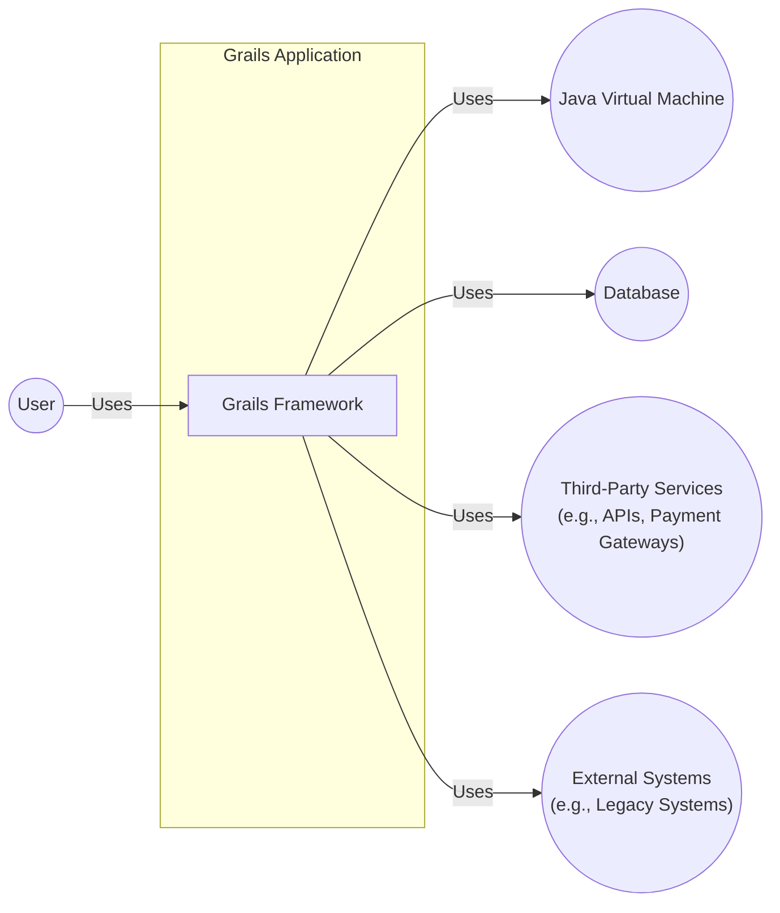
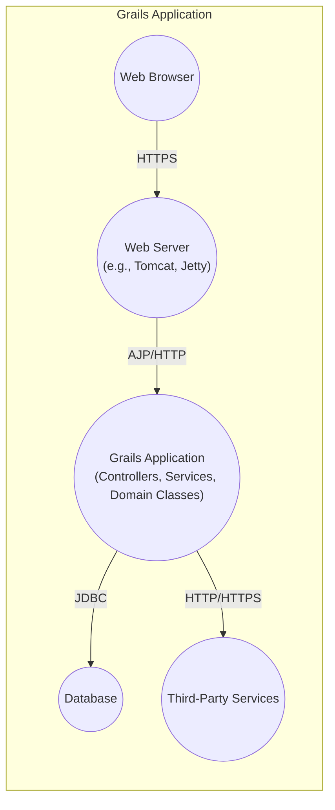
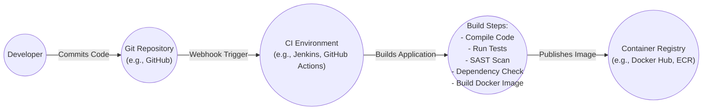

Okay, let's create a design document for the Grails Framework based on the provided GitHub repository.

# BUSINESS POSTURE

Grails is a mature, open-source web application framework. Its primary goal is to provide a highly productive environment for building web applications on the Java Virtual Machine (JVM) by leveraging Groovy and convention-over-configuration.  The business priorities likely revolve around:

*   Maintaining developer productivity and ease of use.
*   Ensuring the framework remains relevant and competitive with newer frameworks.
*   Providing a stable and reliable platform for building enterprise-grade applications.
*   Fostering a strong community and ecosystem.
*   Attracting and retaining users (developers).

Key business risks:

*   Loss of developer mindshare to competing frameworks (e.g., Spring Boot, Micronaut, Quarkus).
*   Security vulnerabilities that could compromise applications built with Grails.
*   Inability to adapt to evolving web development trends and technologies.
*   Lack of sufficient community support and contributions.
*   Performance issues that could impact the scalability of Grails applications.

# SECURITY POSTURE

Grails, being a mature framework, has incorporated various security features over time.  However, the responsibility for secure application development ultimately lies with the developers using the framework.

Existing security controls (based on common Grails practices and plugins):

*   security control: Spring Security Plugin: Often used for authentication and authorization (where: `build.gradle` or `pom.xml` for dependency, configuration in `grails-app/conf/application.groovy` or similar).
*   security control: CSRF Protection: Grails provides built-in protection against Cross-Site Request Forgery (CSRF) attacks (where: Enabled by default in recent versions, configurable in `application.yml` or `application.groovy`).
*   security control: XSS Prevention: Grails provides mechanisms for encoding output to prevent Cross-Site Scripting (XSS) vulnerabilities (where: GSP views, tag libraries).
*   security control: SQL Injection Prevention:  Using GORM (Grails Object Relational Mapping) with parameterized queries helps prevent SQL injection (where: Data access logic in services and domain classes).
*   security control: Session Management: Grails uses standard servlet container session management, which can be configured for security (e.g., HTTPS-only cookies, timeouts) (where: `application.yml` or `application.groovy`).
*   security control: Dependency Management: Grails uses Gradle (or Maven) for dependency management, allowing developers to track and update libraries (where: `build.gradle` or `pom.xml`).
*   security control: Secure by Default settings: Grails has been working to improve its secure-by-default settings over time.

Accepted risks:

*   accepted risk: Reliance on third-party plugins: While many plugins enhance security, they also introduce a potential attack surface if not properly vetted and maintained.
*   accepted risk: Developer error:  Even with a secure framework, developers can introduce vulnerabilities through insecure coding practices.
*   accepted risk: Configuration errors: Misconfiguration of security features (e.g., Spring Security rules) can lead to vulnerabilities.
*   accepted risk: Zero-day vulnerabilities:  Like any software, Grails and its underlying components are susceptible to undiscovered vulnerabilities.

Recommended security controls (High Priority):

*   Implement a robust Content Security Policy (CSP) to mitigate XSS and data injection attacks.
*   Use a dependency vulnerability scanner (e.g., OWASP Dependency-Check, Snyk) as part of the build process.
*   Enforce strong password policies and consider multi-factor authentication (MFA).
*   Regularly conduct security audits and penetration testing of applications built with Grails.
*   Implement comprehensive logging and monitoring to detect and respond to security incidents.

Security Requirements:

*   Authentication:
    *   Support for various authentication mechanisms (e.g., username/password, OAuth 2.0, OpenID Connect).
    *   Secure storage of user credentials (e.g., using bcrypt or similar hashing algorithms).
    *   Protection against brute-force attacks.
    *   Session invalidation upon logout.
*   Authorization:
    *   Role-based access control (RBAC) or attribute-based access control (ABAC).
    *   Fine-grained control over access to resources and functionality.
    *   Protection against privilege escalation attacks.
*   Input Validation:
    *   Validation of all user input on the server-side.
    *   Use of whitelists (allow lists) rather than blacklists (deny lists).
    *   Protection against common injection attacks (e.g., SQL injection, XSS, command injection).
*   Cryptography:
    *   Use of strong, industry-standard cryptographic algorithms.
    *   Secure storage of cryptographic keys.
    *   Protection of sensitive data in transit and at rest.
    *   Proper use of HTTPS.

# DESIGN

## C4 CONTEXT



Context Diagram Element Descriptions:

*   Element:
    *   Name: User
    *   Type: Person
    *   Description: A user of the Grails application, typically interacting through a web browser or mobile app.
    *   Responsibilities: Accessing and interacting with the application's features.
    *   Security controls: Authentication, Authorization, Session Management.

*   Element:
    *   Name: Grails Framework
    *   Type: Software System
    *   Description: The core Grails framework, providing the runtime environment and libraries for building web applications.
    *   Responsibilities: Handling HTTP requests, processing data, rendering views, interacting with the database and external systems.
    *   Security controls: CSRF Protection, XSS Prevention, Input Validation, Secure Configuration.

*   Element:
    *   Name: Java Virtual Machine (JVM)
    *   Type: Software System
    *   Description: The runtime environment for executing Grails applications (Groovy and Java code).
    *   Responsibilities: Providing memory management, garbage collection, and other low-level services.
    *   Security controls: JVM Security Manager (if enabled), Secure Class Loading.

*   Element:
    *   Name: Database
    *   Type: Software System
    *   Description: A database system (e.g., MySQL, PostgreSQL, Oracle) used to store application data.
    *   Responsibilities: Storing and retrieving data, ensuring data integrity and consistency.
    *   Security controls: Database Access Controls, Encryption at Rest, Auditing.

*   Element:
    *   Name: Third-Party Services
    *   Type: Software System
    *   Description: External services used by the Grails application (e.g., payment gateways, email services, social media APIs).
    *   Responsibilities: Providing specific functionalities not implemented within the application.
    *   Security controls: API Keys, OAuth 2.0, Secure Communication (HTTPS).

*   Element:
    *   Name: External Systems
    *   Type: Software System
    *   Description: Other systems that the Grails application interacts with, such as legacy systems or internal services.
    *   Responsibilities: Providing data or functionality to the Grails application.
    *   Security controls: Authentication, Authorization, Secure Communication (e.g., VPN, HTTPS).

## C4 CONTAINER



Container Diagram Element Descriptions:

*   Element:
    *   Name: Web Browser
    *   Type: Software System
    *   Description: The user's web browser, used to access the Grails application.
    *   Responsibilities: Rendering HTML, executing JavaScript, making HTTP requests.
    *   Security controls: Browser Security Features (e.g., Same-Origin Policy, CSP).

*   Element:
    *   Name: Web Server (e.g., Tomcat, Jetty)
    *   Type: Container (Java Web Server)
    *   Description: A web server that hosts the Grails application.
    *   Responsibilities: Handling HTTP requests, serving static content, forwarding requests to the Grails application.
    *   Security controls: HTTPS Configuration, Access Logging, Request Filtering.

*   Element:
    *   Name: Grails Application (Controllers, Services, Domain Classes)
    *   Type: Container (Grails Application)
    *   Description: The Grails application itself, containing the business logic, data access, and presentation layers.
    *   Responsibilities: Processing requests, interacting with the database and external services, rendering views.
    *   Security controls: Authentication, Authorization, Input Validation, CSRF Protection, XSS Prevention.

*   Element:
    *   Name: Database
    *   Type: Container (Database)
    *   Description: The database system used to store application data.
    *   Responsibilities: Storing and retrieving data, ensuring data integrity.
    *   Security controls: Database Access Controls, Encryption at Rest, Auditing.

*   Element:
    *   Name: Third-Party Services
    *   Type: Software System
    *   Description: External services used by the Grails application.
    *   Responsibilities: Providing specific functionalities.
    *   Security controls: API Keys, OAuth 2.0, Secure Communication (HTTPS).

## DEPLOYMENT

Possible deployment solutions:

1.  Traditional WAR deployment to a Java application server (Tomcat, Jetty, WildFly).
2.  Executable JAR deployment (using Spring Boot's embedded server capabilities).
3.  Cloud deployment to platforms like AWS Elastic Beanstalk, Google App Engine, or Heroku.
4.  Containerized deployment using Docker and Kubernetes.

Chosen solution for detailed description: Containerized deployment using Docker and Kubernetes.

```mermaid
graph LR
    subgraph Kubernetes Cluster
        direction TB
        Internet(("Internet")) -- "Ingress\n(HTTPS)" --> LoadBalancer(("Load Balancer"))
        LoadBalancer -- "HTTP" --> GrailsPod1(("Grails Pod 1\n(Docker Container)"))
        LoadBalancer -- "HTTP" --> GrailsPod2(("Grails Pod 2\n(Docker Container)"))
        LoadBalancer -- "HTTP" --> GrailsPodN(("Grails Pod N\n(Docker Container)"))
        GrailsPod1 -- "JDBC" --> DatabaseService(("Database Service"))
        GrailsPod2 -- "JDBC" --> DatabaseService
        GrailsPodN -- "JDBC" --> DatabaseService
        DatabaseService -- "" --> DatabaseNode1(("Database Node 1"))
        DatabaseService -- "" --> DatabaseNode2(("Database Node 2"))
        DatabaseService -- "" --> DatabaseNodeN(("Database Node N"))
    end
```

Deployment Diagram Element Descriptions:

*   Element:
    *   Name: Internet
    *   Type: External
    *   Description: The public internet.
    *   Responsibilities: Routing traffic to the Kubernetes cluster.
    *   Security controls: Firewall, DDoS Protection.

*   Element:
    *   Name: Ingress (HTTPS)
    *   Type: Kubernetes Ingress
    *   Description:  A Kubernetes resource that manages external access to the services in a cluster, typically HTTP.
    *   Responsibilities:  Routing external traffic to the appropriate service, TLS termination.
    *   Security controls:  TLS Certificates, Web Application Firewall (WAF).

*   Element:
    *   Name: Load Balancer
    *   Type: Kubernetes Service (LoadBalancer)
    *   Description: A Kubernetes service that distributes traffic across multiple Grails pods.
    *   Responsibilities: Load balancing, health checks.
    *   Security controls: Network Policies.

*   Element:
    *   Name: Grails Pod 1, Grails Pod 2, Grails Pod N
    *   Type: Kubernetes Pod
    *   Description:  Instances of the Grails application running in Docker containers.
    *   Responsibilities:  Handling user requests.
    *   Security controls:  Container Security (e.g., image scanning, minimal base images), Network Policies, Resource Limits.

*   Element:
    *   Name: Database Service
    *   Type: Kubernetes Service
    *   Description: A Kubernetes service that provides a stable endpoint for accessing the database.
    *   Responsibilities: Abstracting the database nodes from the application pods.
    *   Security controls: Network Policies.

*   Element:
    *   Name: Database Node 1, Database Node 2, Database Node N
    *   Type: Database Instance
    *   Description: Instances of the database server (e.g., PostgreSQL, MySQL).
    *   Responsibilities: Storing and managing application data.
    *   Security controls: Database Authentication, Authorization, Encryption, Auditing.

## BUILD



Build Process Description:

1.  Developer commits code to a Git repository (e.g., GitHub, GitLab).
2.  A webhook triggers the CI environment (e.g., Jenkins, GitHub Actions, CircleCI).
3.  The CI environment checks out the code and executes the build steps:
    *   Compile the Groovy and Java code.
    *   Run unit and integration tests.
    *   Perform a Static Application Security Testing (SAST) scan using a tool like FindBugs, SpotBugs or SonarQube.
    *   Run a dependency check using OWASP Dependency-Check or Snyk to identify known vulnerabilities in dependencies.
    *   Build a Docker image containing the Grails application.
4.  The CI environment pushes the Docker image to a container registry (e.g., Docker Hub, Amazon ECR, Google Container Registry).

Security Controls in Build Process:

*   Code Review:  Mandatory code reviews before merging changes to the main branch.
*   SAST Scanning:  Automated static analysis to identify potential vulnerabilities in the code.
*   Dependency Scanning:  Automated scanning of dependencies for known vulnerabilities.
*   Image Scanning:  Scanning the Docker image for vulnerabilities before pushing it to the registry.
*   Least Privilege:  The CI environment should have only the necessary permissions to perform the build and push the image.
*   Secrets Management:  Sensitive information (e.g., API keys, database credentials) should be securely managed and not hardcoded in the build configuration.

# RISK ASSESSMENT

Critical Business Processes:

*   User authentication and authorization.
*   Data persistence and retrieval.
*   Interaction with third-party services (if applicable).
*   Application availability and performance.

Data to Protect and Sensitivity:

*   User credentials (passwords, usernames, email addresses): Highly sensitive.
*   Personally Identifiable Information (PII) (e.g., names, addresses, phone numbers): Highly sensitive, subject to regulations like GDPR, CCPA.
*   Financial data (e.g., credit card numbers, transaction history): Highly sensitive, subject to PCI DSS.
*   Application data (depending on the specific application):  Sensitivity varies, ranging from public to highly confidential.
*   Session data: Moderately sensitive.

# QUESTIONS & ASSUMPTIONS

Questions:

*   What specific third-party services does a typical Grails application integrate with?
*   What is the typical deployment environment for Grails applications (cloud provider, on-premise)?
*   What are the most common security vulnerabilities found in Grails applications?
*   Are there any specific regulatory compliance requirements (e.g., GDPR, HIPAA, PCI DSS) that need to be considered?
*   What level of security expertise is expected from developers using Grails?

Assumptions:

*   BUSINESS POSTURE: The Grails project prioritizes developer productivity and ease of use, but also recognizes the importance of security.
*   SECURITY POSTURE: Developers using Grails have a basic understanding of web application security principles. The framework provides some security features out of the box, but developers are responsible for implementing secure coding practices.
*   DESIGN: The Grails application follows a typical Model-View-Controller (MVC) architecture. The application interacts with a relational database. The application may interact with external services. The deployment environment is likely to be a Java application server or a containerized environment.