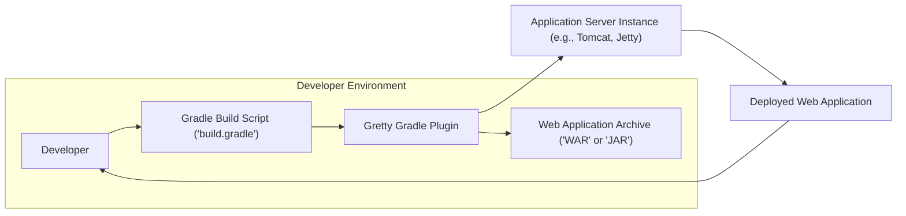
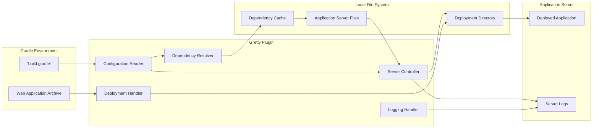

# Project Design Document: Gretty Gradle Plugin

**Version:** 1.1
**Date:** October 26, 2023
**Author:** AI Software Architect

## 1. Introduction

This document provides a detailed design overview of the Gretty Gradle plugin, intended for use in subsequent threat modeling activities. Gretty is a Gradle plugin designed to streamline the execution of web applications directly within the Gradle build process. It achieves this by managing embedded or standalone application server instances (e.g., Tomcat, Jetty), simplifying the development and testing workflow. This document outlines Gretty's architecture, key components, and data flow with a focus on aspects relevant to security analysis.

## 2. Goals and Objectives

*   Provide a refined and more detailed description of the Gretty plugin's architecture and functionality.
*   Elaborate on the internal workings of key components and their interactions.
*   Provide a more granular view of the data flow involved in running a web application using Gretty.
*   Strengthen the foundation for identifying specific security vulnerabilities and threats.
*   Serve as an enhanced reference document for security assessments, development, and maintenance.

## 3. High-Level Architecture

The following diagram illustrates the high-level architecture of the Gretty plugin and its interaction with the Gradle build environment and the target application server.

**Components:**

*   **Developer:** The individual initiating and interacting with the Gradle build process.
*   **Gradle Build Script ('build.gradle'):** The configuration file defining the project's build logic, including Gretty plugin configuration.
*   **Gretty Gradle Plugin:** The core logic of the plugin, responsible for managing the application server and deployment.
*   **Web Application Archive ('WAR' or 'JAR'):** The packaged web application to be deployed and run.
*   **Application Server Instance (e.g., Tomcat, Jetty):** The runtime environment managed by Gretty for executing the web application.
*   **Deployed Web Application:** The running instance of the web application, accessible via network requests.

**Interaction Flow:**

1. The **Developer** executes a Gradle task (e.g., `grettyRun`).
2. **Gradle** processes the **Gradle Build Script ('build.gradle')**, invoking the **Gretty Gradle Plugin**.
3. The **Gretty Gradle Plugin** reads its configuration from the **Gradle Build Script ('build.gradle')**.
4. The plugin locates the **Web Application Archive ('WAR' or 'JAR')**, typically produced by prior Gradle tasks.
5. The plugin manages the lifecycle of the **Application Server Instance**, potentially downloading and configuring it.
6. The **Web Application Archive ('WAR' or 'JAR')** is deployed to the **Application Server Instance**.
7. The **Application Server Instance** starts, making the **Deployed Web Application** accessible.
8. The **Developer** can interact with the **Deployed Web Application**.

## 4. Detailed Design

This section provides a more in-depth look at the internal components and their functionalities within the Gretty plugin.

### 4.1. Core Components

*   **Configuration Management Module:**
    *   Parses the `gretty` block within the `build.gradle` file.
    *   Validates configuration parameters such as server type, version, port, context path, and SSL settings.
    *   Resolves default values for unspecified configurations.
    *   Handles configuration overrides from command-line arguments or environment variables.
*   **Dependency Resolution Module:**
    *   Determines the necessary dependencies for the specified application server (e.g., Tomcat libraries).
    *   Downloads required server distributions from configured repositories (e.g., Maven Central).
    *   Manages caching of downloaded dependencies to avoid redundant downloads.
    *   Verifies the integrity of downloaded files (e.g., using checksums).
*   **Server Lifecycle Management Module:**
    *   Handles the starting and stopping of the application server process.
    *   Executes server-specific startup scripts or APIs.
    *   Monitors the server process for successful startup and potential errors.
    *   Manages server shutdown gracefully upon task completion or interruption.
    *   Potentially configures server settings like JVM options.
*   **Deployment Module:**
    *   Copies the **Web Application Archive ('WAR' or 'JAR')** to the appropriate deployment directory of the application server.
    *   May interact with the server's deployment API (e.g., Tomcat Manager).
    *   Handles hot deployment or redeployment scenarios.
    *   Manages the application context path and virtual host configurations.
*   **Logging and Monitoring Module:**
    *   Configures logging for the Gretty plugin itself.
    *   Potentially captures and displays application server logs.
    *   May provide basic monitoring of the server's status.
*   **Security Module (Implicit):**
    *   While not explicitly named, security considerations are woven throughout other modules. This includes:
        *   Securely handling downloaded dependencies.
        *   Potentially configuring basic server security settings.
        *   Managing access to server management interfaces (if exposed).

### 4.2. Data Flow

The following diagram illustrates the detailed data flow within the Gretty plugin during the execution of a `grettyRun` task.

**Detailed Data Flow Description:**

1. The **Configuration Reader** reads configuration parameters from the **'build.gradle'** file.
2. The **Configuration Reader** provides dependency information to the **Dependency Resolver**.
3. The **Dependency Resolver** checks the **Dependency Cache**.
4. If not cached, the **Dependency Resolver** downloads **Application Server Files** and stores them in the **Dependency Cache**.
5. The **Configuration Reader** provides server configuration to the **Server Controller**.
6. The **Server Controller** uses the **Application Server Files** to manage the application server instance.
7. The **Web Application Archive** is passed to the **Deployment Handler**.
8. The **Server Controller** configures the **Deployment Directory**.
9. The **Deployment Handler** deploys the application to the **Deployment Directory**.
10. The deployed application resides in the **Deployment Directory**.
11. The **Server Controller** starts the application, resulting in the **Deployed Application**.
12. The **Server Controller** generates **Server Logs**.
13. The **Logging Handler** potentially captures and displays the **Server Logs**.

## 5. Security Considerations (For Threat Modeling)

This section outlines specific security considerations relevant for threat modeling, categorized by component and data flow.

*   **Configuration Management Module:**
    *   **Vulnerability:** Injection of malicious configuration values through `build.gradle` manipulation.
    *   **Threat:**  Altering server behavior, gaining unauthorized access.
    *   **Vulnerability:** Exposure of sensitive configuration data (e.g., passwords) in `build.gradle`.
    *   **Threat:** Credential theft, unauthorized access.
*   **Dependency Resolution Module:**
    *   **Vulnerability:** Downloading compromised application server distributions from untrusted repositories.
    *   **Threat:** Introduction of malware or vulnerabilities into the development environment.
    *   **Vulnerability:** Man-in-the-middle attacks during dependency download if not using secure protocols (HTTPS).
    *   **Threat:**  Downloading and using compromised dependencies.
    *   **Vulnerability:** Insufficient verification of downloaded dependencies (e.g., weak checksum algorithms).
    *   **Threat:** Using corrupted or tampered dependencies.
*   **Server Lifecycle Management Module:**
    *   **Vulnerability:**  Insecure default server configurations applied by Gretty.
    *   **Threat:**  Leaving the application server vulnerable to known exploits.
    *   **Vulnerability:**  Exposure of server management interfaces without proper authentication.
    *   **Threat:** Unauthorized control of the application server.
    *   **Vulnerability:**  Insufficient sanitization of JVM options or startup parameters.
    *   **Threat:**  Command injection vulnerabilities.
*   **Deployment Module:**
    *   **Vulnerability:** Path traversal vulnerabilities if Gretty doesn't properly sanitize deployment paths.
    *   **Threat:**  Overwriting critical system files or deploying applications to unintended locations.
    *   **Vulnerability:**  Exposure of sensitive files during the deployment process.
    *   **Threat:** Information disclosure.
    *   **Vulnerability:**  Insufficient access controls on the deployment directory.
    *   **Threat:** Unauthorized modification or deletion of deployed applications.
*   **Logging and Monitoring Module:**
    *   **Vulnerability:**  Logging sensitive information (e.g., API keys, passwords) in plain text.
    *   **Threat:** Information disclosure.
    *   **Vulnerability:**  Insufficient protection of log files.
    *   **Threat:** Unauthorized access to sensitive information.
*   **Interaction with Gradle Environment:**
    *   **Vulnerability:**  Malicious Gradle plugins interfering with Gretty's operation.
    *   **Threat:**  Compromising the deployment process or the application server.
*   **Interaction with Local File System:**
    *   **Vulnerability:**  Insufficient permissions on the dependency cache or deployment directory.
    *   **Threat:**  Unauthorized modification or deletion of critical files.

## 6. Assumptions and Constraints

*   The security of the host operating system is assumed.
*   The user running the Gradle build has appropriate permissions to perform the necessary actions.
*   Network connectivity is available for downloading dependencies.
*   This design focuses on the core functionality of Gretty and may not cover all possible configurations or edge cases.
*   The security of the deployed web application itself is the responsibility of the application developers, though Gretty's actions can influence it.

## 7. Future Considerations

*   Implementing mechanisms for verifying the authenticity and integrity of downloaded application server distributions (e.g., using digital signatures).
*   Providing options for more secure default server configurations.
*   Integrating with security scanning tools to automatically identify vulnerabilities in dependencies and configurations.
*   Enhancing logging to include security-related events and potential threats.
*   Offering more granular control over access to the deployed application and server management interfaces.
*   Exploring options for sandboxing the application server process.

This improved design document provides a more detailed and security-focused overview of the Gretty Gradle plugin, facilitating a more comprehensive and effective threat modeling process. The enhanced descriptions of components, data flow, and specific security considerations offer a stronger foundation for identifying and mitigating potential risks.
