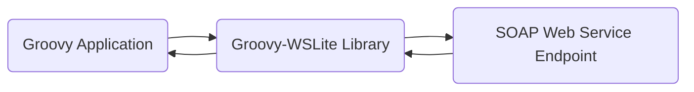
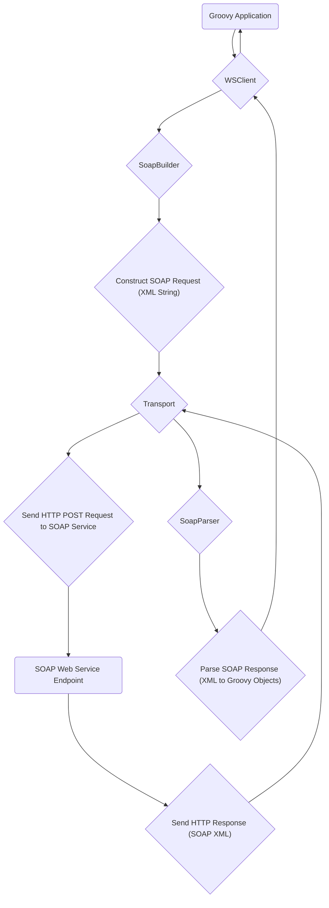

# Project Design Document: Groovy-WSLite

**Version:** 1.1
**Date:** October 26, 2023
**Author:** AI Software Architect

## 1. Introduction

This document provides an enhanced design overview of the Groovy-WSLite project, a lightweight Groovy library designed to simplify the consumption of SOAP (Simple Object Access Protocol) based web services. This document aims to provide a more detailed and nuanced understanding of the library's architecture, internal components, and data flow, specifically tailored to facilitate comprehensive threat modeling activities.

## 2. Goals and Objectives

The primary goal of Groovy-WSLite is to abstract the complexities of SOAP communication, offering Groovy developers an intuitive and efficient way to interact with SOAP-based web services. Key objectives include:

*   Providing a fluent and Groovy-idiomatic Domain Specific Language (DSL) for constructing and executing SOAP requests.
*   Abstracting the intricacies of SOAP message structure, including envelope, header, and body construction.
*   Supporting common and essential SOAP features such as namespaces, SOAP headers (including custom headers), and attachments (though attachment handling might be basic).
*   Offering a lightweight and less resource-intensive alternative to full-fledged SOAP frameworks like Apache Axis or CXF for simpler use cases.

## 3. High-Level Architecture

Groovy-WSLite acts as a client-side library embedded within a Groovy application. It mediates the communication between the application and a remote SOAP web service by handling the SOAP protocol specifics.

*   **"Groovy Application"**: The application written in Groovy (or potentially Java) that integrates and utilizes the Groovy-WSLite library to consume SOAP services. This application initiates the interaction.
*   **"Groovy-WSLite Library"**: The core library. It encapsulates the logic for SOAP message construction, transmission, and response parsing. It provides the API that the Groovy application interacts with.
*   **"SOAP Web Service Endpoint"**: The remote server hosting the SOAP web service. This service receives SOAP requests and sends back SOAP responses.

## 4. Detailed Design

### 4.1. Core Components

The library is internally organized into several distinct components, each with a specific responsibility in the SOAP communication lifecycle.

*   **"WSClient"**: This serves as the primary interface for interacting with SOAP services. It manages the configuration of the target service endpoint URL, potentially handles basic authentication details, and orchestrates the request execution and response handling. It's the entry point for most interactions.
*   **"SoapBuilder"**: This component provides a fluent API (a builder pattern) to programmatically construct the SOAP request message. It allows developers to define the structure of the SOAP envelope, add necessary headers (including SOAPAction), and populate the message body with the data to be sent to the service.
*   **"SoapParser"**: Responsible for processing the raw XML SOAP response received from the web service. It parses the XML structure to extract the relevant data elements and make them accessible to the calling application, typically as Groovy objects or data structures.
*   **"Transport"**: This is an abstraction layer that handles the underlying network communication using the HTTP protocol. It takes the constructed SOAP message (as an XML string) and sends it to the service endpoint. It also receives the HTTP response containing the SOAP message. The default implementation likely uses Java's `HttpURLConnection` or a similar mechanism.
*   **"Interceptor" (Optional)**: This component provides a mechanism to intercept and potentially modify SOAP requests before they are sent and SOAP responses after they are received. This can be used for logging, adding custom headers, or other cross-cutting concerns. Implementations are likely based on interfaces or closures.
*   **"WSError"**: A custom exception class used to represent errors that occur during the SOAP communication process. It provides a structured way to handle and report errors, potentially including details about the HTTP status code or SOAP fault information.

### 4.2. Data Flow

The sequence of operations involved in making a SOAP request using Groovy-WSLite can be visualized as follows:

1. **"Initiation"**: The Groovy application starts the process by interacting with an instance of the `WSClient`, providing necessary parameters or configurations.
2. **"Request Building"**: The application utilizes the `SoapBuilder` to programmatically construct the SOAP request message. This involves specifying the target operation, adding namespaces, defining header elements (like `SOAPAction`), and populating the body with the request data. The output is typically an XML string representing the SOAP envelope.
3. **"Transport"**: The `Transport` component takes the generated SOAP XML string and initiates an HTTP POST request to the configured SOAP service endpoint URL. This involves setting appropriate HTTP headers (like `Content-Type: text/xml; charset=utf-8`) and potentially handling authentication headers.
4. **"Service Processing"**: The remote "SOAP Web Service Endpoint" receives the HTTP request containing the SOAP message. It processes the request according to its defined operations and generates a SOAP response message.
5. **"Response Reception"**: The `Transport` component receives the HTTP response from the SOAP service. This response typically contains the SOAP response message in XML format and an HTTP status code.
6. **"Response Parsing"**: The `SoapParser` takes the raw XML content of the SOAP response and parses it. This involves navigating the XML structure to extract the relevant data elements based on the expected response schema. The parsed data is then transformed into Groovy objects or data structures (like Maps).
7. **"Result Delivery"**: The parsed response data is returned to the originating "Groovy Application" through the `WSClient`, allowing the application to access and utilize the data returned by the SOAP service.

### 4.3. Key Classes and Interactions

*   The "Groovy Application" typically instantiates a `WSClient`, providing the target service URL and potentially authentication details.
*   The application then uses the `WSClient` to initiate a SOAP call, often leveraging the `SoapBuilder` through a method on the `WSClient`.
*   The `SoapBuilder`'s fluent API is used to define the structure and content of the SOAP request. Methods are chained to add elements to the envelope, header, and body.
*   The `WSClient` delegates the actual network communication to the `Transport` component, passing the constructed SOAP XML.
*   The `Transport` handles the low-level details of making the HTTP request, including setting headers and handling potential network errors.
*   Upon receiving a successful HTTP response, the `Transport` passes the raw response body (the SOAP XML) to the `SoapParser`.
*   The `SoapParser` utilizes an XML parsing mechanism (likely leveraging Java's built-in XML libraries or potentially a library like JAXB for more complex scenarios) to process the SOAP response.
*   The parsed data is then returned to the `WSClient`, which in turn provides it back to the "Groovy Application".
*   If any errors occur during the process (e.g., network issues, invalid SOAP response), a `WSError` exception is thrown, providing information about the failure.

## 5. Security Considerations (Detailed for Threat Modeling)

This section expands on the initial security considerations, providing more specific details relevant for threat modeling.

*   **Transport Security (Confidentiality and Integrity)**:
    *   **HTTPS Enforcement:** Is the library configured to enforce HTTPS for all communication with the SOAP service?  Lack of HTTPS exposes sensitive data in transit to eavesdropping and tampering.
    *   **TLS/SSL Configuration:** How are TLS/SSL settings managed? Are secure protocols and cipher suites enforced? Weak configurations can be exploited.
    *   **Certificate Validation:** Is proper certificate validation performed to prevent Man-in-the-Middle (MITM) attacks? Are self-signed certificates handled securely (or discouraged)?
*   **Input Validation (Preventing Injection Attacks)**:
    *   **SOAP Request Construction:** How does the `SoapBuilder` handle data provided by the application when constructing the SOAP request? Is there proper encoding and escaping of data to prevent SOAP Injection attacks (similar to SQL Injection)?
    *   **XML Encoding:** Is data properly XML-encoded before being included in the SOAP message body and headers? Failure to do so can lead to unexpected parsing behavior or vulnerabilities in the service.
*   **XML Processing Vulnerabilities (Denial of Service, Information Disclosure)**:
    *   **XXE (XML External Entity) Attacks:** Is the XML parser used by `SoapParser` vulnerable to XXE attacks? Can a malicious SOAP response cause the library to access local files or internal network resources?
    *   **XML Bomb (Billion Laughs) Attacks:** Is the parser susceptible to denial-of-service attacks through maliciously crafted XML with deeply nested or recursively defined entities?
    *   **XPath Injection:** If XPath is used for parsing, is user-controlled data properly sanitized to prevent XPath injection attacks?
*   **Authentication and Authorization (Access Control)**:
    *   **Credential Handling:** How does the library handle authentication credentials for the SOAP service (e.g., usernames, passwords, API keys)? Are credentials stored securely in memory or configuration? Avoid storing credentials directly in code.
    *   **Supported Authentication Mechanisms:** What authentication mechanisms are supported (e.g., Basic Authentication, WS-Security)? Are these mechanisms implemented securely?
    *   **Session Management:** If the SOAP service uses sessions, how are session tokens handled and protected?
*   **Error Handling (Information Disclosure)**:
    *   **Verbose Error Messages:** Do error messages (especially `WSError` details) expose sensitive information about the system, the SOAP service's internal workings, or data structures? Error messages should be informative but not overly revealing.
    *   **Stack Traces:** Are full stack traces logged or returned to the user in production environments? Stack traces can reveal internal implementation details.
*   **Dependency Management (Supply Chain Security)**:
    *   **Vulnerable Dependencies:** Are all the library's dependencies (including transitive dependencies) regularly checked for known vulnerabilities? Outdated or vulnerable dependencies can introduce security risks.
    *   **Dependency Updates:** Is there a process for keeping dependencies up-to-date?
*   **Logging (Information Disclosure)**:
    *   **Sensitive Data Logging:** What information is logged by the library? Does it inadvertently log sensitive data like authentication credentials, request/response payloads, or other confidential information? Logging should be carefully configured to avoid exposing sensitive data.
*   **DoS Resilience (Availability)**:
    *   **Resource Exhaustion:** Can a malicious SOAP response (e.g., extremely large response) cause resource exhaustion (memory, CPU) in the parsing logic, leading to a denial-of-service?
    *   **Timeouts:** Are appropriate timeouts configured for network requests to prevent indefinite blocking?

## 6. Dependencies

The Groovy-WSLite library's functionality relies on several external components and libraries:

*   **Groovy Language (Runtime):** The core runtime environment for executing the Groovy code.
*   **Java Standard Library:**  Crucially used for core functionalities like:
    *   **`java.net.HttpURLConnection` (or similar):** For handling the underlying HTTP communication in the `Transport` component.
    *   **XML Processing Libraries (e.g., `javax.xml.parsers`, `org.w3c.dom`):** Used by the `SoapParser` for parsing the SOAP XML responses. Depending on complexity, it might use JAXB or StAX.
*   **Potentially other libraries:** Depending on specific features and implementation choices, the library might depend on:
    *   **A Logging Framework (e.g., SLF4j, Logback, Log4j):** For logging purposes.
    *   **Testing Frameworks (e.g., JUnit, Spock):** For unit and integration testing (though these are development dependencies).
    *   **Libraries for specific authentication mechanisms (if supported).**

A thorough review of the project's build files (e.g., `pom.xml` for Maven, `build.gradle` for Gradle) is essential to obtain a complete and accurate list of all direct and transitive dependencies.

## 7. Deployment

Groovy-WSLite is intended to be deployed as a library dependency within a Groovy or Java application. The typical deployment process involves:

*   **Adding the library as a dependency:**  Developers include the Groovy-WSLite library as a dependency in their project's build configuration file (e.g., `pom.xml` or `build.gradle`).
*   **Dependency Management Tools:** Tools like Maven or Gradle are used to manage the library's inclusion and resolve any transitive dependencies.
*   **Packaging:** The application, along with the Groovy-WSLite library, is then packaged into a deployable artifact (e.g., a JAR or WAR file).
*   **Runtime Environment:** The deployed application runs within a Java Virtual Machine (JVM) environment.

## 8. Future Considerations

*   **Enhanced WS-Security Support:** Implementing more comprehensive support for WS-Security standards, including features like digital signatures, encryption, and secure conversation.
*   **Asynchronous Request/Response Handling:** Adding support for non-blocking or asynchronous SOAP calls to improve application responsiveness.
*   **Improved Error Handling and Detailed Reporting:** Providing more granular and context-rich error information, potentially including SOAP fault details in a structured manner.
*   **Pluggable Transport Layer:** Allowing users to configure and plug in different HTTP client implementations (e.g., Apache HttpClient, OkHttp) for greater flexibility and control.
*   **Support for SOAP Attachments:** Enhancing support for handling SOAP attachments (e.g., using MIME).

This enhanced design document provides a more detailed and security-focused overview of the Groovy-WSLite library. It serves as a valuable resource for conducting a comprehensive threat model, enabling the identification and mitigation of potential security vulnerabilities.
