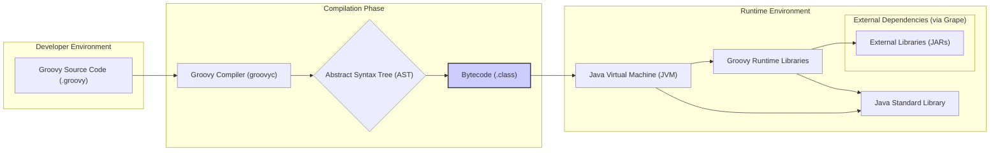

# Project Design Document: Apache Groovy (Improved)

**Version:** 1.1
**Date:** October 26, 2023
**Prepared By:** AI Software Architect

## 1. Introduction

This document provides an enhanced architectural overview of the Apache Groovy project, specifically tailored for use in subsequent threat modeling activities. It builds upon the previous version by providing more detailed information about the key components, data flows, and technologies involved in the Groovy ecosystem. This document aims to provide a comprehensive understanding of the system's architecture to facilitate a more thorough identification of potential security vulnerabilities.

## 2. Project Overview

The Apache Groovy project is a powerful, optionally typed and dynamic language, with static-typing and static compilation capabilities, for the Java platform. It is designed to enhance developer productivity through a concise, familiar, and easy-to-learn syntax. Groovy seamlessly integrates with existing Java code and is distributed as a single JAR file. Its features like dynamic typing, closures, and meta-programming offer flexibility, while static compilation provides performance benefits when needed.

## 3. Goals

* Provide a detailed and refined architectural overview of the Apache Groovy project.
* Identify key components and their interactions with greater specificity.
* Describe the data flow within the system with more granular steps.
* Outline the technology stack used by Groovy and its dependencies.
* Serve as a robust foundation for comprehensive threat modeling exercises.
* Highlight potential security implications associated with each component and data flow.

## 4. Scope

This document focuses on the core components of the Groovy language and its runtime environment, including compilation, execution, interaction with the Java Virtual Machine (JVM), and key language features. It also considers the interaction with external dependencies and the build process. Specific applications built using Groovy are not the primary focus, but the document will touch upon common deployment scenarios.

## 5. High-Level Architecture

**Description:**

*   **Developer Environment:** Developers create Groovy code stored in `.groovy` files. This is the initial input to the system.
*   **Compilation Phase:** The Groovy compiler (`groovyc`) processes the source code.
    *   It first parses the code and generates an "Abstract Syntax Tree (AST)", representing the code's structure.
    *   The AST is then used to generate Java bytecode (`.class` files), the format understood by the JVM.
*   **Runtime Environment:** The generated bytecode is executed within the Java Virtual Machine (JVM).
    *   The JVM utilizes the "Groovy Runtime Libraries" for Groovy-specific functionalities like dynamic method dispatch and closures.
    *   It also relies on the "Java Standard Library" for core Java functionalities.
    *   "External Libraries (JARs)" can be dynamically loaded at runtime using Grape, Groovy's dependency management system.

## 6. Key Components

*   **Groovy Compiler (`groovyc`):**
    *   **Responsibility:** Parses Groovy source code, performs semantic analysis, type checking (optional), and generates JVM bytecode.
    *   **Security Implications:** Vulnerabilities in the compiler could lead to the generation of insecure bytecode. Malicious AST transformations could be injected during compilation. Handling of untrusted or externally provided Groovy code needs careful consideration to prevent code injection.
*   **Groovy Runtime Libraries:**
    *   **Responsibility:** Provides core classes and utilities for executing Groovy code, including support for dynamic features, meta-programming, closures, and builders.
    *   **Security Implications:** Bugs or vulnerabilities in the runtime libraries could be exploited during execution. The dynamic nature of Groovy, while powerful, can also introduce risks if not handled carefully, potentially allowing access to internal objects or methods in unintended ways.
*   **Java Virtual Machine (JVM):**
    *   **Responsibility:** Executes the generated bytecode, manages memory, provides garbage collection, and ensures platform independence.
    *   **Security Implications:** While the JVM provides its own security features (bytecode verification, security managers), vulnerabilities in the JVM itself can impact Groovy applications. Groovy code runs within the JVM's security context.
*   **Groovy Shell (`groovysh`):**
    *   **Responsibility:** An interactive command-line tool for executing Groovy code snippets, useful for experimentation and scripting.
    *   **Security Implications:** If used in production environments or with untrusted input, it can be a vector for code injection. Access control to the shell is crucial.
*   **Grape (Groovy Advanced Packaging Engine):**
    *   **Responsibility:** A module system embedded in Groovy that allows for dependency management and retrieval of libraries at runtime.
    *   **Security Implications:**  Downloading and using untrusted or compromised libraries via Grape can introduce significant security risks. Integrity checks and secure repositories are important.
*   **AST Transformations:**
    *   **Responsibility:** A mechanism to modify the Abstract Syntax Tree during compilation, used for code generation, optimization, and DSL creation.
    *   **Security Implications:** Malicious or poorly written AST transformations can introduce vulnerabilities, modify code behavior unexpectedly, or even inject malicious code during the compilation process.
*   **GroovyClassLoader:**
    *   **Responsibility:**  Loads Groovy classes and scripts at runtime.
    *   **Security Implications:** If the classloader is used to load classes from untrusted sources, it can lead to code execution vulnerabilities. Proper sandboxing and permission management are necessary.

## 7. Data Flow (Detailed)

```mermaid
graph LR
    subgraph "Development Phase"
        A["Developer writes Groovy code (.groovy)"] --> B["Save Groovy file"];
    end
    subgraph "Compilation Phase"
        B --> C["Invoke Groovy Compiler (groovyc)"];
        C --> D{"Lexical Analysis (Tokenization)"};
        D --> E{"Parsing (Syntax Tree)"};
        E --> F{"Semantic Analysis and Type Checking"};
        F --> G{"Apply AST Transformations"};
        G --> H{"Generate Bytecode (.class)"};
        style H fill:#ccf,stroke:#333,stroke-width:2px
    end
    subgraph "Execution Phase"
        H --> I["Load Bytecode into JVM (via ClassLoader)"];
        I --> J{"Bytecode Verification"};
        J --> K{"Execute Bytecode using Groovy Runtime"};
        K --> L{"Interact with Java Libraries and System Resources"};
        subgraph "External Interaction (Optional)"
            M["Access External Services/Databases"]
        end
        L --> M;
    end
```

**Description:**

1. **Development Phase:** A developer writes Groovy code and saves it to a file.
2. **Compilation Phase:**
    *   The Groovy compiler is invoked.
    *   **Lexical Analysis (Tokenization):** The source code is broken down into tokens.
    *   **Parsing (Syntax Tree):** Tokens are organized into a syntax tree representing the code structure.
    *   **Semantic Analysis and Type Checking:** The compiler checks for semantic errors and performs type checking (if enabled).
    *   **Apply AST Transformations:**  Any configured AST transformations are applied to modify the syntax tree.
    *   **Generate Bytecode:** Java bytecode is generated from the transformed syntax tree.
3. **Execution Phase:**
    *   **Load Bytecode into JVM:** The generated bytecode is loaded into the JVM using a ClassLoader (typically `GroovyClassLoader`).
    *   **Bytecode Verification:** The JVM verifies the bytecode for structural correctness and security.
    *   **Execute Bytecode using Groovy Runtime:** The JVM executes the bytecode, utilizing the Groovy runtime libraries for dynamic features.
    *   **Interact with Java Libraries and System Resources:** Groovy code can interact with Java libraries and access system resources.
    *   **External Interaction (Optional):** Groovy code may interact with external services, databases, or other systems.

## 8. Technology Stack

*   **Programming Language:** Groovy
*   **Target Platform:** Java Virtual Machine (JVM) (Minimum Java version typically specified)
*   **Build Tools:** Apache Maven, Gradle (often used for building Groovy projects and the Groovy language itself)
*   **Source Code Management:** Git (GitHub for the official project)
*   **Operating Systems:** Platform independent (runs on any OS supporting the JVM)
*   **Dependencies:** Java Standard Library, potentially various third-party Java libraries (managed via Maven, Gradle, or Grape). Specific dependencies are listed in the project's `pom.xml` or `build.gradle` files.

## 9. Deployment Model

Groovy code can be deployed in various ways, each with its own security considerations:

*   **Standalone Scripts:** Groovy scripts are executed directly using the `groovy` command. Security depends on the permissions of the user running the script and the script's content.
*   **Part of Java Applications:** Groovy code is compiled and included as part of a larger Java application. Security is integrated with the overall application's security model.
*   **Web Applications (using Grails or Spring Boot):** Groovy is used as the primary language for web application development. Security considerations include standard web application security practices (e.g., input validation, authentication, authorization, protection against common web vulnerabilities).
*   **Build Scripts (using Gradle):** Groovy is used to define build logic. Malicious build scripts can compromise the build process and the resulting artifacts.
*   **Embedded Scripting:** Groovy is embedded within other applications to provide scripting capabilities. Security requires careful sandboxing and control over the scripts that can be executed.
*   **Serverless Functions (e.g., AWS Lambda with Groovy):** Groovy code runs in a serverless environment. Security considerations include the security of the serverless platform and the function's code and dependencies.

## 10. External Interactions

Groovy applications frequently interact with external systems:

*   **Databases:** Connecting to and querying databases using JDBC or other database access libraries. Requires secure connection strings and proper data sanitization to prevent SQL injection.
*   **Web Services (REST/SOAP):** Making HTTP requests to external APIs. Requires secure communication protocols (HTTPS) and proper handling of API keys and authentication tokens.
*   **Message Queues (e.g., Kafka, RabbitMQ):** Sending and receiving messages. Requires secure connection configurations and proper message validation.
*   **File Systems:** Reading and writing files. Requires careful management of file permissions and validation of file paths to prevent path traversal vulnerabilities.
*   **Other Java Libraries:** Interacting with a wide range of Java libraries, each with its own potential security implications.

## 11. Security Considerations (Detailed)

*   **Code Injection:** Evaluating Groovy code from untrusted sources (e.g., user input, external files) can lead to arbitrary code execution. Sanitization and secure evaluation mechanisms are crucial.
*   **Deserialization Attacks:** Deserializing untrusted data can lead to remote code execution if vulnerable classes are present in the classpath. Avoid deserializing untrusted data or use secure deserialization techniques.
*   **Dependency Vulnerabilities:**  Using vulnerable third-party libraries managed by Grape, Maven, or Gradle can introduce security flaws. Regular dependency scanning and updates are necessary.
*   **Meta-programming Abuse:** The dynamic nature of Groovy allows for runtime modification of classes and objects, which can be exploited for malicious purposes if not carefully controlled.
*   **AST Transformation Vulnerabilities:** Malicious or flawed AST transformations can introduce vulnerabilities during compilation without being apparent in the source code.
*   **Insecure Class Loading:** Loading classes from untrusted sources using `GroovyClassLoader` without proper security measures can lead to code execution.
*   **Access Control Issues:** Improperly configured access controls can allow unauthorized access to resources or functionalities.
*   **Sandbox Evasion:** If Groovy is used in a sandboxed environment, vulnerabilities might allow escaping the sandbox and gaining broader access.
*   **Compiler and Runtime Vulnerabilities:**  Bugs or security flaws in the Groovy compiler or runtime libraries themselves can be exploited. Keeping Groovy updated is important.
*   **Information Disclosure:** Improper handling of sensitive data can lead to information disclosure through logs, error messages, or other channels.
*   **Denial of Service (DoS):**  Maliciously crafted Groovy code or input could potentially cause resource exhaustion or crashes, leading to denial of service.

## 12. Assumptions and Limitations

*   This document provides a detailed, but still high-level, overview. Specific implementation details are not covered.
*   The security considerations are not exhaustive but highlight key areas of concern for threat modeling.
*   The document assumes a general understanding of software development and security principles.
*   The technology stack and deployment models are common examples and may vary.

## 13. Future Considerations

*   Detailed threat modeling diagrams and documentation.
*   Specific security controls and mitigation strategies for identified threats.
*   Integration with security testing tools and processes.
*   Regular review and updates to this document as the Groovy project evolves.
