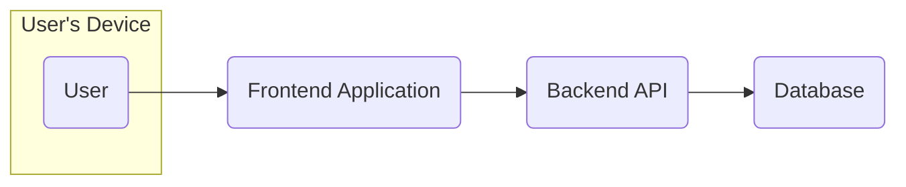
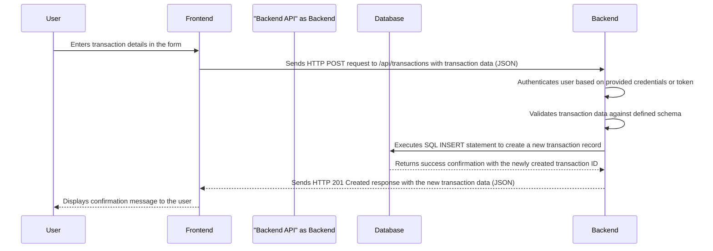
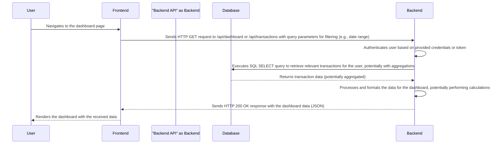
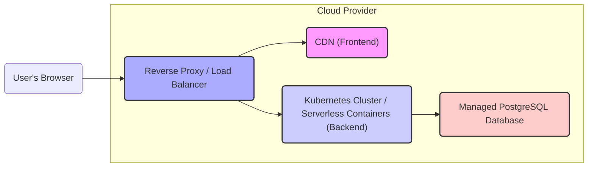

# Project Design Document: Hibeaver - Personal Finance Tracker

**Version:** 1.1
**Date:** October 26, 2023
**Author:** Gemini (AI Language Model)

## 1. Introduction

This document provides a detailed design overview of the Hibeaver project, a personal finance tracking application. This document serves as a blueprint for understanding the system's architecture, components, data flow, and technologies used. It will be used as the foundation for subsequent threat modeling activities. This revision aims to provide more granular detail and clarity compared to the initial version.

## 2. Goals and Objectives

The primary goal of Hibeaver is to provide users with a simple and intuitive way to track their income, expenses, and overall financial health. Key objectives include:

*   Allow users to record individual income and expense transactions with specific details.
*   Enable users to categorize transactions using a hierarchical category system for detailed financial analysis.
*   Provide interactive visualizations of spending patterns over different time periods.
*   Offer customizable reporting on income and expenses, allowing users to filter by categories and date ranges.
*   Ensure user data privacy and security through robust security measures and adherence to best practices.

## 3. High-Level Architecture

The Hibeaver application follows a typical three-tier architecture, promoting separation of concerns and scalability:

*   **Presentation Tier (Frontend):** The user interface, likely a Single Page Application (SPA), through which users interact with the application.
*   **Application Tier (Backend):**  Handles core business logic, data processing, API endpoints, and authentication/authorization.
*   **Data Tier (Database):** Stores persistent application data in a structured and reliable manner.

## 4. Detailed Design

### 4.1. Presentation Tier (Frontend)

*   **Technology:**  Likely a web application built as a Single Page Application (SPA) using a component-based JavaScript framework such as React, Vue.js, or Angular. React is a strong possibility given its popularity and ecosystem.
*   **Functionality:**
    *   Secure user authentication and authorization, including registration, login, logout, and potentially password reset functionalities.
    *   A dynamic dashboard displaying key financial metrics such as total income, total expenses, net balance, and spending breakdowns.
    *   Intuitive forms for adding and editing income and expense transactions, including fields for amount, date, description, and category selection.
    *   Hierarchical categorization of transactions, allowing users to create and manage custom categories and subcategories.
    *   Interactive visualization of financial data using charts and graphs (e.g., bar charts for spending by category, line charts for income/expense trends over time).
    *   Customizable reporting features allowing users to generate reports based on specific date ranges, categories, and transaction types.
    *   User profile management, allowing users to update their personal information and application settings.
*   **Components:**
    *   **Authentication Module:** Handles user login, registration, session management (potentially using JWT stored in local storage or session storage), and logout.
    *   **Transaction Input Module:** Provides interactive forms with validation for entering transaction details (amount, date, category, description, transaction type).
    *   **Dashboard Module:** Fetches and displays aggregated financial information and renders visualizations using charting libraries (e.g., Chart.js, Recharts).
    *   **Reporting Module:** Allows users to define report parameters and displays generated reports in tabular or graphical formats.
    *   **Category Management Module:** Enables users to create, edit, and delete transaction categories and subcategories.
    *   **Settings Module:** Provides UI for managing user profile information and application preferences.

### 4.2. Application Tier (Backend)

*   **Technology:** Likely a RESTful API built using a backend framework such as Node.js with Express, Python with Flask or Django REST Framework, or Ruby on Rails. Given the GitHub repository URL, Python with a framework like Flask or Django REST Framework is highly probable.
*   **Functionality:**
    *   Securely handles user authentication and authorization, verifying user credentials and managing access tokens.
    *   Provides well-defined and documented API endpoints for managing user accounts (e.g., `/users`, `/users/{id}`).
    *   Offers comprehensive API endpoints for performing CRUD operations on transactions (e.g., `/transactions`, `/transactions/{id}`).
    *   Implements business logic for transaction categorization, aggregation, and calculation of financial metrics.
    *   Generates processed data optimized for visualizations and reports, potentially performing data aggregation and transformation.
    *   May integrate with external services for features like currency conversion (if applicable) or potentially future integrations with financial institutions (out of current scope).
*   **Components:**
    *   **API Gateway:**  A single entry point for all API requests, responsible for routing requests to the appropriate services and potentially handling cross-cutting concerns like authentication and rate limiting.
    *   **Authentication Service:**  Manages user authentication and authorization, likely using JWT (JSON Web Tokens) for stateless authentication. This service handles token generation, verification, and refresh.
    *   **User Service:**  Manages user account lifecycle, including registration, retrieval, updates, and deletion of user profiles.
    *   **Transaction Service:**  Handles all operations related to transaction data, including creation, retrieval, updates, and deletion, with appropriate validation and authorization checks.
    *   **Category Service:**  Manages the creation, retrieval, updating, and deletion of transaction categories, potentially supporting hierarchical structures.
    *   **Reporting Service:**  Implements the logic for generating financial reports based on user-defined criteria, performing data aggregation and calculations.

### 4.3. Data Tier (Database)

*   **Technology:**  A relational database such as PostgreSQL or MySQL is a strong candidate due to the structured nature of financial data and the need for data integrity and relationships.
*   **Data Entities and Attributes:**
    *   **Users:**
        *   `user_id` (INT, Primary Key)
        *   `username` (VARCHAR, Unique)
        *   `password_hash` (VARCHAR)
        *   `email` (VARCHAR, Unique)
        *   `registration_date` (TIMESTAMP)
    *   **Transactions:**
        *   `transaction_id` (INT, Primary Key)
        *   `user_id` (INT, Foreign Key referencing Users)
        *   `date` (DATE)
        *   `amount` (DECIMAL)
        *   `description` (TEXT)
        *   `category_id` (INT, Foreign Key referencing Categories)
        *   `transaction_type` (ENUM: 'income', 'expense')
        *   `created_at` (TIMESTAMP)
        *   `updated_at` (TIMESTAMP)
    *   **Categories:**
        *   `category_id` (INT, Primary Key)
        *   `user_id` (INT, Foreign Key referencing Users, allowing for user-specific categories)
        *   `name` (VARCHAR)
        *   `parent_category_id` (INT, Foreign Key referencing Categories, allowing for hierarchical categories, can be NULL)
*   **Data Relationships:**
    *   One-to-many relationship between `Users` and `Transactions` (one user can have multiple transactions).
    *   One-to-many relationship between `Users` and `Categories` (one user can have multiple categories).
    *   Many-to-one relationship between `Transactions` and `Categories` (each transaction belongs to one category).
    *   Self-referential relationship on `Categories` to represent the parent-child relationship for hierarchical categories.

## 5. Data Flow

The typical data flow for adding a new expense transaction would be:

The data flow for retrieving transaction data for the dashboard would be:

## 6. Technology Stack

*   **Frontend:**
    *   JavaScript (ES6+)
    *   React (with libraries like Redux or Zustand for state management)
    *   HTML5
    *   CSS3 (with preprocessors like Sass or Less)
    *   A UI component library (e.g., Material UI, Ant Design)
    *   A charting library (e.g., Chart.js, Recharts, Nivo)
*   **Backend:**
    *   Python 3.x
    *   Flask or Django REST Framework
    *   A database ORM (e.g., SQLAlchemy for Flask, Django ORM)
    *   A library for JWT (e.g., PyJWT)
    *   Potentially libraries for data validation (e.g., Marshmallow)
*   **Database:**
    *   PostgreSQL
*   **Infrastructure:**
    *   Potentially deployed on cloud platforms like AWS (using services like EC2, ECS/Fargate, RDS), Google Cloud (using Compute Engine, Cloud Run, Cloud SQL), or Azure (using Virtual Machines, Azure Container Instances/Azure Kubernetes Service, Azure Database for PostgreSQL).
    *   Containerization using Docker for both frontend and backend applications.
    *   Orchestration using Kubernetes for managing containerized applications.
    *   A reverse proxy and load balancer (e.g., Nginx, HAProxy) in front of the backend API.

## 7. Deployment Architecture

A more detailed deployment architecture could involve:

*   Frontend built as a static website and deployed to a Content Delivery Network (CDN) like AWS CloudFront, Google Cloud CDN, or Azure CDN for fast content delivery.
*   Backend API containerized using Docker and deployed to a container orchestration platform like Kubernetes (e.g., Amazon EKS, Google Kubernetes Engine, Azure Kubernetes Service) or a serverless container platform like AWS Fargate or Google Cloud Run.
*   Database hosted on a managed database service like Amazon RDS for PostgreSQL, Google Cloud SQL for PostgreSQL, or Azure Database for PostgreSQL, ensuring high availability and automated backups.
*   A reverse proxy (e.g., Nginx) acting as the entry point for all incoming requests, handling SSL termination and routing requests to the appropriate backend instances.

## 8. Security Considerations (More Detailed)

This section outlines more specific security considerations that will be further explored during threat modeling:

*   **Authentication and Authorization:**
    *   Utilizing strong password hashing algorithms (e.g., bcrypt, Argon2) with salt.
    *   Implementing secure session management using HTTP-only and secure cookies, or a token-based approach like JWT with appropriate expiration times.
    *   Protecting against brute-force attacks on login endpoints using rate limiting and account lockout mechanisms.
    *   Implementing proper authorization checks on all API endpoints to ensure users can only access resources they are permitted to.
*   **Data Privacy:**
    *   Enforcing encryption of sensitive data at rest (e.g., using database encryption features) and in transit (HTTPS).
    *   Implementing role-based access control (RBAC) at the database level to restrict access to sensitive data.
    *   Adhering to data privacy regulations (e.g., GDPR, CCPA) regarding data storage, processing, and user consent.
*   **Input Validation:**
    *   Performing robust input validation on both the frontend and backend to prevent injection attacks (e.g., SQL injection, cross-site scripting (XSS)).
    *   Sanitizing user inputs before displaying them to prevent XSS vulnerabilities.
    *   Using parameterized queries or prepared statements for all database interactions to prevent SQL injection.
*   **API Security:**
    *   Enforcing authentication and authorization for all API endpoints using JWT or similar mechanisms.
    *   Protecting against common API vulnerabilities such as mass assignment, insecure direct object references (IDOR), and cross-site request forgery (CSRF).
    *   Implementing rate limiting to prevent denial-of-service (DoS) attacks on API endpoints.
    *   Using secure coding practices to avoid common vulnerabilities.
*   **Dependency Management:**
    *   Regularly auditing and updating third-party libraries and dependencies to patch known vulnerabilities.
    *   Utilizing dependency scanning tools to identify and address potential security risks in dependencies.
*   **Infrastructure Security:**
    *   Securing the underlying infrastructure by following cloud provider best practices.
    *   Implementing network security measures such as firewalls and security groups.
    *   Regularly patching and updating operating systems and other infrastructure components.

## 9. Assumptions and Constraints

*   The application is primarily designed for individual personal finance tracking and does not currently support multi-user accounts or collaborative features.
*   The initial scope focuses on manual transaction entry and does not include integrations with bank APIs or other financial institutions.
*   The backend API is designed to be stateless for scalability and ease of deployment.
*   User data is assumed to be stored within a single, primary database.
*   The application will be deployed in a cloud environment.

This revised design document provides a more detailed and comprehensive overview of the Hibeaver project's architecture, components, and security considerations. It offers a stronger foundation for identifying potential security threats and vulnerabilities during the subsequent threat modeling process.