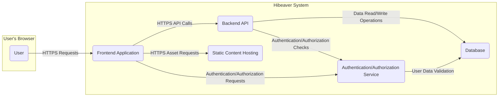
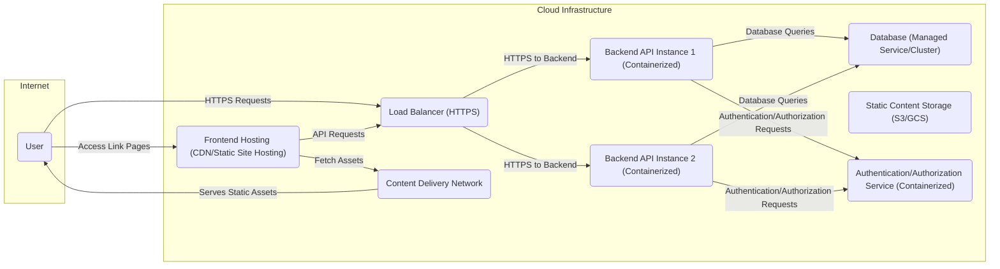

# Project Design Document: Hibeaver - Simple Link in Bio Service

**Version:** 1.1
**Date:** October 26, 2023
**Author:** AI Software Architect

## 1. Introduction

This document outlines the design of Hibeaver, a simple and lightweight "link in bio" service as described in the GitHub repository [https://github.com/hydraxman/hibeaver](https://github.com/hydraxman/hibeaver). This document provides a detailed blueprint of the system's architecture, components, data flow, and technologies. It is specifically designed to serve as the foundation for subsequent threat modeling activities, enabling a comprehensive security analysis.

## 2. Project Overview

Hibeaver offers a user-centric platform that empowers individuals and businesses to create a single, customizable landing page. This page aggregates multiple links to their diverse online presences, simplifying the sharing of numerous resources on platforms with link limitations, such as social media profiles.

## 3. Goals and Objectives

*   **Simplicity and Intuitiveness:** Provide an exceptionally easy-to-use interface for both creating and managing link pages.
*   **Customization:** Offer a range of options for users to personalize the appearance of their link pages to match their branding.
*   **Performance:** Ensure the service is lightweight, loads quickly, and operates efficiently to provide a seamless user experience.
*   **Reliability and Accessibility:** Maintain a dependable and readily available platform for users to share their essential links without interruption.
*   **Privacy and Security:** Uphold strong user privacy principles and implement robust security measures to protect user data.

## 4. Target Audience

*   Social media influencers seeking to centralize their online presence.
*   Content creators who need a single point of access to their various platforms.
*   Small businesses aiming to direct customers to relevant product pages and social channels.
*   Individuals wanting a streamlined way to share their personal or professional links.

## 5. System Architecture

The Hibeaver system is composed of several interconnected components working together:

*   **Frontend Application:** The client-side interface responsible for user interaction and presentation.
*   **Backend API:** The server-side application handling business logic, data management, and security.
*   **Database:** The persistent storage for user data, link configurations, and application settings.
*   **Static Content Hosting:**  The infrastructure for serving static assets required by the Frontend Application.
*   **Authentication/Authorization Service (Potentially part of Backend API or a separate service):** Manages user identity and access control.

### 5.1. Component Descriptions

*   **Frontend Application:**
    *   Implemented using a modern JavaScript framework like React, Vue.js, or Svelte, ensuring a responsive and interactive user experience.
    *   Handles all user-facing interactions, including form submissions for creating and editing link pages, and rendering the public-facing link pages.
    *   Manages the user interface for authentication processes (login, registration).
    *   Communicates with the Backend API via secure HTTPS requests, typically using RESTful principles.
    *   Responsible for client-side input validation to improve user experience and reduce server load.

*   **Backend API:**
    *   Developed using a server-side language and framework such as Node.js with Express, Python with Flask/Django, or Go, chosen for performance and scalability.
    *   Exposes a set of well-defined API endpoints to handle requests from the Frontend Application. These endpoints manage:
        *   User account creation and management.
        *   Link page creation, retrieval, updating, and deletion (CRUD operations).
        *   Management of individual links within a user's page.
        *   Potentially, user profile information and customization settings.
    *   Enforces authentication and authorization to protect user data and ensure only authorized users can access and modify their information.
    *   Interacts with the Database to persist and retrieve application data.
    *   May include middleware for logging, request validation, and error handling.

*   **Database:**
    *   Provides persistent storage for the application's data. The choice between a relational database (e.g., PostgreSQL, MySQL) or a NoSQL database (e.g., MongoDB) depends on the specific data model and scalability requirements.
    *   Stores critical data, including:
        *   User account details (usernames, securely hashed passwords, email addresses, registration dates).
        *   Link page configurations (user-defined customizations, themes, branding elements).
        *   Individual link records (URLs, link titles, descriptions, display order, associated icons).
        *   Potentially, user preferences and application settings.

*   **Static Content Hosting:**
    *   A dedicated service like AWS S3, Google Cloud Storage, or a Content Delivery Network (CDN) is used to store and serve static assets efficiently.
    *   Hosts files such as:
        *   JavaScript files for the Frontend Application.
        *   CSS stylesheets for styling.
        *   Images, icons, and other media assets.
    *   Improves application performance by serving static content directly to the user's browser, reducing the load on the Backend API.

*   **Authentication/Authorization Service:**
    *   Responsible for verifying user identities and managing access permissions. This functionality might be integrated within the Backend API or implemented as a separate microservice for better separation of concerns.
    *   Handles:
        *   User registration and login processes.
        *   Generation and management of authentication tokens (e.g., JWT).
        *   Verification of authentication tokens to authorize user requests.
        *   Potentially, role-based access control (RBAC) if different user roles are introduced.

## 6. Data Flow

Understanding how data moves through the system is critical for identifying potential vulnerabilities. Here's a breakdown of key data flows:

*   **User Creates/Updates a Link Page:**
    1. The User interacts with the Frontend Application, inputting link page details and individual link information.
    2. The Frontend Application sends an HTTPS API request to the Backend API, containing the link page data (potentially as a JSON payload).
    3. The Backend API authenticates and authorizes the User making the request.
    4. The Backend API validates the received data to ensure its integrity and prevent malicious input.
    5. The Backend API performs a write operation to the Database, storing or updating the link page configuration and associated links.
    6. The Database confirms the successful data persistence.
    7. The Backend API sends an HTTPS response back to the Frontend Application, indicating success or failure.

*   **User Views a Link Page:**
    1. A User accesses a Hibeaver link (e.g., `hibeaver.com/username`) in their browser.
    2. The request is routed to the Frontend Application (or potentially the Backend API for server-side rendering).
    3. The system identifies the requested username from the URL.
    4. The Frontend Application (or Backend API) sends a request to the Backend API to retrieve the link page data associated with the username.
    5. The Backend API queries the Database to fetch the relevant link page configuration and link details.
    6. The Database returns the requested data to the Backend API.
    7. The Backend API (or Frontend Application) renders the link page content. If rendered on the frontend, the Backend API sends the raw data, and the Frontend Application handles the presentation logic.
    8. The rendered HTML (and associated static assets fetched from Static Content Hosting) is sent to the User's browser.

*   **User Authentication (Login):**
    1. The User submits their login credentials (username/email and password) through the Frontend Application.
    2. The Frontend Application sends an HTTPS authentication request to the Authentication/Authorization Service (or the appropriate endpoint on the Backend API).
    3. The Authentication/Authorization Service retrieves the user's stored credentials (hashed password) from the Database.
    4. The service verifies the provided password against the stored hash.
    5. Upon successful verification, the service generates an authentication token (e.g., a JWT).
    6. The authentication token is sent back to the Frontend Application via an HTTPS response.
    7. The Frontend Application securely stores the token (e.g., in local storage or an HTTP-only cookie) for subsequent authorized requests.

## 7. Technology Stack (Detailed)

This section outlines potential technologies, acknowledging that the actual implementation may vary.

*   **Frontend:**
    *   **JavaScript Framework:** React (with libraries like Redux or Zustand for state management), Vue.js (with Vuex), or Svelte.
    *   **UI Library/Framework:**  Material UI, Ant Design, Tailwind CSS, or a custom CSS framework.
    *   **Bundler:** Webpack, Parcel, or Rollup.
    *   **Testing Framework:** Jest, Mocha, or Cypress.

*   **Backend:**
    *   **Language:** Node.js (with Express.js), Python (with Django REST Framework or Flask), Go (with Gin or Echo).
    *   **API Framework:** Express.js, Django REST Framework, Flask, Gin, Echo.
    *   **ORM/ODM (if applicable):** Sequelize (for Node.js), Django ORM, SQLAlchemy (for Python), GORM (for Go), Mongoose (for MongoDB).
    *   **Testing Framework:** Jest (for Node.js), pytest (for Python), Go's built-in testing tools.

*   **Database:**
    *   **Relational:** PostgreSQL, MySQL, MariaDB.
    *   **NoSQL:** MongoDB, Couchbase.

*   **Authentication/Authorization:**
    *   **Mechanism:** JWT (JSON Web Tokens) for stateless authentication, Session-based authentication with secure cookies.
    *   **Libraries:**  `jsonwebtoken` (Node.js), `python-jose` (Python), `golang-jwt/jwt/v5` (Go).
    *   **OAuth 2.0:** For potential future integrations with third-party services.

*   **Static Content Hosting:**
    *   **Cloud Storage:** AWS S3, Google Cloud Storage, Azure Blob Storage.
    *   **CDN:** Cloudflare, AWS CloudFront, Google Cloud CDN, Fastly.

*   **Deployment:**
    *   **Containerization:** Docker.
    *   **Orchestration:** Kubernetes (potentially for larger deployments), Docker Compose.
    *   **Cloud Platforms:** AWS (ECS, EKS, EC2), Google Cloud (Cloud Run, GKE, Compute Engine), Azure (App Service, AKS, Virtual Machines).
    *   **Serverless Functions (potentially for specific backend tasks):** AWS Lambda, Google Cloud Functions, Azure Functions.

## 8. Deployment Architecture (Detailed)

A typical cloud-based deployment architecture for Hibeaver could involve:

*   **Load Balancer (Layer 7):**  Distributes incoming HTTPS traffic across multiple Backend API instances. This ensures high availability and scalability. The load balancer also handles SSL termination.
*   **Backend API Instances (Containerized):** Multiple instances of the Backend API running in Docker containers. These instances process requests, interact with the database, and handle business logic.
*   **Database Cluster/Managed Service:** A highly available and scalable database service (e.g., AWS RDS, Google Cloud SQL, Azure Database) or a self-managed database cluster. Replication and backups are crucial.
*   **Static Content Storage (Object Storage):**  A service like AWS S3 or Google Cloud Storage to store and serve static assets. This is often fronted by a CDN for improved performance and reduced latency.
*   **CDN (Content Delivery Network):** Caches static content geographically closer to users, improving load times and reducing bandwidth costs.
*   **Frontend Hosting (Static Site Hosting or CDN):** The Frontend Application (HTML, CSS, JavaScript) can be hosted directly on a CDN or a static site hosting service like Netlify or Vercel.
*   **Authentication/Authorization Service (Potentially separate containers/instances):** If implemented as a separate service, it would be deployed in its own containers or instances and accessed by the Backend API.

## 9. Security Considerations (Detailed)

This section expands on potential security threats and mitigation strategies, crucial for threat modeling.

*   **Authentication and Authorization:**
    *   **Threat:** Brute-force attacks on login forms, credential stuffing, session hijacking.
    *   **Mitigation:** Strong password policies, multi-factor authentication (MFA), rate limiting on login attempts, secure session management (HTTP-only and secure cookies), using HTTPS to protect credentials in transit.
    *   **Threat:** Authorization bypass, privilege escalation.
    *   **Mitigation:** Implement robust role-based access control (RBAC) or attribute-based access control (ABAC), enforce the principle of least privilege, thoroughly validate user roles and permissions before granting access to resources.

*   **Data Security and Privacy:**
    *   **Threat:** Data breaches, unauthorized access to sensitive user data.
    *   **Mitigation:** Encryption of sensitive data at rest (database encryption) and in transit (HTTPS), regular security audits and penetration testing, secure storage of API keys and secrets (using secrets management tools).
    *   **Threat:** Privacy violations, non-compliance with regulations (e.g., GDPR, CCPA).
    *   **Mitigation:** Implement data minimization principles, provide users with control over their data, ensure transparent data processing policies, implement mechanisms for data deletion and anonymization.

*   **Input Validation:**
    *   **Threat:** SQL injection, cross-site scripting (XSS), command injection.
    *   **Mitigation:** Sanitize and validate all user inputs on both the frontend and backend, use parameterized queries or prepared statements to prevent SQL injection, implement context-aware output encoding to prevent XSS.

*   **Cross-Site Scripting (XSS) Prevention:**
    *   **Threat:** Attackers injecting malicious scripts into web pages viewed by other users.
    *   **Mitigation:** Implement Content Security Policy (CSP), use a templating engine that automatically escapes output, sanitize user-generated content before rendering it.

*   **Cross-Site Request Forgery (CSRF) Prevention:**
    *   **Threat:** Attackers tricking authenticated users into performing unintended actions.
    *   **Mitigation:** Implement CSRF tokens, use the SameSite cookie attribute.

*   **Rate Limiting:**
    *   **Threat:** Denial-of-service (DoS) attacks, abuse of API endpoints.
    *   **Mitigation:** Implement rate limiting on API endpoints to restrict the number of requests from a single IP address or user within a specific time frame.

*   **Dependency Management:**
    *   **Threat:** Vulnerabilities in third-party libraries and dependencies.
    *   **Mitigation:** Regularly update dependencies to the latest secure versions, use dependency scanning tools to identify known vulnerabilities.

*   **Secure Configuration:**
    *   **Threat:** Misconfigured servers, databases, or cloud resources leading to security vulnerabilities.
    *   **Mitigation:** Follow security best practices for configuring infrastructure components, regularly review security configurations, disable unnecessary services and ports.

## 10. Future Considerations

*   **Advanced Analytics and Tracking:**  Detailed analytics on link clicks, geographic data, and referrer information.
*   **Custom Domain Support:**  Allowing users to use their own custom domains for their link pages.
*   **Social Media Integrations:**  Directly embedding social media feeds or allowing users to showcase recent posts.
*   **Theming and Advanced Customization:**  More sophisticated theme options, custom CSS injection, and branding features.
*   **Premium Features:**  Subscription-based features like advanced analytics, custom domains, priority support, and team collaboration.

This improved design document provides a more detailed and comprehensive understanding of the Hibeaver project. It offers a solid foundation for conducting thorough threat modeling exercises by clearly outlining the system's architecture, data flows, and potential security considerations.