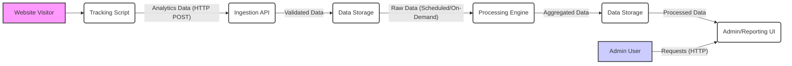
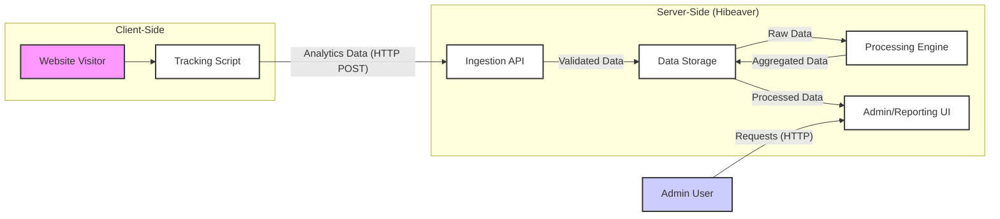

## Project Design Document: Hibeaver - Simple Analytics Server (Improved)

**1. Introduction**

This document provides an enhanced design specification for Hibeaver, a straightforward, self-hosted analytics server. Its primary purpose is to offer a detailed architectural overview, component descriptions, and data flow analysis, specifically tailored for subsequent threat modeling activities. This document aims to be a clear and comprehensive resource for understanding the system's inner workings.

**2. Goals**

*   To deliver a simple and easily deployable analytics solution for website owners.
*   To offer fundamental website traffic analysis capabilities without requiring intricate configurations.
*   To empower users with control over their analytics data through self-hosting.
*   To prioritize user privacy by minimizing the collection of personally identifiable information (PII).

**3. High-Level Architecture**

The Hibeaver system is architecturally composed of the following distinct components:

*   **Tracking Script:** A client-side JavaScript snippet intended for embedding within the HTML of target websites to capture user interaction data.
*   **Ingestion API:** A server-side endpoint responsible for receiving and initially processing data transmitted by the Tracking Script.
*   **Data Storage:** A persistent storage mechanism, such as a database, used to store both raw and processed analytics data.
*   **Processing Engine:** A background process or service dedicated to aggregating and transforming raw data into meaningful analytics reports.
*   **Admin/Reporting UI:** A web-based user interface that allows authorized users to view analytics reports and manage Hibeaver configurations.

**4. Component Details**

*   **Tracking Script:**
    *   **Purpose:** To collect anonymous user activity data on websites where it is integrated.
    *   **Functionality:**
        *   Captures basic user information such as page views, the referring URL, screen resolution, and browser type.
        *   Transmits the collected data to the Ingestion API via HTTP POST requests.
        *   May utilize cookies or local storage for session management (e.g., to distinguish unique visitors within a timeframe).
    *   **Inputs:** User interactions within the browser environment.
    *   **Outputs:** HTTP requests containing analytics data (e.g., page URL, timestamp, referrer) sent to the Ingestion API.
    *   **Security Considerations:**
        *   Susceptible to cross-site scripting (XSS) attacks if not implemented with proper encoding and output sanitization.
        *   Potential for unauthorized data collection if the script is injected or tampered with.
        *   Privacy implications related to cookie usage and data collection practices.

*   **Ingestion API:**
    *   **Purpose:** To receive, validate, and persist the analytics data transmitted by the Tracking Script.
    *   **Functionality:**
        *   Exposes an HTTP endpoint (e.g., `/api/collect`) to accept incoming data payloads.
        *   Performs validation checks on the received data to ensure data integrity and prevent malicious input.
        *   Stores the validated data into the designated Data Storage.
        *   Returns an acknowledgment response to the Tracking Script.
    *   **Inputs:** HTTP POST requests from the Tracking Script containing analytics data in a defined format (e.g., JSON).
    *   **Outputs:** HTTP response codes indicating success or failure to the Tracking Script. Data records written to the Data Storage.
    *   **Security Considerations:**
        *   Vulnerable to denial-of-service (DoS) or distributed denial-of-service (DDoS) attacks if not protected by rate limiting or other mitigation techniques.
        *   Risk of data injection vulnerabilities if input validation is insufficient or improperly implemented.
        *   Requires basic authentication or authorization mechanisms (e.g., API keys) to prevent unauthorized data submission, although this might be minimal for a simple analytics service.

*   **Data Storage:**
    *   **Purpose:** To provide persistent storage for both raw event data and aggregated analytics results.
    *   **Functionality:**
        *   Stores individual event records received from the Ingestion API, potentially including timestamps, page URLs, referrers, and user agent information.
        *   Stores aggregated data generated by the Processing Engine, such as daily page view counts, unique visitor counts, and top referring sites.
        *   Offers efficient data retrieval capabilities for the Processing Engine and the Admin/Reporting UI.
    *   **Inputs:** Validated data from the Ingestion API. Processed data from the Processing Engine.
    *   **Outputs:** Raw event data for the Processing Engine. Processed analytics data for the Admin/Reporting UI.
    *   **Security Considerations:**
        *   Requires robust access control mechanisms to restrict access to authorized components only.
        *   Consideration for data at rest encryption to protect sensitive data in case of unauthorized access to the storage medium.
        *   Implementation of regular backup and recovery procedures to prevent data loss.

*   **Processing Engine:**
    *   **Purpose:** To transform raw analytics data into meaningful reports and metrics.
    *   **Functionality:**
        *   Retrieves raw event data from the Data Storage based on a schedule or on-demand triggers.
        *   Performs data aggregation and calculations to generate key metrics such as page views, unique visitors, bounce rates, and session durations.
        *   Stores the processed and aggregated data back into the Data Storage.
        *   May involve batch processing or stream processing depending on the implementation.
    *   **Inputs:** Raw analytics event data from the Data Storage.
    *   **Outputs:** Aggregated analytics data stored in the Data Storage.
    *   **Security Considerations:**
        *   Potential for resource exhaustion if processing tasks are computationally intensive or if the system is under heavy load.
        *   Logic flaws in the processing algorithms could lead to inaccurate or misleading reports.
        *   Ensuring the integrity of the processing logic to prevent manipulation of analytics data.

*   **Admin/Reporting UI:**
    *   **Purpose:** To provide a user-friendly interface for viewing analytics reports and managing Hibeaver settings.
    *   **Functionality:**
        *   Authenticates and authorizes users before granting access to analytics data and administrative functions.
        *   Retrieves processed analytics data from the Data Storage.
        *   Presents analytics reports in a visually appealing and informative manner (e.g., charts, graphs, tables).
        *   May offer features for configuring tracking settings, managing users, or viewing system logs.
    *   **Inputs:** User requests through a web browser (HTTP requests).
    *   **Outputs:** Rendered web pages displaying analytics reports and administrative interfaces.
    *   **Security Considerations:**
        *   Requires strong authentication mechanisms (e.g., username/password with hashing, multi-factor authentication).
        *   Vulnerable to common web application vulnerabilities such as cross-site scripting (XSS), cross-site request forgery (CSRF), and injection attacks (e.g., SQL injection if a relational database is used and queries are not properly parameterized).
        *   Sensitive data displayed in the UI needs to be protected from unauthorized access and disclosure. Secure communication over HTTPS is essential.

**5. Data Flow**

The typical sequence of data movement within the Hibeaver system is as follows:

1. A "Website Visitor" interacts with a webpage containing the embedded "Tracking Script".
2. The "Tracking Script" collects relevant user activity data (e.g., page viewed, timestamp, referrer).
3. The "Tracking Script" sends this data as an HTTP POST request to the "Ingestion API".
4. The "Ingestion API" receives the request, validates the data, and stores the validated data in the "Data Storage".
5. The "Processing Engine" periodically (or on-demand) retrieves raw data from the "Data Storage".
6. The "Processing Engine" processes the raw data to generate aggregated analytics metrics (e.g., total page views, unique visitors).
7. The "Processing Engine" stores the processed, aggregated data back into the "Data Storage".
8. An "Admin User" accesses the "Admin/Reporting UI" through a web browser.
9. The "Admin/Reporting UI" authenticates the "Admin User".
10. The "Admin/Reporting UI" retrieves processed analytics data from the "Data Storage".
11. The "Admin/Reporting UI" displays the analytics reports to the "Admin User".

**6. Security Considerations (Detailed)**

*   **Tracking Script Security:**
    *   **Threat:** Cross-site scripting (XSS) attacks if the script is not properly sanitized or if user-provided data is reflected without encoding.
    *   **Mitigation:** Implement robust output encoding and sanitization techniques. Utilize Content Security Policy (CSP) headers to restrict the sources from which the browser can load resources.
    *   **Threat:** Unauthorized data collection or manipulation if the script is compromised or injected.
    *   **Mitigation:** Serve the tracking script over HTTPS to prevent man-in-the-middle attacks. Implement integrity checks (e.g., Subresource Integrity - SRI) to ensure the script has not been tampered with.
    *   **Threat:** Privacy violations due to excessive data collection.
    *   **Mitigation:** Adhere to privacy best practices by minimizing data collection and anonymizing data where possible. Clearly communicate data collection practices to users.

*   **Ingestion API Security:**
    *   **Threat:** Denial-of-service (DoS) or distributed denial-of-service (DDoS) attacks overwhelming the API endpoint.
    *   **Mitigation:** Implement rate limiting to restrict the number of requests from a single source within a given timeframe. Utilize a web application firewall (WAF) to filter malicious traffic.
    *   **Threat:** Data injection vulnerabilities allowing attackers to insert malicious data into the system.
    *   **Mitigation:** Implement strict input validation on all received data, checking for expected data types, formats, and ranges. Use parameterized queries or prepared statements to prevent SQL injection if a relational database is used.
    *   **Threat:** Unauthorized data submission.
    *   **Mitigation:** Implement a basic authentication mechanism, such as requiring an API key to be included in requests.

*   **Data Storage Security:**
    *   **Threat:** Unauthorized access to sensitive analytics data.
    *   **Mitigation:** Implement strong access control lists (ACLs) or role-based access control (RBAC) to restrict access to the database.
    *   **Threat:** Data breaches or leaks due to compromised storage.
    *   **Mitigation:** Implement data at rest encryption to protect data even if the storage medium is compromised. Regularly patch and update the database software.
    *   **Threat:** Data loss due to hardware failure or other incidents.
    *   **Mitigation:** Implement regular backup and recovery procedures, including offsite backups.

*   **Admin/Reporting UI Security:**
    *   **Threat:** Brute-force attacks on login credentials.
    *   **Mitigation:** Implement account lockout policies after a certain number of failed login attempts. Consider using CAPTCHA to prevent automated attacks.
    *   **Threat:** Cross-site scripting (XSS) vulnerabilities allowing attackers to inject malicious scripts into the UI.
    *   **Mitigation:** Implement robust output encoding and sanitization techniques for all user-generated content or data retrieved from the database.
    *   **Threat:** Cross-site request forgery (CSRF) attacks allowing attackers to perform actions on behalf of authenticated users.
    *   **Mitigation:** Implement CSRF protection mechanisms, such as synchronizer tokens.
    *   **Threat:** Injection attacks (e.g., SQL injection).
    *   **Mitigation:** Use parameterized queries or prepared statements when interacting with the database.
    *   **Threat:** Insecure communication exposing sensitive data.
    *   **Mitigation:** Enforce HTTPS for all communication between the user's browser and the server.

**7. Technologies Used (Likely and Potential)**

*   **Programming Language (Backend):** Python (consistent with the linked GitHub repository).
*   **Web Framework (Backend):** Potentially Flask (microframework) or Django (full-featured framework) for building the API and UI.
*   **Database:**
    *   Likely a relational database such as PostgreSQL or MySQL for structured data storage.
    *   Alternatively, a simpler embedded database like SQLite could be used for less demanding deployments.
*   **Frontend Technologies:** HTML, CSS, and JavaScript for building the Admin/Reporting UI. Potentially a JavaScript framework like React, Vue.js, or Angular for a more dynamic UI.
*   **Deployment:**
    *   Docker for containerization to simplify deployment and ensure consistency across environments.
    *   Potential deployment platforms include cloud providers (AWS, Google Cloud, Azure), virtual private servers (VPS), or bare-metal servers.

**8. Deployment Considerations**

*   Hibeaver is designed for self-hosting, granting users full control over their data and infrastructure.
*   Deployment options range from simple setups on a single server to more complex, scalable deployments on cloud platforms.
*   Key deployment considerations include:
    *   **Scalability:**  The ability to handle increasing traffic loads and data volume. This might involve scaling the Ingestion API, Processing Engine, and Data Storage independently.
    *   **Availability and Redundancy:** Implementing measures to ensure the system remains operational even in case of hardware failures or other issues. This could involve using load balancers and database replication.
    *   **Security Hardening:**  Securing the underlying operating system, network configurations, and application dependencies. Regularly applying security patches is crucial.
    *   **Monitoring and Logging:** Implementing systems to monitor the health and performance of the Hibeaver instance and to log events for debugging and security analysis.

**9. Future Considerations**

*   **Advanced Analytics Features:** Implementing support for event tracking, funnel analysis, and cohort analysis to provide more in-depth insights.
*   **User Segmentation:** Allowing users to segment their website visitors based on various criteria for more targeted analysis.
*   **Customizable Dashboards and Reporting:** Providing users with the ability to create custom dashboards and reports tailored to their specific needs.
*   **Integration with Other Services:**  Exploring integrations with other platforms or services, such as data visualization tools or marketing automation platforms.
*   **Enhanced Privacy Features:**  Implementing more sophisticated data anonymization techniques and providing users with greater control over their data.

This improved design document offers a more detailed and comprehensive understanding of the Hibeaver project, providing a solid foundation for effective threat modeling and further development.