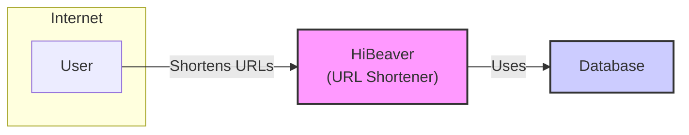
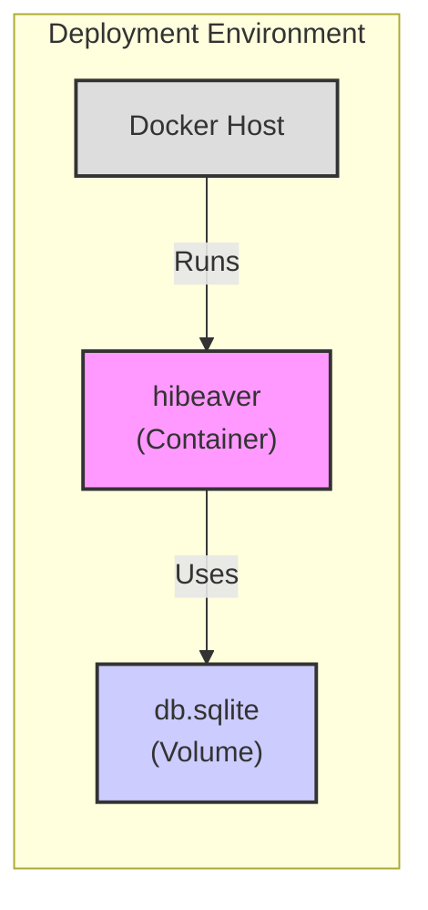

Okay, let's dive into designing a comprehensive document for the HiBeaver project, suitable for threat modeling and architectural review.

# BUSINESS POSTURE

Business Priorities and Goals:

*   Provide a simple, self-hostable URL shortening service.
*   Offer a user-friendly interface for creating and managing short links.
*   Ensure the service is reliable and performs well.
*   Potentially support custom short URLs (as indicated by the `custom_url` field in the code).
*   Minimize operational overhead through ease of deployment and maintenance.
*   Open-source the project to foster community contributions and transparency.

Most Important Business Risks:

*   Service unavailability or performance degradation, leading to user frustration and loss of trust.
*   Data breaches or unauthorized access to link redirection data, potentially exposing sensitive URLs.
*   Abuse of the service for malicious purposes (e.g., phishing, malware distribution), leading to reputational damage and potential legal issues.
*   Lack of scalability to handle increasing traffic, limiting the service's growth potential.
*   Vulnerabilities in the codebase or dependencies, leading to exploits and service compromise.
*   Insufficient logging and monitoring, hindering incident response and troubleshooting.

# SECURITY POSTURE

Existing Security Controls:

*   security control: The project uses Rust, a memory-safe language, which inherently mitigates many common vulnerability classes like buffer overflows. (Implemented in the codebase.)
*   security control: The project appears to use a SQLite database, which, when used correctly, can help prevent SQL injection vulnerabilities. (Implied by `DATABASE_URL` and project structure.)
*   security control: The use of environment variables for configuration (e.g., `DATABASE_URL`, `DOMAIN`) promotes separation of secrets from the codebase. (Implemented in the codebase.)
*   security control: The project includes a Dockerfile, facilitating containerization, which can improve security through isolation and consistent deployment. (Implemented in the project structure.)
*   security control: The project uses `askama` templating engine, that should automatically escape output, preventing cross-site scripting (XSS) vulnerabilities. (Implemented in the codebase.)
*   security control: The project uses `argon2` for password hashing. (Implemented in the codebase.)

Accepted Risks:

*   accepted risk: The project's simplicity might mean advanced features like rate limiting, detailed auditing, and abuse prevention mechanisms are not yet fully implemented.
*   accepted risk: The project is relatively new, so it may have undiscovered vulnerabilities.
*   accepted risk: The project relies on external dependencies (crates), which could introduce supply chain vulnerabilities.
*   accepted risk: The project does not appear to implement any form of authentication or authorization for accessing the API or web interface, meaning anyone with network access can create and manage links.

Recommended Security Controls:

*   security control: Implement robust input validation and sanitization for all user-provided data, especially the target URL and custom short URL (if supported).
*   security control: Implement rate limiting to prevent abuse and denial-of-service attacks.
*   security control: Add comprehensive logging and monitoring to detect and respond to suspicious activity.
*   security control: Implement authentication and authorization to restrict access to the API and web interface. Consider role-based access control (RBAC) if different user roles are needed.
*   security control: Regularly update dependencies to patch known vulnerabilities. Use a tool like `cargo audit` or Dependabot to automate this process.
*   security control: Implement security headers (e.g., HSTS, Content Security Policy, X-Frame-Options) to mitigate common web vulnerabilities.
*   security control: Consider adding a mechanism to scan target URLs for malicious content before creating short links.
*   security control: Implement CSRF protection.
*   security control: Implement mechanism to prevent URL redirection loops.

Security Requirements:

*   Authentication:
    *   The system should require users to authenticate before accessing the API or web interface.
    *   The system should support strong password policies.
    *   The system should securely store user credentials (e.g., using a strong hashing algorithm like Argon2, as currently implemented).
*   Authorization:
    *   The system should implement role-based access control (RBAC) to restrict access to sensitive operations.
    *   The system should ensure that users can only manage their own short links.
*   Input Validation:
    *   The system should validate all user-provided input, including target URLs and custom short URLs.
    *   The system should reject invalid or potentially malicious input.
    *   The system should sanitize input to prevent cross-site scripting (XSS) and other injection attacks.
*   Cryptography:
    *   The system should use HTTPS to encrypt all communication between the client and the server.
    *   The system should use a strong hashing algorithm (like Argon2) for storing passwords.
    *   The system should use cryptographically secure random number generators for generating short URLs and other sensitive values.
*   Output Encoding:
    *   The system should encode all output to prevent cross-site scripting (XSS) vulnerabilities.

# DESIGN

## C4 CONTEXT



Context Diagram Element List:

*   Element:
    *   Name: User
    *   Type: Person
    *   Description: A person who wants to shorten a URL.
    *   Responsibilities:
        *   Provides the long URL to be shortened.
        *   Optionally provides a custom short URL.
        *   Uses the shortened URL.
    *   Security controls:
        *   Authentication (future).
        *   Authorization (future).
        *   Rate limiting (future).

*   Element:
    *   Name: HiBeaver (URL Shortener)
    *   Type: Software System
    *   Description: The URL shortening service.
    *   Responsibilities:
        *   Receives long URLs from users.
        *   Generates short URLs.
        *   Stores the mapping between short and long URLs.
        *   Redirects users to the long URL when they access the short URL.
        *   Provides a web interface for managing short links (future).
    *   Security controls:
        *   Input validation.
        *   Output encoding.
        *   HTTPS.
        *   Secure password storage (Argon2).
        *   Dependency management.
        *   Containerization (Docker).

*   Element:
    *   Name: Database
    *   Type: Database
    *   Description: Stores the mapping between short and long URLs, and potentially user data.
    *   Responsibilities:
        *   Persistently stores data.
        *   Provides data access to the HiBeaver service.
    *   Security controls:
        *   SQL injection prevention (through parameterized queries or ORM).
        *   Access control (database user permissions).
        *   Data encryption at rest (future).

## C4 CONTAINER

```mermaid
graph LR
    subgraph "HiBeaver"
    A[Web Browser] -- "HTTPS" --> B["Web Server\n(Actix Web)"]
    B -- "Database Queries" --> C[Database\n(SQLite)]
    end
    style B fill:#f9f,stroke:#333,stroke-width:2px
    style C fill:#ccf,stroke:#333,stroke-width:2px
```

Container Diagram Element List:

*   Element:
    *   Name: Web Browser
    *   Type: Web Browser
    *   Description: The user's web browser.
    *   Responsibilities:
        *   Sends requests to the web server.
        *   Displays the web interface.
        *   Handles redirects.
    *   Security controls:
        *   Browser security features (e.g., same-origin policy, XSS protection).

*   Element:
    *   Name: Web Server (Actix Web)
    *   Type: Web Application
    *   Description: The main application, built with the Actix Web framework.
    *   Responsibilities:
        *   Handles HTTP requests.
        *   Processes user input.
        *   Generates short URLs.
        *   Interacts with the database.
        *   Serves the web interface.
        *   Redirects users to long URLs.
    *   Security controls:
        *   Input validation.
        *   Output encoding (Askama).
        *   HTTPS.
        *   Secure password storage (Argon2).
        *   Dependency management.

*   Element:
    *   Name: Database (SQLite)
    *   Type: Database
    *   Description: The SQLite database.
    *   Responsibilities:
        *   Stores the mapping between short and long URLs.
        *   Stores user data (if applicable).
    *   Security controls:
        *   SQL injection prevention.
        *   Access control (file system permissions).

## DEPLOYMENT

Possible Deployment Solutions:

1.  Docker Compose: Simple, suitable for single-server deployments.
2.  Kubernetes: More complex, suitable for scalable and highly available deployments.
3.  Bare Metal/VM: Traditional deployment directly onto a server.
4.  Cloud Provider Specific Services (e.g., AWS ECS, Google Cloud Run, Azure Container Instances): Managed container services.

Chosen Solution (for detailed description): Docker Compose

Deployment Diagram:



Deployment Diagram Element List:

*   Element:
    *   Name: Docker Host
    *   Type: Server
    *   Description: The server where Docker is installed and running.
    *   Responsibilities:
        *   Hosts the Docker containers.
        *   Provides resources (CPU, memory, storage) to the containers.
    *   Security controls:
        *   Operating system security hardening.
        *   Firewall.
        *   Regular security updates.

*   Element:
    *   Name: hibeaver (Container)
    *   Type: Docker Container
    *   Description: The containerized HiBeaver application.
    *   Responsibilities:
        *   Runs the web server.
        *   Handles requests.
        *   Interacts with the database.
    *   Security controls:
        *   Container isolation.
        *   Minimal base image.
        *   Regular image updates.

*   Element:
    *   Name: db.sqlite (Volume)
    *   Type: Docker Volume
    *   Description: A persistent volume for the SQLite database.
    *   Responsibilities:
        *   Stores the database file.
        *   Ensures data persistence across container restarts.
    *   Security controls:
        *   File system permissions.
        *   Data backup and recovery (future).

Deployment Steps (Docker Compose):

1.  Install Docker and Docker Compose on the host machine.
2.  Clone the HiBeaver repository.
3.  Build the Docker image (if not using a pre-built image): `docker build -t hibeaver .`
4.  Create a `docker-compose.yml` file (or use the provided one, if it exists and is suitable).  A basic example:

    ```yaml
    version: '3.8'
    services:
      hibeaver:
        image: hibeaver
        ports:
          - "8080:8080"
        environment:
          - DATABASE_URL=sqlite:./db.sqlite
          - DOMAIN=http://localhost:8080
        volumes:
          - hibeaver_data:/data
    volumes:
      hibeaver_data:
    ```
5.  Run `docker-compose up -d` to start the service.

## BUILD

Build Process:

```mermaid
graph LR
    A[Developer] -- "Commits Code" --> B[Git Repository\n(GitHub)]
    B -- "Triggers" --> C[CI/CD Pipeline\n(GitHub Actions?)]
    C -- "Builds" --> D[Rust Build\n(cargo build)]
    D -- "Tests" --> E[Tests\n(cargo test)]
    D -- "Lints" --> F[Linter\n(cargo clippy)]
    D -- "Security Audit" --> G[Security Audit\n(cargo audit)]
    D -- "Creates" --> H[Docker Image]
    H -- "Pushes" --> I[Container Registry\n(Docker Hub?)]
    style A fill:#ddd,stroke:#333,stroke-width:2px
    style B fill:#ccf,stroke:#333,stroke-width:2px
    style C fill:#aaf,stroke:#333,stroke-width:2px
    style D fill:#f9f,stroke:#333,stroke-width:2px
    style E fill:#9f9,stroke:#333,stroke-width:2px
    style F fill:#9f9,stroke:#333,stroke-width:2px
    style G fill:#9f9,stroke:#333,stroke-width:2px
    style H fill:#f9f,stroke:#333,stroke-width:2px
    style I fill:#ccf,stroke:#333,stroke-width:2px
```

Build Process Description:

1.  Developer commits code changes to the GitHub repository.
2.  A CI/CD pipeline (likely GitHub Actions, given the project is on GitHub) is triggered.
3.  The pipeline checks out the code.
4.  The Rust code is built using `cargo build --release`.
5.  Tests are run using `cargo test`.
6.  Code is linted using `cargo clippy`.
7.  A security audit of dependencies is performed using `cargo audit`.
8.  A Docker image is created using the provided `Dockerfile`.
9.  The Docker image is pushed to a container registry (e.g., Docker Hub, GitHub Container Registry).

Security Controls in Build Process:

*   security control: Automated testing (`cargo test`) to catch bugs early.
*   security control: Linting (`cargo clippy`) to enforce code style and identify potential issues.
*   security control: Dependency security auditing (`cargo audit`) to detect known vulnerabilities in dependencies.
*   security control: Containerization (Docker) to ensure consistent builds and deployments.
*   security control: Use of a minimal base image for the Docker container to reduce the attack surface.
*   security control: (Recommended) Signing of Docker images to ensure integrity.
*   security control: (Recommended) Static Application Security Testing (SAST) integration into the CI/CD pipeline.

# RISK ASSESSMENT

Critical Business Processes:

*   URL shortening: The core functionality of the service.
*   URL redirection: Ensuring users are correctly redirected to the intended destination.
*   Data persistence: Maintaining the integrity and availability of the short URL mappings.

Data to Protect:

*   URL mappings (short URL to long URL): Sensitivity depends on the long URLs being shortened. Some may be public, while others could be sensitive or confidential.
*   User data (if authentication is implemented): Usernames, hashed passwords, email addresses (potentially), and any other user-specific information. This data is highly sensitive.
*   Access logs (if implemented): Could contain IP addresses and other potentially identifying information.

# QUESTIONS & ASSUMPTIONS

Questions:

*   What is the expected traffic volume (requests per second/day/month)? This is crucial for scalability planning.
*   Are there any specific compliance requirements (e.g., GDPR, CCPA)?
*   What is the acceptable downtime for the service?
*   Is there a budget for security tools and services?
*   What is the intended user base (public, internal, specific organization)?
*   Will there be a need for an administrative interface?
*   Are there any plans for future features (e.g., analytics, custom domains)?
*   What container registry is intended to be used?

Assumptions:

*   BUSINESS POSTURE: The project prioritizes simplicity and ease of use over advanced features. The initial risk appetite is relatively high, but security is still a concern.
*   SECURITY POSTURE: The project owner is willing to implement additional security controls as needed. The current lack of authentication is a temporary situation.
*   DESIGN: The Docker Compose deployment model is sufficient for the initial deployment. Scalability will be addressed later if needed. The use of SQLite is acceptable for the initial expected load. GitHub Actions will be used for CI/CD.