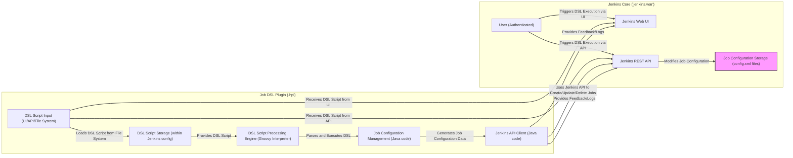
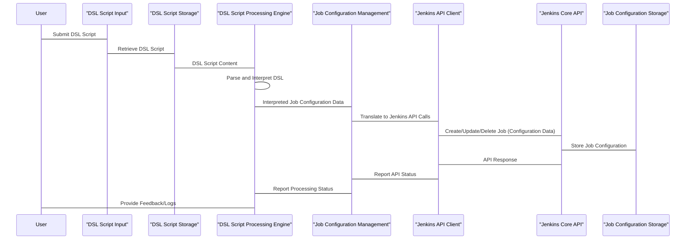

# Project Design Document: Jenkins Job DSL Plugin - For Threat Modeling

**Version:** 1.1
**Date:** October 26, 2023
**Author:** AI Architecture Expert

## 1. Introduction

This document provides a detailed design overview of the Jenkins Job DSL Plugin, specifically created to facilitate thorough threat modeling. The plugin enables users to programmatically define and manage Jenkins jobs using a Groovy-based Domain Specific Language (DSL). This document outlines the key components, data flows, and interactions within the plugin, highlighting areas of potential security concern for subsequent threat analysis.

## 2. Goals and Objectives

The primary goals of the Jenkins Job DSL Plugin, from a security perspective, are:

*   To provide a secure and controlled mechanism for programmatic Jenkins job creation and management.
*   To prevent unauthorized or malicious modification of Jenkins job configurations through DSL scripts.
*   To ensure the integrity and confidentiality of DSL scripts and generated job configurations.
*   To provide auditable actions related to DSL script execution and job updates.
*   To minimize the attack surface introduced by the plugin.

## 3. Scope

This design document focuses on the core functionality of the Jenkins Job DSL Plugin relevant to security threat modeling, including:

*   The processing and interpretation of DSL scripts, with a focus on potential code execution vulnerabilities.
*   The generation and management of Jenkins job configurations, considering access control and data integrity.
*   The interaction with the Jenkins core API, particularly authentication and authorization aspects.
*   The storage and retrieval of DSL scripts, analyzing potential vulnerabilities related to storage and access.
*   User interaction points (UI and API) for triggering DSL script execution, focusing on authentication and authorization.
*   The plugin's internal components and their interactions, identifying trust boundaries and potential attack vectors.

The document does not cover:

*   The detailed syntax of individual DSL commands, unless directly relevant to a potential security vulnerability.
*   The internal implementation details of the Jenkins core beyond the interaction points with the plugin.
*   Security aspects of external plugins unless they directly and significantly interact with the Job DSL Plugin's core security mechanisms.
*   Generic web application security best practices for the Jenkins platform itself.

## 4. Architectural Overview

The Jenkins Job DSL Plugin operates within the Jenkins environment, interacting with the Jenkins core to provide its functionality. Understanding the relationships and trust boundaries between components is crucial for threat modeling.

## 5. Component Details

This section provides a more detailed description of the key components, highlighting security-relevant aspects:

*   **DSL Script Input (UI/API/File System):** This component handles the entry points for DSL scripts.
    *   **Security Concern:**  Vulnerable to Cross-Site Scripting (XSS) if input is not properly sanitized when displayed in the UI. Potential for unauthorized script submission if access controls are weak.
    *   **Access Control:** Relies on Jenkins' authentication and authorization mechanisms for UI and API access. File system access depends on Jenkins' process permissions.

*   **DSL Script Storage (within Jenkins config):** This component stores the DSL scripts.
    *   **Security Concern:**  Sensitive information (credentials, API keys) might be embedded in DSL scripts. Unauthorized access to Jenkins configuration files could expose these secrets.
    *   **Protection:**  Jenkins' configuration files should be protected with appropriate file system permissions. Encryption at rest for Jenkins configuration might be considered.

*   **DSL Script Processing Engine (Groovy Interpreter):** This is the core execution engine for DSL scripts.
    *   **Security Concern:**  The Groovy interpreter can execute arbitrary code. Maliciously crafted DSL scripts could perform unauthorized actions on the Jenkins master or connected systems. This is a significant injection vulnerability risk.
    *   **Sandboxing/Restrictions:**  The plugin might implement some form of sandboxing or restrictions on the Groovy execution environment, but the effectiveness of these measures needs careful consideration.

*   **Job Configuration Management (Java code):** This component translates the interpreted DSL into Jenkins job configurations.
    *   **Security Concern:**  Vulnerabilities in this component could lead to the creation of jobs with insecure configurations (e.g., weak security settings, exposed credentials).
    *   **Input Validation:**  Needs to validate the parameters derived from the DSL script to prevent the creation of insecure job configurations.

*   **Jenkins API Client (Java code):** This component interacts with the Jenkins core API.
    *   **Security Concern:**  Needs to authenticate and authorize correctly with the Jenkins API. Improper handling of API tokens or credentials could lead to unauthorized actions.
    *   **Principle of Least Privilege:**  The API client should only have the necessary permissions to perform its intended actions.

## 6. Data Flow

Understanding how data flows through the plugin is crucial for identifying potential points of compromise:

1. **DSL Script Submission:** A user submits a DSL script through the UI, API, or the script is loaded from the file system. The script content is the primary data input.
2. **Script Retrieval:** The DSL Script Storage provides the script content to the Processing Engine.
3. **Parsing and Interpretation:** The DSL Script Processing Engine parses the Groovy script. This involves lexical analysis and syntactic analysis. The interpreted data represents the desired job configurations.
4. **Configuration Generation:** The Job Configuration Management component translates the interpreted data into Jenkins-specific job configuration objects. This involves mapping DSL elements to Jenkins job properties.
5. **API Interaction:** The Jenkins API Client sends requests to the Jenkins core API to create, update, or delete jobs based on the generated configurations. This involves transmitting job configuration data over the API.
6. **Configuration Storage:** The Jenkins core stores the updated job configurations in its configuration files.
7. **Feedback:** The plugin provides feedback to the user, including logs and status updates. This data might contain sensitive information about the execution process.

## 7. Security Considerations and Potential Threats

This section outlines potential security considerations and threats based on the design:

*   **DSL Script Injection:**
    *   **Threat:** Malicious users could inject arbitrary Groovy code into DSL scripts, leading to remote code execution on the Jenkins master.
    *   **Mitigation:** Input validation, sandboxing of the Groovy interpreter, and strict access control for DSL script submission.
*   **Unauthorized Job Modification:**
    *   **Threat:** Users without proper authorization could execute DSL scripts to create, modify, or delete Jenkins jobs.
    *   **Mitigation:** Leverage Jenkins' authentication and authorization mechanisms, implement role-based access control for DSL script execution.
*   **Exposure of Sensitive Information:**
    *   **Threat:** DSL scripts might contain sensitive information like credentials or API keys, which could be exposed if the scripts or Jenkins configuration files are compromised.
    *   **Mitigation:** Encourage the use of Jenkins Credentials Plugin instead of embedding secrets in DSL scripts, secure storage and access controls for Jenkins configuration.
*   **Cross-Site Scripting (XSS):**
    *   **Threat:** If user-provided DSL script content is not properly sanitized when displayed in the Jenkins UI, it could lead to XSS attacks.
    *   **Mitigation:** Implement proper output encoding and sanitization for all user-provided content.
*   **Insecure Job Configurations:**
    *   **Threat:**  Vulnerabilities in the Job Configuration Management component could lead to the creation of jobs with insecure settings.
    *   **Mitigation:**  Thorough input validation and adherence to secure configuration practices during job configuration generation.
*   **Dependency Vulnerabilities:**
    *   **Threat:** The Job DSL Plugin itself or its dependencies might contain known vulnerabilities.
    *   **Mitigation:** Regularly update the plugin and its dependencies, perform security scanning of the plugin's codebase.
*   **Insufficient Auditing:**
    *   **Threat:** Lack of proper logging and auditing of DSL script executions and job modifications can hinder incident response and forensic analysis.
    *   **Mitigation:** Implement comprehensive logging of all relevant actions, including who executed which script and the resulting changes.

## 8. Deployment Considerations

Security considerations during deployment include:

*   **Secure Plugin Source:** Ensure the plugin is downloaded from a trusted source (official Jenkins plugin repository).
*   **Access Control:** Restrict access to the Jenkins master's file system to prevent unauthorized modification of plugin files.
*   **Regular Updates:** Keep the plugin updated to the latest version to patch any known security vulnerabilities.
*   **Principle of Least Privilege:** Run the Jenkins master process with the minimum necessary privileges.

## 9. Future Considerations for Security

Future development efforts could focus on enhancing the security of the Job DSL Plugin:

*   **Enhanced DSL Script Sandboxing:** Implement more robust sandboxing techniques to restrict the capabilities of executed Groovy code.
*   **Static Analysis of DSL Scripts:** Integrate static analysis tools to detect potential security vulnerabilities in DSL scripts before execution.
*   **Role-Based Access Control for DSL Features:** Implement fine-grained access control for different DSL commands and functionalities.
*   **Integration with Secrets Management Systems:**  Provide better integration with external secrets management systems to avoid storing credentials directly in DSL scripts.
*   **Content Security Policy (CSP) Headers:** Ensure appropriate CSP headers are in place to mitigate XSS risks.

This improved design document provides a more security-focused perspective on the Jenkins Job DSL Plugin, making it more suitable for thorough threat modeling activities. The detailed component descriptions, data flow diagrams, and explicit security considerations will aid in identifying and mitigating potential vulnerabilities.
