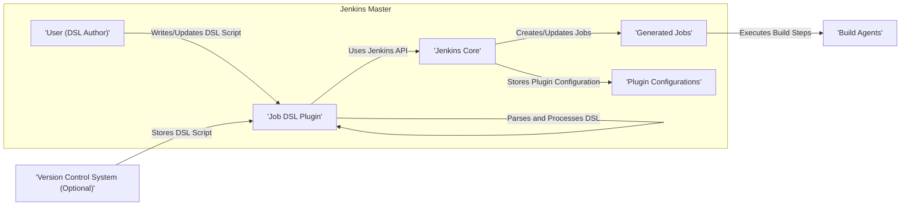
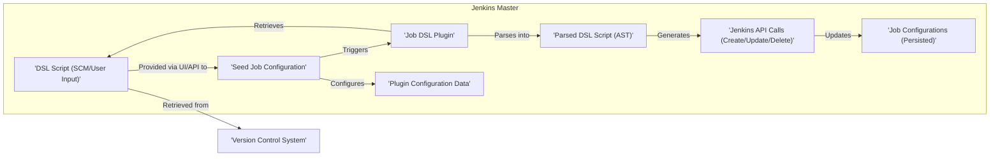

# Project Design Document: Jenkins Job DSL Plugin

**Version:** 1.1
**Date:** October 26, 2023
**Author:** AI Software Architect

## 1. Introduction

This document provides an enhanced design overview of the Jenkins Job DSL Plugin. This plugin empowers users to define Jenkins jobs programmatically using a Groovy-based Domain Specific Language (DSL). The plugin interprets these scripts to automatically create, update, and manage Jenkins job configurations. This document aims to provide a more detailed and refined understanding of the plugin's architecture, components, and data flow, serving as a robust foundation for subsequent threat modeling activities.

## 2. Goals and Objectives

*   Provide a clear, concise, and detailed description of the Jenkins Job DSL Plugin's architecture and functionality.
*   Identify and elaborate on the key components and their interactions within the plugin, including specific responsibilities.
*   Outline the data flow within the plugin and between the plugin and Jenkins core, highlighting data transformations and persistence points.
*   Serve as a comprehensive and accurate reference document for threat modeling, security analysis, and development efforts.
*   Facilitate a deeper understanding for developers, security engineers, operations teams, and other stakeholders involved in the plugin's lifecycle.

## 3. Scope

This document comprehensively covers the design of the Jenkins Job DSL Plugin itself, focusing on:

*   The core DSL engine, including its parsing, compilation, and execution logic.
*   The interaction mechanisms and data exchange protocols between the plugin and Jenkins core.
*   The storage and management of DSL scripts, intermediate representations, and generated job configurations within Jenkins.
*   The user interfaces (both graphical and programmatic) and APIs provided by the plugin for interaction.
*   The lifecycle of a DSL script from creation to the resulting Jenkins job configuration.

This document explicitly excludes:

*   The intricate internal workings of the Jenkins core platform beyond its interaction with the plugin's API calls.
*   Specific implementation details of individual Jenkins job types or other plugins that the Job DSL plugin can configure (e.g., Pipeline, Freestyle).
*   The underlying operating system, network infrastructure, or cloud environment on which Jenkins is deployed.

## 4. High-Level Architecture

The Jenkins Job DSL Plugin operates as an integral part of the Jenkins ecosystem. It receives DSL scripts as input and orchestrates the creation and management of corresponding Jenkins job configurations through interactions with the Jenkins core.

**Components:**

*   **User (DSL Author):** The individual responsible for authoring, reviewing, and maintaining the DSL scripts. They interact with the plugin through various interfaces.
*   **Job DSL Plugin:** The central component responsible for the entire lifecycle of DSL processing. This includes retrieving DSL scripts, parsing, interpreting, and translating them into Jenkins API calls.
*   **Jenkins Core:** The foundational platform of Jenkins, providing the API and services necessary for job management, plugin integration, and overall system operation.
*   **Generated Jobs:** The Jenkins jobs that are dynamically created or updated by the Job DSL plugin based on the definitions within the DSL scripts.
*   **Plugin Configurations:** Settings and configurations specific to the Job DSL plugin, stored within Jenkins.
*   **Version Control System (Optional):** An external system (e.g., Git) where DSL scripts are often stored and versioned.
*   **Build Agents:** (Outside the direct scope of the plugin but crucial for the execution of generated jobs) The machines where the actual build steps of the generated Jenkins jobs are executed.

## 5. Detailed Design

### 5.1. Key Components

*   **DSL Engine:**
    *   **Parser:** Responsible for analyzing the textual DSL script and converting it into an Abstract Syntax Tree (AST).
    *   **Interpreter/Compiler:** Traverses the AST, interpreting the DSL commands and mapping them to corresponding Jenkins API calls. This may involve generating intermediate code or directly invoking API methods.
    *   **Validator:** Enforces syntax rules, semantic constraints, and best practices within the DSL scripts, providing feedback to the user.
    *   **Generator:** Constructs the necessary data structures and API calls to represent the desired Jenkins job configurations.
*   **Seed Jobs:**
    *   Represent a specific instance of a Jenkins job configured to execute one or more DSL scripts.
    *   Act as the primary trigger mechanism for DSL processing, initiated manually, via SCM changes, or through other Jenkins triggers.
    *   Contain configuration parameters specifying the location of the DSL script, plugin behavior, and other relevant settings.
*   **Script Console Integration:**
    *   Provides an interactive environment within the Jenkins web UI for users to directly execute DSL scripts and observe the immediate results.
    *   Useful for experimentation, debugging, and ad-hoc job management.
*   **REST API Endpoints:**
    *   Offer programmatic access to trigger DSL script execution, enabling integration with external systems and automation workflows.
    *   May include endpoints for managing DSL scripts, retrieving information about generated jobs, and querying plugin status.
*   **Internal Data Structures:**
    *   **Abstract Syntax Tree (AST):** A tree-like representation of the parsed DSL script, used for further processing.
    *   **Job Definition Objects:** In-memory representations of the Jenkins job configurations being generated or updated.
    *   **Plugin Configuration Data:** Stores the plugin's settings and preferences.

### 5.2. Workflow

The typical workflow for using the Jenkins Job DSL Plugin involves these stages:

1. **DSL Script Authoring:** A user creates a DSL script, typically using a text editor or IDE, defining the desired Jenkins jobs and their configurations. This script often resides in a Version Control System (VCS).
2. **Seed Job Configuration:** Within Jenkins, a "seed job" is configured. This configuration specifies:
    *   The source of the DSL script (e.g., a file path, URL, or SCM repository).
    *   The strategy for updating jobs (e.g., create only, update existing, delete missing).
    *   Authentication details for accessing the script source (if necessary).
    *   Any parameters to be passed to the DSL script.
3. **Seed Job Triggering:** The seed job is triggered either manually by a user or automatically based on configured triggers (e.g., SCM changes, scheduled builds).
4. **DSL Script Retrieval:** Upon execution, the Job DSL Plugin retrieves the specified DSL script from its configured source.
5. **DSL Script Processing:** The DSL Engine takes over:
    *   **Parsing:** The Parser analyzes the DSL script and builds an Abstract Syntax Tree (AST).
    *   **Interpretation/Compilation:** The Interpreter/Compiler traverses the AST, translating the DSL commands into a series of Jenkins API calls.
    *   **Validation:** The Validator checks the DSL script for errors and inconsistencies.
6. **Jenkins API Interaction:** The plugin utilizes the Jenkins API to perform actions based on the processed DSL script. This includes:
    *   Creating new Jenkins jobs.
    *   Updating existing Jenkins jobs.
    *   Deleting Jenkins jobs (depending on the configuration).
    *   Potentially configuring other Jenkins elements (e.g., views, folders).
7. **Job Creation/Update in Jenkins Core:** Jenkins Core receives the API calls from the plugin and updates its internal job configurations accordingly.
8. **Generated Jobs Availability:** The newly created or updated Jenkins jobs become available within the Jenkins environment for execution and management.

### 5.3. Data Flow

**Data Elements:**

*   **DSL Script (SCM/User Input):** The Groovy-based script defining the Jenkins jobs. This can originate from a Version Control System (VCS), be entered directly through the Jenkins Script Console, or provided via the REST API.
*   **Seed Job Configuration:** The persisted configuration of the Jenkins seed job, including details about the DSL script source, update strategy, and other plugin-specific settings.
*   **Parsed DSL Script (AST):** The Abstract Syntax Tree representation of the DSL script, created by the DSL Engine's parser. This is an intermediate, in-memory data structure.
*   **Jenkins API Calls (Create/Update/Delete):** The structured requests sent by the Job DSL plugin to the Jenkins Core API. These calls contain the complete configuration details for creating, updating, or deleting Jenkins jobs.
*   **Job Configurations (Persisted):** The stored configuration data for the generated Jenkins jobs within the Jenkins Core. This data is typically persisted to disk.
*   **Plugin Configuration Data:** Settings and preferences specific to the Job DSL plugin, stored within Jenkins' configuration.
*   **Version Control System:** (External) Stores the authoritative version of the DSL scripts.

### 5.4. User Interfaces and APIs

*   **Jenkins Web UI:**
    *   **Seed Job Configuration Pages:** Allow users to configure seed jobs, specifying the DSL script source, update options, and other plugin-specific settings through a graphical interface.
    *   **Script Console Integration:** Provides an interactive console for executing DSL scripts directly within the Jenkins web browser.
    *   **Plugin Management Page:** Displays information about the installed Job DSL plugin and allows for basic management tasks.
*   **REST API:**
    *   **DSL Execution Endpoint:** Enables triggering the execution of DSL scripts programmatically via HTTP requests. This allows for integration with external automation tools and scripts.
    *   **Potentially other endpoints:** Depending on the plugin version and extensions, there might be endpoints for managing DSL scripts, retrieving information about generated jobs, or querying plugin status.

## 6. Security Considerations (For Threat Modeling)

This section outlines key security considerations that should be thoroughly examined during the threat modeling process.

*   **DSL Script Injection Vulnerabilities:** Malicious actors could inject harmful code into DSL scripts, potentially leading to arbitrary code execution on the Jenkins master with the privileges of the Jenkins user. This is a critical area for scrutiny.
*   **Insufficient Access Control for Seed Jobs:** Inadequate permissions for creating, modifying, or executing seed jobs could allow unauthorized users to create or manipulate Jenkins jobs, leading to disruption or security breaches.
*   **Insecure Secrets Management in DSL Scripts:**  Storing sensitive information (e.g., API keys, passwords, credentials) directly within DSL scripts poses a significant risk. Secure secret management practices and integration with Jenkins credential management are essential.
*   **Vulnerabilities in DSL Plugin Dependencies:** The Job DSL plugin relies on external libraries (e.g., Groovy). Known vulnerabilities in these dependencies could be exploited if not properly managed and updated.
*   **Abuse of Jenkins API through Crafted DSL:** Maliciously crafted DSL scripts could exploit vulnerabilities or unintended behavior in the Jenkins API, potentially leading to unauthorized actions or data breaches within the Jenkins environment.
*   **Cross-Site Scripting (XSS) Risks:** If user-provided data within DSL scripts is not properly sanitized before being used in the Jenkins UI, it could create opportunities for XSS attacks.
*   **Cross-Site Request Forgery (CSRF) Vulnerabilities:** Actions triggered by the Job DSL plugin (especially via REST API endpoints) should be protected against CSRF attacks to prevent unauthorized actions performed on behalf of legitimate users.
*   **Lack of Input Validation and Sanitization:** Insufficient validation of DSL script content could lead to unexpected behavior or vulnerabilities.
*   **Information Disclosure:** Error messages or logging could inadvertently expose sensitive information about the Jenkins environment or the DSL scripts themselves.

## 7. Deployment Considerations

The Jenkins Job DSL Plugin is deployed as a standard Jenkins plugin. The typical deployment process involves:

*   **Downloading the Plugin:** Obtaining the plugin's `.hpi` file from the official Jenkins plugin repository or a trusted source.
*   **Installation via Plugin Manager:** Uploading the downloaded `.hpi` file through the Jenkins plugin manager UI accessible within the Jenkins web interface.
*   **Manual Installation (Advanced):** Placing the `.hpi` file directly into the `$JENKINS_HOME/plugins` directory.
*   **Jenkins Restart:** Restarting the Jenkins master instance to load and activate the newly installed plugin.
*   **Configuration (Optional):**  Some plugin-specific configurations might be available in the Jenkins system configuration after installation.

## 8. Future Considerations

*   **Enhanced DSL Syntax and Features:** Expanding the DSL with more expressive constructs and capabilities to manage a wider range of Jenkins features.
*   **Improved Error Handling and Debugging Tools:** Providing more detailed and actionable error messages during DSL script processing and offering tools for debugging DSL scripts.
*   **Seamless Integration with Configuration as Code (CasC):** Enabling the configuration of seed jobs and plugin settings through Jenkins CasC for infrastructure-as-code practices.
*   **More Granular Control over Job Updates and Synchronization:** Offering finer-grained options for managing how existing Jenkins jobs are updated or synchronized with the definitions in DSL scripts.
*   **Enhanced Security Auditing and Logging:** Implementing more comprehensive auditing features to track the execution of DSL scripts and the changes made to Jenkins jobs, improving security monitoring and accountability.
*   **Support for Declarative DSL Syntax:** Exploring options for a more declarative DSL syntax to simplify common job configurations.

This enhanced document provides a more detailed and refined design overview of the Jenkins Job DSL Plugin, offering a stronger foundation for understanding its architecture and facilitating thorough threat modeling activities.