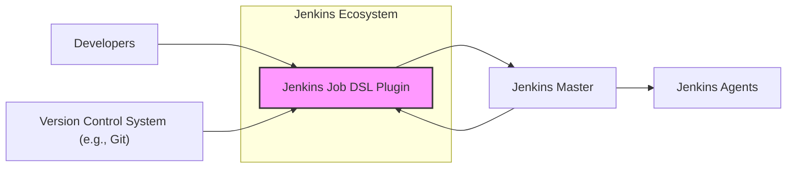
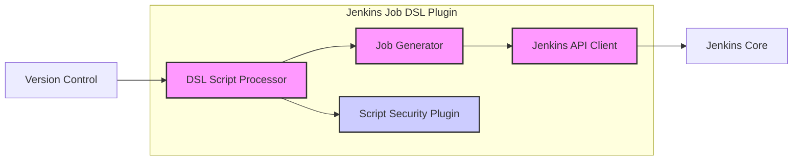
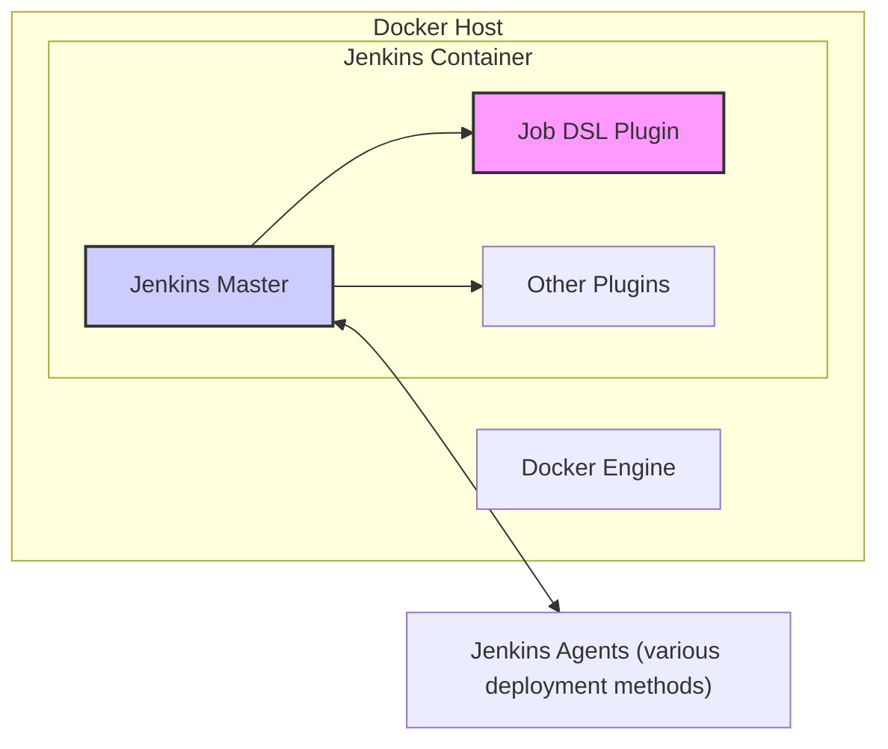
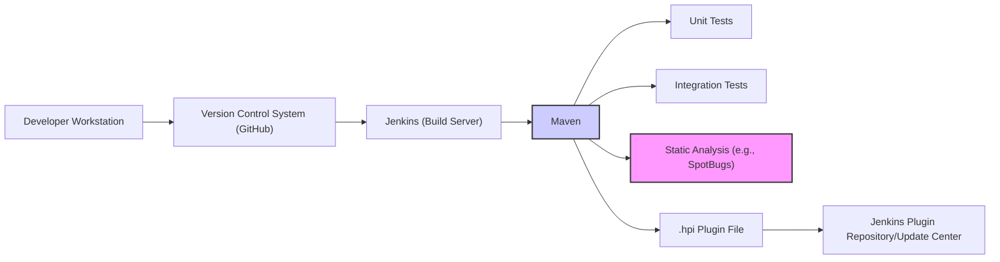

# BUSINESS POSTURE

Business Priorities and Goals:

The Jenkins Job DSL Plugin aims to simplify and automate the creation and management of Jenkins jobs through a Domain Specific Language (DSL). This addresses the following business priorities:

*   Efficiency: Reduce manual configuration of Jenkins jobs, saving time and effort for developers and operations teams.
*   Consistency: Ensure consistent job configurations across different Jenkins instances and environments.
*   Maintainability: Make it easier to update and maintain Jenkins job configurations as requirements evolve.
*   Scalability: Enable the management of a large number of Jenkins jobs without manual intervention.
*   Version Control: Treat job configurations as code, allowing for version control, collaboration, and auditability.

Business Risks:

*   Unauthorized Job Modification: Malicious actors could potentially use the DSL to create or modify jobs, leading to unauthorized code execution or data breaches.
*   DSL Script Vulnerabilities: Vulnerabilities in the DSL scripts themselves or in the plugin's handling of them could be exploited.
*   Configuration Errors: Incorrectly written DSL scripts could lead to misconfigured jobs, potentially causing build failures or security vulnerabilities.
*   Dependency Management: The plugin and the DSL scripts may rely on external libraries or plugins, introducing potential supply chain risks.
*   Access Control: Insufficient access control to the DSL scripts or the Jenkins instance could allow unauthorized users to make changes.

# SECURITY POSTURE

Existing Security Controls:

*   security control: Jenkins Core Security: The plugin inherits the security features of Jenkins core, including authentication, authorization, and access control mechanisms. (Described in Jenkins documentation and configuration).
*   security control: Script Security Plugin: The Job DSL plugin utilizes the Script Security plugin to sandbox the execution of DSL scripts, limiting their access to Jenkins internals and the underlying system. (Described in plugin documentation: https://github.com/jenkinsci/job-dsl-plugin/wiki#script-security).
*   security control: Groovy Sandbox: The DSL is based on Groovy, and the Script Security plugin often uses a Groovy sandbox to further restrict the capabilities of the scripts. (Described in Script Security plugin documentation).
*   security control: Code Reviews: DSL scripts, like any other code, should be subject to code reviews to identify potential security vulnerabilities or configuration errors. (Implemented as part of the development workflow).
*   security control: Version Control: Storing DSL scripts in a version control system (e.g., Git) provides an audit trail and allows for tracking changes and reverting to previous versions. (Implemented as part of the development workflow).

Accepted Risks:

*   accepted risk: Complexity of Configuration: The DSL, while powerful, can be complex, and misconfigurations are possible. This risk is mitigated by code reviews, testing, and documentation.
*   accepted risk: Reliance on Script Security: The security of the DSL execution heavily relies on the effectiveness of the Script Security plugin and the Groovy sandbox. Any vulnerabilities in these components could be exploited.

Recommended Security Controls:

*   security control: Least Privilege Principle: Ensure that Jenkins users and service accounts have only the minimum necessary permissions to execute the DSL scripts and manage jobs.
*   security control: Input Validation: While the DSL itself is a form of input, any user-provided parameters or data used within the DSL scripts should be carefully validated to prevent injection attacks.
*   security control: Regular Updates: Keep the Job DSL plugin, Jenkins core, and all related plugins up to date to patch any security vulnerabilities.
*   security control: Monitoring and Auditing: Monitor Jenkins logs and audit trails for any suspicious activity related to the execution of DSL scripts or changes to job configurations.
*   security control: Static Analysis: Integrate static analysis tools into the development workflow to scan DSL scripts for potential security vulnerabilities.

Security Requirements:

*   Authentication:
    *   Users interacting with the Jenkins instance and the Job DSL plugin must be authenticated using Jenkins' built-in authentication mechanisms or integrated identity providers.
*   Authorization:
    *   Access to execute DSL scripts, create/modify jobs, and access sensitive data should be controlled through role-based access control (RBAC) within Jenkins.
    *   The principle of least privilege should be applied to all users and service accounts.
*   Input Validation:
    *   Any user-provided input used within the DSL scripts should be validated to prevent injection attacks or unexpected behavior.
    *   Parameterized builds should define expected input types and ranges.
*   Cryptography:
    *   Sensitive data, such as credentials, should be stored securely using Jenkins' built-in credential management system.
    *   Communication between Jenkins and other systems should use secure protocols (e.g., HTTPS).
*   Audit:
    *   All actions performed by the plugin and DSL scripts should be logged and auditable.

# DESIGN

## C4 CONTEXT

Context Diagram Element Description:

*   1.  Name: Jenkins Job DSL Plugin
    *   Type: Software System
    *   Description: A Jenkins plugin that allows users to define Jenkins jobs using a Domain Specific Language (DSL).
    *   Responsibilities:
        *   Interpreting and executing DSL scripts.
        *   Creating and updating Jenkins jobs based on the DSL definitions.
        *   Interacting with the Jenkins core API.
        *   Utilizing the Script Security plugin for sandboxed execution.
    *   Security controls:
        *   Relies on Jenkins core security features (authentication, authorization).
        *   Uses the Script Security plugin to sandbox DSL script execution.

*   2.  Name: Developers
    *   Type: User
    *   Description: Individuals who write and maintain the DSL scripts.
    *   Responsibilities:
        *   Writing DSL scripts to define Jenkins jobs.
        *   Storing DSL scripts in a version control system.
        *   Reviewing and testing DSL scripts.
    *   Security controls:
        *   Authenticated and authorized within Jenkins.
        *   Subject to code review processes.

*   3.  Name: Jenkins Master
    *   Type: Software System
    *   Description: The central, coordinating process of Jenkins which manages job configurations, schedules builds, and dispatches builds to agents.
    *   Responsibilities:
        *   Storing job configurations.
        *   Scheduling builds.
        *   Managing agents.
        *   Providing a user interface.
    *   Security controls:
        *   Implements Jenkins core security features (authentication, authorization, access control).

*   4.  Name: Version Control System (e.g., Git)
    *   Type: Software System
    *   Description: A system for tracking changes to files, typically used for source code and, in this case, DSL scripts.
    *   Responsibilities:
        *   Storing DSL scripts.
        *   Tracking changes to DSL scripts.
        *   Enabling collaboration and versioning.
    *   Security controls:
        *   Access control to the repository.
        *   Audit trail of changes.

*   5.  Name: Jenkins Agents
    *   Type: Software System
    *   Description: Nodes that execute the builds defined by Jenkins jobs.
    *   Responsibilities:
        *   Executing build steps.
        *   Providing a runtime environment for builds.
    *   Security controls:
        *   Communication with the Jenkins master should be secured.
        *   Agents should have limited access to sensitive resources.

## C4 CONTAINER

Container Diagram Element Description:

*   1.  Name: DSL Script Processor
    *   Type: Container
    *   Description: The core component of the plugin that parses and executes the DSL scripts.
    *   Responsibilities:
        *   Reading DSL scripts from the version control system.
        *   Parsing the DSL syntax.
        *   Executing the DSL code within a sandboxed environment (using the Script Security Plugin).
        *   Interacting with the Job Generator to create/update jobs.
    *   Security controls:
        *   Relies on the Script Security Plugin for sandboxing.

*   2.  Name: Job Generator
    *   Type: Container
    *   Description: The component responsible for creating and updating Jenkins jobs based on the processed DSL.
    *   Responsibilities:
        *   Receiving instructions from the DSL Script Processor.
        *   Using the Jenkins API Client to interact with the Jenkins core API.
        *   Creating, updating, and deleting Jenkins jobs.
    *   Security controls:
        *   Relies on Jenkins core security for API access.

*   3.  Name: Script Security Plugin
    *   Type: Container
    *   Description: A Jenkins plugin that provides a sandboxed environment for executing scripts, including the Job DSL scripts.
    *   Responsibilities:
        *   Providing a restricted execution environment for scripts.
        *   Limiting access to Jenkins internals and the underlying system.
        *   Using a Groovy sandbox (often).
    *   Security controls:
        *   Implements sandboxing mechanisms.
        *   Regularly updated to address security vulnerabilities.

*   4.  Name: Jenkins API Client
    *   Type: Container
    *   Description: A component that handles communication with the Jenkins core API.
    *   Responsibilities:
        *   Sending requests to the Jenkins core API.
        *   Receiving responses from the Jenkins core API.
        *   Handling authentication and authorization.
    *   Security controls:
        *   Uses Jenkins core security mechanisms for authentication and authorization.

*   5.  Name: Jenkins Core
    *   Type: Software System
    *   Description: Main Jenkins application.
    *   Responsibilities:
        *   Provide API for plugins.
    *   Security controls:
        *   Implements Jenkins core security features (authentication, authorization, access control).

*   6.  Name: Version Control
    *   Type: Software System
    *   Description: System to store and version DSL scripts.
    *   Responsibilities:
        *   Store and provide DSL scripts.
    *   Security controls:
        *   Access control to the repository.
        *   Audit trail of changes.

## DEPLOYMENT

Possible Deployment Solutions:

1.  Manual Plugin Installation: Download the plugin .hpi file and manually upload it to the Jenkins instance.
2.  Jenkins Plugin Manager: Install the plugin directly from the Jenkins Update Center using the Plugin Manager.
3.  Configuration as Code (CasC): Define the plugin installation as part of a Jenkins Configuration as Code (CasC) setup.
4.  Dockerized Jenkins: Include the plugin in a custom Docker image for Jenkins.

Chosen Solution (Dockerized Jenkins):

Deployment Diagram Element Description:

*   1.  Name: Docker Host
    *   Type: Infrastructure Node
    *   Description: The physical or virtual machine that hosts the Docker Engine.
    *   Responsibilities:
        *   Running the Docker Engine.
        *   Providing resources (CPU, memory, storage) to the containers.
    *   Security controls:
        *   Operating system security hardening.
        *   Firewall rules.
        *   Regular security updates.

*   2.  Name: Docker Engine
    *   Type: Software System
    *   Description: The runtime environment for Docker containers.
    *   Responsibilities:
        *   Managing containers.
        *   Building images.
        *   Networking containers.
    *   Security controls:
        *   Docker security best practices (e.g., using non-root users, limiting container capabilities).

*   3.  Name: Jenkins Container
    *   Type: Container
    *   Description: A Docker container running the Jenkins master process.
    *   Responsibilities:
        *   Running the Jenkins master process.
        *   Hosting the Job DSL plugin and other plugins.
    *   Security controls:
        *   Container security best practices (e.g., using a minimal base image, scanning for vulnerabilities).

*   4.  Name: Jenkins Master
    *   Type: Software System
    *   Description: The central, coordinating process of Jenkins.
    *   Responsibilities: Same as described in C4 Context.
    *   Security controls: Same as described in C4 Context.

*   5.  Name: Job DSL Plugin
    *   Type: Plugin
    *   Description: The Job DSL plugin, installed within the Jenkins container.
    *   Responsibilities: Same as described in C4 Context.
    *   Security controls: Same as described in C4 Context.

*   6.  Name: Other Plugins
    *   Type: Plugin
    *   Description: Other Jenkins plugins installed within the Jenkins container.
    *   Responsibilities: Varies depending on the plugins.
    *   Security controls: Varies depending on the plugins.

*   7.  Name: Jenkins Agents (various deployment methods)
    *   Type: Software System/Infrastructure Node
    *   Description: Jenkins agents, which can be deployed in various ways (e.g., separate containers, VMs, physical machines).
    *   Responsibilities: Executing build steps.
    *   Security controls: Varies depending on the deployment method.

## BUILD

The Job DSL plugin itself is built using Maven. The build process can be automated using Jenkins itself (or other CI/CD tools).

Build Process Description:

1.  Developer commits code changes to the GitHub repository.
2.  Jenkins (configured as a build server) detects the changes and triggers a build.
3.  Maven is used to manage dependencies, compile the code, and run tests.
4.  Unit tests are executed to verify individual components.
5.  Integration tests are executed to verify the interaction between different parts of the plugin.
6.  Static analysis tools (e.g., SpotBugs) are used to scan the code for potential bugs and security vulnerabilities.
7.  If all tests and checks pass, Maven packages the plugin into a .hpi file.
8.  The .hpi file is published to the Jenkins Plugin Repository or Update Center.

Security Controls in the Build Process:

*   security control: Version Control: All code changes are tracked in a version control system (GitHub).
*   security control: Build Automation: The build process is automated using Jenkins (or another CI/CD tool).
*   security control: Dependency Management: Maven manages dependencies and helps ensure that the correct versions of libraries are used.
*   security control: Unit Tests: Unit tests help ensure the quality and correctness of the code.
*   security control: Integration Tests: Integration tests verify the interaction between different components.
*   security control: Static Analysis: Static analysis tools scan the code for potential vulnerabilities.
*   security control: Signed artifacts. Plugin is signed before publishing.

# RISK ASSESSMENT

Critical Business Processes:

*   Automated build and deployment pipelines managed by Jenkins.
*   Continuous Integration and Continuous Delivery (CI/CD) processes.
*   Software development lifecycle.

Data Sensitivity:

*   Source code (various sensitivity levels depending on the projects managed by Jenkins).
*   Build artifacts (various sensitivity levels).
*   Jenkins job configurations (potentially containing sensitive information like API keys, credentials, etc.).
*   DSL scripts (potentially containing sensitive information).
*   Jenkins logs (potentially containing sensitive information).
*   Credentials stored in Jenkins credential manager (highly sensitive).

# QUESTIONS & ASSUMPTIONS

Questions:

*   What specific version control system is used, and what are its access control policies?
*   What are the specific security configurations of the Jenkins master and agents?
*   What are the existing procedures for reviewing and approving DSL scripts?
*   Are there any specific compliance requirements (e.g., GDPR, HIPAA) that need to be considered?
*   What is the process for handling security vulnerabilities discovered in the plugin or its dependencies?
*   What level of access do developers have to the production Jenkins instance?
*   What are the specific static analysis tools used in the build process?
*   How are Jenkins agents provisioned and managed?
*   What is the network configuration between the Jenkins master and agents?

Assumptions:

*   BUSINESS POSTURE: The organization has a moderate risk appetite, balancing the need for automation and efficiency with the need for security.
*   SECURITY POSTURE: Jenkins core security features are properly configured and maintained. The Script Security plugin is used and kept up to date. Developers follow secure coding practices.
*   DESIGN: The Job DSL plugin is primarily used to manage Jenkins jobs, not to execute arbitrary code or interact with external systems directly. The DSL scripts are stored in a secure version control system. The Jenkins master and agents are deployed in a secure environment.