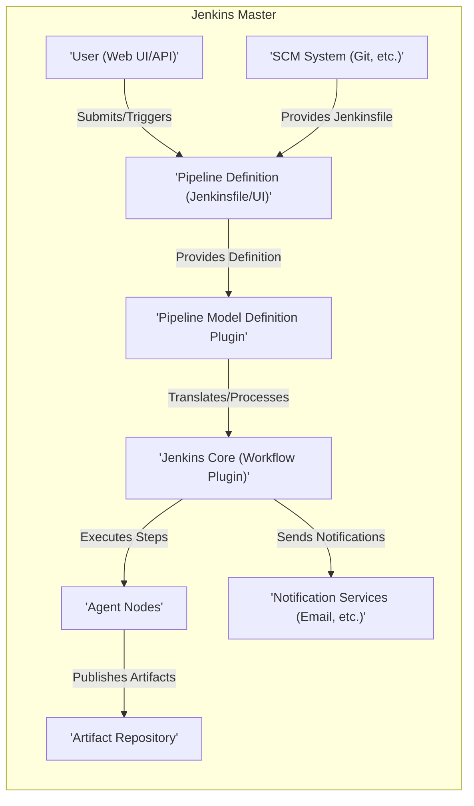

# Project Design Document: Jenkins Pipeline Model Definition Plugin

**Version:** 1.1
**Date:** October 26, 2023
**Author:** AI Software Architect

## 1. Introduction

This document provides an enhanced architectural design of the Jenkins Pipeline Model Definition Plugin. This plugin is crucial for enabling users to define their Jenkins build pipelines using both a structured, declarative syntax, promoting best practices and readability, and a more flexible scripted syntax, offering greater control. This revised document aims to provide a more detailed and clearer outline of the plugin's key components, their interactions, and the overall architecture, specifically tailored for effective threat modeling.

## 2. Goals

*   Clearly and comprehensively define the architecture and individual components of the Jenkins Pipeline Model Definition Plugin, elaborating on their specific responsibilities.
*   Illustrate the data flow within the plugin with greater detail on the types of data being exchanged.
*   Identify key interaction points, trust boundaries, and data transformation steps.
*   Provide a robust and detailed foundation for identifying potential security vulnerabilities during subsequent threat modeling exercises.

## 3. Scope

This document comprehensively covers the core architecture and functionality of the `pipeline-model-definition-plugin`. It encompasses the processing of both Declarative and Scripted Pipelines defined and managed by the plugin. The focus remains on the server-side components residing within the Jenkins master process. While client-side interactions (e.g., user interface elements within the Jenkins web UI) are acknowledged, the emphasis is on the backend processing and data handling.

## 4. High-Level Architecture

The Jenkins Pipeline Model Definition Plugin operates as an integral part of the Jenkins master process, directly interacting with core Jenkins functionalities and potentially external systems.

**Description of Components:**

*   **User (Web UI/API):** Represents human users interacting with Jenkins through the web interface to create, edit, and trigger pipeline executions, or automated systems interacting via the Jenkins API.
*   **Pipeline Definition (Jenkinsfile/UI):**  The authoritative source code representation of the pipeline's logic, either stored as a `Jenkinsfile` within a version control system or directly configured through the Jenkins user interface. This definition dictates the sequence of steps and configurations for the pipeline.
*   **Pipeline Model Definition Plugin:** The central component under analysis, responsible for the crucial tasks of parsing, validating, and transforming pipeline definitions into an executable format. It acts as a bridge between the user-defined pipeline and the Jenkins execution engine.
*   **Jenkins Core (Workflow Plugin):** The foundational Jenkins component responsible for the actual execution of the steps defined within a pipeline. The Model Definition Plugin translates its abstract model into a concrete workflow structure that the Workflow Plugin can interpret and execute.
*   **SCM System (Git, etc.):** External source code management systems, such as Git repositories, where `Jenkinsfile`s are commonly stored and versioned. Jenkins interacts with these systems to retrieve pipeline definitions.
*   **Agent Nodes:** Remote computing resources managed by Jenkins, where the individual build steps of a pipeline are physically executed. These agents provide the necessary environment and tools for running the pipeline tasks.
*   **Artifact Repository:** A designated storage location, either within Jenkins or an external system, where build artifacts produced during pipeline execution are stored and managed.
*   **Notification Services (Email, etc.):** External services used by Jenkins to disseminate notifications regarding pipeline execution status, failures, or successes to relevant stakeholders.

## 5. Component Details

A more granular breakdown of the Pipeline Model Definition Plugin reveals several key internal components:

*   **Declarative Pipeline Parser:**
    *   Specifically designed to process `Jenkinsfile`s written using the Declarative Pipeline syntax.
    *   Performs rigorous syntactic and semantic validation of the Declarative Pipeline definition against a predefined schema, ensuring adherence to the expected structure and keywords.
    *   Transforms the validated Declarative Pipeline definition into a well-defined internal object model, representing the pipeline's structure and logic in a programmatic way.
*   **Scripted Pipeline Interpreter:**
    *   Handles `Jenkinsfile`s authored using the more flexible and programmatic Scripted Pipeline syntax (Groovy DSL).
    *   Leverages the embedded Groovy interpreter within the Jenkins master to dynamically execute the Groovy code defined in the Scripted Pipeline.
    *   Provides access to a rich set of Jenkins APIs and libraries within the script execution context, allowing for complex and customized pipeline logic.
*   **Model Converter:**
    *   Acts as a translator, taking the internal representation of a Declarative Pipeline (generated by the parser) as input.
    *   Transforms this high-level declarative model into a sequence of concrete steps and constructs that are directly understood and executable by the Jenkins Workflow Plugin.
    *   This conversion involves mapping abstract declarative concepts (e.g., `stages`, `steps`, `agent`) to their corresponding low-level implementations within the Jenkins Workflow DSL.
*   **API Endpoints:**
    *   Exposes a set of programmatic API endpoints, enabling external systems and tools to interact with the plugin.
    *   These endpoints facilitate operations such as programmatically retrieving pipeline definitions, triggering pipeline executions, and querying the status of running or completed pipelines.
*   **UI Integration Components:**
    *   Contributes various user interface elements to the Jenkins web interface, enhancing the user experience for creating and editing Declarative Pipelines.
    *   Provides real-time visual feedback and validation mechanisms during the pipeline definition process, helping users identify and correct errors.
    *   May include interactive wizards, form-based editors, and visual representations of the pipeline structure to simplify pipeline creation and management.
*   **Configuration Management Module:**
    *   Manages the plugin's specific configuration settings within the broader Jenkins configuration framework.
    *   Allows administrators to define global settings relevant to pipeline execution, such as default agent configurations, globally available environment variables, and security-related parameters.
*   **Step Libraries (Shared Libraries) Integration:**
    *   Facilitates the integration and utilization of reusable pipeline logic defined in external Groovy scripts through Jenkins Shared Libraries.
    *   The plugin interacts with the Shared Libraries feature of Jenkins to dynamically load and execute these external scripts, promoting code reuse and modularity in pipeline definitions.

## 6. Data Flow

The following illustrates the detailed data flow involved in defining and executing a pipeline using the Pipeline Model Definition Plugin:

```mermaid
graph LR
    subgraph "Pipeline Definition & Processing"
        A["'User Defines Pipeline (Jenkinsfile/UI)'"]
        B["'Jenkins Receives Pipeline Definition'"]
        C["'Pipeline Model Definition Plugin Receives Definition'"]
        D{"'Determine Pipeline Type'"}
        E["'Declarative Parser'"]
        F["'Scripted Interpreter'"]
        G["'Model Converter'"]
        H["'Workflow Definition (Internal Representation)'"]
    end

    subgraph "Pipeline Execution"
        I["'Jenkins Workflow Plugin Executes Definition'"]
        J["'Steps Executed on Agent Nodes'"]
        K["'Artifacts Generated and Stored'"]
        L["'Notifications Sent via Notification Services'"]
        M["'Status Updates Propagated'"]
    end

    A -- "Definition Content" --> B
    B -- "Pipeline Definition" --> C
    C --> D
    D -- "Declarative" --> E
    D -- "Scripted" --> F
    E -- "Internal Model" --> G
    F -- "Workflow DSL (Directly)" --> H
    G -- "Workflow DSL" --> H
    H -- "Executable Workflow" --> I
    I -- "Step Instructions" --> J
    J -- "Generated Artifacts" --> K
    I -- "Notification Events" --> L
    I -- "Status Changes" --> M
    M -- "Status Updates" --> A
```

**Detailed Data Flow Description:**

1. **User Defines Pipeline:** A user authors or modifies a pipeline definition, either by creating or updating a `Jenkinsfile` within a source code repository or by configuring the pipeline directly through the Jenkins web UI. This definition encapsulates the logic and steps of the build process.
2. **Jenkins Receives Pipeline Definition:** Jenkins detects changes to the `Jenkinsfile` (e.g., through webhook triggers from the SCM system or periodic polling) or receives the pipeline definition submitted through the web UI or API.
3. **Pipeline Model Definition Plugin Receives Definition:** The plugin intercepts the incoming pipeline definition, acting as the initial processing point for all pipeline definitions.
4. **Determine Pipeline Type:** The plugin analyzes the structure and syntax of the received definition to determine whether it's a Declarative Pipeline or a Scripted Pipeline. This branching decision dictates the subsequent processing steps.
5. **Declarative Parser:** If the pipeline is identified as Declarative, the Declarative Parser takes over, meticulously parsing and validating the definition against the defined schema.
6. **Scripted Interpreter:** If the pipeline is identified as Scripted, the Scripted Interpreter processes the Groovy code, leveraging the embedded Groovy engine for dynamic interpretation.
7. **Model Converter:** For Declarative Pipelines, the Model Converter transforms the internal object model (created by the parser) into the Jenkins Workflow DSL, bridging the gap between the declarative syntax and the execution engine.
8. **Workflow Definition (Internal Representation):** The plugin constructs an internal representation of the pipeline's execution flow, expressed in the Jenkins Workflow DSL. This representation is the standard format understood by the Jenkins execution engine.
9. **Jenkins Workflow Plugin Executes Definition:** The Jenkins Workflow Plugin receives the generated workflow definition and begins the process of executing the pipeline steps in the defined sequence.
10. **Steps Executed on Agent Nodes:** Individual steps of the pipeline are dispatched to and executed on the designated Jenkins agent nodes. These agents provide the runtime environment for the build processes.
11. **Artifacts Generated and Stored:** During the execution of pipeline steps, build artifacts are produced. These artifacts are then stored in a designated location, either within the Jenkins workspace or in an external artifact repository.
12. **Notifications Sent via Notification Services:** As the pipeline executes, the Jenkins Workflow Plugin sends notifications about significant events (e.g., start, success, failure) to configured notification channels (e.g., email, Slack).
13. **Status Updates Propagated:** Jenkins updates the overall status of the pipeline execution, including logs, stage progression, and any errors encountered. This status information is made available through the Jenkins UI and API.

## 7. Security Considerations (Pre-Threat Modeling)

Before a formal threat model is conducted, several key security considerations should be highlighted:

*   **Access Control and Authorization:**
    *   Enforce strict role-based access control (RBAC) within Jenkins to manage who can create, view, edit, trigger, and abort pipelines. Improperly configured permissions can lead to unauthorized modifications or execution of malicious pipelines.
    *   Verify that the plugin correctly leverages Jenkins' security realm and authorization strategies.
*   **Input Validation and Sanitization:**
    *   Implement robust input validation and sanitization mechanisms within the Declarative Parser and Scripted Interpreter to prevent code injection attacks. Maliciously crafted pipeline definitions could exploit vulnerabilities in the parsing or interpretation logic.
    *   Special attention should be paid to validating user-provided parameters and environment variables used within pipeline steps.
*   **Secrets Management and Credential Handling:**
    *   Ensure secure handling of sensitive credentials (e.g., API keys, passwords, private keys) used within pipeline definitions. Leverage the Jenkins Credentials Plugin for secure storage and retrieval of credentials.
    *   Prevent the accidental exposure of secrets in pipeline logs or environment variables.
*   **Agent Security and Isolation:**
    *   Implement security measures to protect Jenkins agent nodes, as they execute potentially untrusted code from pipeline steps. This includes proper agent provisioning, secure communication channels, and potentially containerization or sandboxing of pipeline execution environments.
    *   Consider the principle of least privilege when configuring agent permissions.
*   **Dependency Management and Vulnerability Scanning:**
    *   Maintain an up-to-date inventory of all dependencies (Jenkins plugins, libraries) used by the Pipeline Model Definition Plugin.
    *   Regularly scan dependencies for known security vulnerabilities and apply necessary updates or patches promptly.
*   **Code Injection Vulnerabilities:**
    *   Thoroughly review the plugin's code, especially the Scripted Interpreter, to prevent code injection vulnerabilities that could allow attackers to execute arbitrary code on the Jenkins master or agents.
    *   Employ secure coding practices and conduct regular security code reviews.
*   **Cross-Site Scripting (XSS) Prevention:**
    *   If the plugin contributes to the Jenkins web UI, implement robust measures to prevent cross-site scripting (XSS) attacks. Sanitize user input and encode output appropriately to prevent the injection of malicious scripts.
*   **Authentication and Authorization for API Endpoints:**
    *   Secure all API endpoints provided by the plugin with appropriate authentication and authorization mechanisms to prevent unauthorized access and manipulation.
    *   Follow best practices for API security, such as using secure authentication protocols (e.g., OAuth 2.0) and implementing proper rate limiting.
*   **Data Confidentiality and Integrity:**
    *   Protect the confidentiality and integrity of sensitive information within pipeline definitions and execution logs. Consider encryption at rest and in transit for sensitive data.
    *   Implement mechanisms to detect and prevent unauthorized modification of pipeline definitions.

## 8. Deployment Considerations

The Pipeline Model Definition Plugin is deployed as a standard Jenkins plugin within the Jenkins ecosystem.

*   The plugin is installed directly onto the Jenkins master node, making its functionalities available to the Jenkins instance.
*   It seamlessly integrates with Jenkins core APIs and extension points, leveraging the existing Jenkins infrastructure.
*   Typically, no separate deployment of external services or infrastructure is required for the plugin to function.
*   Configuration of the plugin is primarily managed through the Jenkins web UI, providing a centralized management interface. Alternatively, configuration-as-code mechanisms can be used for automated configuration management.

## 9. Future Considerations

*   **Enhancements to Declarative Syntax:** Explore potential additions and improvements to the Declarative Pipeline syntax to accommodate more complex and nuanced pipeline scenarios, potentially including more advanced control flow or data manipulation capabilities.
*   **Improved User Interface and User Experience (UI/UX):** Continuously improve the user interface elements for creating and managing pipelines, focusing on usability, intuitiveness, and providing better visual feedback to users.
*   **Deeper Integration with External Tools and Services:** Investigate opportunities for tighter integration with other development and operations tools, such as artifact repositories, testing frameworks, and deployment platforms, to streamline the overall CI/CD pipeline.
*   **Performance Optimization for Large and Complex Pipelines:** Focus on optimizing the parsing, conversion, and execution performance of pipelines, particularly for large and complex definitions, to reduce build times and resource consumption.

This enhanced design document provides a more detailed and comprehensive understanding of the Jenkins Pipeline Model Definition Plugin's architecture, specifically tailored to support thorough threat modeling. By elaborating on the components, data flow, and security considerations, this document aims to empower security experts to effectively identify and mitigate potential vulnerabilities within the plugin and the pipelines it manages.