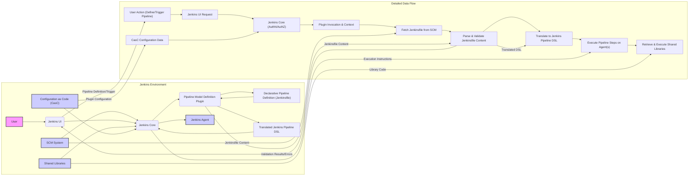

# Project Design Document: Jenkins Pipeline Model Definition Plugin

**Version:** 1.1
**Date:** October 26, 2023
**Author:** AI Software Architect

## 1. Project Overview

This document details the design of the Jenkins Pipeline Model Definition Plugin. This plugin empowers users to define Jenkins build, test, and deployment pipelines using a declarative syntax, offering a simplified and more manageable approach compared to traditional scripted pipelines. This declarative method enhances pipeline readability and maintainability. This document serves as a foundational reference for understanding the plugin's architecture and is specifically intended for use in subsequent threat modeling activities.

## 2. Goals

* To offer a user-friendly, declarative syntax for defining Jenkins pipelines.
* To abstract the complexities of the underlying Jenkins pipeline execution engine.
* To significantly improve the readability and maintainability of pipeline definitions.
* To facilitate the widespread adoption of pipeline-as-code best practices.
* To enable the creation of consistent and repeatable pipeline workflows.

## 3. Non-Goals

* To replace the core Jenkins pipeline execution engine itself.
* To provide a built-in visual editor for pipeline definitions (this functionality is addressed by separate Jenkins plugins).
* To directly manage Jenkins agents or the underlying infrastructure.
* To implement security features beyond leveraging the inherent security mechanisms of the Jenkins core.

## 4. Target Audience

This document is primarily intended for:

* Security engineers responsible for conducting threat modeling exercises.
* Software developers actively contributing to the plugin's development.
* DevOps engineers who utilize the plugin to define and manage pipelines.
* Jenkins administrators responsible for the plugin's installation and management.

## 5. Architectural Overview

The Jenkins Pipeline Model Definition Plugin operates as an integral part of the Jenkins ecosystem. Its primary interactions are with the Jenkins core, leveraging existing Jenkins functionalities. Key components within this architecture include:

* **"Declarative Pipeline Definition (Jenkinsfile)":** This is the user-authored file defining the pipeline's structure and steps using the plugin's declarative syntax. It is typically version-controlled alongside the application's source code.
* **"Pipeline Model Definition Plugin":** This is the central component of the plugin, responsible for:
    * Parsing the "Declarative Pipeline Definition (Jenkinsfile)".
    * Validating the syntax and overall structure of the declarative pipeline definition.
    * Translating the declarative definition into the underlying Jenkins Pipeline Domain Specific Language (DSL), which is based on Groovy.
    * Providing necessary user interface (UI) elements for managing declarative pipelines within Jenkins.
* **"Jenkins Core":** The core Jenkins application providing the execution environment for pipelines, managing available agents, and handling user authentication and authorization.
* **"Jenkins UI":** The web-based user interface through which users interact with Jenkins, including viewing and managing pipelines defined using the plugin.
* **"Configuration as Code (CasC) for Jenkins":** Enables the declarative configuration of the plugin itself through YAML-based configuration files.
* **"Shared Libraries":** Reusable Groovy scripts that can be invoked from within the declarative pipeline definitions.
* **"Source Code Management (SCM) Systems":** Systems like Git or Subversion where the "Declarative Pipeline Definition (Jenkinsfile)" is stored and retrieved.
* **"Jenkins Agents":** The worker nodes where the individual steps of the pipeline are executed.

## 6. Detailed Design

### 6.1. "Declarative Pipeline Definition (Jenkinsfile)"

* Employs a structured, keyword-driven syntax to define pipeline stages, individual steps within those stages, and other pipeline configurations.
* Is conventionally located at the root directory of the project repository.
* Adheres to a specific grammar and schema defined by the plugin.
* Utilizes key declarative blocks such as `agent`, `stages`, `steps`, and `post`.
* Can incorporate environment variables, pipeline parameters, and securely stored credentials.
* Supports referencing and utilizing "Shared Libraries" for code reuse.

### 6.2. "Pipeline Model Definition Plugin"

* **Parsing and Validation:**
    * Upon a pipeline job being triggered (either manually by a user or automatically via an SCM trigger), the plugin initiates the retrieval of the "Declarative Pipeline Definition (Jenkinsfile)".
    * The plugin employs a parser, likely based on a formal grammar definition, to analyze the contents of the "Declarative Pipeline Definition (Jenkinsfile)".
    * The parser identifies and reports syntax errors, such as incorrect keyword usage or missing required elements, to the user.
    * Validation processes ensure that the defined stages, steps, and associated options are valid and conform to the plugin's defined schema. This includes checking for valid parameter types and allowed values.
* **Translation to Jenkins Pipeline DSL:**
    * Following successful validation, the declarative definition is transformed into the equivalent Groovy code that the underlying "Jenkins Core" pipeline engine can interpret and execute.
    * This translation process involves mapping declarative keywords and structural elements to their corresponding Groovy language constructs and Jenkins pipeline DSL elements.
* **User Interface Integration:**
    * The plugin extends the "Jenkins UI" to provide specific views for displaying and managing declarative pipeline configurations.
    * This may include visual representations of the pipeline structure as defined in the "Declarative Pipeline Definition (Jenkinsfile)".
    * The plugin integrates with Jenkins' job configuration screens, allowing users to select the "Pipeline script from SCM" option and specify the repository path to the "Declarative Pipeline Definition (Jenkinsfile)".
* **Configuration Management:**
    * The plugin itself can have configurable options, which can be managed through the "Jenkins UI" or declaratively via "Configuration as Code (CasC)".
    * These configuration settings might include parameters related to parsing behavior, default values for certain options, or integration settings with other Jenkins features.

### 6.3. "Jenkins Core" Integration

* The plugin relies heavily on the "Jenkins Core" for fundamental functionalities, including:
    * Management and execution of pipeline jobs.
    * Management and allocation of "Jenkins Agents" for pipeline execution.
    * Handling user authentication and authorization to control access to pipelines and configurations.
    * Secure management of credentials used within pipelines.
    * Handling various events and triggering pipeline executions based on configured criteria.
    * Providing logging and reporting mechanisms for pipeline execution.
* The translated Groovy script, generated by the plugin, is ultimately executed by the "Jenkins Core" pipeline engine.
* The plugin utilizes Jenkins extension points to seamlessly integrate its functionality into the core system.

### 6.4. "Configuration as Code (CasC)"

* The plugin's configuration can be managed declaratively using YAML files through the Jenkins "Configuration as Code (CasC)" plugin.
* This approach enables automated and version-controlled configuration of the plugin, promoting consistency and reproducibility across Jenkins instances.

### 6.5. "Shared Libraries"

* Declarative pipelines can leverage "Shared Libraries" to promote code reuse and modularity by encapsulating common pipeline logic and steps.
* The plugin is responsible for resolving and loading these "Shared Libraries" during pipeline execution.
* "Shared Libraries" are typically stored in separate repositories and configured within the Jenkins environment.

### 6.6. "Source Code Management (SCM) Systems"

* The plugin integrates with various "SCM Systems" to retrieve the "Declarative Pipeline Definition (Jenkinsfile)".
* It utilizes Jenkins' SCM plugins to handle authentication with the "SCM System" and the secure fetching of the file content.
* Changes detected in the "Declarative Pipeline Definition (Jenkinsfile)" within the "SCM System" can trigger pipeline executions based on configured webhooks or polling mechanisms.

### 6.7. "Jenkins Agents"

* The declarative pipeline definition specifies where certain stages or steps should be executed using the `agent` directive, allowing for targeted execution on specific "Jenkins Agents".
* The plugin relies on "Jenkins Core"'s agent management capabilities to allocate and manage "Jenkins Agents" for pipeline execution.
* The actual execution of the individual pipeline steps, as defined in the translated Groovy script, takes place on the designated "Jenkins Agents".

## 7. Data Flow

**Data Flow Description:**

* **User Interaction:** A "User" interacts with the "Jenkins UI" to define new pipelines or trigger existing ones.
* **SCM Retrieval:** Upon pipeline execution, "Jenkins Core" retrieves the "Declarative Pipeline Definition (Jenkinsfile)" from the configured "SCM System".
* **Plugin Processing:** The "Jenkins Core" invokes the "Pipeline Model Definition Plugin", passing the "Declarative Pipeline Definition (Jenkinsfile)" content.
* **Parsing and Validation:** The "Pipeline Model Definition Plugin" parses the "Declarative Pipeline Definition (Jenkinsfile)" and validates its syntax and structure against its defined schema.
* **Translation:** If validation is successful, the plugin translates the declarative definition into executable "Translated Jenkins Pipeline DSL" (Groovy code).
* **Execution:** The "Translated Jenkins Pipeline DSL" is then passed back to the "Jenkins Core" for execution. "Jenkins Core" orchestrates the execution of pipeline steps on designated "Jenkins Agents".
* **Shared Libraries:** If the pipeline utilizes "Shared Libraries", "Jenkins Core" retrieves the necessary code from the configured locations.
* **Configuration:** The "Pipeline Model Definition Plugin"'s behavior can be influenced by configuration data, which can be provided through the "Jenkins UI" or via "Configuration as Code (CasC)".

## 8. Security Considerations

This section outlines potential security considerations associated with the Jenkins Pipeline Model Definition Plugin, serving as a basis for more in-depth threat modeling:

* **"Declarative Pipeline Definition (Jenkinsfile)" - Code Injection:**
    * **Threat:** Malicious actors with write access to the "SCM System" could inject malicious code directly into the "Declarative Pipeline Definition (Jenkinsfile)". This code could be executed within the Jenkins environment, potentially leading to arbitrary command execution on "Jenkins Agents" or the Jenkins master.
    * **Mitigation:** Implement robust access controls on the "SCM System", enforce code review processes for changes to "Declarative Pipeline Definition (Jenkinsfile)", and consider static analysis tools to scan "Declarative Pipeline Definition (Jenkinsfile)" for suspicious patterns.
* **"Declarative Pipeline Definition (Jenkinsfile)" - Credential Exposure:**
    * **Threat:** Developers might inadvertently hardcode sensitive credentials directly within the "Declarative Pipeline Definition (Jenkinsfile)".
    * **Mitigation:** Mandate the use of Jenkins' credential management system and discourage hardcoding credentials. Implement checks within the plugin or through linters to detect potential credential exposure.
* **"Pipeline Model Definition Plugin" - Parsing Vulnerabilities:**
    * **Threat:** Vulnerabilities in the plugin's parsing logic could be exploited by crafting malicious "Declarative Pipeline Definition (Jenkinsfile)" that cause unexpected behavior, potentially leading to denial-of-service or even remote code execution within the Jenkins master process.
    * **Mitigation:** Follow secure coding practices during plugin development, conduct thorough security testing, and keep the plugin updated with the latest security patches.
* **"Pipeline Model Definition Plugin" - Translation Errors:**
    * **Threat:** Errors or vulnerabilities in the translation process from the declarative syntax to the Jenkins Pipeline DSL could result in the generation of unintended or insecure Groovy code.
    * **Mitigation:** Implement rigorous testing of the translation logic and ensure that the generated Groovy code adheres to security best practices.
* **"Jenkins Core" Integration - Authentication and Authorization Bypass:**
    * **Threat:** If the plugin does not properly leverage Jenkins' authentication and authorization mechanisms, it could potentially introduce vulnerabilities that allow unauthorized users to execute or modify pipelines.
    * **Mitigation:** Ensure that all plugin functionalities respect Jenkins' existing security model and access controls.
* **"Shared Libraries" - Supply Chain Attacks:**
    * **Threat:** If "Shared Libraries" are sourced from untrusted repositories or are compromised, they could introduce malicious code into the pipeline execution environment.
    * **Mitigation:** Implement strict controls over the sources of "Shared Libraries", utilize code signing and verification mechanisms, and regularly scan "Shared Libraries" for vulnerabilities.
* **"Jenkins Agents" - Agent Compromise:**
    * **Threat:** If "Jenkins Agents" are compromised, malicious actors could potentially manipulate pipeline executions or gain access to sensitive data processed by the pipelines.
    * **Mitigation:** Implement robust security measures on "Jenkins Agents", including regular patching, secure configurations, and network segmentation.
* **"Configuration as Code (CasC)" - Sensitive Data in Configuration:**
    * **Threat:** Sensitive information, such as API keys or passwords, might be inadvertently included in the "Configuration as Code (CasC)" files used to configure the plugin.
    * **Mitigation:** Utilize Jenkins' credential management system even when configuring the plugin via "Configuration as Code (CasC)". Avoid storing sensitive data directly in configuration files.

## 9. Future Considerations

* **Enhanced Validation Rules:** Implementing more comprehensive and granular validation rules for the declarative syntax to catch potential errors and security issues earlier in the pipeline definition process.
* **Integration with Security Scanning Tools:** Exploring integration with static analysis and vulnerability scanning tools to automatically analyze the content of "Declarative Pipeline Definition (Jenkinsfile)" for potential security flaws.
* **Improved Error Reporting and User Feedback:** Providing more detailed and user-friendly error messages during the parsing and validation stages to assist users in identifying and resolving issues.
* **Visual Pipeline Editor Enhancements:** Investigating tighter integration with visual pipeline editors to provide a more intuitive way to create and manage declarative pipelines while ensuring adherence to security best practices.

This document provides a detailed design overview of the Jenkins Pipeline Model Definition Plugin, intended to facilitate a thorough understanding of its architecture and to serve as a crucial input for subsequent threat modeling activities.