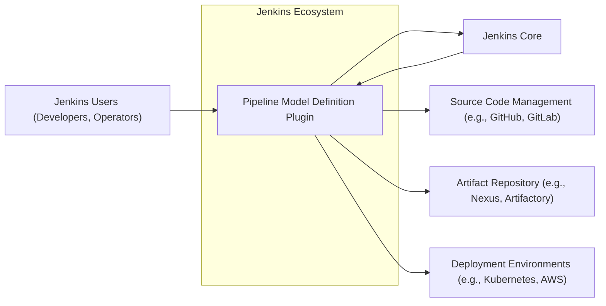
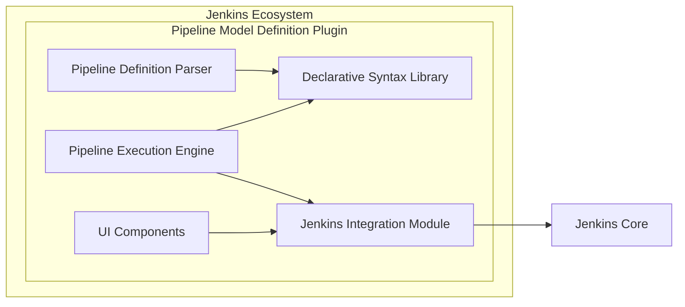
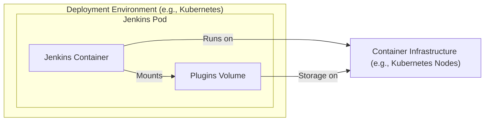
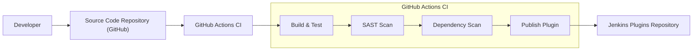

# BUSINESS POSTURE

- Business Priorities and Goals:
  - Goal: Simplify and improve the definition and management of Jenkins pipelines.
  - Goal: Enhance the readability and maintainability of Jenkins pipelines through declarative syntax.
  - Goal: Increase the efficiency and reliability of software delivery processes by providing a robust pipeline definition mechanism.
  - Priority: Ensure the stability and security of the Jenkins Pipeline Model Definition Plugin as it is a core component for many Jenkins users' CI/CD workflows.
- Business Risks:
  - Risk: Vulnerabilities in the Pipeline Model Definition Plugin could lead to security breaches in CI/CD pipelines, compromising software delivery and potentially production environments.
  - Risk: Instability or bugs in the plugin could disrupt CI/CD pipelines, causing delays in software releases and impacting business operations.
  - Risk: Complexity in using or understanding the plugin could hinder adoption and reduce the intended benefits of simplified pipeline management.
  - Risk: Lack of compatibility with other Jenkins plugins or versions could create integration issues and limit the plugin's usability.

# SECURITY POSTURE

- Existing Security Controls:
  - security control: Jenkins core security features (authentication, authorization, access control) - Implemented in Jenkins core.
  - security control: Plugin security scanning by Jenkins project - Described in Jenkins documentation and plugin release process.
  - security control: Open source nature allowing community review - Implicit in the open source development model.
  - security control: Dependency scanning as part of Jenkins release process - Implemented in Jenkins release infrastructure.
- Accepted Risks:
  - accepted risk: Reliance on open-source dependencies which may contain vulnerabilities.
  - accepted risk: Potential for user-defined pipeline scripts to introduce security vulnerabilities if not properly written.
  - accepted risk: Complexity of pipeline configurations might lead to unintentional misconfigurations with security implications.
- Recommended Security Controls:
  - security control: Implement static analysis security testing (SAST) on the plugin code during development and build process.
  - security control: Implement dependency vulnerability scanning as part of the plugin build process and continuous monitoring.
  - security control: Provide clear documentation and best practices for users on writing secure pipeline definitions, including input validation and secrets management.
  - security control: Conduct regular security audits and penetration testing of the plugin.
- Security Requirements:
  - Authentication:
    - Requirement: The plugin should leverage Jenkins' existing authentication mechanisms.
    - Requirement: No new authentication mechanisms should be introduced by the plugin itself.
  - Authorization:
    - Requirement: The plugin should respect Jenkins' existing authorization model for pipeline access and execution.
    - Requirement: Pipeline definitions should not bypass Jenkins' authorization controls.
    - Requirement: Access to pipeline definition and execution should be role-based and configurable within Jenkins.
  - Input Validation:
    - Requirement: The plugin must validate pipeline definitions to prevent injection attacks and other vulnerabilities arising from malformed input.
    - Requirement: Validation should cover syntax, semantics, and resource usage within pipeline definitions.
    - Requirement: Error handling for invalid pipeline definitions should be robust and secure, avoiding information leakage.
  - Cryptography:
    - Requirement: The plugin should support secure handling of secrets within pipeline definitions, leveraging Jenkins' secrets management features.
    - Requirement: If the plugin handles any sensitive data internally, it should be encrypted at rest and in transit as appropriate.
    - Requirement: Avoid implementing custom cryptography; rely on well-vetted libraries and Jenkins' built-in capabilities.

# DESIGN

## C4 CONTEXT

- Context Diagram Elements:
  - - Name: Jenkins Users (Developers, Operators)
    - Type: Person
    - Description: Users who define, manage, and execute Jenkins pipelines using the Pipeline Model Definition Plugin. Includes developers creating pipelines and operators managing Jenkins and deployments.
    - Responsibilities: Define CI/CD pipelines, trigger pipeline executions, monitor pipeline status, manage Jenkins configurations.
    - Security controls: Authentication to Jenkins, Role-Based Access Control (RBAC) within Jenkins, secure storage of Jenkins credentials.
  - - Name: Pipeline Model Definition Plugin
    - Type: Software System
    - Description: Jenkins plugin that provides a declarative syntax for defining CI/CD pipelines. It parses pipeline definitions, executes pipeline stages, and integrates with Jenkins core and other systems.
    - Responsibilities: Parse declarative pipeline syntax, orchestrate pipeline execution, manage pipeline state, integrate with Jenkins core functionalities, provide UI for pipeline definition and monitoring.
    - Security controls: Input validation of pipeline definitions, authorization checks within pipeline execution, secure handling of credentials and secrets within pipelines, SAST and dependency scanning during plugin development.
  - - Name: Jenkins Core
    - Type: Software System
    - Description: The core Jenkins application that provides the foundation for CI/CD automation. It manages jobs, plugins, security, and overall system configuration.
    - Responsibilities: Job scheduling and execution, plugin management, user authentication and authorization, system configuration, event logging and auditing.
    - Security controls: Authentication and authorization mechanisms, access control lists, security realm configuration, audit logging, secure communication protocols (HTTPS).
  - - Name: Source Code Management (SCM) (e.g., GitHub, GitLab)
    - Type: External System
    - Description: Systems used to store and manage source code, including pipeline definitions. Jenkins retrieves pipeline definitions and source code from SCM systems.
    - Responsibilities: Version control of source code and pipeline definitions, access control to repositories, providing APIs for code retrieval and webhook integration.
    - Security controls: Authentication and authorization for repository access, secure communication protocols (HTTPS, SSH), access logging, branch protection policies.
  - - Name: Artifact Repository (e.g., Nexus, Artifactory)
    - Type: External System
    - Description: Systems used to store and manage build artifacts produced by CI/CD pipelines. Jenkins pipelines publish artifacts to and retrieve artifacts from artifact repositories.
    - Responsibilities: Storage and management of build artifacts, versioning of artifacts, access control to artifacts, providing APIs for artifact upload and download.
    - Security controls: Authentication and authorization for artifact access, secure communication protocols (HTTPS), access logging, artifact integrity checks (checksums).
  - - Name: Deployment Environments (e.g., Kubernetes, AWS)
    - Type: External System
    - Description: Target environments where applications are deployed by CI/CD pipelines. Jenkins pipelines deploy applications to various deployment environments.
    - Responsibilities: Hosting and running applications, providing APIs for application deployment and management, monitoring application health and performance.
    - Security controls: Access control to deployment environments, secure communication protocols (HTTPS, SSH), infrastructure security hardening, security monitoring and logging.

## C4 CONTAINER

- Container Diagram Elements:
  - - Name: Pipeline Definition Parser
    - Type: Container/Module
    - Description: Component responsible for parsing declarative pipeline definitions written in the plugin's syntax. It validates the syntax and structure of the pipeline definition.
    - Responsibilities: Syntax parsing, semantic validation, error reporting for invalid pipeline definitions.
    - Security controls: Input validation to prevent injection attacks, secure error handling to avoid information leakage.
  - - Name: Pipeline Execution Engine
    - Type: Container/Module
    - Description: Component that orchestrates the execution of pipeline stages based on the parsed pipeline definition. It interacts with Jenkins core to execute steps and manage pipeline state.
    - Responsibilities: Stage orchestration, step execution, state management, handling parallel execution, error handling during pipeline execution.
    - Security controls: Authorization checks before executing pipeline steps, secure handling of credentials and secrets during execution, resource management to prevent resource exhaustion.
  - - Name: Declarative Syntax Library
    - Type: Container/Module
    - Description: Library that defines the declarative syntax and grammar for pipeline definitions. It provides the building blocks for users to define pipelines in a structured and readable way.
    - Responsibilities: Defining pipeline syntax, providing validation rules, offering reusable pipeline components (stages, steps).
    - Security controls: Well-defined and documented syntax to minimize ambiguity and potential misinterpretations, secure design of syntax to avoid inherent vulnerabilities.
  - - Name: Jenkins Integration Module
    - Type: Container/Module
    - Description: Module that handles integration with Jenkins core functionalities. It uses Jenkins APIs to register pipeline types, manage jobs, and interact with Jenkins security and configuration settings.
    - Responsibilities: Plugin registration with Jenkins, job management, security context handling, configuration management, event handling.
    - Security controls: Secure use of Jenkins APIs, proper handling of Jenkins security context, adherence to Jenkins plugin security guidelines.
  - - Name: UI Components
    - Type: Container/Module
    - Description: User interface components that provide users with ways to define, visualize, and monitor pipelines. This includes UI elements within Jenkins web interface for pipeline editing and execution monitoring.
    - Responsibilities: Pipeline definition UI, pipeline visualization, execution monitoring UI, user interaction handling.
    - Security controls: Input validation in UI forms, protection against Cross-Site Scripting (XSS) vulnerabilities, secure session management, authorization checks for UI actions.

## DEPLOYMENT

- Deployment Architecture Options:
  - Option 1: Jenkins deployed on bare metal servers, plugins deployed within Jenkins instance.
  - Option 2: Jenkins deployed in containers (e.g., Docker), plugins deployed within Jenkins container.
  - Option 3: Jenkins deployed on cloud platforms (e.g., AWS, Azure, GCP), plugins deployed within Jenkins instance/container on cloud.

- Detailed Deployment Architecture (Option 2 - Jenkins deployed in containers):

- Deployment Diagram Elements:
  - - Name: Jenkins Container
    - Type: Container
    - Description: Docker container running the Jenkins application. It includes the Jenkins core and all installed plugins, including the Pipeline Model Definition Plugin.
    - Responsibilities: Running Jenkins application, executing CI/CD pipelines, managing plugins, providing web interface.
    - Security controls: Container image security scanning, least privilege container execution, network policies to restrict container access, resource limits to prevent resource exhaustion.
  - - Name: Plugins Volume
    - Type: Volume
    - Description: Persistent volume mounted to the Jenkins container to store Jenkins plugins. This ensures plugins persist across container restarts.
    - Responsibilities: Persistent storage for Jenkins plugins, ensuring plugin availability after container restarts.
    - Security controls: Access control to the volume storage, encryption at rest for sensitive plugin data (if applicable), regular backups of the volume.
  - - Name: Container Infrastructure (e.g., Kubernetes Nodes)
    - Type: Infrastructure
    - Description: Underlying infrastructure that hosts the Jenkins container, such as Kubernetes nodes or Docker hosts. Provides compute, network, and storage resources.
    - Responsibilities: Providing runtime environment for containers, resource management, network connectivity, storage provisioning.
    - Security controls: Infrastructure security hardening, operating system security patching, network security controls (firewalls, network segmentation), access control to infrastructure resources.

## BUILD

- Build Process Elements:
  - - Name: Developer
    - Type: Person
    - Description: Software developer who writes code for the Pipeline Model Definition Plugin, including bug fixes, new features, and security patches.
    - Responsibilities: Writing code, committing code to source code repository, creating pull requests, addressing code review feedback.
    - Security controls: Secure development environment, code review process, security awareness training.
  - - Name: Source Code Repository (GitHub)
    - Type: System
    - Description: GitHub repository hosting the source code of the Pipeline Model Definition Plugin. Used for version control, collaboration, and triggering CI builds.
    - Responsibilities: Storing source code, managing branches and tags, providing pull request functionality, triggering webhooks for CI.
    - Security controls: Access control to the repository, branch protection policies, audit logging, secure communication protocols (HTTPS, SSH).
  - - Name: GitHub Actions CI
    - Type: System
    - Description: GitHub Actions workflow configured to automatically build, test, scan, and publish the Pipeline Model Definition Plugin upon code changes.
    - Responsibilities: Automated build process, running tests, performing security scans, publishing plugin artifacts.
    - Security controls: Secure CI/CD pipeline configuration, secret management for CI credentials, access control to CI workflows and logs, build artifact integrity checks.
  - - Name: Build & Test
    - Type: Build Step
    - Description: Step in the CI pipeline that compiles the plugin code, runs unit tests, and performs integration tests to ensure code quality and functionality.
    - Responsibilities: Code compilation, unit testing, integration testing, generating build artifacts.
    - Security controls: Secure build environment, dependency management, test case coverage, build process isolation.
  - - Name: SAST Scan
    - Type: Build Step
    - Description: Static Application Security Testing (SAST) scan performed on the plugin source code to identify potential security vulnerabilities before runtime.
    - Responsibilities: Static code analysis, vulnerability detection, reporting identified vulnerabilities.
    - Security controls: Regularly updated SAST scanner, configuration of relevant security rules, vulnerability triage and remediation process.
  - - Name: Dependency Scan
    - Type: Build Step
    - Description: Dependency vulnerability scanning to identify known vulnerabilities in third-party libraries and dependencies used by the plugin.
    - Responsibilities: Dependency analysis, vulnerability database lookup, reporting vulnerable dependencies.
    - Security controls: Regularly updated vulnerability database, automated dependency scanning, vulnerability remediation process, dependency update strategy.
  - - Name: Publish Plugin
    - Type: Build Step
    - Description: Step in the CI pipeline that publishes the built plugin artifact to the Jenkins Plugins Repository, making it available for Jenkins users to install.
    - Responsibilities: Packaging plugin artifact, signing plugin artifact, uploading plugin artifact to repository.
    - Security controls: Secure artifact signing process, secure communication with plugin repository, access control to plugin repository, artifact integrity verification.
  - - Name: Jenkins Plugins Repository
    - Type: System
    - Description: Official repository for Jenkins plugins, where the Pipeline Model Definition Plugin is published and distributed to Jenkins users.
    - Responsibilities: Hosting Jenkins plugins, providing plugin download service, managing plugin metadata, verifying plugin integrity.
    - Security controls: Plugin signing verification, malware scanning of plugins, access control to plugin repository management, secure plugin distribution infrastructure.

# RISK ASSESSMENT

- Critical Business Processes:
  - Software Development and Delivery: The plugin is crucial for defining and executing CI/CD pipelines, which are essential for automating software development, testing, and deployment processes. Disruption or compromise of the plugin can directly impact the speed and reliability of software releases.
  - Security Patching and Updates: Pipelines are often used to automate the deployment of security patches and updates. A compromised pipeline or plugin could hinder or sabotage these critical security operations.
- Data Sensitivity:
  - Pipeline Definitions: Pipeline definitions themselves can contain sensitive information, such as credentials, API keys, and configuration details. Exposure of these definitions could lead to unauthorized access and system compromise.
  - Source Code: Pipelines often interact with source code repositories. While the plugin itself doesn't directly store source code, vulnerabilities could be exploited to gain access to or modify source code through pipeline execution.
  - Build Artifacts: Pipelines produce build artifacts, which may contain sensitive data or vulnerabilities if the build process is compromised.
  - Credentials and Secrets: Pipelines frequently manage and use credentials and secrets for accessing various systems and services. Secure handling of these secrets within pipeline definitions and execution is paramount.

# QUESTIONS & ASSUMPTIONS

- Questions:
  - What specific SAST and dependency scanning tools are currently used in the Jenkins Pipeline Model Definition Plugin build process?
  - Are there regular security audits or penetration testing performed on the plugin?
  - What is the process for handling and remediating security vulnerabilities identified in the plugin or its dependencies?
  - What are the guidelines and best practices provided to users for writing secure pipeline definitions using this plugin?
  - How are secrets managed within pipeline definitions when using this plugin, and what are the recommended approaches?
- Assumptions:
  - Assumption: The Jenkins environment where this plugin is deployed already has basic security controls in place, such as authentication and authorization.
  - Assumption: Users of the plugin are expected to have a basic understanding of security best practices for CI/CD pipelines.
  - Assumption: The plugin is intended to be used within a reasonably secure network environment.
  - Assumption: The Jenkins Plugins Repository has its own security measures to ensure the integrity and safety of plugins distributed through it.
  - Assumption: The development team for the Pipeline Model Definition Plugin follows secure coding practices and is responsive to security vulnerability reports.