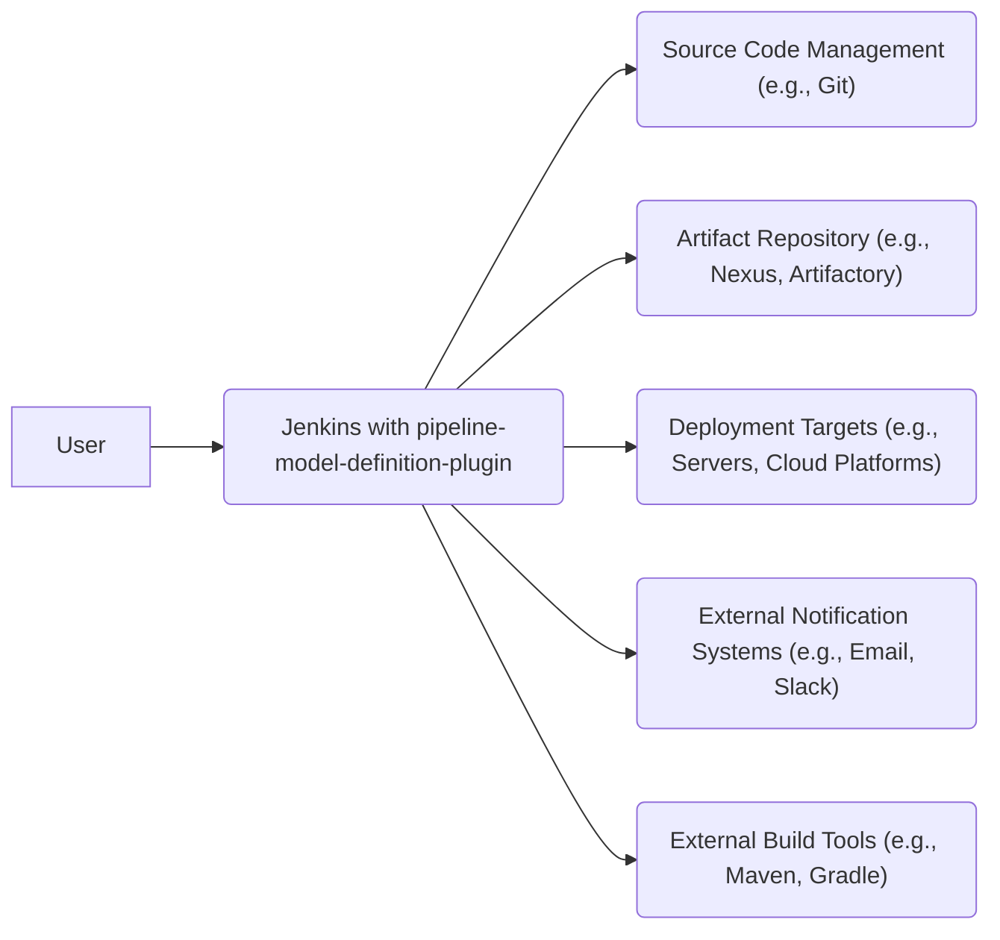
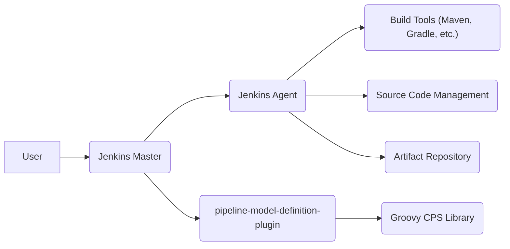
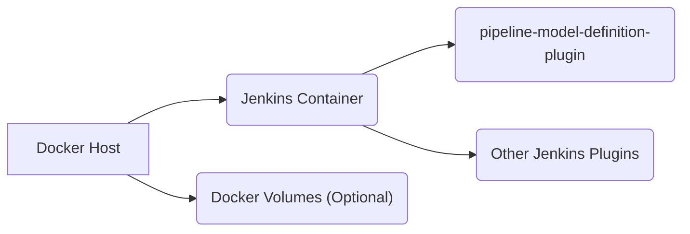
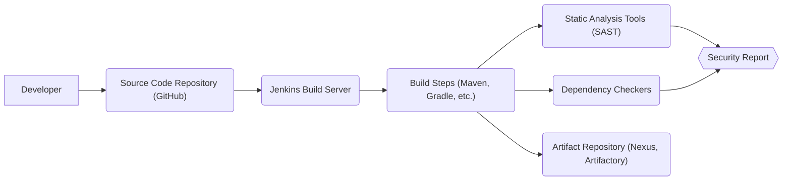

Okay, let's create a design document for the Jenkins `pipeline-model-definition-plugin` based on the provided GitHub repository.

# BUSINESS POSTURE

Business Priorities and Goals:

*   Enable Jenkins users to define their build pipelines as code in a structured, declarative manner.
*   Improve the maintainability and readability of Jenkins pipelines.
*   Provide a more robust and less error-prone way to define pipelines compared to traditional freestyle Jenkins jobs or scripted pipelines.
*   Facilitate pipeline reuse and standardization across projects.
*   Enhance the overall developer experience for building and deploying software with Jenkins.

Most Important Business Risks:

*   Malicious or poorly written pipeline definitions could compromise the Jenkins server or connected systems.
*   Vulnerabilities in the plugin or its dependencies could be exploited to gain unauthorized access or execute arbitrary code.
*   Inadequate validation of pipeline definitions could lead to unexpected behavior or build failures.
*   Lack of proper access controls could allow unauthorized users to modify or execute pipelines.
*   Complexity of the declarative pipeline syntax could hinder adoption or lead to misconfigurations.

# SECURITY POSTURE

Existing Security Controls:

*   security control: Jenkins core security features: The plugin relies on Jenkins' core security mechanisms, including authentication, authorization, and CSRF protection. (Described in Jenkins documentation)
*   security control: Groovy sandboxing: Declarative pipelines, like scripted pipelines, execute within a Groovy sandbox to limit the capabilities of the script and prevent malicious code execution. (Described in Jenkins documentation)
*   security control: Input validation: The plugin performs some level of input validation on the declarative pipeline syntax to prevent common errors. (Implemented within the plugin's parsing logic)
*   security control: Code reviews: The plugin's codebase is subject to code reviews on GitHub to identify potential security vulnerabilities. (Visible in the GitHub repository's pull requests)

Accepted Risks:

*   accepted risk: Reliance on Groovy sandbox: While the Groovy sandbox provides a layer of security, it is not foolproof and vulnerabilities have been discovered in the past.
*   accepted risk: User-provided scripts: Even with the declarative syntax, users can still include script blocks, which could potentially contain malicious code.
*   accepted risk: Dependency vulnerabilities: The plugin depends on various libraries, which could have their own security vulnerabilities.

Recommended Security Controls:

*   security control: Implement more robust input validation and sanitization to prevent injection attacks.
*   security control: Regularly update dependencies to address known vulnerabilities.
*   security control: Integrate static analysis tools (SAST) into the build process to identify potential security issues in the plugin's code.
*   security control: Conduct regular security audits and penetration testing to identify and address vulnerabilities.
*   security control: Provide clear documentation and guidelines on secure pipeline development practices.

Security Requirements:

*   Authentication:
    *   Users must be authenticated before they can interact with the plugin or execute pipelines.
    *   Support for various authentication mechanisms (e.g., LDAP, Active Directory, built-in Jenkins user database).
*   Authorization:
    *   Access to pipelines and their execution should be controlled based on user roles and permissions.
    *   Granular control over who can create, modify, and execute pipelines.
*   Input Validation:
    *   All input from the declarative pipeline syntax should be validated to prevent injection attacks and other vulnerabilities.
    *   Strict validation of script blocks to minimize the risk of malicious code execution.
*   Cryptography:
    *   Sensitive data (e.g., credentials) used in pipelines should be stored and transmitted securely.
    *   Support for encryption of data at rest and in transit.

# DESIGN

## C4 CONTEXT

Element Descriptions:

*   Element:
    *   Name: User
    *   Type: Person
    *   Description: A developer or operator interacting with Jenkins to define, manage, and execute pipelines.
    *   Responsibilities: Creating, modifying, and executing pipelines; viewing build results; managing Jenkins configuration.
    *   Security controls: Authentication, Authorization.
*   Element:
    *   Name: Jenkins with pipeline-model-definition-plugin
    *   Type: Software System
    *   Description: The Jenkins server with the `pipeline-model-definition-plugin` installed.
    *   Responsibilities: Executing pipelines; managing build artifacts; interacting with external systems.
    *   Security controls: Groovy sandboxing, Input validation, Jenkins core security features.
*   Element:
    *   Name: Source Code Management (e.g., Git)
    *   Type: Software System
    *   Description: A system for storing and managing source code.
    *   Responsibilities: Providing source code to Jenkins for builds.
    *   Security controls: Access controls, SSH key authentication, repository integrity checks.
*   Element:
    *   Name: Artifact Repository (e.g., Nexus, Artifactory)
    *   Type: Software System
    *   Description: A system for storing and managing build artifacts.
    *   Responsibilities: Storing build outputs; providing artifacts for deployment.
    *   Security controls: Access controls, artifact signing, vulnerability scanning.
*   Element:
    *   Name: Deployment Targets (e.g., Servers, Cloud Platforms)
    *   Type: Software System
    *   Description: The environments where the built software is deployed.
    *   Responsibilities: Running the deployed software.
    *   Security controls: Network security, access controls, system hardening.
*   Element:
    *   Name: External Notification Systems (e.g., Email, Slack)
    *   Type: Software System
    *   Description: Systems used to send notifications about build status and other events.
    *   Responsibilities: Sending notifications to users.
    *   Security controls: API keys, secure communication channels.
*   Element:
    *   Name: External Build Tools (e.g., Maven, Gradle)
    *   Type: Software System
    *   Description: Tools used to build the software.
    *   Responsibilities: Compiling code, running tests, packaging artifacts.
    *   Security controls: Secure configuration, dependency management.

## C4 CONTAINER

Element Descriptions:

*   Element:
    *   Name: User
    *   Type: Person
    *   Description: A developer or operator interacting with Jenkins.
    *   Responsibilities: Creating, modifying, and executing pipelines; viewing build results.
    *   Security controls: Authentication, Authorization.
*   Element:
    *   Name: Jenkins Master
    *   Type: Web Application
    *   Description: The main Jenkins server process.
    *   Responsibilities: Handling user requests; scheduling builds; managing agents; storing build results.
    *   Security controls: Jenkins core security features, access controls.
*   Element:
    *   Name: Jenkins Agent
    *   Type: Application
    *   Description: A process that executes build steps.
    *   Responsibilities: Running build commands; interacting with external systems.
    *   Security controls: Agent-to-master security, sandboxing.
*   Element:
    *   Name: pipeline-model-definition-plugin
    *   Type: Jenkins Plugin
    *   Description: The plugin that provides the declarative pipeline functionality.
    *   Responsibilities: Parsing declarative pipeline syntax; converting it to executable steps; managing pipeline execution.
    *   Security controls: Input validation, Groovy sandboxing.
*   Element:
    *   Name: Groovy CPS Library
    *   Type: Library
    *   Description: A library that provides the underlying execution engine for Groovy-based pipelines.
    *   Responsibilities: Executing Groovy code in a continuation-passing style.
    *   Security controls: Groovy sandboxing.
*   Element:
    *   Name: Build Tools (Maven, Gradle, etc.)
    *   Type: Application
    *   Description: Tools used to build the software.
    *   Responsibilities: Compiling code, running tests, packaging artifacts.
    *   Security controls: Secure configuration, dependency management.
*   Element:
    *   Name: Source Code Management
    *   Type: Software System
    *   Description: System to store and manage source code.
    *   Responsibilities: Providing source code.
    *   Security controls: Access controls.
*   Element:
    *   Name: Artifact Repository
    *   Type: Software System
    *   Description: System to store and manage build artifacts.
    *   Responsibilities: Storing and retrieving artifacts.
    *   Security controls: Access controls.

## DEPLOYMENT

Possible Deployment Solutions:

1.  Traditional WAR deployment: Jenkins is deployed as a WAR file within a Java application server (e.g., Tomcat, Jetty).
2.  Standalone JAR deployment: Jenkins is run as a standalone executable JAR file.
3.  Docker container deployment: Jenkins is run within a Docker container.
4.  Kubernetes deployment: Jenkins is deployed as a set of pods within a Kubernetes cluster.

Chosen Deployment Solution (Docker):

Element Descriptions:

*   Element:
    *   Name: Docker Host
    *   Type: Infrastructure Node
    *   Description: The physical or virtual machine that runs the Docker engine.
    *   Responsibilities: Running Docker containers.
    *   Security controls: Operating system security, Docker daemon security.
*   Element:
    *   Name: Jenkins Container
    *   Type: Container
    *   Description: The Docker container that runs the Jenkins instance.
    *   Responsibilities: Running the Jenkins master process.
    *   Security controls: Container isolation, image security.
*   Element:
    *   Name: pipeline-model-definition-plugin
    *   Type: Jenkins Plugin
    *   Description: The plugin installed within the Jenkins container.
    *   Responsibilities: Providing declarative pipeline functionality.
    *   Security controls: Plugin security, input validation.
*   Element:
    *   Name: Other Jenkins Plugins
    *   Type: Jenkins Plugin
    *   Description: Other plugins installed within the Jenkins container.
    *   Responsibilities: Providing additional functionality to Jenkins.
    *   Security controls: Plugin security.
*   Element:
    *   Name: Docker Volumes (Optional)
    *   Type: Storage
    *   Description: Persistent storage for Jenkins data (e.g., jobs, plugins, build history).
    *   Responsibilities: Storing Jenkins data.
    *   Security controls: Access controls, encryption.

## BUILD

Build Process Description:

1.  Developer commits code changes to the source code repository (GitHub).
2.  A webhook triggers a build on the Jenkins build server.
3.  Jenkins checks out the code from the repository.
4.  Build steps (defined in the `Jenkinsfile` or plugin configuration) are executed. These steps may include:
    *   Compiling code using build tools like Maven or Gradle.
    *   Running unit and integration tests.
    *   Performing static analysis (SAST) to identify potential security vulnerabilities.
    *   Checking dependencies for known vulnerabilities.
5.  Build artifacts are published to an artifact repository (e.g., Nexus, Artifactory).
6.  Security reports from SAST and dependency checkers are generated and reviewed.

Security Controls:

*   security control: Source code management security: Access controls and branch protection rules on the GitHub repository.
*   security control: Build automation: Using Jenkins to automate the build process ensures consistency and reduces the risk of manual errors.
*   security control: Static analysis (SAST): Integrating SAST tools into the build process helps identify potential security vulnerabilities in the plugin's code.
*   security control: Dependency checking: Using tools to check for known vulnerabilities in dependencies helps prevent the introduction of vulnerable code.
*   security control: Secure build environment: The Jenkins build server should be configured securely, with appropriate access controls and security hardening measures.
*   security control: Artifact signing: Signing build artifacts can help ensure their integrity and authenticity.

# RISK ASSESSMENT

Critical Business Processes:

*   Continuous Integration and Continuous Delivery (CI/CD) pipeline: The plugin is a critical component of the CI/CD pipeline, and its failure or compromise could disrupt the software delivery process.
*   Software build and deployment: The plugin is responsible for building and deploying software, and any vulnerabilities could be exploited to deploy malicious code.

Data Sensitivity:

*   Source code: The plugin has access to the source code of the projects being built, which may contain sensitive information or intellectual property. (High Sensitivity)
*   Build artifacts: The plugin handles build artifacts, which may contain sensitive data or be used to deploy malicious code. (High Sensitivity)
*   Credentials: The plugin may use credentials to access external systems (e.g., source code repositories, artifact repositories, deployment targets). (High Sensitivity)
*   Build logs: Build logs may contain sensitive information, such as environment variables or stack traces. (Medium Sensitivity)
*   Jenkins configuration: The plugin's configuration may contain sensitive information, such as API keys or access tokens. (High Sensitivity)

# QUESTIONS & ASSUMPTIONS

Questions:

*   What specific security standards or compliance requirements (e.g., OWASP, PCI DSS) must the plugin adhere to?
*   What is the expected threat model for the plugin? (e.g., Who are the potential attackers, and what are their motivations?)
*   What are the specific security requirements for integrating with external systems (e.g., authentication, authorization, encryption)?
*   Are there any existing security policies or guidelines that should be followed?
*   What level of logging and auditing is required for the plugin's activities?

Assumptions:

*   BUSINESS POSTURE: The primary goal is to provide a secure and reliable way to define Jenkins pipelines as code.
*   SECURITY POSTURE: Jenkins core security features are properly configured and maintained. The Groovy sandbox is considered a sufficient security measure, but its limitations are acknowledged.
*   DESIGN: The plugin will be deployed in a secure environment, with appropriate network security and access controls. The build process will include security checks, such as SAST and dependency scanning.