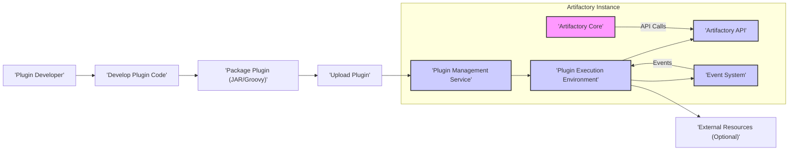
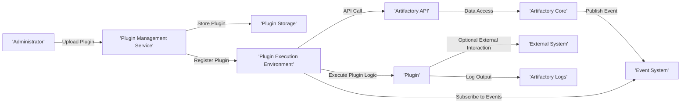

# Project Design Document: Artifactory User Plugins

**Version:** 1.1
**Date:** October 26, 2023
**Author:** AI Software Architect

## 1. Introduction

This document provides an enhanced and more detailed design overview of the Artifactory User Plugins project, based on the repository found at [https://github.com/jfrog/artifactory-user-plugins](https://github.com/jfrog/artifactory-user-plugins). This document aims to clearly articulate the system's architecture, components, and data flow, making it suitable for subsequent threat modeling activities. This revision builds upon the initial design by providing more specific examples and elaborating on key processes.

## 2. Goals

*   Clearly define the architecture and components of the Artifactory User Plugins system with greater detail.
*   Describe the key interactions and data flows within the system, including specific examples.
*   Provide sufficient detail to enable effective threat identification and risk assessment, offering concrete scenarios.
*   Serve as a comprehensive reference point for understanding the system's design and security considerations.

## 3. Scope

This document covers the design of the Artifactory User Plugins system, focusing on the following aspects:

*   Plugin development environment and packaging standards.
*   Plugin deployment and management workflows within Artifactory, including user roles.
*   Plugin execution lifecycle and interaction patterns with Artifactory's internal systems.
*   The overall architecture and key components involved, with a focus on their responsibilities.

This document does not cover:

*   The intricate internal implementation details of Artifactory itself, beyond its direct interaction with the plugin system.
*   The specific implementation of individual user plugins or their business logic.
*   The low-level code details of the plugin framework implementation.

## 4. High-Level Architecture

The Artifactory User Plugins system empowers users to extend Artifactory's core functionalities by developing and deploying custom plugins. These plugins can interact with Artifactory's internal APIs and event system to automate tasks, integrate with external systems, and customize behavior.

**Components:**

*   **Artifactory Core:** The central application responsible for managing artifacts, handling security, and providing core repository functionalities. It exposes internal APIs for interaction.
*   **Plugin Management Service:** A dedicated service within Artifactory that handles the entire lifecycle of user plugins. This includes uploading, validating, storing, deploying, enabling, disabling, and deleting plugins. It often provides a UI and API for these operations.
*   **Plugin Execution Environment:**  A secure and isolated environment where user plugins are executed. This is typically a sandboxed JVM process or a similar mechanism to prevent plugins from negatively impacting Artifactory's stability or security.
*   **Artifactory API:** A well-defined set of internal APIs (likely RESTful or Java-based) that plugins can utilize to interact with Artifactory's data and functionalities. This allows plugins to perform actions like retrieving artifact metadata, triggering builds, or managing repositories.
*   **Event System:** An internal publish/subscribe mechanism within Artifactory that allows plugins to subscribe to and react to various events occurring within the system. Examples include artifact deployment, deletion, or promotion events.
*   **Plugin Developer:** The individual or team responsible for creating the custom plugin code to extend Artifactory's capabilities.
*   **Develop Plugin Code:** The process of writing the plugin's logic, typically using Groovy or Java, adhering to the plugin framework's specifications and utilizing the Artifactory API.
*   **Package Plugin (JAR/Groovy):** The step where the developed plugin code and any necessary dependencies are packaged into a deployable artifact. This could be a single Groovy script or a JAR file containing compiled Java classes and a plugin descriptor.
*   **Upload Plugin:** The action of transferring the packaged plugin artifact to the Artifactory instance, typically through the administrative UI or a dedicated API endpoint.
*   **External Resources (Optional):**  External systems, databases, or services that a plugin might need to interact with to fulfill its functionality. For example, a plugin might integrate with a vulnerability scanning tool or a notification service.

## 5. Detailed Design

### 5.1. Plugin Development and Packaging

*   Plugin developers utilize a Software Development Kit (SDK) or well-documented APIs provided by Artifactory to build plugins.
*   Plugins are primarily developed using Groovy for scripting flexibility or Java for more complex functionalities and performance.
*   Plugins can leverage Artifactory's internal libraries and dependencies, but care must be taken to avoid conflicts.
*   Packaging involves creating either:
    *   A self-contained Groovy script file with a specific naming convention.
    *   A JAR file containing compiled Java classes, a `plugin.yaml` or similar descriptor file, and any required third-party libraries.
*   The plugin descriptor file is crucial, defining:
    *   Plugin name and version.
    *   Entry point class or script.
    *   Dependencies (if any).
    *   Permissions required by the plugin.
    *   Event listeners or scheduled tasks the plugin registers.

### 5.2. Plugin Deployment and Management

*   Artifactory administrators with specific privileges are responsible for deploying and managing plugins.
*   Plugin deployment typically involves uploading the packaged plugin file through the Artifactory Administration UI or a dedicated REST API endpoint.
*   Upon upload, the Plugin Management Service performs several validation checks:
    *   Verifying the plugin descriptor file's syntax and content.
    *   Checking for duplicate plugin IDs or conflicting dependencies.
    *   Potentially scanning the plugin for known vulnerabilities or malicious patterns.
*   The validated plugin is stored in a secure location within the Artifactory file system or database.
*   Administrators can then enable or disable plugins through the UI or API.
*   Enabling a plugin typically involves:
    *   Loading the plugin into the Plugin Execution Environment.
    *   Registering any event listeners or scheduled tasks defined by the plugin.
    *   Making the plugin's functionalities available within Artifactory.
*   Disabling a plugin reverses this process, stopping its execution and potentially releasing resources.

### 5.3. Plugin Execution

*   Plugins are executed in response to various triggers:
    *   **Event-driven:** When a specific event occurs within Artifactory (e.g., an artifact is deployed), and the plugin has registered a listener for that event.
    *   **Scheduled tasks:** Plugins can define tasks to be executed at specific intervals or times.
    *   **API calls:**  Artifactory might expose API endpoints that, when called, trigger the execution of a specific plugin function.
*   The Plugin Execution Environment manages the execution of plugin code, providing a degree of isolation from the core Artifactory process.
*   Plugins interact with Artifactory primarily through the documented Artifactory API, ensuring controlled access to internal functionalities.
*   When an event triggers a plugin, the Event System dispatches the event data to the registered plugin.
*   Plugins can perform various actions, such as:
    *   Modifying artifact metadata.
    *   Triggering external notifications.
    *   Enforcing custom security policies.
    *   Integrating with external systems.
*   The execution environment typically enforces resource limits (e.g., CPU time, memory usage) to prevent misbehaving plugins from impacting Artifactory's performance.
*   Logging and monitoring of plugin execution are crucial for debugging and auditing.

### 5.4. Data Flow

The primary data flows within the Artifactory User Plugins system include:

*   **Plugin Package Upload:** An administrator uploads a packaged plugin (JAR or Groovy script) to the Artifactory instance via the UI or API.
*   **Plugin Configuration Storage:** Plugin metadata (from the descriptor file) and configuration settings are stored within Artifactory's configuration database or file system.
*   **API Request/Response:** Plugins send requests to Artifactory's internal APIs to retrieve information (e.g., artifact properties) or perform actions (e.g., deploy an artifact). Artifactory responds with the requested data or status of the action.
*   **Event Publication and Consumption:** Artifactory Core or other internal services publish events to the Event System. Enabled plugins that have subscribed to these events receive the event data.
*   **Plugin Output (Logs, Metrics):** Plugins may generate logs that are written to Artifactory's log files or a dedicated plugin log. They might also emit metrics that are collected by Artifactory's monitoring system.
*   **Interaction with External Systems:** Plugins might send data to or receive data from external systems based on their functionality (e.g., sending notifications via email, retrieving data from a database).

## 6. Security Considerations

This section provides a more detailed breakdown of potential security considerations relevant to the Artifactory User Plugins system, categorized for clarity.

**6.1. Plugin Origin and Integrity:**

*   **Untrusted Sources:** Plugins could originate from untrusted sources, potentially containing malicious code.
*   **Tampering:** Uploaded plugin packages could be tampered with during transit or storage.
*   **Lack of Code Signing:** Absence of digital signatures makes it difficult to verify the plugin's author and ensure its integrity.

**6.2. Malicious Plugin Behavior:**

*   **Code Injection/Execution:** Malicious plugins could attempt to inject code into Artifactory's core processes or execute arbitrary commands on the server.
*   **Data Exfiltration:** Plugins could be designed to steal sensitive data stored within Artifactory or accessible through its APIs.
*   **Denial of Service (DoS):**  Plugins could consume excessive resources (CPU, memory, network) to disrupt Artifactory's availability.
*   **Privilege Escalation:**  Plugins might attempt to exploit vulnerabilities to gain elevated privileges within Artifactory or the underlying system.

**6.3. Plugin Vulnerabilities:**

*   **Coding Errors:** Poorly written plugins might contain security vulnerabilities (e.g., injection flaws, buffer overflows).
*   **Dependency Vulnerabilities:** Plugins might rely on vulnerable third-party libraries.
*   **Insecure Data Handling:** Plugins might mishandle sensitive data, leading to exposure or compromise.

**6.4. Access Control and Permissions:**

*   **Overly Permissive Plugins:** Plugins might request or be granted excessive permissions, allowing them to perform actions beyond their intended scope.
*   **Insufficient Permission Enforcement:** Artifactory might not adequately enforce the permissions granted to plugins.
*   **Bypassing Security Checks:** Malicious plugins might attempt to bypass Artifactory's security checks or authentication mechanisms.

**6.5. API and Event System Security:**

*   **API Abuse:** Plugins could misuse or abuse Artifactory's internal APIs to perform unauthorized actions.
*   **Event Injection/Manipulation:** Malicious plugins might attempt to inject or manipulate events within the Event System to trigger unintended behavior.
*   **Information Disclosure through APIs:**  APIs might inadvertently expose sensitive information to plugins.

**6.6. Resource Management:**

*   **Resource Exhaustion:**  Plugins could consume excessive resources, impacting the performance and stability of Artifactory.
*   **Lack of Resource Quotas:**  Absence of mechanisms to limit the resources consumed by individual plugins.

## 7. Deployment Considerations

*   Plugin deployment should be restricted to authorized administrators with specific roles and permissions.
*   A clear process for uploading, testing, and deploying plugins should be established.
*   Consider a staging environment for testing plugins before deploying them to production.
*   Implement version control for plugins to facilitate rollbacks if necessary.
*   Maintain comprehensive logging of plugin deployment, activation, and deactivation events.
*   Regularly review deployed plugins and their associated permissions.
*   Establish a process for reporting and addressing vulnerabilities found in user plugins.
*   Consider automated scanning of plugin packages for known vulnerabilities before deployment.

## 8. Future Considerations

*   **Enhanced Plugin Sandboxing:** Implement more robust and fine-grained sandboxing techniques to further isolate plugin execution and restrict their access to system resources and sensitive data.
*   **Mandatory Plugin Signing:** Require all plugins to be digitally signed by their developers to ensure authenticity and integrity, providing a chain of trust.
*   **Curated Plugin Marketplace:** Develop a secure and curated marketplace for sharing and discovering user plugins, with a thorough vetting process to minimize the risk of malicious plugins.
*   **Granular Permission Model:** Implement a more granular and flexible permission model for plugins, allowing administrators to precisely control the actions a plugin can perform.
*   **Plugin Resource Quotas:** Introduce mechanisms to define and enforce resource quotas (CPU, memory, network) for individual plugins to prevent resource exhaustion.
*   **Advanced Monitoring and Alerting:** Implement advanced monitoring and alerting capabilities to detect anomalous plugin behavior or potential security threats.
*   **Plugin Dependency Management:** Integrate a robust dependency management system to track and manage plugin dependencies, including vulnerability scanning of those dependencies.

This enhanced document provides a more detailed and comprehensive design overview of the Artifactory User Plugins system, making it even more suitable for thorough threat modeling activities. The added specifics and categorization of security considerations offer a clearer understanding of potential risks and vulnerabilities.