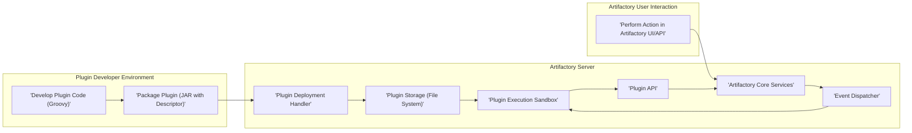
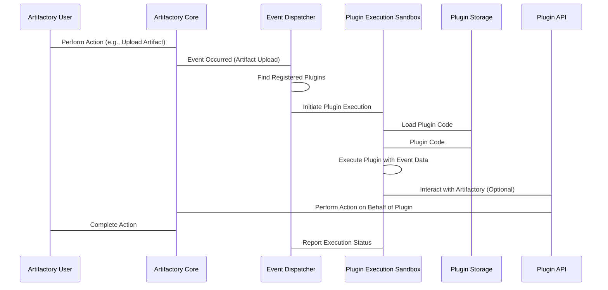

# Project Design Document: Artifactory User Plugins

**Version:** 1.1
**Date:** October 26, 2023
**Author:** AI Software Architecture Expert

## 1. Introduction

This document provides a detailed design of the Artifactory User Plugins project, as represented by the codebase at [https://github.com/jfrog/artifactory-user-plugins](https://github.com/jfrog/artifactory-user-plugins). This design serves as the foundation for subsequent threat modeling activities. The focus is on understanding the system's architecture, components, data flow, and interactions to identify potential security vulnerabilities. This revision aims to provide more detail and clarity compared to the previous version.

## 2. Goals

*   Clearly define the architecture and components of the Artifactory User Plugins system.
*   Describe the interactions between different components, including data exchange.
*   Outline the data flow within the system, emphasizing trigger points and transformations.
*   Provide a comprehensive overview for threat modeling purposes, including potential attack vectors.
*   Document key security considerations and the plugin security model.

## 3. Scope

This document covers the design of the Artifactory User Plugins system, including:

*   The plugin development lifecycle, from coding to packaging.
*   The plugin deployment mechanism and its security implications.
*   The plugin execution environment within Artifactory, including resource constraints.
*   The interaction between plugins and Artifactory's internal APIs.
*   The various types of events that can trigger plugin execution and their associated data.
*   The security model governing plugin execution and permissions.

This document does not cover:

*   The detailed internal architecture of Artifactory itself, beyond its direct interaction with plugins.
*   The specific implementation details of individual example plugins beyond illustrative purposes.
*   Low-level code implementation details within Artifactory or the plugin framework.

## 4. High-Level Architecture

The Artifactory User Plugins system enables users to extend the functionality of JFrog Artifactory by developing and deploying custom plugins. These plugins, primarily written in Groovy, are executed by Artifactory in response to specific system events.

**Components:**

*   **Plugin Developer Environment:** The environment where plugin developers write, test, and package their code.
    *   **Develop Plugin Code (Groovy):** The process of writing the custom logic using the Groovy programming language and Artifactory's plugin API.
    *   **Package Plugin (JAR with Descriptor):** The process of packaging the Groovy code, dependencies, and a plugin descriptor file (e.g., `plugin.yaml` or similar) into a JAR file. The descriptor defines metadata about the plugin, including event listeners.
*   **Artifactory Server:** The core Artifactory application hosting the plugin infrastructure.
    *   **Plugin Deployment Handler:** A service within Artifactory responsible for receiving, validating, and registering newly deployed plugins. This includes security checks and parsing the plugin descriptor.
    *   **Plugin Storage (File System):** The location on the Artifactory server's file system where deployed plugin JAR files are stored. Access to this location is typically restricted.
    *   **Event Dispatcher:** A component within Artifactory that monitors for various system events (e.g., artifact uploads, downloads, deletions, build promotions). It determines which plugins are registered to handle specific events.
    *   **Plugin Execution Sandbox:** A secure environment within the Artifactory JVM where plugin code is executed. This aims to provide isolation and prevent plugins from directly accessing or interfering with Artifactory's core operations or other plugins. Resource limits might be enforced here.
    *   **Artifactory Core Services:** The main application logic of Artifactory, providing functionalities like repository management, artifact storage, user authentication, and authorization.
    *   **Plugin API:** A set of interfaces and classes exposed by Artifactory that plugins can use to interact with the system. This API provides controlled access to Artifactory's functionalities.
*   **Artifactory User Interaction:** How users interact with Artifactory, potentially triggering plugin executions.
    *   **Perform Action in Artifactory UI/API:** Users interact with Artifactory through its user interface or REST API, performing actions that might trigger events.

## 5. Detailed Design

### 5.1 Plugin Development Lifecycle

*   **Coding:** Developers write plugins in Groovy, utilizing Artifactory's Plugin API. The API provides access to context information about the event, Artifactory services, and data.
*   **Configuration:** Plugins are configured via a descriptor file (e.g., `plugin.yaml`), specifying metadata like plugin name, version, description, and the events it listens to.
*   **Packaging:** The Groovy code, descriptor file, and any necessary dependencies are packaged into a JAR file.
*   **Testing:** Developers typically test their plugins in a local Artifactory instance or a dedicated testing environment before deploying to production.

### 5.2 Plugin Deployment Mechanism

*   **Initiation:** Plugin deployment is typically initiated by an administrator through the Artifactory UI or a dedicated API endpoint.
*   **Upload:** The plugin JAR file is uploaded to the Artifactory server.
*   **Validation:** The Plugin Deployment Handler performs several validation checks:
    *   **File Integrity:** Verifies the integrity of the uploaded JAR file.
    *   **Descriptor Parsing:** Parses the plugin descriptor file to extract metadata and event listeners.
    *   **Security Checks:** Potentially performs security scans or policy checks on the plugin code (depending on Artifactory configuration).
    *   **Dependency Analysis:** Checks for potential conflicts with existing libraries in Artifactory.
*   **Storage:** Upon successful validation, the plugin JAR is stored in the Plugin Storage. Access to this directory is restricted to the Artifactory process.
*   **Registration:** The Plugin Deployment Handler registers the plugin with the Event Dispatcher, associating it with the specified event listeners.
*   **Activation:** The plugin is typically activated immediately upon successful deployment, making it eligible for execution.

### 5.3 Plugin Execution Environment

*   **Event Trigger:** When an event occurs within Artifactory (e.g., an artifact is deployed), the Event Dispatcher identifies the plugins registered for that event.
*   **Sandbox Initialization:** The Plugin Execution Sandbox is initialized for the plugin execution. This might involve creating a separate classloader or using other isolation techniques.
*   **Code Loading:** The plugin's code is loaded from the Plugin Storage into the execution sandbox.
*   **Contextual Data:** Relevant data associated with the event is passed to the plugin as parameters. This might include information about the artifact, repository, user, and the event itself.
*   **Execution:** The plugin's `execute` method (or similar entry point) is invoked within the sandbox.
*   **API Interaction:** The plugin interacts with Artifactory through the provided Plugin API. This API enforces access controls and permissions.
*   **Resource Limits:** The Plugin Execution Sandbox might enforce resource limits (e.g., CPU time, memory usage) to prevent a plugin from monopolizing server resources.
*   **Logging:** Plugin execution activities are typically logged for auditing and debugging purposes.
*   **Error Handling:** Mechanisms are in place to handle exceptions and errors during plugin execution, preventing them from crashing the entire Artifactory instance.

### 5.4 Plugin Types and Event Triggers (Expanded)

Plugins can be triggered by a wide range of events, categorized as follows:

*   **Artifact Events:**
    *   `before`/`after` artifact upload
    *   `before`/`after` artifact download
    *   `before`/`after` artifact deletion
    *   `before`/`after` artifact property change
*   **Build Events:**
    *   `before`/`after` build promotion
    *   `before`/`after` build deletion
*   **Repository Events:**
    *   `before`/`after` repository creation
    *   `before`/`after` repository deletion
*   **Security Events:**
    *   User login/logout
    *   Permission changes
*   **Scheduled Events:**
    *   Plugins can be configured to run at specific intervals using a scheduler.
*   **Custom Events:** Artifactory might allow for the definition and triggering of custom events.

### 5.5 Data Flow (Detailed)

1. An **Artifactory User Interaction** triggers an action via the UI or API.
2. **Artifactory Core Services** process the action.
3. The **Event Dispatcher** intercepts relevant events generated by the Core Services.
4. The **Event Dispatcher** consults its registry to identify plugins subscribed to the specific event.
5. The **Event Dispatcher** signals the **Plugin Execution Sandbox** to initiate execution for each matching plugin.
6. The **Plugin Execution Sandbox** loads the plugin code from **Plugin Storage**.
7. The **Plugin Execution Sandbox** receives event-specific data from the **Event Dispatcher**.
8. The plugin code executes within the **Plugin Execution Sandbox**.
9. The plugin interacts with **Artifactory Core Services** via the **Plugin API** to perform actions or retrieve information.
10. **Artifactory Core Services** continue processing the original user action, potentially incorporating changes made by the plugin.
11. Execution results and logs are recorded.

## 6. Security Considerations (For Threat Modeling - Expanded)

This section highlights potential security areas and attack vectors that should be considered during threat modeling:

*   **Malicious Plugin Upload:**
    *   **Threat:** An attacker with sufficient privileges uploads a malicious plugin designed to compromise Artifactory.
    *   **Impact:** Full compromise of Artifactory, data breach, denial of service.
    *   **Mitigation:** Strong authentication and authorization for plugin deployment, code scanning of uploaded plugins.
*   **Plugin Code Exploits:**
    *   **Threat:** Vulnerabilities in the plugin code itself (e.g., injection flaws, insecure dependencies) are exploited.
    *   **Impact:** Unauthorized access, data manipulation, cross-site scripting (if plugins render UI).
    *   **Mitigation:** Secure coding practices for plugin developers, dependency scanning, sandboxing.
*   **Circumventing the Sandbox:**
    *   **Threat:** A sophisticated attacker finds a way to escape the Plugin Execution Sandbox and directly access the Artifactory server's resources or other plugins' data.
    *   **Impact:** Full compromise of Artifactory.
    *   **Mitigation:** Robust sandbox implementation, regular security audits of the sandbox environment.
*   **Abuse of Plugin API:**
    *   **Threat:** A plugin, either intentionally malicious or compromised, misuses the Artifactory Plugin API to perform unauthorized actions beyond its intended scope.
    *   **Impact:** Data modification, access to sensitive information, denial of service.
    *   **Mitigation:** Principle of least privilege for plugin permissions, thorough API access control.
*   **Resource Exhaustion by Plugins:**
    *   **Threat:** A poorly written or malicious plugin consumes excessive resources (CPU, memory, network), leading to a denial of service.
    *   **Impact:** Artifactory becomes unresponsive or crashes.
    *   **Mitigation:** Resource limits within the sandbox, monitoring of plugin resource usage.
*   **Data Leakage through Plugins:**
    *   **Threat:** A plugin intentionally or unintentionally leaks sensitive information (e.g., credentials, internal data) to external systems.
    *   **Impact:** Data breach, compliance violations.
    *   **Mitigation:** Secure coding practices, restrictions on external network access from plugins, data sanitization.
*   **Supply Chain Attacks on Plugins:**
    *   **Threat:** Dependencies used by plugins are compromised, introducing malicious code.
    *   **Impact:** Same as malicious plugin upload.
    *   **Mitigation:** Dependency scanning, using trusted repositories.

## 7. Plugin Security Model

*   **Sandboxing:** Plugins are executed within a sandbox environment to isolate them from the Artifactory core and other plugins.
*   **API-Based Interaction:** Plugins can only interact with Artifactory through the defined Plugin API, which enforces access controls.
*   **Permissions (Potentially):**  Future enhancements might include a permission model where plugins declare the Artifactory resources and actions they need access to.
*   **Code Scanning (Optional):** Artifactory might integrate with code scanning tools to analyze uploaded plugins for potential vulnerabilities.
*   **Administrator Control:** Administrators have the ability to deploy, enable, disable, and delete plugins.

## 8. Deployment Considerations

*   **Administrative Privileges:** Deploying plugins requires administrative privileges within Artifactory.
*   **Deployment Methods:** Plugins can be deployed via:
    *   The Artifactory UI (uploading the JAR file).
    *   The Artifactory REST API.
    *   Potentially through configuration management tools.
*   **Plugin Management Interface:** Artifactory provides an interface to manage deployed plugins (enable, disable, delete).
*   **Versioning:**  A mechanism for managing different versions of plugins is important for updates and rollbacks.
*   **Rollback:** The ability to easily rollback to a previous version of a plugin in case of issues.
*   **Monitoring and Logging:**  Logging of plugin deployment activities, execution, and errors is crucial for security and troubleshooting.

## 9. Future Considerations

*   **Enhanced Plugin API:** Expanding the Plugin API to provide access to more Artifactory functionalities.
*   **Fine-grained Permissions:** Implementing a more granular permission model for plugins.
*   **Improved Sandboxing Techniques:** Exploring more robust sandboxing technologies for enhanced security.
*   **Plugin Marketplace:** A potential future feature could be a marketplace for sharing and discovering plugins.
*   **Support for Additional Languages:**  Exploring support for other programming languages besides Groovy.
*   **Automated Testing Framework:** Providing a framework for developers to write automated tests for their plugins.

This revised design document provides a more detailed and comprehensive overview of the Artifactory User Plugins system, further enhancing its value for threat modeling activities. The added details on security considerations and the plugin security model offer a clearer picture of potential vulnerabilities and existing safeguards.