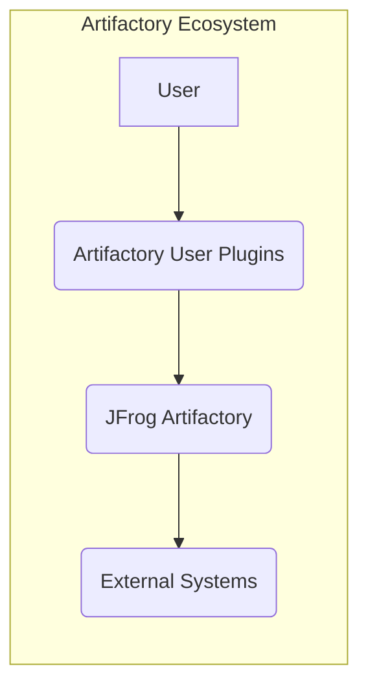
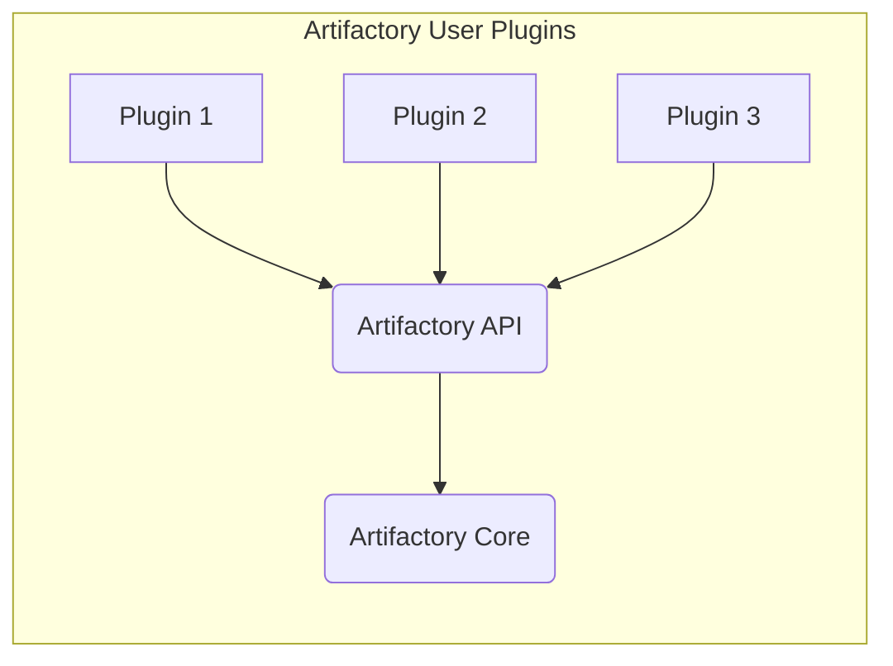
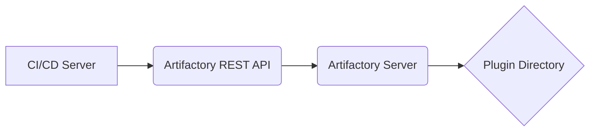
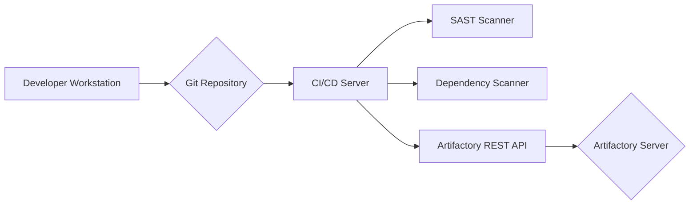

Okay, let's create a design document for the Artifactory User Plugins project.

# BUSINESS POSTURE

Business Priorities and Goals:

*   Enhance Extensibility: Allow users to customize and extend JFrog Artifactory's functionality without modifying the core application. This enables tailored workflows and integrations specific to an organization's needs.
*   Improve Operational Efficiency: Enable automation of tasks within Artifactory, reducing manual intervention and potential errors.
*   Maintain Core Stability: Provide a safe and controlled way to add functionality, ensuring that user-provided code does not compromise the stability or security of the main Artifactory instance.
*   Foster Community Contributions: Encourage a community around Artifactory where users can share and reuse plugins, accelerating innovation and problem-solving.
*   Reduce Vendor Lock-in: By allowing custom integrations, users can more easily connect Artifactory with other tools in their ecosystem, reducing reliance on a single vendor's solutions.

Most Important Business Risks:

*   Security Vulnerabilities in Plugins: User-developed plugins could introduce security vulnerabilities, potentially exposing sensitive data or compromising the Artifactory instance.
*   Performance Degradation: Poorly written plugins could negatively impact Artifactory's performance, leading to slowdowns or instability.
*   Maintenance Overhead: Managing a large number of plugins, especially those developed by third parties, could create a significant maintenance burden.
*   Compatibility Issues: Plugins might become incompatible with newer versions of Artifactory, requiring updates and potentially causing disruptions.
*   Lack of Support: Community-developed plugins might lack proper support, leaving users with unresolved issues.

# SECURITY POSTURE

Existing Security Controls:

*   security control: Plugin Isolation: Artifactory executes user plugins in a sandboxed environment (Groovy sandbox) to limit their access to the core system and prevent malicious or accidental damage. Described in repository README.md.
*   security control: Permission Control: Artifactory provides a mechanism to control which users and groups can deploy, execute, and manage plugins. Described in repository README.md.
*   security control: API for Auditing: Artifactory likely provides APIs or logging mechanisms to track plugin activity, aiding in auditing and incident response. (Assumption, needs verification).
*   security control: Code Review (Optional): Organizations can implement a code review process for internally developed plugins before deployment. This is a procedural control, not a technical one inherent to the project.

Accepted Risks:

*   accepted risk: Third-Party Plugin Risk: Users deploying plugins from untrusted sources accept the risk of potential vulnerabilities or malicious code within those plugins.
*   accepted risk: Plugin-Induced Instability: While the sandbox aims to mitigate this, there's an accepted risk that a poorly written plugin could still cause performance issues or instability in specific scenarios.

Recommended Security Controls:

*   security control: Static Code Analysis: Integrate static code analysis tools into the plugin development and deployment workflow to automatically scan for common vulnerabilities and coding errors.
*   security control: Dynamic Analysis: Consider implementing dynamic analysis (runtime testing) of plugins in a staging environment to identify potential security or performance issues before production deployment.
*   security control: Plugin Signing: Implement a mechanism to digitally sign plugins, allowing Artifactory to verify the authenticity and integrity of plugins before execution.
*   security control: Dependency Scanning: Scan plugin dependencies for known vulnerabilities.
*   security control: Content Trust: Enforce content trust to ensure that only signed and verified plugins can be executed.

Security Requirements:

*   Authentication:
    *   Plugins should leverage Artifactory's existing authentication mechanisms.  Plugins should not implement their own authentication.
    *   If a plugin interacts with external systems, it should use secure credential storage mechanisms (e.g., Artifactory's encrypted properties or a dedicated secrets management solution).

*   Authorization:
    *   Plugins should respect Artifactory's existing permission model.
    *   Plugins should implement granular authorization checks if they introduce new actions or resources.  Use the provided APIs to check user permissions.

*   Input Validation:
    *   Plugins must thoroughly validate all inputs received from users, other plugins, or external systems.
    *   Use whitelisting (allowlisting) rather than blacklisting (denylisting) whenever possible.
    *   Sanitize inputs to prevent injection attacks (e.g., cross-site scripting, SQL injection).

*   Cryptography:
    *   Plugins should use Artifactory's provided cryptographic libraries and APIs for any encryption, hashing, or digital signature needs.
    *   Avoid implementing custom cryptographic algorithms.
    *   Use secure random number generators.
    *   Store sensitive keys securely.

# DESIGN

## C4 CONTEXT

Element Descriptions:

*   Element:
    *   Name: User
    *   Type: Person
    *   Description: A user of JFrog Artifactory who interacts with the system and may utilize user plugins.
    *   Responsibilities: Interacting with Artifactory, deploying plugins, configuring plugins, triggering plugin actions.
    *   Security Controls: Authentication and authorization within Artifactory.

*   Element:
    *   Name: Artifactory User Plugins
    *   Type: Software System
    *   Description: The collection of user-developed plugins that extend Artifactory's functionality.
    *   Responsibilities: Executing custom logic, interacting with Artifactory APIs, interacting with external systems (if necessary).
    *   Security Controls: Plugin isolation (sandboxing), permission control, input validation, secure coding practices.

*   Element:
    *   Name: JFrog Artifactory
    *   Type: Software System
    *   Description: The core JFrog Artifactory binary repository manager.
    *   Responsibilities: Managing artifacts, providing access control, exposing APIs for plugin interaction.
    *   Security Controls: Artifactory's built-in security features, including authentication, authorization, access control, and auditing.

*   Element:
    *   Name: External Systems
    *   Type: Software System
    *   Description: Any external systems that plugins might interact with, such as build servers, notification services, or other applications.
    *   Responsibilities: Varies depending on the specific external system.
    *   Security Controls: Depend on the external system; plugins should use secure communication protocols and authentication mechanisms when interacting with them.

## C4 CONTAINER

Element Descriptions:

*   Element:
    *   Name: Plugin 1, Plugin 2, Plugin 3
    *   Type: Container (Groovy Script)
    *   Description: Individual user-developed plugins.  Each plugin is a separate Groovy script.
    *   Responsibilities: Implementing specific custom logic, interacting with the Artifactory API.
    *   Security Controls: Input validation, secure coding practices, adherence to Artifactory's security model.

*   Element:
    *   Name: Artifactory API
    *   Type: API
    *   Description: The set of APIs provided by Artifactory for plugins to interact with the core system.
    *   Responsibilities: Providing access to Artifactory's functionality, enforcing security controls.
    *   Security Controls: Authentication, authorization, input validation.

*   Element:
    *   Name: Artifactory Core
    *   Type: Container
    *   Description: The core functionality of JFrog Artifactory.
    *   Responsibilities: Managing artifacts, users, permissions, etc.
    *   Security Controls: Artifactory's built-in security features.

## DEPLOYMENT

Possible Deployment Solutions:

1.  Manual Deployment via Web UI: Users manually upload plugin scripts through the Artifactory web interface.
2.  Automated Deployment via REST API: Plugins are deployed using Artifactory's REST API, often as part of a CI/CD pipeline.
3.  Configuration Management Tools: Tools like Ansible, Chef, or Puppet can be used to manage plugin deployments.

Chosen Solution (for detailed description): Automated Deployment via REST API

Element Descriptions:

*   Element:
    *   Name: CI/CD Server
    *   Type: Server
    *   Description: A server running a CI/CD system (e.g., Jenkins, GitLab CI, GitHub Actions).
    *   Responsibilities: Building, testing, and deploying plugins.
    *   Security Controls: Access controls, secure credential management, secure communication with Artifactory.

*   Element:
    *   Name: Artifactory REST API
    *   Type: API
    *   Description: The REST API endpoint for deploying plugins to Artifactory.
    *   Responsibilities: Receiving plugin deployment requests, validating credentials, storing plugins.
    *   Security Controls: Authentication, authorization, input validation, TLS encryption.

*   Element:
    *   Name: Artifactory Server
    *   Type: Server
    *   Description: The server hosting the JFrog Artifactory instance.
    *   Responsibilities: Running Artifactory, managing plugins, serving artifacts.
    *   Security Controls: Server hardening, network security, Artifactory's built-in security features.

*   Element:
    *   Name: Plugin Directory
    *   Type: File System Directory
    *   Description: The directory on the Artifactory server where plugin scripts are stored.
    *   Responsibilities: Storing plugin files.
    *   Security Controls: File system permissions, access control lists.

## BUILD

Build Process Description:

1.  Developer: Developers write plugin code (Groovy scripts) and commit it to a Git repository.
2.  Git Repository: The source code for the plugins is stored in a version-controlled Git repository.
3.  CI/CD Server: A CI/CD server (e.g., Jenkins, GitLab CI) monitors the Git repository for changes. When a change is detected, it triggers a build pipeline.
4.  SAST Scanner: The build pipeline includes a static application security testing (SAST) step. A SAST tool (e.g., SonarQube, Fortify) scans the plugin code for potential vulnerabilities.
5.  Dependency Scanner: The build pipeline includes a dependency scanning step. A tool like JFrog Xray or Snyk scans the plugin's dependencies (if any) for known vulnerabilities.
6.  Artifactory REST API: If the SAST and dependency scans pass, the CI/CD server uses the Artifactory REST API to deploy the plugin to the Artifactory server.
7.  Artifactory Server: The Artifactory server receives the plugin and stores it in the designated plugin directory.

Security Controls:

*   security control: Source Code Management: Using a Git repository provides version control, audit trails, and access control for plugin code.
*   security control: CI/CD Pipeline: Automating the build and deployment process ensures consistency and reduces the risk of manual errors.
*   security control: SAST Scanning: Static code analysis helps identify vulnerabilities early in the development lifecycle.
*   security control: Dependency Scanning: Scanning dependencies helps prevent the use of vulnerable libraries.
*   security control: Secure Credentials: The CI/CD server should use secure credential management to store and access the Artifactory API credentials.
*   security control: Least Privilege: The CI/CD server should have only the necessary permissions to deploy plugins to Artifactory.

# RISK ASSESSMENT

Critical Business Processes:

*   Artifact Management: The core process of storing, retrieving, and managing software artifacts.
*   Build and Release Pipeline: The process of building and releasing software, which relies on Artifactory for artifact storage and dependency management.
*   Software Delivery: The overall process of delivering software to end-users, which depends on the availability and reliability of Artifactory.

Data to Protect:

*   Software Artifacts: These are the primary data stored in Artifactory. Their sensitivity varies greatly depending on the nature of the artifacts. They can range from public open-source libraries (low sensitivity) to proprietary source code and compiled binaries (high sensitivity).
*   Metadata: Artifactory stores metadata about artifacts, including version information, dependencies, and build details. This metadata can be sensitive, especially if it reveals information about internal development processes or vulnerabilities.
*   User Credentials: Artifactory stores user credentials and access tokens. These are highly sensitive and must be protected from unauthorized access.
*   Configuration Data: Artifactory's configuration data, including settings related to security, access control, and integrations, is sensitive and must be protected.
*   Logs: Artifactory's logs may contain sensitive information, such as user activity, IP addresses, and error messages that could reveal vulnerabilities.

Data Sensitivity Levels:

*   High: Proprietary source code, compiled binaries, user credentials, access tokens, sensitive configuration data.
*   Medium: Metadata about internal projects, build details, internal documentation.
*   Low: Publicly available open-source libraries, publicly available documentation.

# QUESTIONS & ASSUMPTIONS

Questions:

*   What specific APIs are available for plugins to interact with Artifactory?  A detailed API documentation reference is needed.
*   What are the exact limitations of the Groovy sandbox environment?  What system resources are restricted?
*   What logging and auditing capabilities are available for plugin activity?
*   Are there any existing performance benchmarks for Artifactory plugins?
*   What is the recommended approach for handling errors and exceptions within plugins?
*   What is the process for updating or undeploying plugins?
*   What is the versioning strategy for plugins?

Assumptions:

*   Assumption: Artifactory provides a robust API for plugins to interact with its core functionality.
*   Assumption: The Groovy sandbox effectively isolates plugins and prevents them from accessing sensitive system resources.
*   Assumption: Artifactory provides adequate logging and auditing capabilities to track plugin activity.
*   Assumption: Developers writing plugins have a basic understanding of security best practices.
*   Assumption: Artifactory's REST API is secured with authentication and authorization.
*   Assumption: The CI/CD server used for plugin deployment is securely configured.
*   Assumption: The Artifactory server is properly hardened and secured.
*   Assumption: Plugin developers will follow secure coding practices.
*   Assumption: Artifactory handles plugin concurrency.