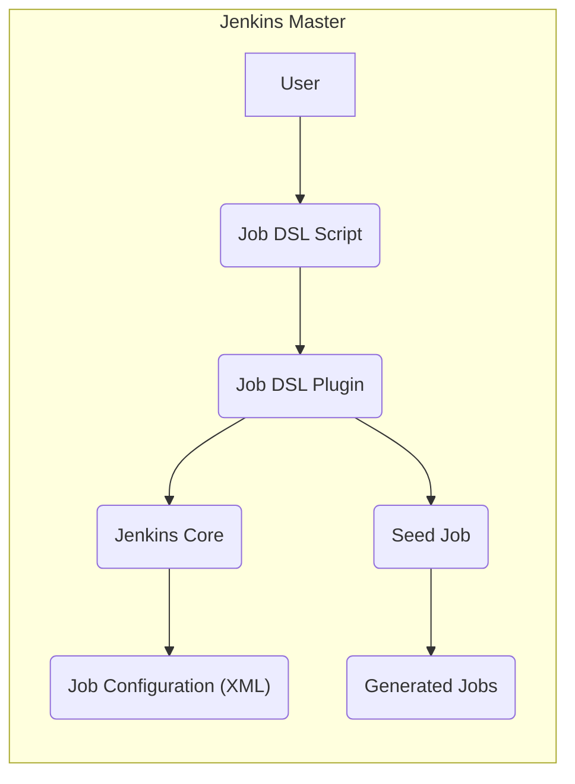
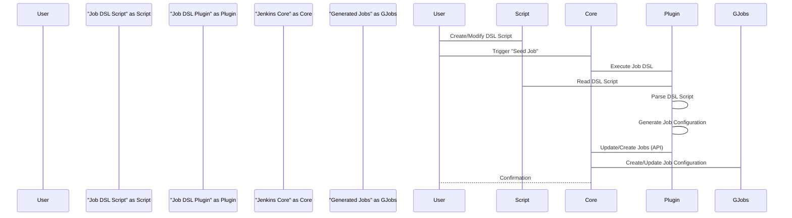

# Project Design Document: Jenkins Job DSL Plugin

**Version:** 1.1
**Date:** October 26, 2023
**Author:** AI Software Architect

## 1. Introduction

This document provides a detailed design overview of the Jenkins Job DSL Plugin. This document aims to clearly articulate the plugin's architecture, components, and data flow, serving as a foundation for subsequent threat modeling activities. The information presented here is based on the public repository: [https://github.com/jenkinsci/job-dsl-plugin](https://github.com/jenkinsci/job-dsl-plugin).

## 2. Goals

The primary goals of the Jenkins Job DSL Plugin are:

* To empower users to define Jenkins jobs programmatically using a Groovy-based Domain Specific Language (DSL).
* To offer a robust mechanism for the automated and repeatable generation and updating of Jenkins jobs.
* To facilitate the management of Jenkins job configurations as code, thereby enabling version control, collaboration, and auditability.
* To simplify the creation of intricate job configurations by abstracting away the complexities of the underlying Jenkins XML configuration.

## 3. Architecture Overview

The Jenkins Job DSL Plugin operates as an integral part of the Jenkins master process. It provides a structured approach to define jobs using Groovy scripts, which are then interpreted by the plugin to create or modify Jenkins job configurations.

**Key Actors and Components:**

* **User:**  An individual or an automated system responsible for creating and managing Job DSL scripts. This actor interacts with the system by writing and triggering the execution of these scripts.
* **Job DSL Script:** A text file, written in Groovy, that adheres to the Job DSL syntax to declaratively define Jenkins jobs. This script serves as the input for the plugin.
* **Job DSL Plugin:** The core software component within Jenkins that interprets Job DSL scripts and orchestrates the interaction with Jenkins Core to manage job configurations.
* **Jenkins Core:** The foundational component of Jenkins, responsible for the overall management of jobs, builds, security, and the plugin ecosystem.
* **Job Configuration (XML):** The persistent storage format for Jenkins job configurations, represented in XML. The Job DSL Plugin ultimately manipulates these XML files.
* **Seed Job:** A standard Jenkins job specifically configured to execute Job DSL scripts. It acts as the entry point for the plugin's functionality.
* **Generated Jobs:** The Jenkins jobs that are dynamically created or updated by the Job DSL Plugin based on the specifications within the provided scripts.

## 4. Detailed Component Description

### 4.1. Job DSL Script

* **Description:** A file containing Groovy code that leverages the Job DSL syntax to define the desired state of Jenkins jobs.
* **Functionality:**
    * Specifies all aspects of a Jenkins job, including parameters, source code management (SCM) settings, build triggers, build steps (including shell commands or plugin invocations), and post-build actions.
    * Can define entire job structures or update specific aspects of existing jobs.
* **Security Considerations:**
    * **Code Injection:** Malicious users could inject arbitrary Groovy code into DSL scripts, leading to unauthorized actions on the Jenkins master or agents.
    * **Credential Exposure:** Scripts might inadvertently contain or expose sensitive credentials if not handled carefully.
    * **Access Control:**  Unauthorized modification of DSL scripts can lead to unintended or malicious changes in job configurations.

### 4.2. Job DSL Plugin

* **Description:** A Jenkins plugin that provides the core functionality for parsing, interpreting, and executing Job DSL scripts to manage Jenkins job configurations.
* **Functionality:**
    * **DSL Parsing:**  Analyzes the Groovy-based DSL script to understand the intended job configurations.
    * **Configuration Translation:** Converts the parsed DSL into the corresponding Jenkins XML configuration format.
    * **Jenkins API Interaction:** Uses the Jenkins Core API to create, update, or delete jobs based on the translated configuration.
    * **Script Execution Environment:** Provides the runtime environment for executing the Groovy DSL scripts. This environment's security is critical.
    * **Metadata Management:**  Keeps track of jobs created or managed by specific DSL scripts.
* **Sub-components:**
    * **"DSL Parser":**  The component responsible for lexing and parsing the Groovy DSL syntax. Vulnerabilities here could allow malicious script execution.
    * **"Configuration Generator":** Transforms the parsed DSL into the internal representation of Jenkins job configurations and then serializes it to XML.
    * **"Jenkins API Client":**  Handles communication with the Jenkins Core API, including authentication and authorization.
    * **"Script Execution Engine":**  The Groovy interpreter used to execute the DSL scripts. Security sandboxing or restrictions are important here.
    * **"Update Strategy":** Determines how existing jobs are updated based on changes in the DSL script (e.g., create-or-replace, update-if-exists).
* **Security Considerations:**
    * **Vulnerable Dependencies:** The plugin might rely on third-party libraries with known security vulnerabilities.
    * **Improper Input Validation:** Failure to properly validate input from DSL scripts could lead to various attacks.
    * **API Security:**  The plugin's interaction with the Jenkins Core API must be secure, respecting authentication and authorization mechanisms.

### 4.3. Jenkins Core

* **Description:** The central application of Jenkins, responsible for managing all aspects of the CI/CD server, including job management, build execution, security, and plugin management.
* **Functionality:**
    * **Job Configuration Storage:** Persistently stores job configurations in XML format.
    * **Build Scheduling and Execution:** Manages the execution of build jobs on master or agents.
    * **User and Permission Management:** Controls access to Jenkins resources and functionalities.
    * **Plugin Management:** Provides the framework for installing and managing plugins like the Job DSL Plugin.
    * **API Endpoints:** Offers a programmatic interface for plugins and external systems to interact with Jenkins.
* **Security Considerations:**
    * **Core Vulnerabilities:**  Security flaws in Jenkins Core itself can impact the security of all plugins, including the Job DSL Plugin.
    * **Access Control Enforcement:** Jenkins Core is responsible for enforcing access controls, which the Job DSL Plugin relies on.

### 4.4. Seed Job

* **Description:** A standard Jenkins job whose primary purpose is to execute a Job DSL script.
* **Functionality:**
    * **Script Retrieval:**  Configured to locate and retrieve the Job DSL script, typically from a file system path or an SCM repository.
    * **Plugin Invocation:**  Triggers the execution of the Job DSL Plugin, passing the script as input.
    * **Execution Context:** Provides the security context under which the DSL script is executed.
* **Security Considerations:**
    * **Seed Job Configuration Security:**  Misconfigured Seed Jobs can grant excessive permissions to the executed DSL scripts.
    * **SCM Credentials:** If the DSL script is fetched from SCM, the Seed Job's SCM credentials must be securely managed.
    * **Access Control:**  Restricting who can configure and trigger Seed Jobs is crucial.

### 4.5. Generated Jobs

* **Description:** The Jenkins jobs that are created or modified as a result of the Job DSL Plugin executing a script.
* **Functionality:**  Perform the CI/CD tasks as defined in their configuration, which was generated by the Job DSL Plugin.
* **Security Considerations:**
    * **Configuration Security:** The security of these jobs directly depends on the configurations defined in the DSL scripts. Insecure DSL scripts can lead to insecure job configurations.
    * **Build Step Security:**  DSL scripts can define arbitrary build steps, including executing shell commands, which can introduce security risks if not carefully managed.

## 5. Data Flow

The typical data flow within the Job DSL Plugin involves the following sequence of actions:

1. **"User" authors or modifies a "Job DSL Script".** This script contains the declarative definition of Jenkins job configurations.
2. **The "User" or an automated process triggers a "Seed Job".** This action initiates the execution of the Job DSL script.
3. **The "Seed Job" executes, invoking the "Job DSL Plugin".**
4. **The "Job DSL Plugin" retrieves the specified "Job DSL Script".** This might involve reading from the local file system or fetching from an SCM repository.
5. **The "DSL Parser" within the "Job DSL Plugin" parses the script.** This step validates the syntax and structure of the DSL.
6. **The "Configuration Generator" translates the parsed DSL into Jenkins job configuration XML.** This is the core transformation process.
7. **The "Jenkins API Client" within the "Job DSL Plugin" communicates with the "Jenkins Core" API.**
8. **"Jenkins Core" processes the API requests to create, update, or delete "Generated Jobs" based on the provided configuration.**
9. **The "Generated Jobs" are now available and managed within "Jenkins Core".**

## 6. Key Interactions and Dependencies

* **"Job DSL Plugin" interacts with "Jenkins Core" API:** This interaction is crucial for managing job configurations. Secure authentication and authorization are paramount.
* **"Job DSL Script" execution environment:** The plugin executes Groovy code, necessitating careful consideration of security implications, such as the use of sandboxing or restricted permissions to prevent malicious code execution.
* **"Seed Job" configuration:** The configuration of the "Seed Job" dictates how and when the DSL scripts are executed and the security context under which they run.
* **Source Code Management (SCM):** "Job DSL Scripts" are often stored in SCM systems. Secure access and management of these repositories are essential to prevent unauthorized modification of job definitions.
* **User permissions within Jenkins:** Access control to "Seed Jobs" and the ability to execute them are critical security considerations to prevent unauthorized job creation or modification.
* **Groovy Language and Libraries:** The plugin depends on the Groovy language and potentially other Groovy libraries. Vulnerabilities in these dependencies could affect the plugin's security.

## 7. Security Considerations (Pre-Threat Modeling)

Based on the architecture and data flow, potential security concerns that should be explored during threat modeling include:

* **Arbitrary Code Execution via DSL Scripts:** Malicious actors could inject arbitrary Groovy code into "Job DSL Scripts", leading to unauthorized command execution on the Jenkins master or agents. This is a high-severity risk.
* **Privilege Escalation through Job Configuration:**  Improperly configured "Seed Jobs" or malicious DSL scripts could create "Generated Jobs" with elevated privileges, allowing unauthorized access to resources or sensitive data.
* **Exposure of Sensitive Information in DSL Scripts:**  Credentials, API keys, or other sensitive information might be inadvertently included in "Job DSL Scripts", potentially leading to information disclosure. Secure secret management practices are crucial.
* **Cross-Site Scripting (XSS) Vulnerabilities:** If the plugin renders user-provided data from DSL scripts without proper sanitization, it could be susceptible to XSS attacks, potentially compromising other Jenkins users.
* **Insecure Deserialization:** If the plugin uses deserialization to handle data from untrusted sources (e.g., within DSL scripts), it could be vulnerable to insecure deserialization attacks, potentially leading to remote code execution.
* **Access Control Bypass:**  Flaws in the plugin's access control mechanisms could allow unauthorized users to execute DSL scripts or modify job configurations.
* **Dependency Vulnerabilities:**  The plugin's reliance on third-party libraries (including Groovy) introduces the risk of vulnerabilities in those dependencies being exploited. Regular updates and vulnerability scanning are necessary.
* **Man-in-the-Middle Attacks:** If communication between the plugin and Jenkins Core or external systems (like SCM) is not properly secured (e.g., using HTTPS), it could be vulnerable to man-in-the-middle attacks.
* **Denial of Service (DoS):**  Maliciously crafted DSL scripts could potentially consume excessive resources on the Jenkins master, leading to a denial of service.

## 8. Deployment Model

The Job DSL Plugin is deployed as a standard Jenkins plugin, typically installed through the Jenkins Plugin Manager.

* **Installation:**  The plugin can be installed by uploading the plugin's `.hpi` file to the Jenkins master or by searching for and installing it through the Jenkins Plugin Manager UI.
* **Configuration:**  Generally, the Job DSL Plugin does not require global configuration. Most configuration is done within the "Job DSL Scripts" and the configuration of the "Seed Jobs" that execute them.
* **Usage:** Users create "Seed Jobs" and configure them to execute specific "Job DSL Scripts". These scripts can be stored directly within the Jenkins workspace of the "Seed Job" or fetched from external sources like SCM repositories.

## 9. Glossary

* **DSL:** Domain Specific Language - a specialized language designed for a particular domain.
* **SCM:** Source Code Management - systems like Git or Subversion used for version control of code and other files.
* **Groovy:** A dynamic, object-oriented programming language built on top of the Java platform.
* **Jenkins Master:** The central control instance in a Jenkins installation.
* **Jenkins Agent:** A node that executes build jobs on behalf of the Jenkins master.
* **HPI:** Hudson Plugin Installation - the file format for Jenkins plugins.
* **API:** Application Programming Interface - a set of rules and specifications that software programs can follow to communicate with each other.

This improved document provides a more detailed and security-focused overview of the Jenkins Job DSL Plugin's design. This information will be crucial for conducting a comprehensive threat model to identify and mitigate potential security risks effectively.
