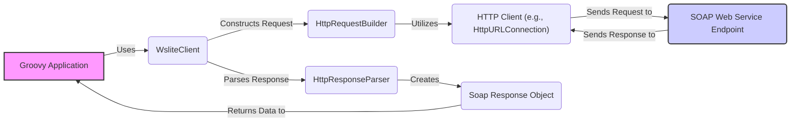
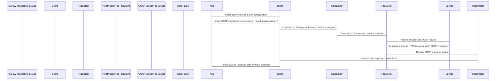

# Project Design Document: groovy-wslite

**Version:** 1.1
**Date:** October 26, 2023
**Author:** Gemini (AI Language Model)

## 1. Introduction

This document provides an enhanced design overview of the `groovy-wslite` project, a Groovy library designed to simplify the consumption of SOAP/WSDL web services. It details the project's architecture, key components, and data flow, providing a solid foundation for subsequent threat modeling and further development. This revision aims for greater clarity and detail based on a deeper understanding of the project's purpose and functionality.

## 2. Goals and Objectives

The core objectives of `groovy-wslite` are to:

*   Offer a streamlined and Groovy-centric approach to interacting with SOAP-based web services.
*   Minimize the boilerplate code typically associated with SOAP message handling.
*   Provide an intuitive API for constructing and dispatching SOAP requests.
*   Facilitate straightforward parsing and access to data within SOAP responses.
*   Support essential SOAP features, including namespaces, SOAP headers, and attachments.
*   Abstract the underlying complexities of SOAP and HTTP communication.

## 3. Architecture Overview

`groovy-wslite` functions as a client-side library embedded within Groovy applications. It orchestrates the creation of SOAP requests, manages their transmission over HTTP(S), and interprets the resulting SOAP responses.

*   **Groovy Application:** The application leveraging the `groovy-wslite` library to communicate with a remote SOAP service.
*   **WsliteClient:** The primary interface for interacting with SOAP services. It manages request execution and configuration.
*   **HttpRequestBuilder:**  Responsible for assembling the HTTP request, including headers, the SOAP envelope in the body, and any necessary authentication details.
*   **HttpResponseParser:**  Handles the interpretation of the HTTP response from the SOAP service, extracting the SOAP envelope and managing potential error conditions (SOAP faults).
*   **HTTP Client:** The underlying mechanism (typically Java's `HttpURLConnection` or a similar component) used to transmit the HTTP request.
*   **SOAP Web Service Endpoint:** The remote server hosting the target SOAP web service.
*   **Soap Response Object:** A structured representation of the parsed SOAP response, providing convenient access to the data contained within.

## 4. Component Design

This section provides a more detailed breakdown of the internal components of `groovy-wslite`.

*   **`WsliteClient`:**
    *   Serves as the central point of interaction for sending SOAP requests.
    *   Offers methods for invoking SOAP operations, either based on a provided WSDL or by manually constructing the request.
        *   Examples include methods like `send()`, `invoke()`, and potentially more specialized methods for specific use cases.
    *   Manages configuration settings, such as:
        *   Connection and read timeouts.
        *   Authentication credentials (e.g., username/password, WS-Security tokens).
        *   Custom HTTP headers.
        *   Proxy settings.
    *   Instantiates and orchestrates the use of `HttpRequestBuilder` and `HttpResponseParser`.
    *   May incorporate caching mechanisms for WSDL information to improve performance by reducing redundant parsing.

*   **`HttpRequestBuilder`:**
    *   Takes a SOAP message (represented as XML or potentially as a Groovy object structure) and constructs the corresponding HTTP request.
    *   Sets essential HTTP headers:
        *   `Content-Type: text/xml; charset=utf-8`.
        *   `SOAPAction` (derived from the WSDL or provided explicitly).
    *   Handles the inclusion of authentication headers based on the configured authentication method:
        *   Basic Authentication headers.
        *   WS-Security headers (e.g., `UsernameToken`).
    *   Allows for customization of HTTP request parameters, such as:
        *   Adding custom headers.
        *   Setting request methods (although typically POST for SOAP).

*   **`HttpResponseParser`:**
    *   Receives the `InputStream` from the `HTTP Client`'s response.
    *   Parses the XML content of the SOAP response using an XML parsing library (likely Groovy's `XmlSlurper`).
    *   Specifically handles SOAP faults:
        *   Identifies the presence of a `<soap:Fault>` element.
        *   Extracts relevant fault details (fault code, fault string, etc.).
        *   Potentially throws exceptions to signal SOAP errors to the calling application.
    *   Provides methods or mechanisms to access the data within the SOAP response:
        *   Returns a Groovy object representation of the XML structure.
        *   Offers convenient ways to navigate and extract data using Groovy's XML parsing features.

*   **`SoapMessage` (Internal Representation):**
    *   Represents the structure of the SOAP envelope, including the `<soap:Envelope>`, `<soap:Header>`, and `<soap:Body>` elements.
    *   May be constructed programmatically within `WsliteClient` or based on information extracted from a WSDL.

*   **`WSDLReader` (Potentially Implicit or External):**
    *   Functionality for parsing WSDL files to understand the service's contract.
    *   May be implemented internally or rely on external libraries for WSDL processing.
    *   Used to extract information about:
        *   Available operations.
        *   Input and output message structures.
        *   Data types.
        *   Service endpoint locations.
    *   This information can be used to:
        *   Validate request parameters.
        *   Generate SOAP request structures automatically.

## 5. Data Flow

This section elaborates on the sequence of actions involved in sending a SOAP request using `groovy-wslite`.

1. The Groovy application creates an instance of `WsliteClient`, potentially configuring it with details like the service endpoint URL and authentication credentials.
2. The application calls a method on the `WsliteClient` to invoke a specific SOAP operation. This might involve providing a pre-constructed SOAP message or parameters that `groovy-wslite` uses to build the message.
3. The `WsliteClient` delegates the creation of the HTTP request to the `HttpRequestBuilder`. This component:
    *   Constructs the SOAP envelope, either programmatically or based on WSDL information.
    *   Sets the necessary HTTP headers, including `Content-Type` and `SOAPAction`.
    *   Adds authentication headers if configured.
4. The `HttpRequestBuilder` utilizes the configured `HTTP Client` (e.g., `HttpURLConnection`) to send the HTTP request to the SOAP web service endpoint.
5. The SOAP web service receives the request, processes it according to its logic, and generates an HTTP response containing the SOAP response envelope.
6. The `HTTP Client` receives the HTTP response and passes the response stream to the `HttpResponseParser`.
7. The `HttpResponseParser` parses the XML content of the SOAP response.
8. If the response contains a SOAP fault, the `HttpResponseParser` extracts the fault details and typically throws an exception to inform the calling application of the error.
9. The `HttpResponseParser` makes the data within the successful SOAP response accessible to the `WsliteClient`, often as a Groovy object representing the XML structure.
10. The `WsliteClient` returns the parsed SOAP response data to the Groovy application, or propagates any exceptions encountered during the process.

## 6. Security Considerations

This section expands on the security considerations relevant to `groovy-wslite`, providing more specific details.

*   **Transport Layer Security (TLS/SSL):**  Enforcing HTTPS for all communication with the SOAP service is crucial to protect the confidentiality and integrity of SOAP messages during transit. This prevents eavesdropping and tampering.
*   **Authentication Mechanisms:**  `groovy-wslite` needs robust support for various authentication methods:
    *   **Basic Authentication:** Securely handling and transmitting username and password credentials, preferably over HTTPS.
    *   **WS-Security:** Supporting the implementation of WS-Security standards, including:
        *   `UsernameToken`: Securely adding username and password credentials to the SOAP header.
        *   X.509 Certificates:  Enabling authentication using digital certificates.
    *   **OAuth 2.0:**  Allowing for the inclusion of OAuth 2.0 access tokens in request headers for services using this authorization framework. This might involve mechanisms for setting custom authorization headers.
*   **Input Validation and Output Encoding:** While `groovy-wslite` primarily acts as a client, it's essential that the *consuming Groovy application* validates any user-provided data before including it in SOAP requests to prevent SOAP injection attacks. Similarly, the application should handle the output received from the SOAP service securely to prevent issues like cross-site scripting (XSS) if the data is displayed in a web context.
*   **XML External Entity (XXE) Prevention:** The XML parsing components within `HttpResponseParser` (likely `XmlSlurper`) must be configured to disable the processing of external entities and external DTDs. This mitigates the risk of XXE vulnerabilities, which could allow attackers to access local files or internal network resources.
*   **SOAP Injection Prevention:**  The library and the consuming application must ensure proper encoding of data within the SOAP envelope to prevent attackers from injecting malicious XML elements or attributes that could alter the intended functionality of the SOAP service.
*   **Dependency Management and Vulnerability Scanning:** Regularly reviewing and updating the library's dependencies is critical to address any known security vulnerabilities in those components. Using dependency scanning tools can help automate this process.
*   **Secure Error Handling and Logging:** Error messages and logs should avoid revealing sensitive information about the application or the SOAP service. Detailed error information should be logged securely and accessed only by authorized personnel.
*   **Configuration Security:** Securely managing configuration details like service endpoint URLs, authentication credentials, and certificates is essential. Avoid hardcoding sensitive information directly in the code. Consider using environment variables or secure configuration management tools.

## 7. Deployment Considerations

`groovy-wslite` is deployed as a library within the Groovy application that utilizes it.

*   The `groovy-wslite` JAR file (along with its transitive dependencies) must be included in the application's classpath. This is typically managed through dependency management tools like Gradle or Maven.
*   No separate deployment or installation of `groovy-wslite` is required on the server-side SOAP service.

## 8. Technologies Used

*   **Groovy:** The primary language for the library.
*   **Java:**  As Groovy runs on the JVM, Java libraries are inherently utilized.
*   **XML Processing:**
    *   Likely utilizes Groovy's built-in XML parsing capabilities provided by `XmlSlurper` for parsing responses.
    *   May use `StreamingMarkupBuilder` for constructing SOAP request XML.
*   **HTTP Client:**
    *   Potentially uses the standard Java `HttpURLConnection`.
    *   Could offer integration with other HTTP client libraries like Apache HttpClient or OkHttp for more advanced features or flexibility.

## 9. Glossary

*   **SOAP (Simple Object Access Protocol):** A standardized XML-based protocol for exchanging structured information in web services.
*   **WSDL (Web Services Description Language):** An XML-based language used to describe the capabilities of a SOAP web service, including its operations, parameters, and data types.
*   **HTTP (Hypertext Transfer Protocol):** The foundational protocol for communication on the World Wide Web.
*   **HTTPS (HTTP Secure):** HTTP communication secured with TLS/SSL encryption.
*   **XML (Extensible Markup Language):** A markup language designed for encoding documents in a format that is both human-readable and machine-readable.
*   **SOAP Envelope:** The root element of a SOAP message, containing the `<soap:Envelope>` element, which encapsulates the `<soap:Header>` and `<soap:Body>`.
*   **SOAP Fault:** A standard mechanism within SOAP for reporting errors, indicated by the `<soap:Fault>` element within the `<soap:Body>`.
*   **Groovy DSL (Domain Specific Language):** Groovy's feature that allows for creating more expressive and concise syntax tailored to specific tasks.
*   **XXE (XML External Entity):** A type of security vulnerability that allows an attacker to cause the XML parser to access arbitrary local or remote resources.

This revised document provides a more detailed and comprehensive design overview of the `groovy-wslite` project. The added clarity and specific examples aim to enhance understanding and facilitate more effective threat modeling and future development efforts.
