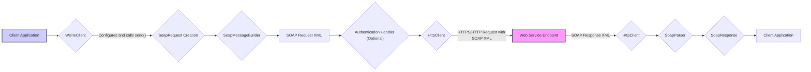

# Project Design Document: Groovy-WSLite

**Version:** 1.1
**Date:** October 26, 2023
**Author:** AI Software Architect

## 1. Introduction

This document provides an enhanced and more detailed design overview of the Groovy-WSLite project, a lightweight SOAP client library for Groovy. This revised document aims to provide a clearer and more comprehensive articulation of the architecture, components, and data flow of the library, specifically tailored to facilitate thorough threat modeling activities. We have expanded on the previous version to provide more granular detail and context.

## 2. Goals and Non-Goals

### 2.1 Goals

*   Provide a simple and intuitive Groovy API for consuming SOAP web services, minimizing boilerplate code.
*   Support the fundamental aspects of SOAP communication, including sending requests with custom headers and handling various response structures.
*   Handle basic authentication mechanisms commonly used with SOAP services, such as Basic Authentication.
*   Offer flexibility in configuring SOAP requests, including setting custom SOAP actions and manipulating the message body.
*   Maintain a lightweight footprint with minimal external dependencies to reduce the risk of dependency conflicts and security vulnerabilities.
*   Provide clear and concise error handling for common SOAP communication issues.

### 2.2 Non-Goals

*   Implementing a full-fledged SOAP server or any server-side functionalities.
*   Providing comprehensive support for advanced WS-* specifications beyond basic addressing and security (e.g., WS-SecurityPolicy, WS-ReliableMessaging, WS-Coordination). Support for these would be considered in future iterations based on demand.
*   Offering a graphical user interface (GUI) for interacting with the library. The focus is on programmatic interaction.
*   Providing extensive general-purpose XML manipulation capabilities beyond what is strictly necessary for constructing and parsing SOAP messages. Users requiring advanced XML manipulation should leverage dedicated XML libraries.
*   Acting as a general-purpose HTTP client. While it utilizes HTTP for transport, its scope is limited to SOAP interactions.

## 3. Architectural Overview

Groovy-WSLite adopts a client-side architecture, acting as an intermediary between a Groovy application and a remote SOAP web service. It abstracts the complexities of SOAP message construction, transport over HTTP(S), and response parsing. The core of the architecture involves the client application interacting with the `WsliteClient`, which orchestrates the process of sending requests and receiving responses from the target SOAP web service. The design emphasizes a clear separation of concerns between message creation, transport, and parsing.

## 4. Components

*   **`WsliteClient`:**
    *   The primary interface for interacting with SOAP services. It encapsulates the configuration and execution logic.
    *   Responsible for managing the target web service endpoint URL.
    *   Provides methods like `send()` to dispatch SOAP requests and receive `SoapResponse` objects.
    *   Internally manages the lifecycle of the `HttpClient` instance.
    *   May offer configuration options for timeouts, connection settings, and proxy configurations.
*   **`SoapRequest`:**
    *   A data object representing a SOAP request message before it's serialized into XML.
    *   Allows programmatic setting of the SOAP action (via HTTP header or message content).
    *   Provides methods to add custom HTTP headers for the underlying HTTP request.
    *   Offers flexible ways to define the SOAP message body, potentially accepting raw XML strings or providing builders for structured content.
*   **`SoapResponse`:**
    *   A data object representing the SOAP response received from the web service.
    *   Provides access to the HTTP status code of the response.
    *   Exposes the response headers received from the server.
    *   Contains the raw XML content of the SOAP response body.
    *   May offer convenience methods for parsing the XML body into a more usable structure (e.g., using Groovy's `XmlSlurper`).
*   **`HttpClient` (Internal Abstraction):**
    *   An internal interface or abstraction layer responsible for the actual HTTP communication.
    *   The default implementation likely leverages Groovy's `HttpURLConnection` or potentially an external HTTP client library like Apache HttpClient.
    *   Handles setting HTTP methods (typically POST for SOAP), content types, and sending the request payload.
    *   Responsible for receiving the HTTP response and extracting relevant information.
    *   May include logic for handling redirects and basic error responses.
*   **`SoapMessageBuilder` (Internal):**
    *   An internal component responsible for serializing the `SoapRequest` object into a valid SOAP XML message.
    *   Ensures the correct structure of the SOAP envelope, header (including SOAPAction), and body.
    *   Handles the encoding of the message content.
*   **`SoapParser` (Internal):**
    *   An internal component responsible for parsing the raw XML string of the SOAP response body.
    *   May use Groovy's `XmlSlurper` or a similar XML parsing mechanism.
    *   Extracts the relevant parts of the SOAP response for access through the `SoapResponse` object.
    *   Handles potential XML parsing errors.
*   **Authentication Handlers (Optional/Configurable):**
    *   Implementations of specific authentication schemes (e.g., `BasicAuthenticationHandler`).
    *   Intercept the request process before it's sent by the `HttpClient`.
    *   Modify the HTTP request headers (e.g., adding the `Authorization` header for Basic Authentication).
    *   These handlers are typically configurable and can be added or removed as needed.

## 5. Data Flow

**Detailed Data Flow:**

1. The **Client Application** initiates a SOAP call by interacting with the **`WsliteClient`**, configuring the target endpoint and potentially authentication details.
2. The client application creates and configures a **`SoapRequest`** object, specifying the SOAP action, any custom headers, and the data for the message body.
3. The **`WsliteClient`** utilizes the internal **`SoapMessageBuilder`** to serialize the `SoapRequest` object into a well-formed **SOAP Request XML** string.
4. If configured, an **Authentication Handler** intercepts the request and modifies it, for example, by adding authentication headers.
5. The **`WsliteClient`** uses its internal **`HttpClient`** to send an **HTTPS/HTTP Request with SOAP XML** to the **Web Service Endpoint**. The request typically uses the POST method with the SOAP XML in the request body and appropriate `Content-Type` headers.
6. The **Web Service Endpoint** processes the request and sends back a **SOAP Response XML** string along with an HTTP status code and headers.
7. The **`HttpClient`** receives the **SOAP Response XML**, status code, and headers.
8. The **`WsliteClient`** uses the internal **`SoapParser`** to parse the **SOAP Response XML** into a **`SoapResponse`** object.
9. The **`SoapResponse`** object, containing the response data (status code, headers, and body), is returned to the **Client Application**.

## 6. Security Considerations (For Threat Modeling)

This section details potential security concerns and vulnerabilities that should be thoroughly considered during threat modeling.

*   **Transport Layer Security:**
    *   **Threat:** Communication with the web service might occur over insecure HTTP, exposing sensitive data in transit.
    *   **Consideration:** The library should strongly encourage or enforce the use of HTTPS. Configuration options for TLS/SSL settings (e.g., trust stores, key stores, protocol versions) are crucial. Lack of proper certificate validation could lead to Man-in-the-Middle attacks.
*   **SOAP Message Injection:**
    *   **Threat:** If user-provided data is directly embedded into the SOAP request XML without proper sanitization or encoding, it could lead to SOAP injection vulnerabilities, allowing attackers to manipulate the SOAP message.
    *   **Consideration:** The `SoapMessageBuilder` must implement robust encoding mechanisms to prevent injection attacks. Input validation on the client-side before constructing the `SoapRequest` is also important.
*   **Authentication and Authorization Weaknesses:**
    *   **Threat:** Insecure handling or storage of authentication credentials. Lack of support for strong authentication mechanisms.
    *   **Consideration:** Secure handling of credentials within Authentication Handlers is paramount. The library should support common authentication methods and potentially allow for custom authentication implementations. Consider the risk of credentials being logged or exposed.
*   **XML External Entity (XXE) Attacks:**
    *   **Threat:** If the `SoapParser` uses an XML parser that is not correctly configured, it could be vulnerable to XXE attacks, allowing attackers to access local files or internal network resources.
    *   **Consideration:** The `SoapParser` must be configured to disable external entity processing by default. Ensure the underlying XML parsing library is used securely.
*   **Denial of Service (DoS):**
    *   **Threat:** The library might be susceptible to DoS attacks if it doesn't handle excessively large responses or malformed XML gracefully, potentially consuming excessive resources.
    *   **Consideration:** Implement timeouts for network requests and XML parsing. Consider resource limits for parsing large responses.
*   **Dependency Vulnerabilities:**
    *   **Threat:** Vulnerabilities in the underlying HTTP client or XML parsing libraries could be exploited.
    *   **Consideration:**  Maintain up-to-date dependencies and perform regular security audits of the dependency tree. Clearly document the used dependencies.
*   **Logging of Sensitive Information:**
    *   **Threat:** Logging sensitive data like authentication credentials or parts of the SOAP message content could expose it to unauthorized access.
    *   **Consideration:** Implement careful logging practices, avoiding the logging of sensitive information. Provide configuration options to control logging levels and content.
*   **Man-in-the-Middle (MitM) Attacks (Reiteration):**
    *   **Threat:** If HTTPS is not used or if certificate validation is not properly implemented, attackers can intercept and potentially modify communication.
    *   **Consideration:**  Emphasize the importance of HTTPS and ensure the underlying HTTP client performs proper certificate validation.
*   **Error Handling and Information Disclosure:**
    *   **Threat:** Verbose error messages might reveal sensitive information about the system, the web service, or internal configurations to potential attackers.
    *   **Consideration:** Implement secure error handling that provides useful information for debugging without exposing sensitive details.

## 7. Dependencies

*   **Groovy Standard Library:**  The library relies on core Groovy language features and utilities.
*   **HTTP Client Implementation:**
    *   **Potential Choices:**  `HttpURLConnection` (built-in), Apache HttpClient, OkHttp.
    *   **Security Implications:** The chosen HTTP client's security features and vulnerability history are relevant.
*   **XML Parsing Library:**
    *   **Potential Choices:** Groovy's `XmlSlurper` (uses standard Java XML parsing), JAXB.
    *   **Security Implications:** The XML parsing library's susceptibility to XXE and other XML-related vulnerabilities is a key concern.

## 8. Deployment

Groovy-WSLite is intended to be deployed as a library dependency within other Groovy or Java applications. Common deployment scenarios include:

*   **Standalone Groovy Applications:** Included as a dependency in the application's build configuration (e.g., using Gradle or Maven).
*   **Web Applications (e.g., using Spring Boot, Micronaut):**  Integrated as a dependency within the web application project.
*   **Integration within Existing Java Projects:** Can be used in Java projects by including the Groovy library as a dependency.

Considerations for deployment include managing dependencies, ensuring the correct version of Groovy is available, and configuring any necessary network settings (e.g., proxy configurations).

## 9. Future Considerations

*   Adding support for more advanced WS-* specifications, such as WS-Security for enhanced message security.
*   Improving error handling by providing more specific and actionable error messages, potentially including SOAP fault details.
*   Offering more granular configuration options for the underlying HTTP client, allowing users to customize timeouts, connection pooling, and other settings.
*   Potentially supporting asynchronous request processing using Groovy's concurrency features or reactive programming paradigms.
*   Providing interceptors or middleware capabilities for request and response processing, allowing users to add custom logic for logging, monitoring, or transformation.
*   Exploring support for different SOAP versions (e.g., SOAP 1.1 and SOAP 1.2).

This improved design document provides a more detailed and nuanced understanding of the Groovy-WSLite project, specifically focusing on aspects crucial for effective threat modeling. The enhanced descriptions of components, the more detailed data flow diagram, and the expanded security considerations offer a stronger foundation for identifying and mitigating potential vulnerabilities.