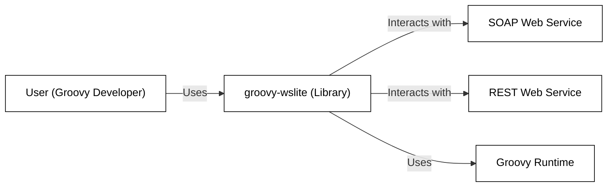
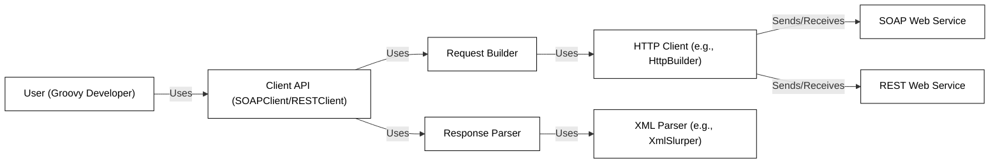
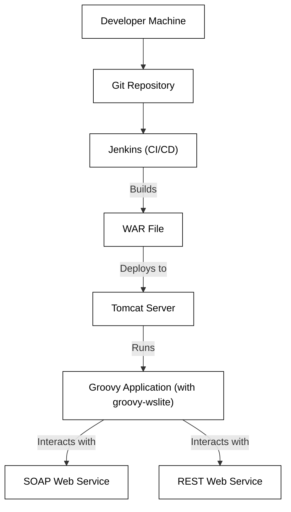
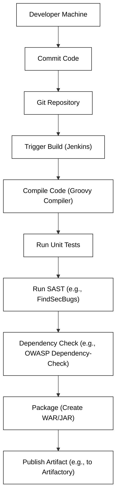

Okay, let's create a design document for the `groovy-wslite` project.

# BUSINESS POSTURE

Business Priorities and Goals:

*   Provide a lightweight, easy-to-use SOAP and REST client library for Groovy developers.
*   Simplify interaction with web services, reducing development time and complexity.
*   Offer a flexible and maintainable solution that can adapt to evolving web service standards.
*   Maintain backward compatibility where possible, minimizing disruption for existing users.
*   Provide good documentation and examples to facilitate adoption and usage.

Business Risks:

*   Insecure handling of sensitive data transmitted to/from web services (e.g., credentials, PII).
*   Vulnerabilities in the library itself (e.g., XML parsing vulnerabilities, injection flaws) that could be exploited by malicious actors.
*   Lack of support for modern security standards (e.g., OAuth 2.0, JWT) could limit its applicability in secure environments.
*   Dependence on outdated or vulnerable third-party libraries could introduce security risks.
*   Insufficient error handling and logging could hinder troubleshooting and security incident response.
*   Inability to properly validate server certificates, leading to man-in-the-middle attacks.

# SECURITY POSTURE

Existing Security Controls:

*   security control: The library appears to support basic authentication (username/password). (Implied from documentation and examples).
*   security control: The library supports HTTPS, enabling encrypted communication. (Implied from documentation and examples).
*   security control: Some level of input validation is likely present, but needs to be explicitly verified and documented. (Assumed, needs verification).
*   security control: The library uses established XML parsing libraries (like `XmlSlurper` and `XmlParser` in Groovy), which have their own security considerations and handling. (Observed in code).

Accepted Risks:

*   accepted risk: Limited built-in support for advanced authentication/authorization mechanisms beyond basic authentication. Users may need to implement custom solutions for OAuth 2.0, JWT, etc.
*   accepted risk: Potential vulnerabilities in underlying Groovy XML parsing libraries, requiring staying up-to-date with Groovy releases and security patches.
*   accepted risk: The library's reliance on the user to correctly configure security aspects (e.g., certificate validation, proper handling of sensitive data) places a burden on the developer.

Recommended Security Controls:

*   security control: Implement explicit and comprehensive input validation for all user-supplied data, including URLs, headers, and request bodies.  This should include checks for data type, length, format, and allowed characters.
*   security control: Provide clear guidance and examples on how to securely handle sensitive data, such as credentials and API keys.  Recommend best practices like using environment variables or secure configuration stores.
*   security control: Implement robust error handling and logging, including detailed error messages and contextual information to aid in debugging and security incident response.  Logs should be securely stored and monitored.
*   security control: Offer built-in support or clear integration paths for modern authentication/authorization mechanisms like OAuth 2.0 and JWT.
*   security control: Regularly update dependencies to address known vulnerabilities in third-party libraries. Implement a dependency management system to track and manage dependencies.
*   security control: Provide options for strict certificate validation and hostname verification to prevent man-in-the-middle attacks. Allow users to configure trusted certificate authorities.
*   security control: Implement security headers in responses (where applicable) to mitigate common web vulnerabilities (e.g., X-Content-Type-Options, X-Frame-Options, Content-Security-Policy).
*   security control: Conduct regular security testing, including static analysis (SAST), dynamic analysis (DAST), and dependency analysis, to identify and address potential vulnerabilities.

Security Requirements:

*   Authentication:
    *   The library MUST support basic authentication securely (e.g., over HTTPS).
    *   The library SHOULD provide mechanisms or guidance for integrating with other authentication schemes (e.g., API keys, OAuth 2.0, JWT).
*   Authorization:
    *   The library itself does not handle authorization; this is the responsibility of the web services it interacts with.  However, the library should facilitate the passing of authorization tokens (e.g., in headers).
*   Input Validation:
    *   The library MUST validate all user-supplied input to prevent injection attacks and other vulnerabilities.
    *   Validation rules SHOULD be configurable by the user where appropriate.
*   Cryptography:
    *   The library MUST use HTTPS for all communication with web services by default.
    *   The library MUST support TLS 1.2 or higher.
    *   The library SHOULD allow users to configure certificate validation and trusted CAs.
*   Data Handling
    *   The library MUST NOT log or store sensitive data (credentials, PII) insecurely.
    *   The library SHOULD provide guidance on secure handling of sensitive data.

# DESIGN

## C4 CONTEXT

Element Descriptions:

*   Element:
    *   Name: User (Groovy Developer)
    *   Type: Person
    *   Description: A developer using the groovy-wslite library in their Groovy application.
    *   Responsibilities: Writes code that utilizes the groovy-wslite library to interact with web services.  Handles responses and errors from the library. Configures the library (e.g., endpoints, credentials).
    *   Security controls: Implements secure coding practices. Handles sensitive data securely.  Performs input validation.

*   Element:
    *   Name: groovy-wslite (Library)
    *   Type: Software System
    *   Description: The groovy-wslite library itself.
    *   Responsibilities: Provides a simplified interface for making SOAP and REST requests. Handles low-level details of HTTP communication. Parses responses from web services.
    *   Security controls: Uses HTTPS.  Provides mechanisms for authentication (basic auth).  Relies on Groovy's XML parsing security.

*   Element:
    *   Name: SOAP Web Service
    *   Type: Software System
    *   Description: An external SOAP web service.
    *   Responsibilities: Provides services via SOAP protocol.
    *   Security controls: Implements its own security controls (authentication, authorization, input validation, etc.).

*   Element:
    *   Name: REST Web Service
    *   Type: Software System
    *   Description: An external REST web service.
    *   Responsibilities: Provides services via REST protocol.
    *   Security controls: Implements its own security controls (authentication, authorization, input validation, etc.).

*   Element:
    *   Name: Groovy Runtime
    *   Type: Software System
    *   Description: The Groovy runtime environment.
    *   Responsibilities: Executes Groovy code. Provides underlying libraries and functionalities.
    *   Security controls: Implements security features of the Groovy language and runtime.  Handles XML parsing securely (with appropriate configurations).

## C4 CONTAINER

Element Descriptions:

*   Element:
    *   Name: User (Groovy Developer)
    *   Type: Person
    *   Description: (Same as in Context Diagram)
    *   Responsibilities: (Same as in Context Diagram)
    *   Security controls: (Same as in Context Diagram)

*   Element:
    *   Name: Client API (SOAPClient/RESTClient)
    *   Type: Container
    *   Description: The main entry point for users of the library. Provides methods for creating and interacting with SOAP and REST clients.
    *   Responsibilities: Provides a high-level interface for making requests. Manages the request/response lifecycle.
    *   Security controls:  Handles authentication information (e.g., basic auth credentials). Enforces HTTPS usage.

*   Element:
    *   Name: Request Builder
    *   Type: Container
    *   Description: Constructs the HTTP request based on user input and configuration.
    *   Responsibilities:  Formats the request body (e.g., XML for SOAP, JSON for REST). Sets HTTP headers.  Handles encoding.
    *   Security controls: Performs input validation on user-provided data (URLs, headers, body content).

*   Element:
    *   Name: Response Parser
    *   Type: Container
    *   Description: Parses the HTTP response from the web service.
    *   Responsibilities: Extracts data from the response body (e.g., XML, JSON). Handles different content types.  Detects and handles errors.
    *   Security controls:  Relies on secure XML parsing libraries (e.g., XmlSlurper with appropriate security settings).

*   Element:
    *   Name: HTTP Client (e.g., HttpBuilder)
    *   Type: Container
    *   Description:  Handles the low-level details of making HTTP requests.  Likely uses a library like Apache HttpComponents or similar.
    *   Responsibilities:  Establishes HTTP connections. Sends requests and receives responses.  Handles timeouts and retries.
    *   Security controls:  Manages TLS/SSL connections.  Handles certificate validation.

*   Element:
    *   Name: XML Parser (e.g., XmlSlurper)
    *   Type: Container
    *   Description: Parses XML responses (primarily for SOAP).
    *   Responsibilities: Parses XML data into Groovy objects.
    *   Security controls: Uses secure parsing configurations to mitigate XML-related vulnerabilities (e.g., XXE).

*   Element:
    *   Name: SOAP Web Service
    *   Type: Software System
    *   Description: (Same as in Context Diagram)
    *   Responsibilities: (Same as in Context Diagram)
    *   Security controls: (Same as in Context Diagram)

*   Element:
    *   Name: REST Web Service
    *   Type: Software System
    *   Description: (Same as in Context Diagram)
    *   Responsibilities: (Same as in Context Diagram)
    *   Security controls: (Same as in Context Diagram)

## DEPLOYMENT

Possible Deployment Solutions:

1.  **Embedded in a Groovy Application:** The library is typically used as a dependency within a larger Groovy application.  The application, along with groovy-wslite, is packaged and deployed as a single unit (e.g., a WAR file for a web application, a JAR file for a standalone application).
2.  **Standalone Script:**  groovy-wslite can be used in standalone Groovy scripts.  In this case, the script and the library JAR file would be deployed together.
3.  **Grape Dependency:** Groovy's Grape dependency management system can automatically download and manage the groovy-wslite library.

Chosen Solution (for detailed description): **Embedded in a Groovy Application (WAR file deployed to Tomcat)**

Element Descriptions:

*   Element:
    *   Name: Developer Machine
    *   Type: Infrastructure Node
    *   Description: The developer's workstation where code is written and tested.
    *   Responsibilities: Code development, unit testing, local execution.
    *   Security controls: Secure coding practices, local security tools (e.g., IDE security plugins).

*   Element:
    *   Name: Git Repository
    *   Type: Infrastructure Node
    *   Description: A version control system (e.g., GitHub, GitLab) storing the application code and groovy-wslite dependency information.
    *   Responsibilities: Code storage, version control, collaboration.
    *   Security controls: Access controls, branch protection rules, code review processes.

*   Element:
    *   Name: Jenkins (CI/CD)
    *   Type: Infrastructure Node
    *   Description: A continuous integration and continuous deployment server.
    *   Responsibilities: Automates the build, test, and deployment process.
    *   Security controls: Secure configuration, access controls, build pipeline security (e.g., secrets management).

*   Element:
    *   Name: WAR File
    *   Type: Artifact
    *   Description: The packaged Groovy web application, including the groovy-wslite library.
    *   Responsibilities: Contains all necessary code and dependencies for deployment.
    *   Security controls:  Built from a secure build process.  May be subject to vulnerability scanning before deployment.

*   Element:
    *   Name: Tomcat Server
    *   Type: Infrastructure Node
    *   Description: An Apache Tomcat server hosting the Groovy web application.
    *   Responsibilities:  Provides a runtime environment for the web application.  Handles HTTP requests and responses.
    *   Security controls:  Secure configuration (e.g., disabling unnecessary features, using strong passwords), regular security updates, firewall rules.

*   Element:
    *   Name: Groovy Application (with groovy-wslite)
    *   Type: Software System
    *   Description: The running Groovy application, utilizing groovy-wslite to interact with web services.
    *   Responsibilities:  Performs business logic, interacts with web services using groovy-wslite.
    *   Security controls:  Implements application-level security controls (authentication, authorization, input validation, etc.).

*   Element:
    *   Name: SOAP Web Service
    *   Type: Software System
    *   Description: (Same as in Context Diagram)
    *   Responsibilities: (Same as in Context Diagram)
    *   Security controls: (Same as in Context Diagram)

*   Element:
    *   Name: REST Web Service
    *   Type: Software System
    *   Description: (Same as in Context Diagram)
    *   Responsibilities: (Same as in Context Diagram)
    *   Security controls: (Same as in Context Diagram)

## BUILD

Build Process Description:

1.  **Developer Commits Code:** A developer writes code and commits it to a Git repository.
2.  **Build Triggered:** A commit to the repository triggers a build in a CI/CD system (e.g., Jenkins).
3.  **Code Compilation:** The Groovy compiler compiles the code, including the groovy-wslite library (which is typically included as a dependency).
4.  **Unit Tests:** Unit tests are executed to verify the functionality of the code.
5.  **SAST (Static Application Security Testing):** A SAST tool (e.g., FindSecBugs, or a generic code analysis tool) scans the code for potential security vulnerabilities.
6.  **Dependency Check:** A dependency analysis tool (e.g., OWASP Dependency-Check) checks for known vulnerabilities in project dependencies, including groovy-wslite and its transitive dependencies.
7.  **Packaging:** The compiled code and dependencies are packaged into a deployable artifact (e.g., a WAR file for a web application, a JAR file for a standalone application).
8.  **Artifact Publishing:** The built artifact is published to an artifact repository (e.g., Artifactory, Nexus) for later deployment.

Security Controls in Build Process:

*   **Secure Coding Practices:** Developers follow secure coding guidelines to minimize vulnerabilities.
*   **Code Review:** Code changes are reviewed by other developers to identify potential security issues.
*   **SAST:** Static analysis tools scan the code for vulnerabilities.
*   **Dependency Analysis:** Tools check for known vulnerabilities in dependencies.
*   **Build Automation:** The build process is automated to ensure consistency and repeatability.
*   **Secrets Management:** Sensitive information (e.g., API keys, passwords) used during the build process are securely managed (e.g., using Jenkins credentials).
*   **Artifact Repository Security:** The artifact repository is secured with access controls and other security measures.

# RISK ASSESSMENT

Critical Business Processes:

*   Communication with external web services: The library is fundamentally about enabling communication with external services.  Failure or compromise of this communication could disrupt business operations.
*   Data exchange with external services:  The library facilitates the exchange of data, which may be sensitive or critical to business operations.

Data Sensitivity:

*   **Credentials:** Usernames, passwords, API keys used for authentication with web services are highly sensitive.
*   **Data in Transit:** Data exchanged with web services may contain PII, financial data, or other confidential information.  The sensitivity depends on the specific web services being used.
*   **Configuration Data:** Endpoint URLs, configuration settings, and other data used by the library may have some level of sensitivity, especially if they reveal internal network details.

# QUESTIONS & ASSUMPTIONS

Questions:

*   What specific web services will be used with this library?  This will help determine the specific security requirements and risks.
*   What are the expected data volumes and performance requirements?
*   Are there any specific compliance requirements (e.g., PCI DSS, HIPAA) that need to be considered?
*   What is the existing security infrastructure and tooling in place?
*   What level of logging and monitoring is required?
*   What is the process for handling security vulnerabilities discovered in the library or its dependencies?
*   Is there a specific threat model already in place for applications using this library?

Assumptions:

*   BUSINESS POSTURE: The primary goal is to provide a simple and convenient way for Groovy developers to interact with web services.  Security is important, but usability and ease of adoption are also key considerations.
*   SECURITY POSTURE: The library will be used in environments where basic security measures are in place (e.g., HTTPS is used, firewalls are configured).  It is assumed that developers using the library have some basic understanding of security best practices.
*   DESIGN: The library will continue to rely on existing Groovy libraries and functionalities (e.g., for XML parsing, HTTP communication).  Major architectural changes are unlikely. The library is primarily used as a dependency within larger Groovy applications.