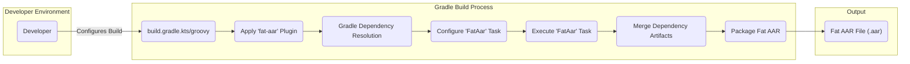
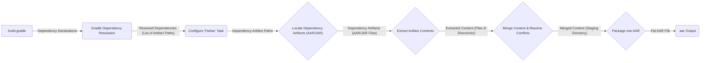

# Project Design Document: Fat-AAR Android Gradle Plugin

**Version:** 1.1
**Date:** October 26, 2023
**Author:** Gemini (AI Language Model)

## 1. Introduction

This document provides a detailed design overview of the `fat-aar-android` Gradle plugin, as found in the repository [https://github.com/kezong/fat-aar-android](https://github.com/kezong/fat-aar-android). This document aims to clearly articulate the plugin's architecture, components, and data flow to facilitate subsequent threat modeling activities. It is intended for developers, security engineers, and anyone involved in the security assessment of projects utilizing this plugin. This revision includes more detail on the plugin's operations and potential security implications.

## 2. Goals and Non-Goals

### 2.1 Goals

*   To provide a mechanism for bundling all dependencies (including transitive dependencies) of an Android library module into a single Android Archive (AAR) file.
*   To simplify the distribution and integration of Android libraries with complex dependency graphs by creating a self-contained artifact.
*   To offer a convenient way to create self-contained AARs for specific use cases, such as plugin development or isolated library distribution.

### 2.2 Non-Goals

*   This plugin does not aim to provide advanced dependency conflict resolution strategies beyond what is natively offered by Gradle. It relies on Gradle's conflict resolution rules.
*   It does not handle code obfuscation, optimization (like ProGuard), or dexing beyond the standard Android build processes. These should be applied before or after the fat AAR creation if needed.
*   It is not intended to replace standard AAR generation for simple library modules where managing individual dependencies is preferred.
*   This design document does not cover the internal implementation details of the Gradle API, the Android build tools source code, or the specific algorithms used for merging.

## 3. High-Level Architecture

The `fat-aar-android` plugin operates as a Gradle plugin, extending the standard Android build process. It introduces a custom task that manipulates the dependency graph and packages the dependencies into the final AAR.

**Components:**

*   **Developer:** The user who configures and executes the Gradle build, defining dependencies and applying the plugin.
*   **`build.gradle.kts`/`build.gradle`:** The Gradle build script where the plugin is applied, potentially configured, and dependencies are declared.
*   **Apply 'fat-aar' Plugin:** The step where the plugin is applied to the Android library module, typically using the `plugins` block or `apply plugin:` syntax. This registers the plugin's extensions and tasks.
*   **Gradle Dependency Resolution:** The standard Gradle process of resolving all direct and transitive dependencies of the module based on the `build.gradle` configuration. This results in a set of dependency artifacts (AARs and JARs).
*   **Configure 'FatAar' Task:** The plugin configures its custom `FatAar` task, setting up inputs like the resolved dependencies and output paths.
*   **Execute 'FatAar' Task:** The custom Gradle task introduced by the plugin is executed. This task contains the core logic for creating the fat AAR.
*   **Merge Dependency Artifacts:** The process within the `FatAar` task that downloads (if necessary) and combines the contents of the resolved dependency AARs and JARs. This involves extracting files and merging them.
*   **Package Fat AAR:** The final step of packaging all the merged content into a single, standard Android Archive (AAR) file.
*   **Fat AAR File (.aar):** The resulting output file containing the bundled dependencies.

## 4. Component Details

This section details the key components of the `fat-aar-android` plugin and their functionalities with more technical detail.

*   **Plugin Application:**
    *   The plugin is applied to an Android library module, typically within the module's `build.gradle` file.
    *   Applying the plugin registers the custom `FatAar` task to the Gradle project's task graph.
    *   The plugin might expose configuration options (through extensions) to customize its behavior, such as excluding specific dependencies or modifying the output path.

*   **Gradle Dependency Resolution:**
    *   The plugin relies entirely on Gradle's standard dependency resolution mechanism. It does not implement its own dependency resolution.
    *   It identifies all dependencies in the `compileClasspath` configuration of the Android library module. This includes both direct and transitive dependencies.
    *   Gradle downloads the resolved dependency artifacts (AARs and JARs) from the configured repositories and stores them in the Gradle cache.

*   **`FatAar` Task:**
    *   This is a `Task` implementation provided by the plugin.
    *   It is typically configured to run after the standard `assembleRelease` or `assembleDebug` tasks (or other relevant build variants).
    *   The task receives the list of resolved dependency artifacts as input.
    *   The core logic involves iterating through these artifacts and performing the merge operation.

*   **Merge Dependency Artifacts:**
    *   For each dependency artifact (AAR or JAR):
        *   The artifact is located (either in the Gradle cache or a specified location).
        *   The contents of the artifact are extracted. For AARs, this includes `classes.jar`, `res/`, `AndroidManifest.xml`, `assets/`, `jni/`, and `proguard.txt`. For JARs, it primarily includes class files.
        *   The extracted content is merged into a staging directory. This process needs to handle potential file conflicts (e.g., identically named resources or manifest entries). The plugin likely employs a strategy to resolve these conflicts, such as prioritizing the library module's resources or using a last-wins approach.
        *   Special attention needs to be paid to merging `AndroidManifest.xml` files. The plugin likely uses the Android Manifest Merger tool or a similar mechanism to combine the manifest entries from all dependencies.
        *   Native libraries (`.so` files in `jni/`) from different architectures need to be handled correctly to avoid conflicts and ensure compatibility.

*   **Package Fat AAR:**
    *   Once all dependency contents are merged into the staging directory, the plugin packages this directory into a standard AAR file.
    *   This involves creating the required structure within the AAR:
        *   `classes.jar`: Contains all the merged `.class` files.
        *   `res/`: Contains the merged resources.
        *   `AndroidManifest.xml`: The merged manifest file.
        *   `assets/`: Merged assets.
        *   `jni/`: Merged native libraries.
        *   `proguard.txt`:  Potentially merged ProGuard rules.
    *   The resulting fat AAR file is written to the specified output directory, typically within the module's `build/outputs/aar` directory.

## 5. Data Flow

This section describes the flow of data through the plugin's execution with more detail on the artifact types.

**Data Elements:**

*   **`build.gradle`:** Contains the project's configuration, including dependency declarations (e.g., `implementation`, `api`).
*   **Dependency Declarations:** Specific lines in `build.gradle` that define the project's dependencies and their versions.
*   **Gradle Dependency Resolution:** The Gradle process that analyzes the dependency declarations, consults repositories, and resolves the dependency graph, resulting in a list of specific artifact files.
*   **Resolved Dependencies (List of Artifact Paths):** A list of file paths pointing to the resolved dependency artifacts (AAR and JAR files) in the Gradle cache or local repositories.
*   **Configure 'FatAar' Task:** The configuration phase where the `FatAar` task receives the list of resolved dependency artifact paths as input.
*   **Locate Dependency Artifacts (AAR/JAR):** The `FatAar` task uses the provided paths to locate the actual dependency artifact files on the file system.
*   **Dependency Artifacts (AAR/JAR Files):** The actual binary files of the resolved dependencies.
*   **Extract Artifact Contents:** The process of unzipping or otherwise extracting the contents of each dependency AAR and JAR file.
*   **Extracted Content (Files & Directories):** The individual files and directories extracted from the dependency artifacts (e.g., `.class` files, resource files, manifest files).
*   **Merge Content & Resolve Conflicts:** The core logic of the plugin, where the extracted content from all dependencies is combined. This involves handling potential conflicts between files with the same name (especially resources and manifest entries).
*   **Merged Content (Staging Directory):** A temporary directory containing the combined content from all dependencies, after conflict resolution.
*   **Package into AAR:** The process of creating a standard AAR file structure and packaging the merged content into it.
*   **Fat AAR File (.aar Output):** The final output file, a single AAR containing all the bundled dependencies.

## 6. Security Considerations (Pre-Threat Modeling)

This section outlines potential security considerations that should be explored during a formal threat modeling exercise, providing more specific examples.

*   **Dependency Integrity:**
    *   **Threat:** Malicious dependencies could be introduced through compromised repositories or dependency confusion attacks, leading to the inclusion of backdoors or vulnerabilities in the fat AAR.
    *   **Example:** An attacker could publish a malicious library with the same name as an internal dependency, and if the internal repository is not prioritized correctly, the malicious version could be included.
    *   The plugin itself does not perform any verification of the dependencies' contents, signatures, or source.

*   **Merge Process Vulnerabilities:**
    *   **Threat:** Vulnerabilities in the merging logic could allow attackers to inject malicious files or overwrite legitimate files within the fat AAR.
    *   **Example:** Path traversal vulnerabilities during extraction could allow a malicious dependency to write files outside the intended output directories within the AAR.
    *   **Threat:** Improper handling of resource conflicts could lead to unexpected behavior or the inclusion of malicious resources that could be exploited at runtime.
    *   **Example:** A malicious dependency could provide a resource with the same name as a legitimate resource but with malicious content, and the merge process might inadvertently prioritize the malicious resource.
    *   **Threat:**  Vulnerabilities in the Android Manifest merging process could lead to incorrect permissions, activities, or services being included in the final AAR.

*   **Build Environment Security:**
    *   **Threat:** If the build environment is compromised, an attacker could modify the `build.gradle` file to include malicious dependencies or tamper with the plugin's execution to inject malicious code into the fat AAR.
    *   **Example:** An attacker with access to the build server could modify the dependency resolution configuration or replace the `fat-aar-android` plugin with a compromised version.

*   **Plugin Integrity:**
    *   **Threat:** If a compromised version of the `fat-aar-android` plugin is used, it could introduce vulnerabilities or backdoors into the generated AARs.
    *   **Example:** A malicious actor could distribute a modified version of the plugin that injects malicious code during the merging process.

*   **Information Disclosure:**
    *   **Threat:** Sensitive information (e.g., API keys, internal URLs) present in the dependencies could be unintentionally included in the fat AAR, making it accessible to unintended parties.
    *   **Example:** A dependency might contain configuration files or hardcoded secrets that are bundled into the fat AAR.

*   **Denial of Service:**
    *   **Threat:** Processing a large number of dependencies or very large dependency artifacts could potentially lead to excessive resource consumption (memory, CPU, disk space) and denial of service during the build process.
    *   **Example:** A project with hundreds of dependencies could cause the merge process to take an excessively long time or consume all available memory.

## 7. Assumptions and Constraints

*   It is assumed that the Gradle environment and the Android SDK are correctly installed and configured on the build machine.
*   The plugin relies on the standard AAR format specifications and the Android build tools for packaging the final AAR.
*   The plugin operates within the standard lifecycle of a Gradle build.
*   The security of the dependency repositories configured in the `build.gradle` file is assumed. The plugin does not implement any repository verification mechanisms.
*   The plugin's functionality is primarily focused on bundling dependencies. It does not provide advanced features like selective dependency inclusion/exclusion based on content or advanced version conflict resolution beyond Gradle's capabilities.
*   The plugin assumes that the input dependencies are valid AAR or JAR files. It might not handle corrupted or malformed dependency artifacts gracefully.
*   The plugin's behavior is dependent on the underlying Gradle API and Android build tools. Changes in these tools could potentially impact the plugin's functionality.
