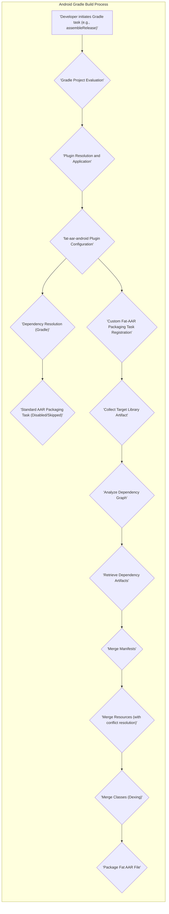
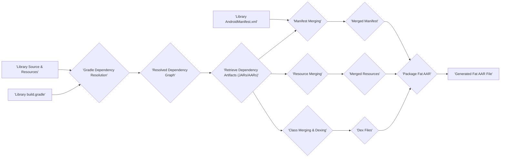

# Project Design Document: Fat-AAR Android (Improved)

**Document Version:** 1.1
**Date:** October 26, 2023
**Author:** AI Architecture Expert

## 1. Introduction

This document provides an enhanced design overview of the `fat-aar-android` project, a Gradle plugin engineered to bundle all transitive dependencies of an Android library module into a single Android Archive (AAR) file. This consolidated "fat" AAR simplifies dependency management for consuming applications, eliminating the need for explicit inclusion of transitive dependencies. This detailed design serves as the foundation for a comprehensive threat modeling exercise.

## 2. Goals and Objectives

*   **Primary Goal:** Develop a robust and reliable Gradle plugin capable of efficiently bundling all transitive dependencies of an Android library module into a single, self-contained AAR file.
*   **Objectives:**
    *   Achieve seamless integration within the Android Gradle build lifecycle, minimizing disruption to standard build processes.
    *   Ensure accurate and complete resolution and packaging of all direct and transitive dependencies, respecting dependency constraints and versions.
    *   Preserve the functional integrity of the original library and its bundled dependencies, avoiding conflicts or runtime issues.
    *   Offer flexible configuration options to customize the bundling process, such as excluding specific dependencies or managing dependency versions.
    *   Generate a valid and well-formed AAR file adhering to Android AAR specifications.
    *   Provide clear and informative logging and error handling during the bundling process.

## 3. System Architecture

The `fat-aar-android` plugin operates as an extension to the Android Gradle build process. It intercepts the standard AAR packaging workflow and introduces a custom task to create the fat AAR.

**Explanation of Components:**

*   **Developer initiates Gradle task (e.g., assembleRelease):** The developer triggers the build process.
*   **Gradle Project Evaluation:** Gradle evaluates the project's `build.gradle` files and settings.
*   **Plugin Resolution and Application:** Gradle resolves and applies all declared plugins, including `fat-aar-android`.
*   **`fat-aar-android` Plugin Configuration:** The plugin reads and applies any user-defined configurations from the `build.gradle` file.
*   **Dependency Resolution (Gradle):** Gradle resolves all direct and transitive dependencies of the library module based on declared dependencies and constraints.
*   **Standard AAR Packaging Task (Disabled/Skipped):** The default AAR packaging task provided by the Android Gradle Plugin is typically disabled or its output is ignored by the `fat-aar-android` plugin.
*   **Custom Fat-AAR Packaging Task Registration:** The `fat-aar-android` plugin registers a custom Gradle task responsible for creating the fat AAR.
*   **Collect Target Library Artifact:** The plugin identifies and retrieves the output AAR or relevant build artifacts of the target library module.
*   **Analyze Dependency Graph:** The plugin analyzes the resolved dependency graph to identify all direct and transitive dependencies that need to be included in the fat AAR.
*   **Retrieve Dependency Artifacts:** The plugin retrieves the actual JAR and AAR files of the identified dependencies from the Gradle cache or remote repositories.
*   **Merge Manifests:** The plugin merges the `AndroidManifest.xml` files from the target library and its dependencies, handling potential conflicts (e.g., using a priority-based approach).
*   **Merge Resources (with conflict resolution):** The plugin merges resources from the library and its dependencies. This step requires robust conflict resolution logic to handle resources with the same name (e.g., preferring resources from the main library or providing configuration options).
*   **Merge Classes (Dexing):** The plugin merges the compiled Java/Kotlin classes from the library and its dependencies. This typically involves a dexing process to convert the `.class` files into Dalvik bytecode (`.dex`) suitable for Android.
*   **Package Fat AAR File:** The plugin packages all the merged resources, classes, and the merged manifest into a single AAR file according to the AAR specification.

## 4. Key Components

*   **Gradle Plugin Implementation (`FatAarPlugin.kt`):**
    *   The main entry point for the plugin, responsible for applying the plugin to the project.
    *   Registers the custom `FatAarTask`.
    *   Defines and handles plugin configuration options (e.g., exclusions, output path).
    *   Interacts with the Android Gradle Plugin's API to access build artifacts and dependency information.
    *   Potential Security Considerations: Vulnerabilities in the plugin implementation could allow malicious build scripts to execute arbitrary code or manipulate the build process.
*   **Custom Packaging Task (`FatAarTask.kt`):**
    *   The core component responsible for the fat AAR creation process.
    *   Orchestrates dependency collection, artifact retrieval, merging, and packaging.
    *   Implements the logic for merging manifests, resources, and classes.
    *   Handles error conditions and provides informative logging.
    *   Potential Security Considerations: Improper handling of dependency artifacts or merging logic could lead to vulnerabilities being included in the fat AAR or denial-of-service conditions during the build.
*   **Dependency Resolution Handler:**
    *   Leverages Gradle's `Configuration` and `ResolvedArtifactResult` APIs to traverse the dependency graph and obtain the file paths of dependency artifacts.
    *   Respects dependency scopes (e.g., `implementation`, `api`, `runtimeOnly`).
    *   Handles dependency exclusions and version conflicts.
    *   Potential Security Considerations: Incorrectly resolving dependencies could lead to the inclusion of unintended or vulnerable libraries.
*   **Manifest Merging Engine:**
    *   Implements the logic for merging `AndroidManifest.xml` files from the library and its dependencies.
    *   Handles merge rules and conflict resolution strategies defined by the Android Manifest Merger.
    *   Potential Security Considerations: Vulnerabilities in the merging logic could allow malicious manifests to override critical settings or introduce unexpected permissions.
*   **Resource Merging Engine:**
    *   Responsible for merging resources from the library and its dependencies.
    *   Implements conflict resolution strategies (e.g., using the resource from the main library, providing options for conflict resolution).
    *   Potential Security Considerations: Improper resource merging could lead to resource hijacking or denial-of-service by overwriting or corrupting resources.
*   **Class Merging and Dexing Logic:**
    *   Merges the compiled `.class` files from the library and its dependencies.
    *   Invokes the Android Dexer (e.g., D8 or R8) to convert the merged classes into Dalvik bytecode.
    *   Potential Security Considerations: Issues during class merging or dexing could lead to runtime exceptions or unexpected behavior in the consuming application.
*   **AAR Packaging Logic:**
    *   Uses standard Java ZIP libraries or Android Gradle Plugin APIs to create the final AAR file structure.
    *   Includes the merged manifest, resources, and dex files.
    *   Potential Security Considerations: Incorrect AAR packaging could lead to malformed AAR files that are rejected by the Android system or could be exploited.
*   **Configuration Options (within `build.gradle.kts` or `build.gradle`):**
    *   Allows users to customize the plugin's behavior.
    *   Examples:
        *   `excludeDependencies`: A list of dependency coordinates to exclude from the fat AAR.
        *   `outputFileName`:  Custom name for the generated fat AAR file.
        *   `resourceConflictStrategy`:  Option to define how resource conflicts are resolved.
    *   Potential Security Considerations: Improperly validated configuration options could be exploited to bypass security measures or introduce malicious content.

## 5. Data Flow

The data flow within the `fat-aar-android` plugin involves several stages of processing and transformation:

*   **Input:**
    *   Android library module's source code and resources.
    *   Library module's `build.gradle` file with dependency declarations and plugin configuration.
    *   Resolved dependency artifacts (JARs and AARs) from the Gradle cache or remote repositories.
    *   The AndroidManifest.xml file of the library module.
*   **Processing:**
    1. **Dependency Resolution:** Gradle resolves the complete dependency graph based on the library's `build.gradle`.
    2. **Artifact Retrieval:** The plugin retrieves the actual JAR and AAR files of the target library and its transitive dependencies.
    3. **Manifest Merging:** The plugin merges the `AndroidManifest.xml` files, applying merge rules and resolving conflicts.
    4. **Resource Merging:** The plugin merges resources from all included artifacts, applying the configured conflict resolution strategy.
    5. **Class Merging and Dexing:** The plugin merges the `.class` files and converts them to `.dex` format.
    6. **AAR Packaging:** The merged manifest, resources, and dex files are packaged into a single AAR file.
*   **Output:**
    *   A single "fat" AAR file containing the library's code, resources, and the code and resources of its transitive dependencies.

## 6. Security Considerations (Detailed)

This section provides a more detailed analysis of potential security considerations for threat modeling:

*   **Dependency Integrity and Supply Chain Attacks:**
    *   Threat: Malicious actors could compromise dependencies hosted on remote repositories, leading to the inclusion of vulnerable or malicious code in the fat AAR.
    *   Mitigation Considerations: Implement checksum verification for downloaded dependencies, integrate with dependency scanning tools to identify known vulnerabilities, consider using private or curated dependency repositories.
*   **Resource Conflict Exploitation:**
    *   Threat: Attackers could craft malicious dependencies with resource names designed to overwrite legitimate resources in the target library, potentially leading to UI manipulation or information disclosure.
    *   Mitigation Considerations: Thoroughly analyze the plugin's resource merging strategy, provide options for strict conflict resolution, consider namespace isolation for resources.
*   **Manifest Merging Vulnerabilities:**
    *   Threat: Malicious dependencies could include manifest entries that grant unintended permissions or expose components, potentially compromising the security of applications using the fat AAR.
    *   Mitigation Considerations: Carefully review the manifest merging logic, enforce strict validation of merged manifest entries, provide options to review and modify the merged manifest.
*   **Classloading and Code Execution Issues:**
    *   Threat: While less direct in this plugin, issues in class merging or dexing could theoretically lead to unexpected code execution paths or runtime vulnerabilities in consuming applications.
    *   Mitigation Considerations: Ensure the use of robust and well-tested dexing tools, carefully handle potential class name collisions (though this plugin aims for simpler inclusion), consider bytecode scanning for known vulnerabilities.
*   **Plugin Vulnerabilities:**
    *   Threat: Vulnerabilities within the `fat-aar-android` plugin itself could be exploited if an attacker can influence the build process (e.g., through a compromised build script).
    *   Mitigation Considerations: Follow secure coding practices during plugin development, conduct regular security audits and penetration testing, keep dependencies of the plugin up-to-date.
*   **Information Disclosure through Dependencies:**
    *   Threat: Transitive dependencies might inadvertently include sensitive information (e.g., API keys, internal URLs) that could be exposed in the fat AAR.
    *   Mitigation Considerations: Encourage developers to review the dependencies being bundled, consider tools for scanning dependencies for sensitive information.
*   **Configuration Manipulation:**
    *   Threat: If plugin configuration is not properly validated, malicious actors might be able to manipulate the configuration to exclude critical security libraries or include vulnerable dependencies.
    *   Mitigation Considerations: Implement strict validation of all configuration options, ensure that only authorized users can modify the build configuration.

## 7. Deployment Considerations

The `fat-aar-android` plugin is deployed as a Gradle plugin and integrated into Android library projects.

*   **Integration:** Developers apply the plugin within the `plugins` block or using the `apply` statement in the library module's `build.gradle.kts` or `build.gradle` file.
*   **Execution Environment:** The plugin executes as part of the standard Android Gradle build process, typically on a developer's local machine or within a Continuous Integration/Continuous Delivery (CI/CD) pipeline.
*   **Dependency on Gradle and Android Gradle Plugin:** The plugin relies on the functionality and APIs provided by Gradle and the Android Gradle Plugin. Security vulnerabilities in these underlying platforms could indirectly impact the security of the `fat-aar-android` plugin.
*   **Distribution:** The plugin itself is typically distributed through the Gradle Plugin Portal or a private Maven repository. Ensuring the integrity of the plugin's distribution channel is important to prevent supply chain attacks targeting the plugin itself.

## 8. Future Enhancements (Optional)

*   **Fine-grained Dependency Exclusion:** Allow more specific exclusion rules based on dependency attributes (e.g., version, scope).
*   **Dependency Shading/Relocation:** Implement techniques to repackage dependencies to avoid class name collisions and potential conflicts.
*   **Automated Vulnerability Scanning Integration:** Integrate with dependency scanning tools to automatically identify and flag potential vulnerabilities in bundled dependencies during the build process.
*   **Support for Different Dependency Configurations:** Allow users to specify which dependency configurations should be included in the fat AAR.
*   **Improved Logging and Reporting:** Provide more detailed logs and reports about the bundling process, including information about merged resources and potential conflicts.

This improved design document provides a more detailed and nuanced understanding of the `fat-aar-android` project, specifically tailored for effective threat modeling. The expanded descriptions of components, data flow, and security considerations offer a solid foundation for identifying and mitigating potential risks.
