## Project Design Document: Fat-AAR Android Gradle Plugin (Improved)

**1. Introduction**

This document provides an enhanced design overview of the `fat-aar-android` Gradle plugin. This plugin streamlines the creation of "fat" Android Archive (AAR) files by embedding all transitive dependencies of an Android library module into a single, self-contained artifact. This approach simplifies distribution, reduces dependency conflicts for consumers, and can be beneficial in environments with restricted dependency management. This document details the plugin's architecture, operational flow, and crucial security considerations, serving as a comprehensive resource for threat modeling and further development.

**2. Goals and Objectives**

* **Primary Goal:** To provide a robust and user-friendly Gradle plugin that automates the generation of "fat" AAR files, encapsulating all direct and transitive dependencies of an Android library module. This simplifies integration for consumers by eliminating the need to manage individual dependency versions.
* **Objectives:**
    * Offer a straightforward mechanism to apply the plugin to any Android library module via Gradle.
    * Accurately identify, resolve, and package all direct and transitive dependencies, including various dependency types (JAR, AAR).
    * Implement robust conflict resolution strategies to handle potential version clashes between dependencies.
    * Generate a standard-compliant and valid AAR file that adheres to the Android AAR specification.
    * Minimize interference with the standard Android build lifecycle and other Gradle plugins.
    * Provide configurable options to customize the bundling process, such as excluding specific dependencies or managing dependency scopes.
    * Offer clear and informative logging to aid in debugging and understanding the plugin's operation.

**3. Architecture and Components**

The `fat-aar-android` plugin functions as a standard Gradle plugin, extending the Android build process with custom logic and tasks. Key components include:

* **Gradle Plugin Implementation (`com.kezong.fat-aar`)**: The core of the plugin, typically implemented in Groovy or Kotlin, extending Gradle's `Plugin<Project>` interface. This component is responsible for registering tasks and configuring the plugin's behavior.
* **Custom Gradle Tasks**: The plugin introduces specific Gradle tasks to manage the fat AAR creation process. These tasks are integral to the plugin's functionality:
    * **`assembleFatAar`**: The primary task invoked to generate the fat AAR. It orchestrates the dependency resolution and packaging steps. This task typically depends on standard Android library tasks like `assembleRelease` or `assembleDebug`.
    * **`resolveFatAarDependencies`**: A task dedicated to analyzing the project's dependencies and resolving the complete dependency graph, including transitive dependencies. This task leverages Gradle's `Configuration` API to access resolved dependencies.
    * **`packageFatAar`**: This task is responsible for taking the resolved dependency artifacts and packaging them into the final AAR file. It involves manipulating ZIP archives and potentially merging resources.
* **Gradle Configuration DSL**: The plugin exposes a Domain Specific Language (DSL) within the `build.gradle` file, allowing users to configure plugin-specific settings, such as dependency exclusions or custom packaging rules.
* **Input Artifacts**:
    * **Target Android Library Module**: The Android library project to which the plugin is applied.
    * **`build.gradle` File**: Contains the plugin application and any custom configurations provided by the user.
    * **Declared Dependencies**: Dependencies explicitly declared in the `dependencies` block of the module's `build.gradle` file.
    * **Transitive Dependencies**: Dependencies that are required by the declared dependencies.
    * **Resolved Dependency Artifacts**: The actual JAR and AAR files of the resolved dependencies, typically located in the Gradle cache.
* **Output Artifact**:
    * **Fat AAR File**: The resulting AAR file, located in the module's `build/outputs/aar` directory (or a configurable location), containing the library's compiled code, resources, and all its bundled dependencies.
* **Temporary Files/Directories**: The plugin might utilize temporary directories within the `build` directory to store intermediate files during the dependency resolution, extraction, and packaging processes.

**4. Data Flow**

The generation of a fat AAR involves a series of steps orchestrated by the plugin's tasks:

```mermaid
graph LR
    subgraph "Gradle Build Process"
        A("Start Gradle Build") --> B("Apply 'com.kezong.fat-aar' Plugin");
        B --> C{"Configure Fat-Aar Extension"};
        C --> D("Execute 'assembleFatAar' Task");
    end

    subgraph "Fat-Aar Plugin Execution"
        D --> E("Execute 'resolveFatAarDependencies' Task");
        E --> F{"Analyze Project Dependencies"};
        F --> G{"Resolve Dependency Graph (Gradle API)"};
        G --> H("Retrieve Resolved Artifacts");
        H --> I("Execute 'packageFatAar' Task");
        I --> J("Create Temporary Directory");
        J --> K("Extract Contents of Dependency AARs");
        K --> L("Copy Contents of Dependency JARs");
        L --> M{"Handle Resource Conflicts (if any)"};
        M --> N("Package into Fat AAR (Zip API)");
        N --> O("Generate Fat AAR File");
        O --> P("Clean Up Temporary Directory");
    end

    style A fill:#f9f,stroke:#333,stroke-width:2px
    style P fill:#ccf,stroke:#333,stroke-width:2px
```



Detailed steps:

1. **Start Gradle Build:** The user initiates a Gradle build for the Android library module, typically by running a Gradle command.
2. **Apply 'com.kezong.fat-aar' Plugin:** Gradle processes the `build.gradle` file and applies the `com.kezong.fat-aar` plugin based on the `plugins` block.
3. **Configure Fat-Aar Extension:** The plugin registers its configuration extension, allowing users to customize its behavior within the `build.gradle` file.
4. **Execute 'assembleFatAar' Task:** When the `assembleFatAar` task is executed (either directly or as a dependency of another task), the fat AAR generation process begins.
5. **Execute 'resolveFatAarDependencies' Task:** This task is responsible for analyzing the project's declared dependencies and leveraging Gradle's dependency resolution engine to build the complete dependency graph. It uses Gradle's `Configuration.getResolvedConfiguration().getResolvedArtifacts()` to retrieve the resolved artifacts.
6. **Analyze Project Dependencies:** The task analyzes the `dependencies` block in the `build.gradle` file to identify the direct dependencies.
7. **Resolve Dependency Graph (Gradle API):** Gradle's internal dependency resolution mechanism is invoked to determine all transitive dependencies.
8. **Retrieve Resolved Artifacts:** The task retrieves the actual file paths of the resolved dependency artifacts (JARs and AARs) from Gradle's cache.
9. **Execute 'packageFatAar' Task:** This task takes the list of resolved dependency artifacts and packages them into the fat AAR.
10. **Create Temporary Directory:** A temporary directory is created within the module's `build` directory to stage the contents of the dependencies.
11. **Extract Contents of Dependency AARs:** The contents (classes, resources, assets, etc.) of each resolved AAR dependency are extracted into the temporary directory.
12. **Copy Contents of Dependency JARs:** The contents (primarily class files) of each resolved JAR dependency are copied into the temporary directory.
13. **Handle Resource Conflicts (if any):** The plugin might implement strategies to handle potential resource conflicts between the library module and its dependencies (e.g., using a "first-win" strategy or providing configuration options for conflict resolution).
14. **Package into Fat AAR (Zip API):** The plugin uses a library like `java.util.zip.ZipOutputStream` to create a new AAR archive. It includes the contents of the library module and the extracted/copied contents of its dependencies.
15. **Generate Fat AAR File:** The final fat AAR file is written to the designated output directory (e.g., `build/outputs/aar`).
16. **Clean Up Temporary Directory:** The temporary directory and its contents are deleted to avoid leaving behind unnecessary files.

**5. Deployment**

The `fat-aar-android` plugin is deployed as a Gradle plugin, making it accessible to Android projects. Common deployment methods include:

* **Gradle Plugin Portal:** The recommended method. The plugin is published to the Gradle Plugin Portal, allowing users to easily apply it by specifying its ID in the `plugins` block of their `build.gradle` file.
* **`buildSrc` Directory:** For internal or project-specific plugins, the plugin code can be placed in the `buildSrc` directory of the root project. Gradle automatically compiles and makes plugins in this directory available.
* **Standalone JAR Distribution:** The plugin can be packaged as a JAR file and distributed. Users can then apply the plugin using the `apply plugin:` syntax, referencing the JAR file.

To use the plugin, developers add the following to their Android library module's `build.gradle` file:

```gradle
plugins {
    id 'com.android.library'
    id 'com.kezong.fat-aar'
}
```

Optionally, configuration can be added within the `android` block or a dedicated `fatAar` block (depending on the plugin's implementation).

**6. Security Considerations (For Threat Modeling)**

This section details potential security considerations relevant to the `fat-aar-android` plugin, providing a basis for threat modeling activities:

* **Supply Chain Attacks (Dependency Confusion/Substitution):**
    * **Risk:** A malicious actor could attempt to inject compromised dependencies by exploiting vulnerabilities in Gradle's dependency resolution process or by publishing a malicious package with the same name as a legitimate dependency.
    * **Considerations:** Does the plugin rely on Gradle's dependency verification mechanisms (e.g., checksum verification, signing)? How does it handle potential conflicts between different versions of the same dependency?
    * **Mitigation Strategies:** Encourage users to utilize Gradle's dependency verification features. The plugin itself could potentially provide warnings if dependency verification fails.
* **Malicious Dependencies Inclusion:**
    * **Risk:** If a project includes a compromised dependency (either directly or transitively), the plugin will bundle it into the fat AAR, potentially introducing vulnerabilities into applications that consume the library.
    * **Considerations:** The plugin itself doesn't inherently prevent this, but it's crucial to understand the impact of bundling potentially malicious code.
    * **Mitigation Strategies:** Recommend users employ dependency scanning tools to identify known vulnerabilities in their dependencies before generating the fat AAR.
* **Tampering with Generated AAR:**
    * **Risk:** An attacker could potentially modify the generated fat AAR file after it's created, injecting malicious code or altering its functionality before it's distributed or consumed.
    * **Considerations:** Does the plugin offer any mechanisms to ensure the integrity of the generated AAR (e.g., generating checksums, signing the AAR)?
    * **Mitigation Strategies:** Suggest users sign their generated AAR files before distribution.
* **Information Disclosure in Temporary Files:**
    * **Risk:** Sensitive information (e.g., API keys, credentials) might be present in the contents of dependencies and could be exposed if temporary files are not handled securely (e.g., left with overly permissive permissions or not deleted properly).
    * **Considerations:** How does the plugin manage temporary files? Are they created with appropriate permissions? Are they securely deleted after use?
    * **Mitigation Strategies:** Ensure temporary directories are created with restricted permissions and are deleted immediately after use.
* **Plugin Vulnerabilities:**
    * **Risk:** The plugin itself could contain vulnerabilities in its code (e.g., in its dependency resolution logic, file handling, or ZIP manipulation) that could be exploited by malicious actors.
    * **Considerations:** Regular security audits and updates of the plugin are essential. Secure coding practices should be followed during plugin development.
    * **Mitigation Strategies:** Implement thorough input validation and sanitization. Regularly review and update the plugin's dependencies.
* **Resource Conflicts and Overrides (Potential for Denial of Service or Unexpected Behavior):**
    * **Risk:** Improper handling of resource conflicts during the merging process could lead to unexpected behavior in consuming applications or potentially create denial-of-service scenarios if critical resources are overwritten.
    * **Considerations:** How does the plugin handle resource merging? Does it provide options for users to define conflict resolution strategies?
    * **Mitigation Strategies:** Implement robust resource merging strategies and provide users with options to customize conflict resolution.
* **Exposure of Internal Library Structure:**
    * **Risk:** Bundling all dependencies can expose internal implementation details of the library, potentially making it easier for attackers to understand the library's structure and identify potential vulnerabilities.
    * **Considerations:** This is an inherent trade-off of creating a fat AAR. The threat model should acknowledge this increased attack surface.
    * **Mitigation Strategies:**  Consider the implications of exposing internal dependencies and potentially obfuscate code if necessary.
* **Supply Chain Security of the Plugin Itself:**
    * **Risk:** If the plugin's own dependencies or the plugin distribution mechanism are compromised, malicious code could be injected into the plugin itself, affecting all users of the plugin.
    * **Considerations:** Secure development practices for the plugin, secure management of the plugin's dependencies, and secure distribution channels are crucial.
    * **Mitigation Strategies:** Utilize dependency scanning for the plugin's own dependencies. Secure the plugin's release process and distribution channels.

**7. Future Considerations**

* **Enhanced Dependency Exclusion/Filtering:** Provide more fine-grained control over which dependencies are included or excluded based on various criteria (e.g., group ID, artifact ID, version).
* **Advanced Conflict Resolution Strategies:** Implement more sophisticated strategies for resolving dependency conflicts, such as semantic versioning-aware conflict resolution.
* **Integration with Dependency Analysis and Vulnerability Scanning Tools:** Provide hooks or integrations with tools that can analyze dependencies for known security vulnerabilities.
* **Support for Different Packaging Formats or Customizations:** Explore the possibility of generating other "fat" artifacts or allowing users to customize the packaging process further.
* **Improved Error Handling and Logging:** Enhance error messages and logging to provide more detailed information for debugging and troubleshooting.
* **Performance Optimization:** Investigate potential performance bottlenecks in the dependency resolution and packaging processes and implement optimizations.
* **Support for Different Dependency Scopes:** Allow users to specify which dependency scopes should be included in the fat AAR.