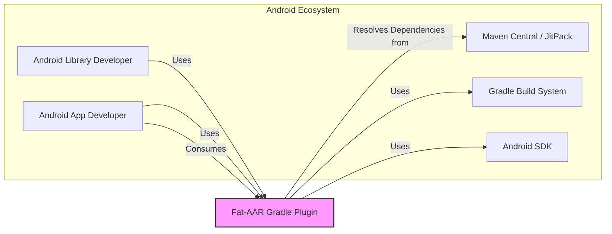
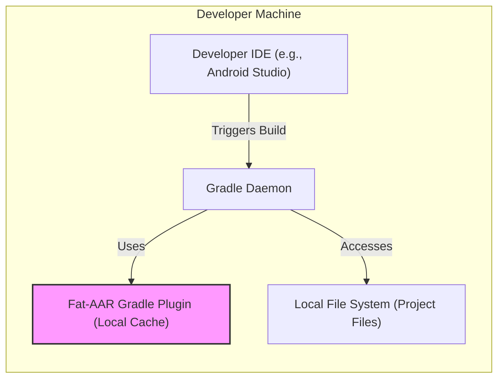
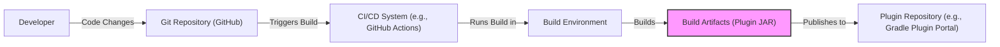

# BUSINESS POSTURE

This project, `fat-aar-android`, aims to simplify the distribution and integration of Android libraries. By creating "fat" AAR files that bundle dependencies, it addresses the common problem of dependency conflicts and management complexity for Android developers.

- Business Priorities and Goals:
  - Simplify Android library distribution for library developers.
  - Streamline Android library integration for application developers.
  - Reduce dependency conflicts in Android projects.
  - Improve developer experience by providing self-contained library artifacts.

- Most Important Business Risks:
  - Increased size of AAR artifacts, potentially impacting download times and application size.
  - Dependency conflicts if bundled dependencies clash with dependencies already present in the consuming application.
  - Security vulnerabilities arising from outdated or compromised bundled dependencies.
  - Potential for build process complexity and increased build times.

# SECURITY POSTURE

This section outlines the existing and recommended security posture for the `fat-aar-android` project.

- Existing Security Controls:
  - security control: Open source project hosted on GitHub, leveraging community review for code quality and potential security issues. (Implemented: GitHub repository)
  - security control: Use of Gradle and Android SDK, which are widely adopted and have established security practices. (Implemented: Build system and dependencies)
  - security control: Version control using Git, providing history and traceability of code changes. (Implemented: Git repository)

- Accepted Risks:
  - accepted risk: Potential vulnerabilities in third-party dependencies bundled within the fat AAR.
  - accepted risk: Risk of supply chain attacks targeting dependencies used by the plugin.
  - accepted risk: Reliance on the security of the underlying Gradle and Android SDK environments.

- Recommended Security Controls:
  - security control: Implement automated dependency scanning to identify known vulnerabilities in bundled dependencies.
  - security control: Establish a process for regularly updating dependencies to patch security vulnerabilities.
  - security control: Integrate static analysis security testing (SAST) tools into the build process to identify potential code-level security issues in the plugin itself.
  - security control: Consider signing the generated fat AAR artifacts to ensure integrity and authenticity.
  - security control: Implement input validation for Gradle plugin configurations to prevent injection attacks or unexpected behavior.

- Security Requirements:
  - Authentication: Not directly applicable to the plugin itself, as it is a build-time tool. However, if distribution mechanisms are implemented (e.g., publishing to a repository), authentication for publishing would be required.
  - Authorization: Not directly applicable to the plugin itself. Access control to the plugin's source code and build environment should be managed through standard repository and infrastructure access controls.
  - Input Validation: The plugin should validate all inputs from the Gradle build script (configurations, dependencies) to prevent unexpected behavior, injection attacks, or denial-of-service. Input validation should be implemented within the plugin's Groovy/Kotlin code.
  - Cryptography: Cryptography might be relevant if the plugin or its dependencies handle sensitive data or require secure communication. If cryptography is used, ensure proper implementation and key management practices are followed within the plugin and its dependencies.

# DESIGN

This section provides a detailed design of the `fat-aar-android` project, using the C4 model to illustrate different levels of abstraction.

## C4 CONTEXT



- Context Diagram Elements:
  - - Name: Android Library Developer
    - Type: Person
    - Description: Developers who create Android libraries and want to distribute them easily.
    - Responsibilities: Develops and publishes Android libraries. Uses the Fat-AAR Gradle Plugin to create distributable artifacts.
    - Security controls: Follows secure coding practices when developing libraries. Manages credentials for publishing libraries if applicable.

  - - Name: Android App Developer
    - Type: Person
    - Description: Developers who build Android applications and consume Android libraries.
    - Responsibilities: Develops Android applications. Integrates Android libraries into applications. Benefits from simplified dependency management provided by fat AARs.
    - Security controls: Reviews and selects libraries from trusted sources. Performs dependency vulnerability scanning in their applications.

  - - Name: Maven Central / JitPack
    - Type: External System
    - Description: Public repositories for hosting and distributing Java and Android libraries.
    - Responsibilities: Hosts and provides access to Android libraries and their dependencies.
    - Security controls: Implements security measures to protect hosted artifacts and infrastructure. Provides checksums and signing for published artifacts.

  - - Name: Gradle Build System
    - Type: External System
    - Description: A powerful build automation tool used for Android projects.
    - Responsibilities: Manages project dependencies, compiles code, runs tests, and packages applications and libraries. Executes the Fat-AAR Gradle Plugin.
    - Security controls: Provides secure build environment. Supports dependency verification and signing.

  - - Name: Android SDK
    - Type: External System
    - Description: Software Development Kit provided by Google for Android development. Includes tools for building, testing, and debugging Android applications.
    - Responsibilities: Provides necessary tools and libraries for Android development, including AAR packaging tools.
    - Security controls: Google is responsible for the security of the Android SDK. Developers should use the latest stable version of the SDK.

  - - Name: Fat-AAR Gradle Plugin
    - Type: Software System
    - Description: Gradle plugin that automates the process of creating "fat" AAR files by bundling dependencies.
    - Responsibilities: Resolves dependencies of an Android library. Packages the library and its dependencies into a single AAR file. Provides configuration options for customizing the fat AAR creation process.
    - Security controls: Input validation of Gradle configurations. Dependency scanning during build process (recommended). Secure handling of dependencies.

## C4 CONTAINER

```mermaid
flowchart LR
    subgraph "Fat-AAR Gradle Plugin"
        A["Gradle Plugin Code" ]
        B["Dependency Resolution" ]
        C["AAR Packaging" ]
    end

    A -- Uses --> B
    A -- Uses --> C
    B -- Uses --> "Maven Central / JitPack"
    C -- Uses --> "Android SDK Tools"

    style A fill:#f9f,stroke:#333,stroke-width:2px
```

- Container Diagram Elements:
  - - Name: Gradle Plugin Code
    - Type: Container - Code (Groovy/Kotlin)
    - Description: The core logic of the Fat-AAR Gradle Plugin, written in Groovy or Kotlin. Handles configuration, dependency resolution orchestration, and AAR packaging invocation.
    - Responsibilities: Reads plugin configurations from Gradle build scripts. Orchestrates dependency resolution using Gradle's dependency management. Invokes Android SDK tools for AAR packaging. Implements plugin logic and build tasks.
    - Security controls: Input validation of plugin configurations. SAST scanning of plugin code (recommended). Secure coding practices.

  - - Name: Dependency Resolution
    - Type: Container - Gradle Feature
    - Description: Gradle's built-in dependency resolution mechanism. Responsible for resolving and downloading dependencies declared in the Android library project and its plugin configuration.
    - Responsibilities: Resolves dependencies from configured repositories (Maven Central, JitPack, etc.). Manages dependency versions and conflicts. Downloads dependency artifacts.
    - Security controls: Gradle's dependency verification features. Secure communication channels for downloading dependencies (HTTPS).

  - - Name: AAR Packaging
    - Type: Container - Android SDK Tools
    - Description: Tools from the Android SDK (like AAPT2, d8/R8) used to package the Android library and its bundled dependencies into an AAR file.
    - Responsibilities: Compiles resources and code. Packages compiled code and resources into AAR format. Optimizes and minifies code (R8).
    - Security controls: Security of Android SDK tools is managed by Google. Plugin relies on the security of these tools.

## DEPLOYMENT

For the Fat-AAR Gradle Plugin, the "deployment" primarily refers to its availability and usage within developer environments and build systems. The plugin itself is not deployed as a running service, but rather as a build tool dependency.

Deployment Architecture Option 1: Local Developer Machine
Deployment Architecture Option 2: CI/CD Build Server

We will describe Deployment Architecture Option 1: Local Developer Machine in detail.



- Deployment Diagram Elements (Local Developer Machine):
  - - Name: Developer IDE (e.g., Android Studio)
    - Type: Environment - Software Application
    - Description: Integrated Development Environment used by Android developers to write code, manage projects, and trigger builds.
    - Responsibilities: Provides interface for developers to interact with the project and build system. Executes Gradle tasks.
    - Security controls: IDE security is the responsibility of the developer and organization. Secure coding practices within the IDE.

  - - Name: Gradle Daemon
    - Type: Environment - Process
    - Description: Background process that runs Gradle builds. Improves build speed by caching and reusing build information.
    - Responsibilities: Executes Gradle build scripts. Manages build processes and dependencies. Invokes Gradle plugins.
    - Security controls: Secure configuration of Gradle Daemon. Access control to the machine where Daemon runs.

  - - Name: Fat-AAR Gradle Plugin (Local Cache)
    - Type: Environment - Software Library/Plugin
    - Description: The Fat-AAR Gradle Plugin, downloaded and cached locally by Gradle for use in builds.
    - Responsibilities: Provides fat AAR functionality during Gradle builds. Executes within the Gradle Daemon process.
    - Security controls: Plugin security is ensured through development and build process. Local cache integrity is managed by Gradle.

  - - Name: Local File System (Project Files)
    - Type: Environment - Data Storage
    - Description: The developer's local file system where project source code, Gradle build scripts, and plugin are stored and accessed.
    - Responsibilities: Stores project files and build artifacts. Provides access to files for the IDE and Gradle Daemon.
    - Security controls: File system permissions and access controls. Encryption of local file system (optional).

## BUILD

The build process for the Fat-AAR Gradle Plugin focuses on creating and publishing the plugin itself, not the fat AARs it generates.



- Build Process Elements:
  - - Name: Developer
    - Type: Person
    - Description: Developer working on the Fat-AAR Gradle Plugin.
    - Responsibilities: Writes code for the plugin. Commits code changes to the Git repository.
    - Security controls: Secure coding practices. Code review process. Authentication for Git access.

  - - Name: Git Repository (GitHub)
    - Type: System - Version Control
    - Description: GitHub repository hosting the source code of the Fat-AAR Gradle Plugin.
    - Responsibilities: Stores and manages source code. Provides version control and collaboration features. Triggers CI/CD pipelines on code changes.
    - Security controls: Access control to the repository. Branch protection rules. Audit logs.

  - - Name: CI/CD System (e.g., GitHub Actions)
    - Type: System - Automation
    - Description: Continuous Integration and Continuous Delivery system used to automate the build, test, and release process of the plugin.
    - Responsibilities: Automates build process. Runs tests. Performs security checks (SAST, dependency scanning - recommended). Publishes build artifacts.
    - Security controls: Secure configuration of CI/CD pipelines. Secrets management for credentials. Isolation of build environments.

  - - Name: Build Environment
    - Type: Environment - Isolated Environment
    - Description: Isolated environment where the plugin build process is executed.
    - Responsibilities: Provides necessary tools and dependencies for building the plugin. Executes build commands.
    - Security controls: Secure and hardened build environment. Minimal necessary tools installed. Regular patching and updates.

  - - Name: Build Artifacts (Plugin JAR)
    - Type: Artifact - Software Artifact
    - Description: Compiled JAR file of the Fat-AAR Gradle Plugin.
    - Responsibilities: Contains the distributable plugin code.
    - Security controls: Signing of JAR artifact (recommended). Integrity checks.

  - - Name: Plugin Repository (e.g., Gradle Plugin Portal)
    - Type: System - Artifact Repository
    - Description: Repository for hosting and distributing Gradle plugins.
    - Responsibilities: Hosts and provides access to Gradle plugins.
    - Security controls: Secure artifact repository. Access control for publishing. Integrity checks and signing verification for plugins.

# RISK ASSESSMENT

- Critical Business Process:
  - Distribution and integration of Android libraries. The plugin aims to improve the efficiency and reduce errors in this process.

- Data to Protect and Sensitivity:
  - Source code of the Fat-AAR Gradle Plugin: Intellectual property, moderate sensitivity. Unauthorized access or modification could lead to compromised plugin versions.
  - Build artifacts (Plugin JAR): Publicly distributed, but integrity is critical. Compromised plugin JAR could be distributed to developers, posing a supply chain risk.
  - Dependencies of the plugin: Publicly available, but vulnerabilities in dependencies can introduce security risks.
  - Developer credentials and CI/CD secrets: High sensitivity. Compromise could lead to unauthorized code changes, builds, and publishing of malicious plugin versions.

# QUESTIONS & ASSUMPTIONS

- Questions:
  - What is the intended distribution mechanism for the Fat-AAR Gradle Plugin itself? (e.g., Gradle Plugin Portal, Maven Central)
  - Are there specific performance requirements for the plugin in terms of build time overhead?
  - What is the expected scale of usage for this plugin? (Number of users, projects)
  - Are there any specific legal or compliance requirements related to the dependencies bundled in the fat AARs?
  - What is the process for users to report issues or security vulnerabilities related to the plugin?

- Assumptions:
  - The primary goal is to simplify Android library distribution and usage for developers.
  - Security is a secondary but important consideration.
  - The plugin is intended to be used in standard Android development environments with Gradle.
  - Developers using the plugin are expected to have a basic understanding of Gradle and Android development.
  - The plugin will be maintained and updated to address issues and security vulnerabilities.