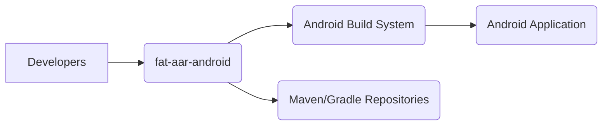
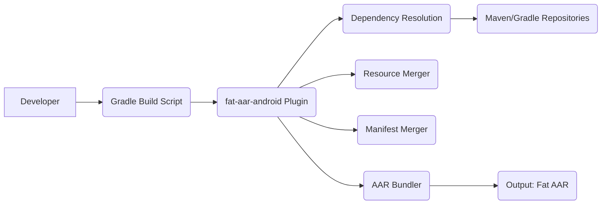
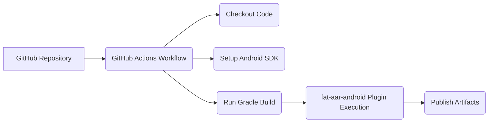
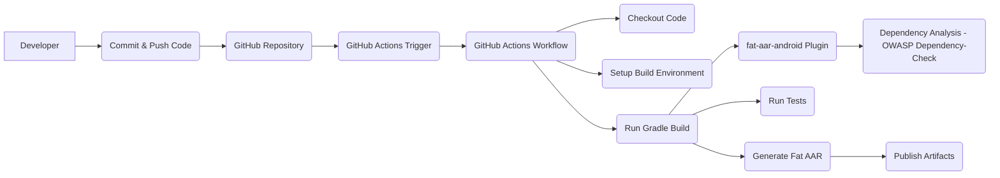

Okay, let's create a design document for the `fat-aar-android` project.

# BUSINESS POSTURE

Business Priorities and Goals:

*   Enable developers to easily integrate Android libraries (AARs) with their dependencies into a single, unified AAR file.
*   Simplify the build process for Android applications that rely on multiple libraries, especially when those libraries have overlapping or conflicting dependencies.
*   Reduce the complexity of managing transitive dependencies in Android projects.
*   Provide a reliable and maintainable solution for bundling AARs.
*   Improve developer productivity by streamlining the library integration process.

Most Important Business Risks:

*   Incompatibility with specific Android build tools or Gradle versions, leading to build failures.
*   Incorrect handling of resource merging or manifest merging, causing runtime errors or unexpected application behavior.
*   Security vulnerabilities introduced through the bundled dependencies, potentially exposing applications to exploits.
*   Lack of proper dependency resolution, leading to conflicts and runtime crashes.
*   Performance overhead introduced by the bundling process, impacting application startup time or runtime performance.
*   Maintenance overhead and difficulty in updating the tool to support new Android features or build system changes.

# SECURITY POSTURE

Existing Security Controls:

*   security control: The project is open-source, allowing for community review and contributions, which can help identify and address security issues. (Described in GitHub repository)
*   security control: The project uses Gradle, a well-established build system with its own security considerations and best practices. (Described in GitHub repository)

Accepted Risks:

*   accepted risk: The project relies on the security of the underlying dependencies that are being bundled. Any vulnerabilities in those dependencies will be inherited by the final AAR.
*   accepted risk: The project does not perform any specific security hardening or vulnerability scanning of the bundled AARs.
*   accepted risk: The project is dependent on the security of the build environment where it is executed.

Recommended Security Controls:

*   security control: Integrate a dependency analysis tool (e.g., OWASP Dependency-Check, Snyk) into the build process to identify known vulnerabilities in the bundled dependencies.
*   security control: Implement a mechanism to verify the integrity of the downloaded dependencies (e.g., checksum verification) to prevent supply chain attacks.
*   security control: Regularly update the project's dependencies, including Gradle and any build plugins, to address security patches.
*   security control: Provide clear documentation on the security implications of using the tool and best practices for securing the bundled AARs.

Security Requirements:

*   Authentication: Not directly applicable to this project, as it's a build tool and doesn't handle user authentication.
*   Authorization: Not directly applicable, as it operates within the build process and doesn't manage user permissions.
*   Input Validation: The tool should validate the input AAR files to ensure they are valid and well-formed. This can help prevent issues caused by corrupted or malicious AARs.
*   Cryptography: If the tool handles any sensitive data (which it shouldn't in its primary function), it should use appropriate cryptographic techniques to protect that data.  This is not a primary concern for this specific project.

# DESIGN

## C4 CONTEXT

Element Descriptions:

*   Element 1
    *   Name: Developers
    *   Type: User
    *   Description: Android developers who use the `fat-aar-android` plugin to bundle their AAR dependencies.
    *   Responsibilities: Use the plugin in their Android projects, configure the plugin settings, and build their applications.
    *   Security controls: Follow secure coding practices, use strong passwords, and keep their development environment secure.

*   Element 2
    *   Name: fat-aar-android
    *   Type: Project
    *   Description: The Gradle plugin that merges multiple AAR files into a single AAR.
    *   Responsibilities: Resolve dependencies, merge resources and manifests, and create the final bundled AAR.
    *   Security controls: Input validation of AAR files, dependency analysis (recommended).

*   Element 3
    *   Name: Android Build System
    *   Type: System
    *   Description: The standard Android build system (primarily Gradle) that uses the `fat-aar-android` plugin.
    *   Responsibilities: Compile code, package resources, and generate the final Android application (APK or AAB).
    *   Security controls: Standard Android build system security measures.

*   Element 4
    *   Name: Maven/Gradle Repositories
    *   Type: System
    *   Description: Repositories (e.g., Maven Central, Google's Maven repository) that host the AAR dependencies.
    *   Responsibilities: Provide access to the AAR files and their metadata.
    *   Security controls: Repository-specific security measures (e.g., access controls, checksum verification).

*   Element 5
    *   Name: Android Application
    *   Type: System
    *   Description: The final Android application that includes the bundled AAR.
    *   Responsibilities: Run on Android devices and provide the intended functionality.
    *   Security controls: Application-specific security measures (e.g., secure coding, data protection).

## C4 CONTAINER

Element Descriptions:

*   Element 1
    *   Name: Developer
    *   Type: User
    *   Description: Android developer.
    *   Responsibilities: Write and maintain the Gradle build script.
    *   Security controls: Secure coding practices.

*   Element 2
    *   Name: Gradle Build Script
    *   Type: Configuration
    *   Description: The project's `build.gradle` file that configures the `fat-aar-android` plugin.
    *   Responsibilities: Define project dependencies and plugin configuration.
    *   Security controls: Secure configuration management.

*   Element 3
    *   Name: fat-aar-android Plugin
    *   Type: Software Component
    *   Description: The core logic of the `fat-aar-android` plugin.
    *   Responsibilities: Orchestrate the dependency resolution, merging, and bundling process.
    *   Security controls: Input validation, dependency analysis (recommended).

*   Element 4
    *   Name: Dependency Resolution
    *   Type: Software Component
    *   Description: Resolves the dependencies specified in the build script.
    *   Responsibilities: Identify and download the required AAR files and their transitive dependencies.
    *   Security controls: Checksum verification (recommended).

*   Element 5
    *   Name: Resource Merger
    *   Type: Software Component
    *   Description: Merges the resources from the different AAR files.
    *   Responsibilities: Combine resource files (e.g., layouts, drawables) and handle potential conflicts.
    *   Security controls: Resource conflict detection and resolution.

*   Element 6
    *   Name: Manifest Merger
    *   Type: Software Component
    *   Description: Merges the AndroidManifest.xml files from the different AAR files.
    *   Responsibilities: Combine manifest entries and handle potential conflicts.
    *   Security controls: Manifest conflict detection and resolution.

*   Element 7
    *   Name: AAR Bundler
    *   Type: Software Component
    *   Description: Creates the final bundled AAR file.
    *   Responsibilities: Package the merged resources, manifest, and compiled code into a single AAR.
    *   Security controls: None specific.

*   Element 8
    *   Name: Maven/Gradle Repositories
    *   Type: External System
    *   Description: Repositories hosting the AAR dependencies.
    *   Responsibilities: Provide AAR files.
    *   Security controls: Repository-specific security.

*   Element 9
    *   Name: Output: Fat AAR
    *   Type: Artifact
    *   Description: The final bundled AAR file.
    *   Responsibilities: To be included in the Android application.
    *   Security controls: Inherits security posture of bundled dependencies.

## DEPLOYMENT

Possible Deployment Solutions:

1.  **Local Build:** The plugin runs as part of the local Android build process on the developer's machine.
2.  **CI/CD Pipeline:** The plugin runs within a CI/CD pipeline (e.g., Jenkins, GitHub Actions, GitLab CI) as part of the automated build process.

Chosen Solution (CI/CD Pipeline - GitHub Actions):

Element Descriptions:

*   Element 1
    *   Name: GitHub Repository
    *   Type: Source Code Repository
    *   Description: Contains the Android project's source code and build configuration.
    *   Responsibilities: Store and version the project's code.
    *   Security controls: Access controls, branch protection rules.

*   Element 2
    *   Name: GitHub Actions Workflow
    *   Type: CI/CD Pipeline
    *   Description: Defines the automated build and deployment process.
    *   Responsibilities: Execute the build steps, including running the `fat-aar-android` plugin.
    *   Security controls: Workflow permissions, secrets management.

*   Element 3
    *   Name: Checkout Code
    *   Type: Build Step
    *   Description: Retrieves the source code from the repository.
    *   Responsibilities: Provide the build environment with the project's code.
    *   Security controls: None specific.

*   Element 4
    *   Name: Setup Android SDK
    *   Type: Build Step
    *   Description: Installs and configures the Android SDK.
    *   Responsibilities: Provide the necessary tools for building Android applications.
    *   Security controls: None specific.

*   Element 5
    *   Name: Run Gradle Build
    *   Type: Build Step
    *   Description: Executes the Gradle build command.
    *   Responsibilities: Compile the code, run tests, and execute the `fat-aar-android` plugin.
    *   Security controls: None specific.

*   Element 6
    *   Name: fat-aar-android Plugin Execution
    *   Type: Build Step
    *   Description: The `fat-aar-android` plugin runs as part of the Gradle build.
    *   Responsibilities: Generate the bundled AAR file.
    *   Security controls: Input validation, dependency analysis (recommended).

*   Element 7
    *   Name: Publish Artifacts
    *   Type: Build Step
    *   Description: Uploads the generated AAR file (and potentially other build artifacts) to a repository or storage location.
    *   Responsibilities: Make the build output available for deployment or distribution.
    *   Security controls: Access controls for the artifact repository.

## BUILD

Build Process Description:

1.  **Developer Action:** A developer commits and pushes code changes to the GitHub repository.
2.  **Trigger:** GitHub Actions detects the push event and triggers the defined workflow.
3.  **Checkout:** The workflow checks out the code from the repository.
4.  **Setup:** The build environment is set up, including installing the Android SDK and any required dependencies.
5.  **Gradle Build:** The Gradle build command is executed.
6.  **fat-aar-android Plugin:** The `fat-aar-android` plugin runs as part of the Gradle build, generating the bundled AAR.
7.  **Dependency Analysis:** (Recommended) A dependency analysis tool (e.g., OWASP Dependency-Check) is executed to scan the bundled dependencies for known vulnerabilities.
8.  **Tests:** Unit tests and other automated tests are executed.
9.  **Artifact Generation:** The final Fat AAR is generated.
10. **Publish:** The generated AAR file is published to a repository (e.g., Maven Central, a private repository, or GitHub Packages).

Security Controls in Build Process:

*   security control: **Dependency Analysis (OWASP Dependency-Check):** Scans for known vulnerabilities in dependencies.
*   security control: **GitHub Actions Workflow Permissions:** Restrict access to the workflow and its resources.
*   security control: **GitHub Secrets Management:** Securely store sensitive information (e.g., API keys, credentials) used in the build process.
*   security control: **Code Review:** Enforce code review policies to ensure that code changes are reviewed by other developers before being merged.
*   security control: **Static Code Analysis (Linters):** Use linters and static analysis tools to identify potential code quality and security issues.

# RISK ASSESSMENT

Critical Business Processes:

*   **Android Application Build Process:** The core process being impacted is the building of Android applications that rely on AAR libraries.
*   **Software Development Lifecycle:** The tool integrates into the SDLC, affecting how developers manage dependencies and build their applications.

Data:

*   **Source Code:** The project itself is open-source, so the source code is not considered sensitive.
*   **Dependency Metadata:** The tool processes metadata about dependencies (e.g., names, versions). This is generally not sensitive.
*   **Bundled AAR Contents:** The tool bundles AAR files, which may contain compiled code, resources, and manifest files. The sensitivity of this data depends on the specific AARs being bundled. If the AARs contain proprietary code or sensitive resources, then the bundled AAR would also be considered sensitive.
*   **Build Artifacts:** The output Fat AAR. Sensitivity depends on content.

Data Sensitivity:

*   The primary sensitivity concern is with the contents of the bundled AARs. If the original AARs contain sensitive data, the bundled AAR will inherit that sensitivity.

# QUESTIONS & ASSUMPTIONS

Questions:

*   What specific version of Gradle and the Android Gradle Plugin are supported?
*   Are there any known limitations or incompatibilities with specific Android libraries or build configurations?
*   How are conflicts handled during resource merging and manifest merging?
*   What is the expected performance impact of using the plugin, especially for large projects with many dependencies?
*   What is the long-term maintenance plan for the project?
*   Are there any plans to integrate security scanning tools directly into the plugin?

Assumptions:

*   BUSINESS POSTURE: The primary goal is to simplify the Android build process, and security is a secondary (but important) consideration.
*   SECURITY POSTURE: Developers are responsible for the security of their own development environments and the dependencies they choose to include. The tool itself does not introduce any new security vulnerabilities beyond those that may exist in the bundled dependencies.
*   DESIGN: The tool operates within the standard Android build process and does not require any significant changes to the application's architecture. The deployment will be handled by CI/CD, specifically GitHub Actions. The build process will include dependency analysis.