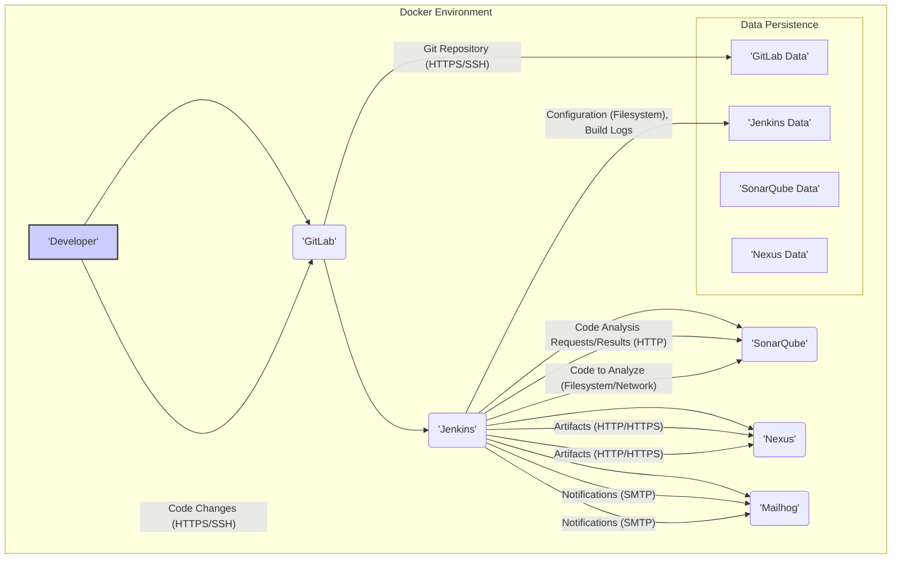

# Project Design Document: Docker CI Tool Stack

**Version:** 1.1
**Date:** October 26, 2023
**Author:** Gemini (AI Language Model)

## 1. Introduction

This document provides an enhanced design overview of the Docker CI Tool Stack project located at [https://github.com/marcelbirkner/docker-ci-tool-stack](https://github.com/marcelbirkner/docker-ci-tool-stack). Building upon the initial design, this version aims to provide greater clarity, detail, and a stronger focus on aspects relevant to threat modeling. This document will serve as a refined foundation for identifying potential security vulnerabilities, understanding trust boundaries, and designing appropriate mitigation strategies.

## 2. Goals

*   Provide a clear and concise description of the system's architecture and components, emphasizing security-relevant aspects.
*   Illustrate the data flow between different components, highlighting potential points of interception or manipulation.
*   Identify key technologies, their interactions, and associated security considerations.
*   Explicitly define trust boundaries within the system.
*   Serve as a robust basis for conducting a thorough threat modeling exercise.

## 3. System Overview

The Docker CI Tool Stack project offers a localized, containerized environment for simulating continuous integration and continuous delivery (CI/CD) pipelines. Utilizing Docker Compose, it orchestrates several widely adopted open-source tools essential for modern software development workflows. The primary objective is to empower developers with an easily accessible and isolated environment for testing and refining CI/CD processes before their implementation in production settings. This isolation is crucial for experimenting without impacting live systems.

The core components of this stack are:

*   **Jenkins:** The central automation server responsible for executing CI/CD pipelines.
*   **SonarQube:** A platform for continuous code quality inspection, performing static analysis to identify bugs and vulnerabilities.
*   **Nexus Repository Manager:**  Used for storing and managing build artifacts (like Docker images) and dependencies.
*   **GitLab:** Provides source code management using Git, along with integrated CI/CD pipeline definition capabilities.
*   **Mailhog:** A developer-friendly email testing tool that captures outgoing emails for inspection.

The system's design emphasizes self-containment within the Docker environment, minimizing reliance on the host operating system and ensuring consistent behavior across different development machines. This isolation also creates clear trust boundaries between the host and the containerized environment.

## 4. System Architecture

**Components:**

*   **Developer:** Represents an authenticated user interacting with the system, primarily by pushing code changes to GitLab. This interaction establishes an initial trust boundary.
*   **GitLab:**  Manages source code repositories and acts as the trigger for CI/CD pipelines within Jenkins. It handles sensitive code and user credentials.
*   **Jenkins:** The core orchestration engine for the CI/CD pipeline. It executes build steps, interacts with other components, and manages sensitive credentials for those interactions.
*   **SonarQube:** Performs static analysis on the codebase, potentially identifying security vulnerabilities. It receives code from Jenkins and returns analysis results.
*   **Nexus:** Stores and manages build artifacts, which could include sensitive application components. Access control is critical here.
*   **Mailhog:** Captures and displays emails sent by the system, which might contain sensitive information related to build status or errors.
*   **GitLab Data:** Persistent storage for GitLab's repository data, including code history and user information.
*   **Jenkins Data:** Persistent storage for Jenkins' configuration, build history, and potentially sensitive credentials.
*   **SonarQube Data:** Persistent storage for SonarQube's analysis results, quality profiles, and configuration.
*   **Nexus Data:** Persistent storage for Nexus' repository data, including the stored artifacts.

## 5. Component Details

### 5.1. GitLab

*   **Purpose:** Secure source code management, version control, and triggering CI/CD pipelines. Acts as a primary trust boundary for code.
*   **Technology:** Git, Ruby on Rails.
*   **Key Interactions:**
    *   Authenticates developers via HTTPS or SSH.
    *   Receives code pushes and merge requests from developers.
    *   Triggers Jenkins jobs based on configured webhooks or `.gitlab-ci.yml` pipeline definitions. These webhooks often include secrets for authentication.
    *   Stores repository data, including code and user credentials, persistently in a Docker volume. This data is highly sensitive.
*   **Configuration:** Configured via environment variables, the GitLab web interface (requiring administrative credentials), and potentially configuration files within the repository.
*   **Security Considerations:**
    *   Authentication and authorization mechanisms are critical.
    *   Exposure of the web interface requires strong security measures.
    *   Vulnerabilities in GitLab could lead to code compromise.
    *   Secrets used for webhook authentication need careful management.

### 5.2. Jenkins

*   **Purpose:** CI/CD automation server, orchestrating build, test, and deployment processes. Acts as a central orchestrator with access to various other components.
*   **Technology:** Java.
*   **Key Interactions:**
    *   Receives triggers from GitLab, often containing authentication tokens.
    *   Authenticates with GitLab to check out source code.
    *   Sends code to SonarQube for analysis, potentially over HTTP.
    *   Authenticates with Nexus to push and pull build artifacts, typically over HTTP/HTTPS.
    *   Sends notifications via SMTP to Mailhog.
    *   Stores configuration (including potentially sensitive credentials for other services), build history, and plugins persistently in a Docker volume.
*   **Configuration:** Configured via its web interface (requiring administrative credentials), pipeline definitions (Jenkinsfile stored in repositories), and installed plugins. Plugin vulnerabilities are a significant concern.
*   **Security Considerations:**
    *   Secure storage and management of credentials for accessing other services (GitLab, Nexus, etc.).
    *   Access control to the Jenkins web interface is paramount.
    *   Regular updates of Jenkins and its plugins are essential to mitigate vulnerabilities.
    *   Pipeline scripts can execute arbitrary code, posing a risk if not carefully reviewed.

### 5.3. SonarQube

*   **Purpose:** Continuous code quality inspection and static analysis, identifying potential bugs, vulnerabilities, and code smells.
*   **Technology:** Java.
*   **Key Interactions:**
    *   Receives code from Jenkins for analysis, typically via a scanner.
    *   Performs static analysis based on configured quality profiles and rules.
    *   Sends analysis results back to Jenkins, often via HTTP.
    *   Stores analysis results, quality profiles, and user configurations persistently in a Docker volume.
*   **Configuration:** Configured via its web interface (requiring administrative credentials) and project-level settings. Quality profiles define the rules used for analysis.
*   **Security Considerations:**
    *   Access control to analysis results and configuration should be restricted.
    *   Vulnerabilities in SonarQube could allow attackers to manipulate analysis results or gain access to source code.
    *   The communication channel with Jenkins should be secured if possible.

### 5.4. Nexus Repository Manager

*   **Purpose:** Repository manager for storing and managing build artifacts (e.g., Docker images, JAR files) and dependencies. Acts as a central repository for potentially sensitive application components.
*   **Technology:** Java.
*   **Key Interactions:**
    *   Receives build artifacts pushed by Jenkins, typically via HTTP/HTTPS with authentication.
    *   Provides artifacts to other services or developers upon request, often with authentication.
    *   Stores artifacts and repository metadata persistently in a Docker volume.
*   **Configuration:** Configured via its web interface (requiring administrative credentials), including repository settings, user management, and access control policies.
*   **Security Considerations:**
    *   Strong authentication and authorization are crucial to prevent unauthorized access to artifacts.
    *   Secure transfer of artifacts (HTTPS) is recommended.
    *   Vulnerabilities in Nexus could lead to the compromise of stored artifacts.

### 5.5. Mailhog

*   **Purpose:** Email testing tool for capturing and inspecting emails sent by the system, primarily for development and debugging.
*   **Technology:** Go.
*   **Key Interactions:**
    *   Receives emails sent by Jenkins (e.g., build notifications) via SMTP.
    *   Provides a web interface to view captured emails.
*   **Configuration:** Minimal configuration, primarily related to SMTP settings.
*   **Security Considerations:**
    *   While primarily for testing, if exposed without proper authentication, it could reveal sensitive information contained in build notifications or error messages.
    *   Should not be used in production environments without careful consideration of the information it might expose.

## 6. Data Flow

The typical data flow within the system, highlighting potential security implications, is as follows:

1. A **Developer** commits and pushes code changes to the **GitLab** repository over HTTPS or SSH, authenticating with their credentials. This establishes the initial trust in the code's origin.
2. **GitLab** triggers a configured CI/CD pipeline in **Jenkins**, typically via a webhook. This webhook often includes a secret token for authentication, which needs to be securely managed.
3. **Jenkins** authenticates with **GitLab** (using stored credentials or tokens) and checks out the latest code. This transfer of code represents a potential point of interception if not secured.
4. **Jenkins** sends the codebase to **SonarQube** for static analysis. This transfer might occur over the local Docker network or potentially over HTTP if configured that way.
5. **SonarQube** analyzes the code and sends the analysis results back to **Jenkins**, typically over HTTP. The sensitivity of these results depends on the information they reveal about potential vulnerabilities.
6. **Jenkins** builds the application or software. The build process itself might involve fetching dependencies from external sources, which introduces another trust boundary.
7. **Jenkins** authenticates with **Nexus** (using stored credentials) and pushes the resulting build artifacts (e.g., Docker images) to the repository, usually over HTTP/HTTPS. Secure transfer is crucial here.
8. **Jenkins** sends notifications about the build status (success or failure) via SMTP to **Mailhog**. These notifications might contain sensitive information.
9. Persistent data for each component (GitLab, Jenkins, SonarQube, Nexus) is stored in dedicated Docker volumes. The security of these volumes is paramount for protecting sensitive data at rest.

## 7. Security Considerations (Detailed)

This section expands on the initial security considerations, providing more specific details relevant to threat modeling.

*   **Trust Boundaries:** Clear trust boundaries exist between:
    *   The Developer's machine and GitLab.
    *   GitLab and Jenkins.
    *   Jenkins and SonarQube.
    *   Jenkins and Nexus.
    *   The Docker environment and the host system.
    *   Each individual container within the Docker environment.
*   **Authentication and Authorization:** Each component implements its own authentication and authorization mechanisms. Weaknesses in these mechanisms could lead to unauthorized access.
*   **Secrets Management:** Securely managing credentials for accessing GitLab, SonarQube, and Nexus within Jenkins is critical. Hardcoding or storing secrets in plain text is a major vulnerability.
*   **Network Security:** Communication between containers within the Docker network should ideally be restricted to necessary ports. Unnecessary port exposure increases the attack surface.
*   **Data at Rest:** The persistent data stored in Docker volumes needs to be protected using appropriate file system permissions and potentially encryption.
*   **Dependency Vulnerabilities:** Regularly scanning the container images and application dependencies for known vulnerabilities is essential.
*   **Input Validation:** Each component should properly validate inputs to prevent injection attacks.
*   **Logging and Monitoring:** Implementing comprehensive logging and monitoring can help detect and respond to security incidents.
*   **Regular Updates:** Keeping all components and their dependencies up-to-date with the latest security patches is crucial.
*   **Least Privilege:**  Components should only be granted the minimum necessary permissions to perform their functions.

## 8. Deployment Considerations

This tool stack is primarily intended for local development and testing. Deploying it to a production environment would necessitate significant security hardening and architectural changes.

*   **Docker Compose:** The stack is orchestrated using Docker Compose, which simplifies local setup but might not be suitable for production orchestration.
*   **Local Environment:** Designed for execution on a developer's machine or a local server, typically within a controlled network.
*   **Resource Requirements:** Running all these services concurrently requires substantial CPU, memory, and disk space.
*   **Production Deployment Challenges:**
    *   Security hardening of each component for public exposure.
    *   Scalability and high availability considerations.
    *   Robust backup and recovery mechanisms.
    *   Centralized logging and monitoring.

## 9. Future Considerations

*   **Integration with Security Scanning Tools:** Incorporate tools for static and dynamic application security testing (SAST/DAST) within the pipeline.
*   **Centralized Secrets Management:** Implement a dedicated secrets management solution (e.g., HashiCorp Vault) instead of relying on Jenkins' built-in credential storage.
*   **Enhanced Monitoring and Alerting:** Integrate with monitoring and alerting systems to detect and respond to security threats in real-time.
*   **Network Segmentation:** Further segment the Docker network to isolate components and limit the impact of potential breaches.
*   **Immutable Infrastructure:** Explore the possibility of using immutable infrastructure principles for increased security and reliability.

This enhanced design document provides a more detailed and security-focused overview of the Docker CI Tool Stack project. It serves as a more robust foundation for conducting a thorough threat modeling exercise, enabling a systematic identification and mitigation of potential security risks. The explicit identification of trust boundaries and detailed component interactions will aid in understanding the attack surface and potential vulnerabilities.