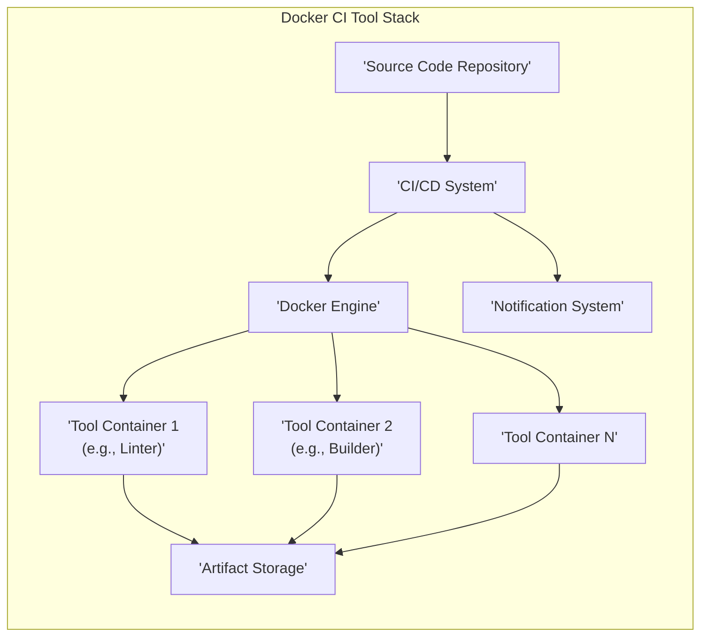
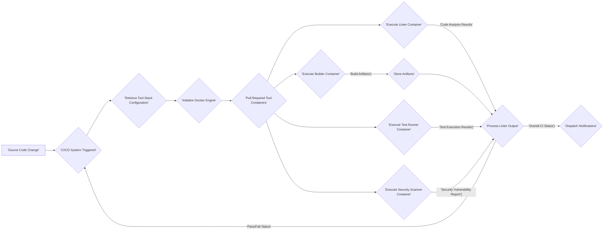

## Project Design Document: Docker CI Tool Stack (Improved)

**1. Introduction**

This document provides an enhanced design specification for the Docker CI Tool Stack project, accessible on GitHub at [https://github.com/marcelbirkner/docker-ci-tool-stack](https://github.com/marcelbirkner/docker-ci-tool-stack). This revised document aims to offer a more detailed and structured understanding of the system's architecture, components, and interactions, specifically tailored for threat modeling and further development.

**1.1. Purpose**

The primary goal of this project is to deliver a readily available and containerized suite of tools designed to streamline Continuous Integration (CI) workflows. By encapsulating essential CI utilities within Docker containers, the project simplifies setup, management, and ensures consistent execution across diverse environments. This standardized approach empowers developers and CI/CD pipelines with easy access to critical tooling.

**1.2. Scope**

This design document comprehensively covers the fundamental components and their interdependencies within the Docker CI Tool Stack. The focus is on the logical architecture, data flow, and key operational aspects. While specific tool configurations and versions are acknowledged as implementation details, this document provides the necessary context for understanding their roles within the stack.

**1.3. Target Audience**

This document is primarily intended for:

*   Security architects and engineers tasked with performing threat modeling and security assessments.
*   Software developers who will utilize or contribute to the project's development and maintenance.
*   Operations and DevOps teams responsible for the deployment, management, and upkeep of the tool stack.

**2. High-Level Overview**

The Docker CI Tool Stack is conceived as a modular system comprising interconnected Docker containers, each dedicated to hosting a specific CI function. These containers are orchestrated to operate cohesively, providing a complete and self-contained CI environment. The core principle is the isolation of each tool and its dependencies within its own container, which simplifies management, mitigates dependency conflicts, and promotes environmental consistency.

**3. Detailed Design**

This section provides an in-depth description of the individual components and their interactions within the Docker CI Tool Stack.

**3.1. Components**

*   **Source Code Repository:** The system where the project's source code is version-controlled and managed. Examples include GitHub, GitLab, and Bitbucket.
*   **CI/CD System:** The platform responsible for automating the CI/CD pipeline. It triggers the execution of the tool stack based on events within the source code repository. Examples include Jenkins, GitLab CI, and GitHub Actions.
*   **Docker Engine:** The underlying containerization runtime environment. It is responsible for building, running, and managing the lifecycle of the containerized tools.
*   **Tool Containers:** Individual, self-contained Docker containers, each encapsulating a specific CI tool. Examples include:
    *   **Linter Container:** Houses tools for static code analysis and style enforcement (e.g., ESLint, Flake8, SonarQube Scanner).
    *   **Builder Container:** Responsible for compiling the application or generating deployable artifacts (e.g., using Maven, Gradle, or language-specific build tools).
    *   **Test Runner Container:** Executes automated tests, including unit, integration, and end-to-end tests (e.g., using JUnit, pytest, Cypress).
    *   **Security Scanner Container:** Performs vulnerability scanning and security analysis on the codebase and dependencies (e.g., using OWASP Dependency-Check, Snyk, or Trivy).
    *   **Code Quality Analysis Container:** Evaluates code complexity, maintainability, and potential code smells (e.g., using SonarQube Scanner).
*   **Artifact Storage:** A designated location for storing the build outputs and artifacts generated during the CI process. This could be a Docker Registry (e.g., Docker Hub, GitLab Container Registry), cloud storage (e.g., AWS S3, Azure Blob Storage), or a dedicated artifact repository (e.g., Nexus, Artifactory).
*   **Notification System:** A mechanism for providing feedback and updates on the status of the CI process to relevant stakeholders. This can include email notifications, Slack messages, or integrations with other communication platforms.

**3.2. Component Interactions and Data Flow**

The typical operational flow within the Docker CI Tool Stack involves the following sequence of actions:

*   **Source Code Change:** A developer commits and pushes code modifications to the Source Code Repository.
*   **CI/CD System Triggered:** The Source Code Repository notifies the configured CI/CD System about the code changes.
*   **Retrieve Tool Stack Configuration:** The CI/CD System fetches the configuration defining the specific tools to be used and the orchestration steps for the Docker CI Tool Stack. This configuration might be stored in a `.gitlab-ci.yml`, `.github/workflows/`, or a similar configuration file.
*   **Initialize Docker Engine:** The CI/CD System instructs the Docker Engine to start or connect to an existing Docker environment.
*   **Pull Required Tool Containers:** The Docker Engine pulls the necessary Docker images for the defined tool containers from the specified container registry.
*   **Execute Tool Containers:** The Docker Engine runs the individual tool containers, either sequentially or in parallel, based on the configured workflow.
    *   **Linter Container Execution:** The source code is mounted into the Linter Container, and the linting tools are executed, generating code analysis reports.
    *   **Builder Container Execution:** The source code and necessary build configurations are mounted, and the Builder Container compiles the application or generates deployable artifacts.
    *   **Test Runner Container Execution:** The built artifacts and test configurations are mounted, and the automated tests are executed, producing test results.
    *   **Security Scanner Container Execution:** The application artifacts or source code are analyzed for security vulnerabilities, generating security scan reports.
*   **Process Output:** The CI/CD System collects the output and results from each executed tool container.
*   **Store Artifacts:** Upon successful build and testing, the Builder Container pushes the generated artifacts to the designated Artifact Storage.
*   **Dispatch Notifications:** The CI/CD System sends notifications (indicating success or failure, along with relevant details) to the configured notification channels.

**3.3. Deployment Architecture**

The Docker CI Tool Stack offers flexible deployment options:

*   **Local Development Environment:** Developers can run the tool stack locally using Docker Desktop or similar tools to perform pre-commit checks and local testing.
*   **CI/CD Agent Infrastructure:** The tool stack can be deployed on dedicated CI/CD agents or worker nodes within the organization's CI/CD infrastructure.
*   **Container Orchestration Platforms:** For enhanced scalability and management, the tool stack can be deployed and orchestrated using platforms like Kubernetes or Docker Swarm.

**4. Security Considerations**

This section outlines key security considerations relevant to the Docker CI Tool Stack. A dedicated threat modeling exercise will further elaborate on potential vulnerabilities and mitigation strategies.

*   **Secure Container Images:**  Ensuring the base images used for the tool containers are from trusted sources and are regularly scanned for known vulnerabilities is paramount. Employing image scanning tools and adhering to secure image building practices is essential.
*   **Secrets Management:** Securely managing sensitive credentials (e.g., API keys, database passwords, registry credentials) used by the tools within the containers is critical. Avoid hardcoding secrets in Dockerfiles or configuration files. Utilize secrets management solutions provided by the CI/CD system or dedicated tools like HashiCorp Vault.
*   **Network Segmentation:** Implementing network policies to restrict communication between containers and external resources can limit the impact of potential breaches. Employing network segmentation and firewalls is recommended.
*   **Access Control and Authorization:**  Restricting access to the Docker Engine and the CI/CD system is crucial to prevent unauthorized execution of containers or modifications to the CI/CD pipeline. Implement robust authentication and authorization mechanisms.
*   **Data Security in Transit and at Rest:** Protecting the source code and build artifacts during the CI process is vital. Utilize secure protocols (e.g., HTTPS, SSH) for data transfer and ensure secure storage mechanisms for artifacts.
*   **Supply Chain Security:**  Verifying the integrity and authenticity of the tools and dependencies used within the containers helps mitigate supply chain attacks. Employ dependency scanning and vulnerability management tools.
*   **Logging and Auditing:**  Implementing comprehensive logging and auditing of the tool stack's activities is crucial for detecting and responding to security incidents. Centralized logging solutions can enhance visibility and analysis.
*   **Resource Limits:**  Setting appropriate resource limits (CPU, memory) for containers can prevent denial-of-service attacks or resource exhaustion.
*   **Regular Security Updates:**  Maintaining up-to-date versions of the Docker Engine, container images, and the tools within the containers is crucial for patching known vulnerabilities.

**5. Assumptions and Constraints**

*   **Docker Engine Availability:** The project assumes the presence and correct operation of the Docker Engine in the deployment environment.
*   **Container Registry Access:** It is assumed that the environment has access to a container registry (either public or private) to pull the necessary Docker images.
*   **CI/CD System Compatibility:** The tool stack is designed to integrate with a compatible CI/CD system capable of orchestrating Docker containers.
*   **External Configuration Management:** The configuration of the tool stack (e.g., which tools are included, their specific versions, and configurations) is managed externally, typically through the CI/CD system's configuration files or environment variables.
*   **Network Connectivity Requirements:** The containers within the tool stack require appropriate network connectivity to communicate with each other and any necessary external services.

**6. Future Considerations**

*   **Enhanced Scalability and Resilience:** Designing the tool stack to scale horizontally to accommodate increased workloads and implementing mechanisms for fault tolerance and self-healing.
*   **Improved Extensibility and Customization:**  Making it easier to add, remove, or customize tools within the stack without requiring significant modifications. This could involve a more modular design or the use of configuration management tools.
*   **Centralized Logging and Monitoring Integration:**  Integrating with centralized logging and monitoring systems (e.g., ELK stack, Prometheus/Grafana) for improved observability and incident response capabilities.
*   **Advanced Security Integrations:** Incorporating more advanced security tools and practices, such as static application security testing (SAST) and dynamic application security testing (DAST) tools within the pipeline.
*   **Support for Different Architectures:**  Considering support for different CPU architectures (e.g., ARM) to broaden the deployment possibilities.
*   **Standardized Configuration and Orchestration:**  Exploring the use of standardized configuration management tools (e.g., Ansible, Terraform) or container orchestration frameworks (e.g., Kubernetes) for more consistent and manageable deployments.

This improved design document provides a more detailed and comprehensive understanding of the Docker CI Tool Stack project, serving as a robust foundation for subsequent threat modeling and further development efforts.
