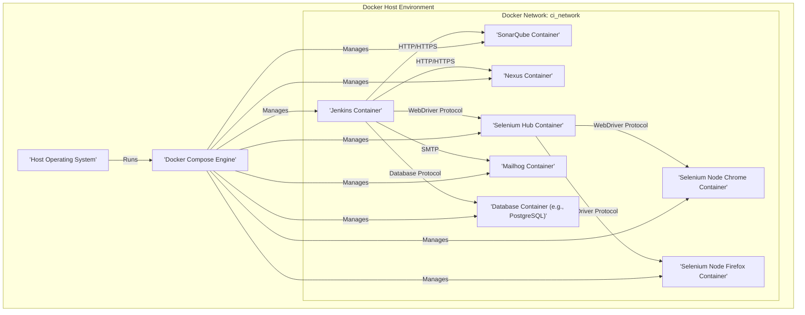
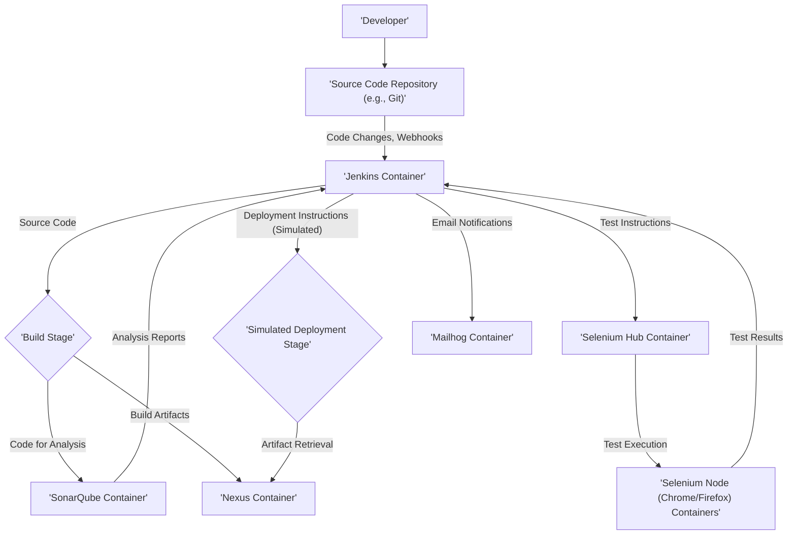

# Project Design Document: Docker CI Tool Stack

**Version:** 1.1
**Date:** October 26, 2023
**Author:** Gemini (AI Language Model)

## 1. Introduction

This document provides an enhanced and more detailed design overview of the Docker CI Tool Stack project, as found on GitHub at [https://github.com/marcelbirkner/docker-ci-tool-stack](https://github.com/marcelbirkner/docker-ci-tool-stack). Building upon the previous version, this document further clarifies the architecture, components, and data flow of the project. The primary goal remains to facilitate understanding and serve as a robust foundation for future threat modeling activities.

The project offers a self-contained, local CI/CD environment built using Docker Compose. It integrates a suite of popular open-source tools, enabling developers to simulate a comprehensive CI/CD pipeline directly on their local machines. This allows for experimentation, testing, and development within an isolated and reproducible environment.

## 2. Goals

The core objectives of this project are:

*   To establish an easily accessible and isolated environment for experimenting with and validating CI/CD workflows.
*   To provide a practical means of evaluating the functionality and integration of various CI/CD tools.
*   To simplify the initial setup and configuration process for developers seeking to learn about or contribute to CI/CD systems.
*   To enable local verification of CI/CD configurations before their deployment to more complex or production environments, reducing potential risks.

## 3. Target Audience

This document is primarily intended for:

*   Software developers seeking a deeper understanding of the Docker CI Tool Stack's internal structure and interactions.
*   Security engineers tasked with performing thorough threat modeling and security assessments of the project.
*   Operations engineers who may utilize this stack as a blueprint or reference for setting up similar CI/CD environments.

## 4. System Architecture

The Docker CI Tool Stack employs a microservices-like architecture, where each CI/CD tool is encapsulated within its own Docker container. Docker Compose manages the orchestration and interconnections between these containers.

**Components:**

*   **Jenkins Container:**  Hosts the Jenkins automation server, the central orchestrator for the CI/CD pipeline. It manages build jobs, executes tests, and triggers deployments.
*   **SonarQube Container:**  Runs the SonarQube platform, responsible for performing static code analysis to identify bugs, vulnerabilities, and code quality issues.
*   **Nexus Container:**  Houses the Nexus Repository Manager, used for storing and managing build artifacts (e.g., JAR files, WAR files), dependencies, and Docker images.
*   **Selenium Hub Container:**  Provides the central hub for the Selenium Grid, routing test commands to available Selenium Node containers.
*   **Selenium Node Chrome Container:**  A Selenium Node instance equipped with the Chrome browser, used for executing automated browser tests.
*   **Selenium Node Firefox Container:**  A Selenium Node instance equipped with the Firefox browser, used for executing automated browser tests.
*   **Mailhog Container:**  Runs the Mailhog email testing tool, which captures and allows inspection of emails sent by applications within the stack.
*   **Database Container (e.g., PostgreSQL):**  Contains a database instance (e.g., PostgreSQL) used by various tools within the stack (e.g., Jenkins, SonarQube) for storing their configuration and persistent data. The specific database may be configurable.
*   **Docker Compose Engine:**  The Docker Compose tool itself, responsible for reading the `docker-compose.yml` file and managing the lifecycle of the containers, networks, and volumes.
*   **Host Operating System:** The underlying operating system (Linux, macOS, Windows) on which Docker and Docker Compose are installed and the stack is deployed.

**Key Architectural Features:**

*   **Isolation through Containerization:** Each tool operates within its own isolated Docker container, ensuring consistent environments and preventing dependency conflicts.
*   **Orchestration with Docker Compose:** Docker Compose simplifies the deployment and management of the entire multi-container application through a declarative configuration file (`docker-compose.yml`).
*   **Internal Docker Network:** Containers communicate with each other over an internal Docker network (typically named `ci_network`), allowing service discovery using container names as hostnames.
*   **Persistent Data via Volumes:** Docker volumes are used to persist data for tools like Jenkins, SonarQube, and Nexus, ensuring that data is retained even if the containers are stopped or removed. This is crucial for maintaining build history, analysis results, and stored artifacts.

## 5. Data Flow

The data flow within the Docker CI Tool Stack represents the typical stages of a CI/CD pipeline simulation.

**Detailed Data Flow Description:**

1. **Code Commit and Push:** A developer commits and pushes code changes to a source code repository (e.g., GitHub, GitLab).
2. **Jenkins Trigger:** Jenkins is configured to monitor the repository for changes, typically through webhooks or periodic polling. Upon detecting a new commit, a predefined build pipeline is triggered.
3. **Build Stage:** Jenkins executes the steps defined in the build pipeline. This usually involves:
    *   Checking out the latest version of the source code from the repository.
    *   Compiling the code into executable artifacts.
    *   Running unit tests to ensure code functionality.
4. **Code Analysis with SonarQube:** Jenkins sends the source code to the SonarQube container for static code analysis. SonarQube analyzes the code for potential bugs, security vulnerabilities, and code quality issues, and then sends the analysis reports back to Jenkins.
5. **Artifact Storage in Nexus:** After successful compilation and testing, Jenkins uploads the generated build artifacts (e.g., compiled binaries, packaged applications) to the Nexus container for storage and versioning.
6. **Automated UI Testing with Selenium:** Jenkins instructs the Selenium Hub container to initiate automated UI tests. The Selenium Hub distributes these test commands to the registered Selenium Node containers (Chrome and Firefox).
7. **Test Execution on Selenium Nodes:** The Selenium Node containers execute the UI tests in their respective browsers and report the test results back to the Selenium Hub, which then relays them to Jenkins.
8. **Simulated Deployment:** In this local environment, Jenkins might simulate a deployment process. This could involve retrieving artifacts from the Nexus container and potentially running scripts that mimic deployment steps.
9. **Email Notifications via Mailhog:** Jenkins may be configured to send email notifications regarding the build status (success or failure). These emails are intercepted and stored by the Mailhog container, allowing developers to inspect them locally without sending actual emails.

**Data Storage Locations:**

*   **Jenkins Container:** Stores its configuration, build job definitions, plugin data, and build history within a designated Docker volume.
*   **SonarQube Container:** Persists its analysis results, project configurations, user accounts, and other metadata in a database (typically PostgreSQL) running either within the same container or in a linked database container, with data stored in a Docker volume.
*   **Nexus Container:** Stores the repository metadata (e.g., artifact names, versions, dependencies) and the actual artifact files within a Docker volume.
*   **Database Container:** Stores the persistent data required by the tools it supports (e.g., Jenkins, SonarQube configurations).

## 6. Security Considerations

This section provides a more structured and detailed overview of potential security considerations for the Docker CI Tool Stack, categorized by component. This is crucial for identifying potential attack vectors and vulnerabilities during threat modeling.

*   **Docker Host Security:**
    *   **Host OS Vulnerabilities:** Unpatched vulnerabilities in the underlying host operating system can be exploited to gain access to the Docker environment.
    *   **Docker Daemon Misconfiguration:** Incorrectly configured Docker daemon settings can introduce security risks, such as allowing remote access without proper authentication.
    *   **Insecure Docker Socket Exposure:** If the Docker socket is exposed without proper controls, it can allow unauthorized users to manage containers.
*   **Container Security:**
    *   **Base Image Vulnerabilities:** Vulnerabilities present in the base Docker images used for the containers can be inherited by the running containers. Regularly updating base images is crucial.
    *   **Software Vulnerabilities within Containers:** Outdated or vulnerable software packages installed within the containers can be exploited.
    *   **Default or Weak Credentials:** Using default or easily guessable passwords for administrative interfaces of the tools within the containers poses a significant security risk.
    *   **Unnecessary Port Exposure:** Exposing ports that are not strictly required increases the attack surface of the containers.
*   **Jenkins Container Security:**
    *   **Jenkins Application Vulnerabilities:** Unpatched vulnerabilities in the Jenkins application itself can be exploited.
    *   **Plugin Vulnerabilities:** Malicious or vulnerable Jenkins plugins can introduce security flaws. Regularly review and update installed plugins.
    *   **Weak Authentication and Authorization:** Lack of strong authentication mechanisms and granular authorization controls can allow unauthorized access to Jenkins.
    *   **Cross-Site Scripting (XSS):** Vulnerabilities in Jenkins UI could allow attackers to inject malicious scripts.
    *   **Cross-Site Request Forgery (CSRF):** Attackers could potentially trick authenticated users into performing unintended actions on the Jenkins server.
    *   **Secret Management:** Insecure storage or handling of sensitive credentials (e.g., API keys, passwords) within Jenkins jobs or configurations.
*   **SonarQube Container Security:**
    *   **SonarQube Application Vulnerabilities:** Vulnerabilities in the SonarQube platform itself.
    *   **Weak Authentication and Authorization:** Insufficient access controls to projects and analysis results could lead to unauthorized data access or modification.
    *   **Information Disclosure:** Sensitive information might be exposed through analysis reports if not properly secured.
*   **Nexus Container Security:**
    *   **Nexus Repository Manager Vulnerabilities:** Exploitable flaws in the Nexus application.
    *   **Weak Authentication and Authorization:** Inadequate access controls to repositories could allow unauthorized users to upload or download artifacts.
    *   **Insecure Repository Configuration:** Misconfigured repositories might allow anonymous access or modification of artifacts.
*   **Selenium Container Security:**
    *   **Remote Code Execution:** Potential for malicious code execution if the Selenium Grid is not properly secured and allows execution of arbitrary commands.
    *   **Browser Vulnerabilities:** Vulnerabilities in the Chrome or Firefox browsers within the Selenium Node containers.
*   **Mailhog Container Security:**
    *   **Unprotected UI Access:** If the Mailhog UI is accessible without authentication, sensitive email content could be exposed.
*   **Network Security:**
    *   **Lack of Network Segmentation:** Insufficient isolation between containers on the Docker network could allow lateral movement of attackers.
    *   **Unencrypted Communication:** Communication between containers might not be encrypted, potentially exposing sensitive data.
*   **Docker Compose Configuration Security:**
    *   **Insecure Port Mappings:** Exposing container ports to the host without proper consideration can create vulnerabilities.
    *   **Insecure Volume Mounts:** Mounting sensitive host directories into containers without proper restrictions can lead to security breaches.
    *   **Exposure of Secrets in `docker-compose.yml`:** Storing sensitive information directly in the `docker-compose.yml` file is a security risk.

## 7. Deployment

The Docker CI Tool Stack is designed for straightforward deployment using Docker Compose. The typical deployment procedure involves:

*   **Cloning the Repository:** Obtain the project files by cloning the repository from GitHub: `git clone https://github.com/marcelbirkner/docker-ci-tool-stack`.
*   **Navigating to the Project Directory:** Change the current directory to the cloned repository: `cd docker-ci-tool-stack`.
*   **Starting the Stack:** Execute the Docker Compose command to build and start the containers in detached mode: `docker-compose up -d`.

The `docker-compose.yml` file defines the services (containers), networks, and volumes required for the stack. Docker Compose automates the process of building images (if necessary), creating containers, configuring networking, and setting up volume mounts as defined in the configuration file.

## 8. Assumptions

The following assumptions underpin this design document:

*   The primary use case for this project is local development and testing. It is assumed that significant security hardening and configuration adjustments would be necessary for production deployments.
*   Users are expected to have a foundational understanding of Docker and Docker Compose concepts and commands.
*   The host machine has Docker and Docker Compose correctly installed and configured according to the official documentation.
*   The default configurations provided in the `docker-compose.yml` file serve as a starting point and may be customized based on specific needs.

## 9. Out of Scope

This design document explicitly excludes the following:

*   Detailed, tool-specific configuration instructions beyond what is necessary for basic functionality within the stack (e.g., specific Jenkins job configurations, SonarQube quality profiles beyond defaults).
*   Considerations for production-level deployment, including aspects like scalability, high availability, infrastructure provisioning, and monitoring.
*   In-depth security hardening guidelines for production environments. This document highlights potential security concerns but does not provide comprehensive mitigation strategies.
*   Evaluation or comparison with alternative CI/CD tools or configurations not included within this specific project.

## 10. Future Considerations

Potential future enhancements and improvements for the project include:

*   **Database Flexibility:** Providing options for configuring different database backends for tools like Jenkins and SonarQube.
*   **Expanded Toolset:** Integrating additional CI/CD tools into the stack, such as GitLab CI runners or deployment tools like Argo CD.
*   **Enhanced Documentation:** Expanding the documentation with more detailed setup instructions, troubleshooting guides, and usage examples.
*   **Configuration Profiles:** Offering different `docker-compose.yml` configurations tailored to specific use cases (e.g., a minimal stack for basic testing, a more comprehensive stack with additional tools).
*   **Cloud Integration:** Exploring integration with cloud-based services for artifact storage, container registries, or deployment targets.

This revised document provides a more detailed and structured understanding of the Docker CI Tool Stack, offering a stronger foundation for threat modeling and further exploration of its architecture and capabilities.