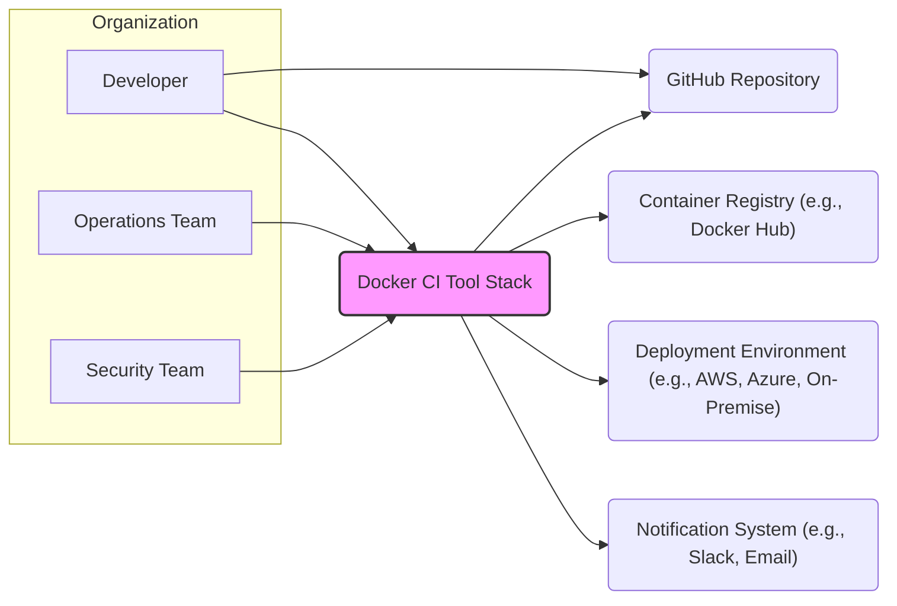
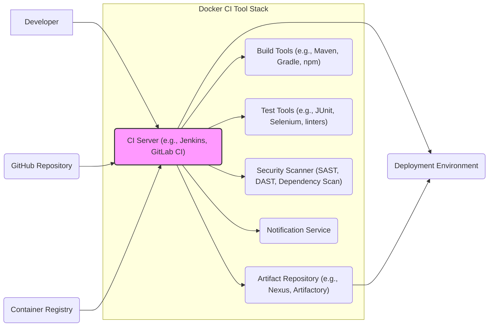
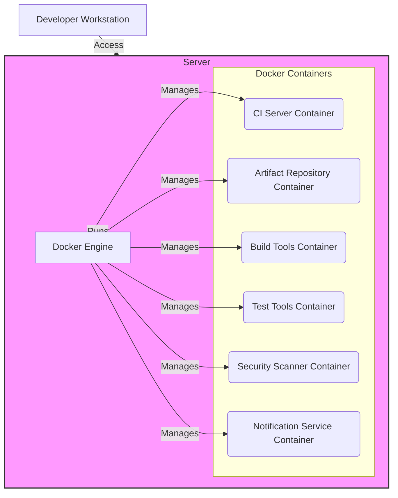

# BUSINESS POSTURE

This project, "docker-ci-tool-stack", aims to provide a pre-configured, containerized environment for Continuous Integration (CI) and potentially Continuous Delivery (CD) processes. The primary business goal is to streamline and standardize the software build, test, and deployment pipeline, leading to faster development cycles, improved software quality, and reduced operational overhead.

Business Priorities:
- Accelerate software delivery speed.
- Enhance software quality and reliability through automated testing and validation.
- Reduce infrastructure management overhead for CI/CD environments.
- Improve developer productivity by providing a consistent and readily available CI/CD toolset.

Business Risks:
- Security vulnerabilities in the CI/CD pipeline could lead to compromised software releases or data breaches.
- Misconfiguration or instability of the CI/CD environment could disrupt development workflows and delay releases.
- Lack of proper access control and auditing in the CI/CD system could lead to unauthorized modifications or data leaks.
- Dependency on external Docker images or components introduces supply chain risks.

# SECURITY POSTURE

Existing Security Controls:
- security control: Docker image isolation to separate CI/CD tools and build environments. (Implied by the project name and nature)
- security control: Potentially uses base images from trusted sources. (Assumption, needs verification)

Accepted Risks:
- accepted risk: Reliance on Docker Hub or other container registries for base images, which may have vulnerabilities. (Common risk in containerized environments)
- accepted risk: Initial configuration might not follow security best practices out-of-the-box and requires user hardening. (General risk with pre-configured tools)

Recommended Security Controls:
- security control: Implement regular vulnerability scanning of Docker images used in the tool stack.
- security control: Enforce least privilege principles for all components and users accessing the CI/CD environment.
- security control: Implement robust logging and monitoring of CI/CD activities for security auditing and incident response.
- security control: Securely manage secrets and credentials used within the CI/CD pipeline, using dedicated secret management solutions.
- security control: Implement network segmentation to isolate the CI/CD environment from other less trusted networks.
- security control: Regularly update the tool stack components and base images to patch known vulnerabilities.
- security control: Implement code signing and artifact verification to ensure the integrity of build outputs.

Security Requirements:
- Authentication:
    - security requirement: Secure authentication mechanism for accessing the CI/CD tool stack (e.g., username/password, API keys, SSO).
    - security requirement: Multi-factor authentication (MFA) should be considered for administrative access.
- Authorization:
    - security requirement: Role-Based Access Control (RBAC) to manage permissions for different users and teams within the CI/CD environment.
    - security requirement: Granular authorization policies to control access to specific CI/CD resources and functionalities.
- Input Validation:
    - security requirement: Validate all inputs to the CI/CD pipeline to prevent injection attacks (e.g., command injection, SQL injection).
    - security requirement: Sanitize user-provided data before using it in build scripts or configurations.
- Cryptography:
    - security requirement: Protect sensitive data at rest and in transit using encryption.
    - security requirement: Securely store and manage cryptographic keys used for encryption and signing.
    - security requirement: Use HTTPS for all communication within the CI/CD environment and with external systems.

# DESIGN

## C4 CONTEXT

### Context Diagram Elements:

- Element:
    - Name: Developer
    - Type: Person
    - Description: Software developers who use the CI tool stack to build, test, and deploy their code.
    - Responsibilities: Writing code, committing code to repositories, triggering CI/CD pipelines, monitoring build and deployment status.
    - Security controls: Authentication to access CI/CD system, authorization based on project roles, secure coding practices.

- Element:
    - Name: Operations Team
    - Type: Person
    - Description: Team responsible for managing and maintaining the CI tool stack infrastructure and ensuring its availability and performance.
    - Responsibilities: Infrastructure management, monitoring, troubleshooting, upgrades, security patching of the CI/CD environment.
    - Security controls: Strong authentication and authorization for administrative access, access control to infrastructure components, security monitoring and logging.

- Element:
    - Name: Security Team
    - Type: Person
    - Description: Team responsible for ensuring the security of the CI tool stack and the software development lifecycle.
    - Responsibilities: Security assessments, threat modeling, vulnerability management, security policy enforcement, incident response related to CI/CD.
    - Security controls: Security audits of CI/CD configurations, vulnerability scanning integration, security training for developers and operations.

- Element:
    - Name: Docker CI Tool Stack
    - Type: System
    - Description: The project in question, providing a containerized environment for CI/CD processes. It automates build, test, and deployment workflows.
    - Responsibilities: Source code checkout, dependency management, compilation, testing, packaging, artifact storage, deployment orchestration, notifications.
    - Security controls: Authentication, authorization, input validation, secure configuration, vulnerability scanning, logging and monitoring, secrets management.

- Element:
    - Name: GitHub Repository
    - Type: External System
    - Description: Source code repository hosting the application code that is built and deployed using the CI tool stack.
    - Responsibilities: Version control, code storage, access control to source code, trigger CI/CD pipelines on code changes.
    - Security controls: Access control (authentication and authorization), branch protection, audit logs, vulnerability scanning of repository configurations.

- Element:
    - Name: Container Registry (e.g., Docker Hub)
    - Type: External System
    - Description: Registry for storing and distributing Docker images used in the CI tool stack and potentially for deploying applications.
    - Responsibilities: Image storage, image distribution, access control to container images, vulnerability scanning of public images.
    - Security controls: Access control (authentication and authorization), image signing and verification, vulnerability scanning of stored images, private registry options.

- Element:
    - Name: Deployment Environment (e.g., AWS, Azure, On-Premise)
    - Type: External System
    - Description: Target environment where the applications built by the CI tool stack are deployed and run.
    - Responsibilities: Application hosting, runtime environment, infrastructure management, application monitoring.
    - Security controls: Infrastructure security controls (network security, access control, OS hardening), application security controls (runtime protection, vulnerability management), monitoring and logging.

- Element:
    - Name: Notification System (e.g., Slack, Email)
    - Type: External System
    - Description: System used to send notifications about CI/CD pipeline status, build failures, deployment success, and other relevant events.
    - Responsibilities: Notification delivery, message routing, user subscription management.
    - Security controls: Secure communication channels (HTTPS), access control to notification configurations, protection of sensitive information in notifications.

## C4 CONTAINER

### Container Diagram Elements:

- Element:
    - Name: CI Server (e.g., Jenkins, GitLab CI)
    - Type: Container
    - Description: Orchestrates the CI/CD pipelines, manages jobs, and integrates with other tools. Acts as the central control plane of the CI/CD system.
    - Responsibilities: Pipeline execution, job scheduling, source code checkout, build process initiation, test execution, security scanning, artifact publishing, deployment triggering, notification management.
    - Security controls: Authentication and authorization for user access and pipeline management, secure pipeline configuration, secrets management integration, audit logging, input validation for pipeline parameters.

- Element:
    - Name: Artifact Repository (e.g., Nexus, Artifactory)
    - Type: Container
    - Description: Stores build artifacts (e.g., compiled code, Docker images, packages) produced by the CI/CD pipelines. Provides versioning and management of artifacts.
    - Responsibilities: Artifact storage, artifact versioning, artifact retrieval, access control to artifacts, artifact metadata management, vulnerability scanning of stored artifacts.
    - Security controls: Authentication and authorization for artifact access, secure artifact storage, integrity checks for artifacts, vulnerability scanning of stored artifacts, audit logging of artifact access.

- Element:
    - Name: Build Tools (e.g., Maven, Gradle, npm)
    - Type: Container
    - Description: Tools used to compile, package, and build the application code. These are specific to the programming languages and frameworks used in the projects.
    - Responsibilities: Code compilation, dependency resolution, packaging, unit testing, code formatting, static analysis.
    - Security controls: Dependency vulnerability scanning, secure build configurations, input validation for build parameters, isolation from other containers, least privilege execution.

- Element:
    - Name: Test Tools (e.g., JUnit, Selenium, linters)
    - Type: Container
    - Description: Tools used to execute automated tests (unit tests, integration tests, end-to-end tests) and code quality checks.
    - Responsibilities: Test execution, test reporting, code linting, code style checks, static analysis.
    - Security controls: Secure test configurations, isolation from other containers, input validation for test parameters, secure handling of test data.

- Element:
    - Name: Security Scanner (SAST, DAST, Dependency Scan)
    - Type: Container
    - Description: Tools used to perform security scans on the code, dependencies, and build artifacts to identify vulnerabilities. Includes Static Application Security Testing (SAST), Dynamic Application Security Testing (DAST), and dependency scanning.
    - Responsibilities: Static code analysis, dynamic vulnerability scanning, dependency vulnerability scanning, security report generation, integration with CI pipeline for automated security checks.
    - Security controls: Secure scanner configuration, vulnerability database updates, secure handling of scan results, integration with vulnerability management systems.

- Element:
    - Name: Notification Service
    - Type: Container
    - Description: Handles sending notifications about CI/CD pipeline events to various channels (e.g., Slack, email).
    - Responsibilities: Notification routing, message formatting, integration with notification providers, user subscription management.
    - Security controls: Secure communication channels to notification providers, access control to notification configurations, protection of sensitive information in notifications, audit logging of notification events.

## DEPLOYMENT

Deployment Solution: Docker Compose on a single server (for development/testing)

### Deployment Diagram Elements:

- Element:
    - Name: Server (Physical or Virtual)
    - Type: Infrastructure
    - Description: A physical or virtual server that hosts the Docker Engine and the CI tool stack containers. Could be on-premise or in the cloud.
    - Responsibilities: Providing compute resources, network connectivity, storage for Docker Engine and containers.
    - Security controls: Operating system hardening, network security controls (firewall, network segmentation), access control to the server, security monitoring and logging, regular security patching.

- Element:
    - Name: Docker Engine
    - Type: Software
    - Description: The container runtime environment that manages and runs the Docker containers for the CI tool stack.
    - Responsibilities: Container lifecycle management, resource allocation, network management for containers, image management.
    - Security controls: Docker Engine security hardening, container isolation, resource limits for containers, secure configuration of Docker Engine, vulnerability scanning of Docker Engine.

- Element:
    - Name: Docker Containers (CI Server Container, Artifact Repository Container, etc.)
    - Type: Software
    - Description: Individual Docker containers running each component of the CI tool stack (CI Server, Artifact Repository, Build Tools, Test Tools, Security Scanner, Notification Service).
    - Responsibilities: Running the specific CI/CD tool or service within an isolated container environment.
    - Security controls: Container image security (base image selection, vulnerability scanning), container configuration security (least privilege, resource limits), network policies for container communication, security monitoring within containers.

- Element:
    - Name: Developer Workstation
    - Type: Infrastructure
    - Description: Developer's local machine used to access and interact with the CI tool stack.
    - Responsibilities: Accessing CI Server UI, triggering pipelines, monitoring build status.
    - Security controls: Endpoint security controls (antivirus, firewall), secure authentication to access CI Server, access control to developer workstation.

## BUILD

```mermaid
flowchart LR
    Developer["Developer"] --> CodeCommit["Code Commit to GitHub"]
    CodeCommit --> GitHubActions["GitHub Actions Workflow (CI Build)"]
    subgraph "GitHub Actions Workflow"
        SourceCodeCheckout["Source Code Checkout"]
        DependencyScan["Dependency Vulnerability Scan"]
        BuildStep["Build & Test"]
        SAST["SAST Scan"]
        ContainerBuild["Container Image Build"]
        ContainerScan["Container Image Scan"]
        ArtifactPush["Artifact Push to Container Registry"]
    end
    GitHubActions --> SourceCodeCheckout
    SourceCodeCheckout --> DependencyScan
    DependencyScan --> BuildStep
    BuildStep --> SAST
    SAST --> ContainerBuild
    ContainerBuild --> ContainerScan
    ContainerScan --> ArtifactPush
    ArtifactPush --> ContainerRegistry["Container Registry"]

    style GitHubActions fill:#f9f,stroke:#333,stroke-width:2px
```

### Build Process Description:

The build process for the Docker CI Tool Stack itself can be automated using a CI/CD pipeline, for example, using GitHub Actions.

1.  Developer commits code changes to the GitHub repository.
2.  A GitHub Actions workflow is triggered automatically on code commit.
3.  Source Code Checkout: The workflow checks out the latest code from the repository.
4.  Dependency Vulnerability Scan: Scans project dependencies for known vulnerabilities. Tools like `npm audit`, `mvn dependency:check`, or `bundler audit` can be used depending on the project's language.
5.  Build & Test: Builds the Docker images and runs unit tests for any components of the tool stack.
6.  SAST Scan: Performs Static Application Security Testing (SAST) on the codebase to identify potential security vulnerabilities in the code. Tools like SonarQube, or GitHub CodeQL can be used.
7.  Container Image Build: Builds the Docker images for each component of the CI tool stack based on Dockerfiles.
8.  Container Image Scan: Scans the newly built Docker images for vulnerabilities using container image scanning tools like Trivy, Clair, or Anchore.
9.  Artifact Push to Container Registry: If all security checks pass, the workflow pushes the built Docker images to a Container Registry (e.g., Docker Hub, GitHub Container Registry).

Security Controls in Build Process:
- security control: Automated build process using CI/CD pipelines (GitHub Actions).
- security control: Source code version control using Git and GitHub.
- security control: Dependency vulnerability scanning to identify and mitigate vulnerable dependencies.
- security control: Static Application Security Testing (SAST) to identify code-level vulnerabilities.
- security control: Container image scanning to identify vulnerabilities in Docker images.
- security control: Secure artifact repository (Container Registry) for storing and distributing Docker images.
- security control: Code review process before merging code changes to the main branch.
- security control: Build process triggered automatically on code changes, ensuring consistent and repeatable builds.

# RISK ASSESSMENT

Critical Business Processes:
- Software development lifecycle: The CI tool stack directly supports the entire software development lifecycle, from code commit to deployment. Disruption or compromise of this system can severely impact software delivery.
- Software release process: The CI tool stack automates the release process. Security vulnerabilities in the CI/CD pipeline can lead to the release of compromised software.
- Code integrity and confidentiality: The CI tool stack handles source code and build artifacts, which are critical assets. Loss of integrity or confidentiality of this data can have significant business impact.

Data Sensitivity:
- Source code: Highly sensitive. Contains intellectual property and business logic. Confidentiality and integrity are critical.
- Build artifacts (Docker images, binaries): Sensitive. Can contain vulnerabilities if not built securely. Integrity is critical to ensure software supply chain security.
- Secrets and credentials: Highly sensitive. Used for accessing external systems, databases, and cloud resources. Confidentiality is paramount.
- Pipeline configurations: Sensitive. Define the build and deployment processes. Integrity is critical to ensure consistent and secure deployments.
- Logs and audit trails: Moderately sensitive. Contain information about system activities and user actions. Integrity and availability are important for security monitoring and incident response.

# QUESTIONS & ASSUMPTIONS

Questions:
- What specific CI/CD tools are intended to be included in the "docker-ci-tool-stack"? (e.g., Jenkins, GitLab CI, Tekton, etc.)
- What is the target deployment environment for the CI tool stack itself? (e.g., cloud, on-premise, Kubernetes)
- What are the specific security requirements and compliance needs for the organization using this tool stack?
- Are there any existing security policies or standards that need to be considered in the design?
- What is the intended user base and access control model for the CI tool stack?

Assumptions:
- The primary goal is to create a general-purpose, reusable CI tool stack based on Docker.
- Security is a significant concern, and the design should incorporate security best practices.
- The tool stack will be used by software development and operations teams.
- The organization using this tool stack values automation, efficiency, and security in their software development lifecycle.
- The deployment environment for the CI tool stack is assumed to be a single server for simplicity in the deployment diagram, but it could be more complex in a production environment.