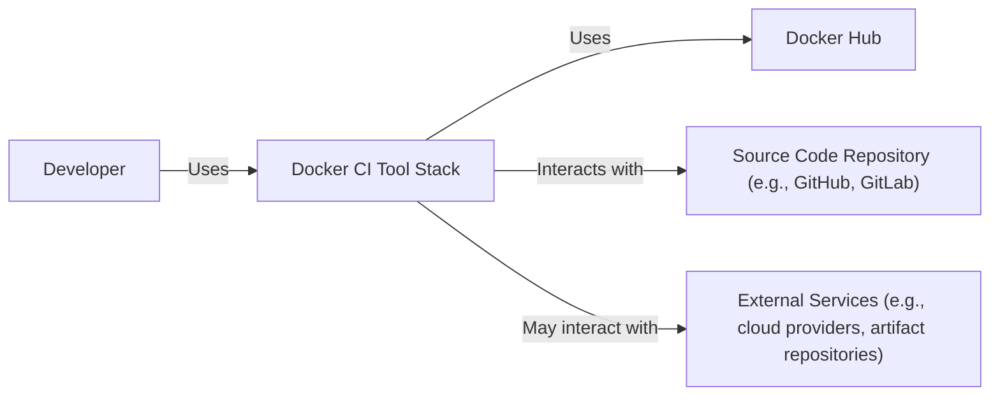
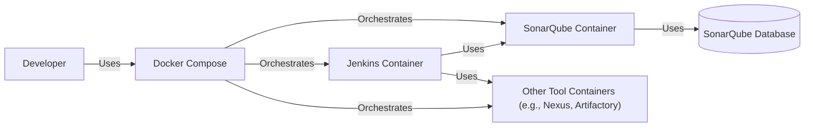
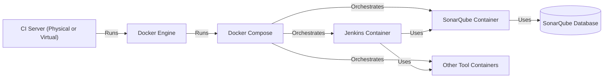
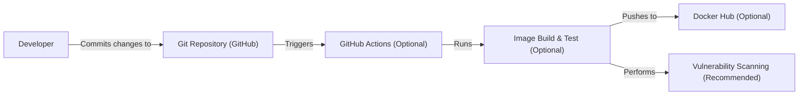

Okay, let's create a design document for the provided GitHub repository.

# BUSINESS POSTURE

Business Priorities and Goals:

*   Provide a ready-to-use, containerized tool stack for Continuous Integration (CI) purposes.
*   Enable developers to quickly set up a CI environment without manual configuration of individual tools.
*   Offer a consistent and reproducible CI environment across different projects and teams.
*   Reduce the time and effort spent on CI setup and maintenance.
*   Facilitate best practices in software development, such as automated testing and code analysis.

Most Important Business Risks:

*   Vulnerabilities in the included CI tools could be exploited to compromise builds or gain unauthorized access to source code or infrastructure.
*   Inconsistent or outdated tool versions could lead to compatibility issues or unreliable build results.
*   Lack of proper configuration or security hardening of the tools could expose sensitive data or create attack vectors.
*   The "batteries included" approach might introduce unnecessary tools or dependencies, increasing the attack surface.
*   Reliance on external Docker images introduces a supply chain risk if those images are compromised.

# SECURITY POSTURE

Existing Security Controls:

*   security control: Use of official Docker images for most tools (where available), reducing the risk of using tampered images. (Implicit in the Dockerfile)
*   security control: Containerization isolates the CI tools from the host system and from each other, limiting the impact of potential vulnerabilities. (Implicit in the use of Docker)
*   security control: The project is open source, allowing for community scrutiny and contributions to identify and fix security issues. (GitHub repository)

Accepted Risks:

*   accepted risk: The project uses specific versions of tools, which may become outdated and vulnerable over time. Regular updates are required.
*   accepted risk: The project relies on the security practices of the maintainers of the individual Docker images used.
*   accepted risk: The project does not enforce specific security configurations for the included tools, leaving it to the user to implement appropriate hardening measures.

Recommended Security Controls:

*   security control: Implement automated vulnerability scanning of the Docker images during the build process (e.g., using tools like Trivy, Clair, or Anchore).
*   security control: Provide documentation and guidance on securely configuring the included tools (e.g., setting strong passwords, enabling authentication, restricting access).
*   security control: Regularly update the Docker images to their latest versions to patch known vulnerabilities. Automate this process if possible.
*   security control: Consider using minimal base images (e.g., Alpine Linux) to reduce the attack surface.
*   security control: Implement a mechanism for verifying the integrity of the Docker images (e.g., using Docker Content Trust or Notary).
*   security control: Provide clear instructions on how to integrate the tool stack with existing security infrastructure (e.g., secrets management, network policies).

Security Requirements:

*   Authentication:
    *   The CI tools should be configured to require strong authentication for access.
    *   Consider integrating with existing identity providers (e.g., LDAP, OAuth) if applicable.
*   Authorization:
    *   Access to the CI tools and their resources should be restricted based on the principle of least privilege.
    *   Implement role-based access control (RBAC) where appropriate.
*   Input Validation:
    *   The CI tools should validate all inputs to prevent injection attacks and other vulnerabilities.
    *   This is primarily the responsibility of the individual tools, but the project should encourage secure configuration.
*   Cryptography:
    *   Sensitive data (e.g., passwords, API keys) should be stored and transmitted securely using strong encryption.
    *   Use TLS/SSL for all network communication.
    *   Consider using a secrets management solution (e.g., HashiCorp Vault) to manage sensitive data.

# DESIGN

This project provides a Docker-based CI tool stack. It simplifies setting up a CI environment by packaging several common tools into a single Docker Compose configuration.

## C4 CONTEXT

Element Descriptions:

*   Element:
    *   Name: Developer
    *   Type: Person
    *   Description: A software developer who uses the Docker CI Tool Stack to build, test, and deploy their code.
    *   Responsibilities: Writing code, configuring the CI pipeline, triggering builds, reviewing results.
    *   Security controls: Strong authentication to source code repository and any external services. Secure coding practices.

*   Element:
    *   Name: Docker CI Tool Stack
    *   Type: Software System
    *   Description: A collection of containerized CI tools orchestrated by Docker Compose.
    *   Responsibilities: Providing a consistent and reproducible CI environment, running builds, executing tests, performing code analysis, and potentially deploying applications.
    *   Security controls: Containerization, regular updates of base images, vulnerability scanning (recommended).

*   Element:
    *   Name: Docker Hub
    *   Type: External System
    *   Description: A public registry for Docker images.
    *   Responsibilities: Providing base images for the CI tools.
    *   Security controls: Docker Content Trust (recommended), image signing (dependent on image maintainers).

*   Element:
    *   Name: Source Code Repository
    *   Type: External System
    *   Description: A repository hosting the source code of the project being built (e.g., GitHub, GitLab, Bitbucket).
    *   Responsibilities: Storing source code, managing versions, providing access control.
    *   Security controls: Strong authentication, access control lists, branch protection rules.

*   Element:
    *   Name: External Services
    *   Type: External System
    *   Description: Any external services that the CI pipeline might interact with (e.g., cloud providers for deployment, artifact repositories for storing build artifacts, notification services).
    *   Responsibilities: Varies depending on the specific service.
    *   Security controls: Secure communication (TLS/SSL), authentication and authorization mechanisms specific to each service.

## C4 CONTAINER

Element Descriptions:

*   Element:
    *   Name: Developer
    *   Type: Person
    *   Description: (Same as in Context Diagram)
    *   Responsibilities: (Same as in Context Diagram)
    *   Security controls: (Same as in Context Diagram)

*   Element:
    *   Name: Docker Compose
    *   Type: Tool
    *   Description: A tool for defining and running multi-container Docker applications.
    *   Responsibilities: Orchestrating the CI tool containers, managing their lifecycle, and networking.
    *   Security controls: Secure configuration of Docker Compose itself (e.g., restricting access to the Docker socket).

*   Element:
    *   Name: Jenkins Container
    *   Type: Container
    *   Description: A container running the Jenkins automation server.
    *   Responsibilities: Orchestrating the CI pipeline, executing build steps, running tests, and triggering deployments.
    *   Security controls: Strong authentication, role-based access control, secure configuration of Jenkins plugins, regular updates.

*   Element:
    *   Name: SonarQube Container
    *   Type: Container
    *   Description: A container running the SonarQube code quality analysis platform.
    *   Responsibilities: Performing static code analysis, identifying bugs, vulnerabilities, and code smells.
    *   Security controls: Secure configuration of SonarQube, regular updates, authentication, and authorization.

*   Element:
    *   Name: SonarQube Database
    *   Type: Container
    *   Description: Database to store SonarQube data.
    *   Responsibilities: Store data.
    *   Security controls: Access restriction to SonarQube container only.

*   Element:
    *   Name: Other Tool Containers
    *   Type: Container
    *   Description: Containers for other CI tools included in the stack (e.g., Nexus, Artifactory, etc.).
    *   Responsibilities: Varies depending on the specific tool.
    *   Security controls: Secure configuration of each tool, regular updates, authentication, and authorization.

## DEPLOYMENT

Possible Deployment Solutions:

1.  Local Development Machine: Developers can run the Docker Compose stack directly on their local machines for development and testing.
2.  Dedicated CI Server: The stack can be deployed on a dedicated CI server (physical or virtual) to provide a centralized CI environment for a team or organization.
3.  Cloud-Based VM: The stack can be deployed on a cloud-based virtual machine (e.g., AWS EC2, Azure VM, Google Compute Engine) for scalability and flexibility.
4.  Kubernetes Cluster: For more complex deployments and higher availability, the stack can be adapted to run on a Kubernetes cluster.

Chosen Solution (for detailed description): Dedicated CI Server

Element Descriptions:

*   Element:
    *   Name: CI Server
    *   Type: Infrastructure Node
    *   Description: A physical or virtual server dedicated to running the CI tool stack.
    *   Responsibilities: Providing the compute resources and operating system for the Docker Engine.
    *   Security controls: Hardening of the operating system, firewall rules, intrusion detection/prevention systems, regular security patching.

*   Element:
    *   Name: Docker Engine
    *   Type: Software
    *   Description: The runtime environment for Docker containers.
    *   Responsibilities: Running and managing Docker containers.
    *   Security controls: Secure configuration of the Docker daemon, restricting access to the Docker socket, using a non-root user for running containers (where possible).

*   Element:
    *   Name: Docker Compose, Jenkins Container, SonarQube Container, Other Tool Containers, SonarQube Database
    *   Type: (Same as in Container Diagram)
    *   Description: (Same as in Container Diagram)
    *   Responsibilities: (Same as in Container Diagram)
    *   Security controls: (Same as in Container Diagram)

## BUILD

The build process for this project primarily involves building and publishing the Docker Compose configuration and any associated scripts. There isn't a traditional "build" process for the CI tools themselves, as they are pulled as pre-built images from Docker Hub. However, we can consider the process of creating and updating the Docker Compose file and related files as the "build" process.

Build Process Description:

1.  Developer makes changes to the Docker Compose file (docker-compose.yml) or other related files (e.g., scripts, documentation).
2.  Developer commits the changes to the Git repository (GitHub).
3.  Optionally, a CI/CD pipeline (e.g., GitHub Actions) can be configured to automatically build and test the changes. This could involve:
    *   Building custom Docker images if any modifications are made to the base images.
    *   Running linters and formatters on the Docker Compose file and other files.
    *   Performing vulnerability scanning on the Docker images (recommended).
    *   Pushing updated images to a container registry (e.g., Docker Hub) (optional, if custom images are built).
4.  The updated Docker Compose file and other files are available in the Git repository for users to download and deploy.

Security Controls in Build Process:

*   security control: Code review of changes to the Docker Compose file and other files before merging them into the main branch.
*   security control: Use of linters and formatters to ensure consistency and prevent errors in the configuration files.
*   security control: Vulnerability scanning of Docker images during the build process (highly recommended).
*   security control: Use of a CI/CD pipeline (e.g., GitHub Actions) to automate the build and testing process, ensuring consistency and reducing manual errors.
*   security control: Signing of the published artifacts (e.g. Docker images)

# RISK ASSESSMENT

Critical Business Processes:

*   Software development and delivery: The CI tool stack is critical for automating the build, testing, and deployment of software.
*   Code quality assurance: The tools help ensure the quality and security of the code being developed.

Data to Protect and Sensitivity:

*   Source code: Highly sensitive. Contains the intellectual property of the organization.
*   Build artifacts: Potentially sensitive, depending on the nature of the application.
*   CI configuration files: May contain sensitive information such as credentials or API keys (should be avoided).
*   Test results and code analysis reports: May contain information about vulnerabilities or weaknesses in the code.
*   Credentials and API keys (if stored within the CI environment): Highly sensitive. Should be managed securely using a secrets management solution.

# QUESTIONS & ASSUMPTIONS

Questions:

*   What specific CI tools are required for the projects that will use this stack? The current repository provides a starting point, but the exact set of tools may need to be customized.
*   What are the specific security requirements of the organization or projects that will use this stack? This will influence the configuration and hardening of the tools.
*   What is the expected scale of usage? This will impact the choice of deployment environment (local machine, dedicated server, cloud-based VM, Kubernetes).
*   Are there any existing CI/CD pipelines or infrastructure that this stack needs to integrate with?
*   What is the process for managing updates and patching of the CI tools?

Assumptions:

*   BUSINESS POSTURE: The primary goal is to provide a convenient and easy-to-use CI tool stack, prioritizing ease of setup and use over maximum security.
*   SECURITY POSTURE: Users are responsible for securely configuring the CI tools and managing sensitive data. The project provides a baseline configuration, but additional hardening may be required.
*   DESIGN: The Docker Compose-based approach is suitable for the intended use cases. For more complex deployments, a Kubernetes-based solution might be considered. The provided diagrams are a starting point and may need to be adapted based on specific requirements.