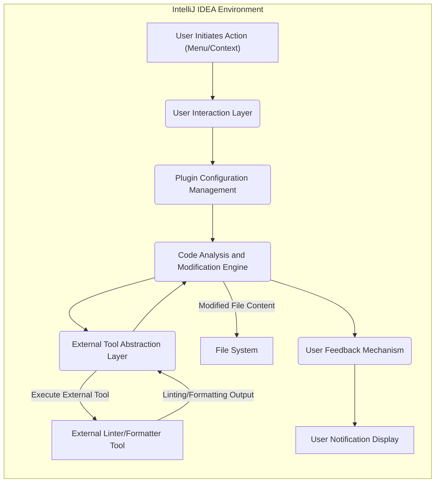

# Project Design Document: Lint Cleaner Plugin

**Version:** 1.1
**Date:** October 26, 2023
**Author:** AI Software Architect

## 1. Introduction

This document details the design of the "Lint Cleaner Plugin," an IntelliJ IDEA plugin engineered to streamline the process of automatically resolving linting and code style discrepancies within a codebase. This document serves as a foundational blueprint for comprehending the plugin's architecture, data flow mechanisms, and core components. It is specifically intended to be utilized as the basis for subsequent threat modeling exercises.

## 2. Goals

* To offer a user-friendly and efficient mechanism for developers to automatically rectify linting and code style violations directly within the IntelliJ IDEA development environment.
* To provide compatibility with a range of widely used linters and code formatters.
* To enable configurable options for tailoring the plugin's behavior to specific project needs.
* To ensure seamless integration with the IntelliJ IDEA user interface, adhering to its established conventions.
* To maintain high performance and avoid any discernible impact on the IDE's responsiveness.

## 3. Non-Goals

* Direct implementation of novel linting rules or code formatting algorithms within the plugin itself. The plugin will function as an orchestrator for existing external tools.
* Provision of a comprehensive linting configuration management system. The plugin will leverage existing project-level configurations for the integrated linters.
* Support for Integrated Development Environments (IDEs) other than IntelliJ IDEA at the present time.

## 4. Architectural Overview

The Lint Cleaner Plugin is designed with a modular architecture, facilitating clear separation of concerns and interaction with the IntelliJ IDEA platform and external linting/formatting utilities.

* **Key Components:**
    * **User Interaction Layer:** Encompasses UI elements within IntelliJ IDEA that enable user interaction with the plugin.
    * **Plugin Configuration Management:** Responsible for managing the plugin's settings and preferences.
    * **External Tool Abstraction Layer:** Provides an abstract interface for interacting with diverse linting and formatting tools.
    * **Code Analysis and Modification Engine:**  The core logic for identifying relevant files, invoking linters/formatters, and applying the suggested fixes.
    * **User Feedback Mechanism:**  Handles the presentation of status updates, notifications, and error messages to the user.

* **External System Interactions:**
    * **IntelliJ IDEA Platform SDK:** The fundamental dependency, providing APIs for plugin development and seamless integration with the IDE.
    * **External Linter/Formatter Executables:** Command-line interface (CLI) tools such as ESLint, Prettier, and others, which the plugin will execute as subprocesses.

## 5. Detailed Design

### 5.1. User Interaction Layer

* **Main Menu Integration:** An entry within the top-level IntelliJ IDEA menu (e.g., "Code" -> "Run Lint Cleaner") to initiate the code cleaning process.
* **Contextual Operations:** Right-click activated actions available on files or directories within the Project View, allowing users to target specific code sections for cleaning.
* **Preferences Panel:** A dedicated configuration panel accessible through IntelliJ IDEA's Preferences dialog, enabling users to customize:
    * Selection of active linters and formatters.
    * Specification of paths to the executable files of linters/formatters.
    * Definition of custom command-line arguments to be passed to the external tools.
    * Definition of file inclusion and exclusion patterns using glob-like syntax.
    * Toggle for automatic saving of files after fixes are applied.
* **Progress Display:** A visual indicator, potentially in the status bar or as a modal dialog, to communicate the progress of the cleaning operation.
* **Informational Notifications:** Non-obtrusive pop-up notifications to inform the user about the completion status of the cleaning process and any errors or warnings encountered.

### 5.2. Plugin Configuration Management

* **Settings Persistence:** Plugin settings are stored within IntelliJ IDEA's application or project-specific configuration files, leveraging the IDE's built-in settings management capabilities.
* **Initialization and Loading:** Settings are loaded into memory when the plugin is initialized upon IDE startup or project opening.
* **Modification and Saving:** Settings are persisted to disk when the user modifies them through the settings panel or potentially through programmatic changes.
* **Basic Validation:** Implementation of rudimentary validation checks on configuration values, such as verifying the existence of specified executable paths and the validity of file patterns.

### 5.3. External Tool Abstraction Layer

* **Interface Definition:** Defines a set of abstract interfaces that standardize the interaction with different linting and formatting tools, promoting extensibility and maintainability.
* **Concrete Implementations:** Provides specific implementations of the defined interfaces for each supported external tool (e.g., `ESLintAdapter`, `PrettierAdapter`, `StylelintAdapter`). These adapters encapsulate the tool-specific logic for execution and output parsing.
* **Subprocess Management:** Responsible for the secure and reliable invocation of external command-line tools as subprocesses, managing their input, output, and error streams.
* **Output Interpretation:**  Parses the textual output generated by the linters and formatters to identify reported issues, their locations within the code, and suggested fixes. This often involves handling different output formats (e.g., JSON, Checkstyle XML).
* **Fix Application Strategies:** Implements different strategies for applying the suggested fixes, which might involve directly modifying the file content programmatically or utilizing the linter/formatter's built-in "fix" functionality (if available).

### 5.4. Code Analysis and Modification Engine

* **Target File Selection:** Determines the specific set of files to be processed based on the user's selection in the IDE or according to the file inclusion/exclusion patterns defined in the plugin's configuration.
* **Tool Orchestration:**  Manages the execution of the appropriate linter and formatter tools for each selected file, taking into account the plugin's configuration and the file type.
* **Issue Aggregation and Prioritization:** Collects the reported issues from the various linters and formatters. Future enhancements could include prioritization or deduplication of issues.
* **Fix Application Coordination:** Coordinates the application of fixes, potentially needing to handle scenarios where different tools suggest conflicting modifications to the same code region.
* **File System Operations:** Performs the necessary file system operations, including reading the content of files before analysis and writing the modified content back to the file system after applying fixes. Implements appropriate error handling for file access operations.

### 5.5. User Feedback Mechanism

* **Notification Display:** Utilizes IntelliJ IDEA's built-in notification API to present informative messages to the user, adhering to the IDE's notification conventions.
* **Error Reporting:**  Displays clear and actionable error messages when issues arise during the cleaning process, such as failures to execute linters, problems parsing output, or file access errors.
* **Success Indication:**  Provides confirmation messages to the user upon successful completion of the cleaning process, potentially indicating the number of issues that were automatically resolved.
* **Logging (Internal):**  Implements internal logging mechanisms (not directly visible to the user in typical operation) for debugging and troubleshooting purposes. This logging can record details about tool executions, configuration loading, and potential errors.

## 6. Data Flow

**Detailed Data Flow Description:**

1. **User Initiates Action:** The user triggers the lint cleaning process through an interaction with the plugin's UI elements, such as a menu item or a context menu action within the IntelliJ IDEA environment.
2. **User Interaction Layer:** The UI components within the plugin receive the user's request and any associated parameters (e.g., selected files or directories).
3. **Plugin Configuration Management:** The User Interaction Layer may interact with the Plugin Configuration Management component to retrieve the current plugin settings, such as the enabled linters, their executable paths, and custom arguments.
4. **Code Analysis and Modification Engine:** The core engine determines the specific files that need to be processed based on the user's selection and the plugin's configuration rules (inclusion/exclusion patterns).
5. **External Tool Abstraction Layer:** For each file to be processed, the engine invokes the appropriate external linter or formatter tool through the abstraction layer. This involves selecting the correct adapter based on the configured linters/formatters.
6. **Execute External Tool:** The abstraction layer executes the external command-line tool as a subprocess, providing the file content as input (or the file path as an argument) along with any relevant configuration parameters.
7. **Linting/Formatting Output:** The external tool performs its analysis or formatting and generates output, typically in a textual format, indicating any linting issues or the formatted code.
8. **External Tool Abstraction Layer:** The abstraction layer captures and parses the output from the external tool, extracting information about the identified issues, their locations, and suggested fixes.
9. **Code Analysis and Modification Engine:** The engine receives the parsed issues and coordinates the application of the suggested fixes. This might involve directly modifying the file content in memory or instructing the abstraction layer to use the tool's built-in fix capabilities.
10. **Modified File Content:** The engine writes the modified file content back to the File System, overwriting the original file with the corrected version.
11. **User Feedback Mechanism:** The engine sends status updates, notifications (success or error messages), and potentially details about the applied fixes to the User Feedback Mechanism.
12. **User Notification Display:** The User Feedback Mechanism utilizes IntelliJ IDEA's notification system to display relevant information to the user, providing feedback on the outcome of the lint cleaning process.

## 7. Dependencies

* **IntelliJ Platform SDK:**  Provides the essential APIs and infrastructure required for developing plugins for the IntelliJ IDEA platform.
* **Java Runtime Environment (JRE) or Java Development Kit (JDK):**  The underlying runtime environment necessary for executing the IntelliJ IDEA platform and the plugin, which is typically developed in Java or Kotlin.
* **External Linter/Formatter Executables:** The plugin relies on the presence and correct configuration of external command-line tools such as ESLint, Prettier, Stylelint, etc. The user is responsible for installing these tools and ensuring they are accessible in the system's PATH or by providing explicit paths in the plugin's settings.

## 8. Security Considerations (High-Level)

This section outlines potential security considerations that will be subject to a more in-depth analysis during the dedicated threat modeling phase.

* **External Process Execution Vulnerabilities:** The plugin's core functionality involves executing external command-line tools, which introduces potential security risks:
    * **Malicious Tool Configuration:** If a user inadvertently or maliciously configures the plugin to execute a harmful or untrusted executable, it could lead to system compromise.
    * **Command Injection Flaws:** Improperly sanitized input when constructing the command-line arguments passed to the external tools could create command injection vulnerabilities, allowing attackers to execute arbitrary commands on the user's system.
* **File System Access Control:** The plugin requires read and write access to files within the project. Potential risks include:
    * **Unauthorized File Modification:** Although operating within the user's context, vulnerabilities in the plugin's logic could potentially allow unintended modification or deletion of files outside the intended scope.
    * **Data Integrity Issues:** Bugs in the fix application logic could lead to data corruption or unintended changes to the codebase.
* **Configuration Data Security:** While this plugin is unlikely to store highly sensitive credentials, the plugin's configuration data itself could be a target:
    * **Exposure of Tool Paths:**  Revealing the paths to external tools might provide information to attackers about the user's development environment.
* **Plugin Update Mechanism Security:**  The process for updating the plugin itself needs to be secure to prevent the distribution of malicious updates that could introduce vulnerabilities or compromise user systems.
* **Privilege Escalation (Low Risk):** While less likely in a typical plugin scenario, it's worth considering if any part of the plugin could inadvertently lead to privilege escalation if not carefully designed.
* **Dependency Vulnerabilities:**  The plugin itself depends on the IntelliJ Platform SDK and potentially other libraries. Vulnerabilities in these dependencies could indirectly affect the plugin's security.

## 9. Future Considerations

* **Expanded Linter and Formatter Support:**  Adding support for a wider range of linting and code formatting tools to cater to diverse project needs.
* **Integration with Version Control Systems:**  Enhancing the plugin to interact with version control systems like Git, allowing for automatic staging of changes made by the cleaner.
* **Interactive Fix Review and Application:**  Providing a user interface for reviewing the suggested fixes before they are automatically applied, offering more control to the developer.
* **Performance Optimizations:**  Implementing optimizations to improve the plugin's performance, especially when processing large projects with numerous files.
* **Customizable Fix Application Strategies:**  Allowing users to define more granular control over how fixes are applied, potentially offering options to ignore certain types of issues or customize the fixing behavior.
* **Enhanced Error Handling and Reporting:**  Providing more detailed and user-friendly error messages and logging information to aid in troubleshooting.

This revised document provides a more detailed and comprehensive overview of the Lint Cleaner Plugin's design. It aims to offer a clearer understanding of the system's architecture, data flow, and potential security considerations, making it a more effective foundation for the subsequent threat modeling process.