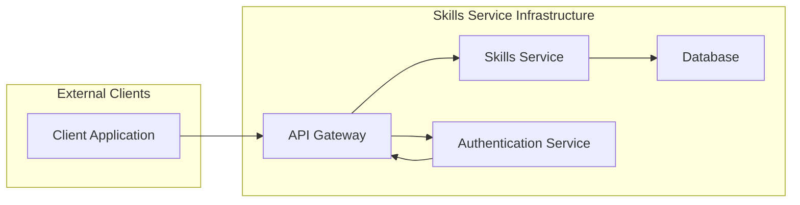
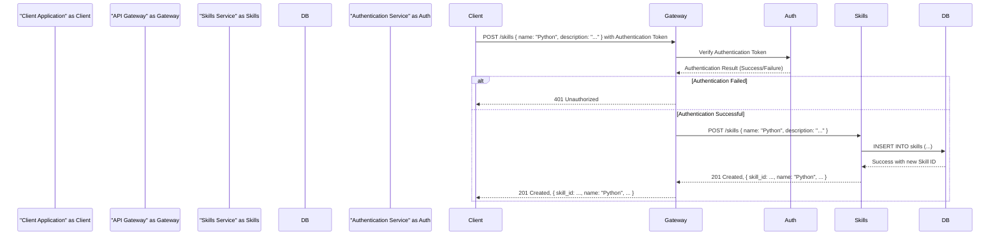
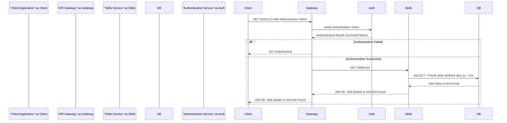

# Project Design Document: Skills Service

**Version:** 1.1
**Date:** October 26, 2023
**Prepared By:** AI Architecture Expert

## 1. Introduction

This document provides a detailed design for the Skills Service project, based on the repository found at [https://github.com/NationalSecurityAgency/skills-service](https://github.com/NationalSecurityAgency/skills-service). This document aims to clearly outline the system's architecture, components, data flow, and deployment considerations. It will serve as a foundation for subsequent threat modeling activities. This revision includes more detailed descriptions and expands on security considerations.

## 2. Goals and Objectives

The primary goal of the Skills Service is to provide a centralized platform for managing and accessing information about individual skills. Key objectives include:

*   Providing a well-defined and documented RESTful API for interacting with skill data.
*   Allowing for the complete lifecycle management of skill records: creation, retrieval, updating, and deletion (CRUD).
*   Supporting a rich set of attributes for each skill, such as name, description, categories, and potentially proficiency levels or associated resources.
*   Offering robust mechanisms for searching and filtering skills based on various criteria, including keywords, categories, and other relevant attributes.
*   Ensuring data integrity, consistency, and security through appropriate validation and access controls.
*   Being designed for scalability, maintainability, and ease of deployment in a cloud environment.

## 3. High-Level Architecture

The Skills Service adopts a microservices architecture, separating concerns into distinct, independently deployable units. This approach promotes modularity, scalability, and resilience. The core components are:

*   **API Gateway:**  The single entry point for all external requests, responsible for routing, authentication, authorization, and potentially rate limiting and request transformation.
*   **Skills Service:** The core business logic component responsible for managing skill data. It handles CRUD operations, search functionality, and data validation.
*   **Database:**  A persistent storage layer optimized for storing and retrieving skill data.
*   **Authentication Service (Assumed):** While not explicitly detailed in the provided repository, a separate authentication service is assumed for securely verifying the identity of clients and issuing access tokens.

## 4. Detailed Design

### 4.1. API Gateway

*   **Functionality:**
    *   **Reverse Proxy and Routing:**  Directs incoming requests to the appropriate backend service (primarily the Skills Service) based on defined routes and rules.
    *   **Authentication & Authorization Enforcement:**  Verifies the identity of the client using tokens provided in the request and ensures they have the necessary permissions to access the requested resources. This involves communication with the Authentication Service.
    *   **Rate Limiting and Throttling:**  Protects the backend services from being overwhelmed by excessive requests, ensuring fair usage and preventing denial-of-service attacks.
    *   **Request and Response Transformation:**  May modify request headers or bodies before forwarding them to the backend, and similarly transform responses before sending them back to the client.
    *   **TLS Termination:**  Handles the encryption and decryption of HTTPS traffic, ensuring secure communication between clients and the service.
    *   **API Composition (Potentially):** In more complex scenarios, the API Gateway might aggregate responses from multiple backend services.
*   **Technology:**  Likely an off-the-shelf API Gateway solution such as Kong, Tyk, Ambassador, or a cloud-managed service like AWS API Gateway, Azure API Management, or Google Cloud API Gateway. Alternatively, a lightweight proxy like Nginx or Traefik with added authentication plugins could be used.

### 4.2. Skills Service

*   **Functionality:**
    *   **RESTful API Endpoints:** Exposes well-defined endpoints for managing skill data, adhering to RESTful principles (e.g., `/skills` for collections, `/skills/{id}` for individual resources).
    *   **CRUD Operations Implementation:**  Provides logic for creating new skill records, retrieving existing ones (individually or in lists), updating existing records, and deleting records from the database.
    *   **Search and Filtering Logic:**  Implements functionality to search and filter skills based on various criteria specified in the request parameters (e.g., name, description keywords, categories). This might involve database queries or dedicated search indexing technologies.
    *   **Data Validation and Sanitization:**  Ensures that incoming data conforms to defined schemas and constraints, preventing invalid data from being persisted and mitigating injection attacks.
    *   **Business Logic Implementation:**  Enforces any specific business rules related to skill management, such as constraints on skill names or relationships between skills.
    *   **Data Transformation (Potentially):** May transform data between the API layer and the data storage layer.
*   **Technology:** Based on the repository, likely implemented using Python and a framework like FastAPI or Flask. Consideration for asynchronous processing might lead to the use of libraries like `asyncio`.
*   **Data Model (Conceptual):**
    *   `skill_id` (UUID or Integer, Primary Key, Unique Identifier)
    *   `name` (String, Required, Indexed for Search)
    *   `description` (String, Indexed for Search)
    *   `category` (String, Optional, for categorization and filtering)
    *   `created_at` (Timestamp, Automatically Generated)
    *   `updated_at` (Timestamp, Automatically Updated)
    *   `related_skills` (Array/List of Skill IDs, for representing relationships)
    *   `proficiency_levels` (JSON or structured data, if tracking proficiency)

### 4.3. Database

*   **Functionality:**  Provides persistent, reliable, and scalable storage for skill data. It should support efficient querying and indexing for search operations.
*   **Technology:**  Likely a relational database such as PostgreSQL, MySQL, or potentially a cloud-managed database service like Amazon RDS, Azure SQL Database, or Google Cloud SQL. The provided repository suggests PostgreSQL, which is a strong choice for structured data.
*   **Schema:**  Will contain a table (or set of tables if relationships are complex) to store skill records, mapping to the data model described above. Consideration for indexing strategies to optimize search performance is important.

### 4.4. Authentication Service (Assumed)

*   **Functionality:**
    *   **User/Application Authentication:** Verifies the identity of users or applications attempting to access the Skills Service, typically through username/password credentials or API keys.
    *   **Token Issuance:**  Issues secure access tokens (e.g., JWT - JSON Web Tokens) upon successful authentication. These tokens are used by clients to authenticate subsequent requests to the API Gateway.
    *   **Token Verification and Validation:**  Provides mechanisms for the API Gateway to verify the authenticity and validity of access tokens presented by clients. This includes checking the signature, expiration time, and issuer of the token.
    *   **Authorization Information Provision:**  May provide information about the roles and permissions associated with an authenticated user or application, allowing the API Gateway to make authorization decisions.
    *   **User Management (Potentially):**  May include functionalities for managing user accounts, such as registration, password reset, and profile management.
*   **Technology:**  Could be a dedicated identity provider (IdP) like Keycloak, Auth0, Okta, or a cloud-managed service like AWS Cognito, Azure Active Directory, or Google Cloud Identity Platform. A custom-built service using frameworks like Spring Security or Django OAuth Toolkit is also possible.

## 5. Data Flow

### 5.1. Adding a New Skill

### 5.2. Retrieving a Skill

## 6. Security Considerations (For Threat Modeling)

This section outlines potential security concerns that will be explored in detail during the threat modeling process, categorized by component.

*   **API Gateway:**
    *   **Authentication and Authorization Bypass:**  Vulnerabilities allowing unauthorized access to backend services.
    *   **Injection Attacks:**  Exposure to header injection or other forms of injection if not properly configured.
    *   **Rate Limiting Evasion:**  Techniques used by attackers to bypass rate limiting mechanisms.
    *   **Denial of Service (DoS):**  Attacks targeting the API Gateway to make the service unavailable.
    *   **Misconfiguration:**  Incorrectly configured routing rules or security policies.
*   **Skills Service:**
    *   **SQL Injection:**  Vulnerabilities in database queries allowing attackers to manipulate the database.
    *   **Cross-Site Scripting (XSS):**  If the service renders user-provided data in a web context (less likely for a pure API, but possible in admin interfaces).
    *   **Insecure Deserialization:**  If the service deserializes untrusted data.
    *   **Mass Assignment:**  Allowing clients to update unintended fields in the data model.
    *   **Business Logic Flaws:**  Vulnerabilities in the application's logic that can be exploited.
    *   **Improper Input Validation:**  Failing to validate and sanitize user input, leading to various vulnerabilities.
*   **Database:**
    *   **Unauthorized Access:**  Gaining access to the database without proper authentication.
    *   **Data Breaches:**  Exfiltration of sensitive skill data.
    *   **Data Integrity Issues:**  Unauthorized modification or deletion of data.
    *   **SQL Injection (from Skills Service):**  As mentioned above, a primary attack vector.
    *   **Insufficient Encryption:**  Lack of encryption for data at rest and in transit.
*   **Authentication Service:**
    *   **Brute-Force Attacks:**  Attempting to guess user credentials.
    *   **Credential Stuffing:**  Using compromised credentials from other services.
    *   **Token Theft or Hijacking:**  Stealing or intercepting access tokens.
    *   **Vulnerabilities in Token Generation or Verification:**  Weaknesses in the token implementation (e.g., JWT vulnerabilities).
    *   **Account Takeover:**  Gaining unauthorized access to user accounts.
*   **General Security Considerations:**
    *   **Dependency Vulnerabilities:**  Using outdated or vulnerable libraries and dependencies in any of the services.
    *   **Insecure Secrets Management:**  Storing sensitive credentials (e.g., database passwords, API keys) in insecure locations.
    *   **Insufficient Logging and Monitoring:**  Lack of adequate logging and monitoring to detect and respond to security incidents.
    *   **Lack of Security Audits and Penetration Testing:**  Failure to regularly assess the security posture of the system.

## 7. Deployment Architecture

The Skills Service is highly likely to be deployed using containerization technology like Docker and orchestrated using Kubernetes or a similar platform for scalability and resilience. A typical deployment might involve:

*   **Containerization with Docker:** Each service (API Gateway, Skills Service, Authentication Service) packaged as a Docker container for consistent deployment and isolation.
*   **Orchestration with Kubernetes:** Kubernetes managing the deployment, scaling, health checks, and resource allocation for the containers. This includes managing deployments, services, and ingress.
*   **Cloud Environment:**  Deployment typically occurs in a cloud environment such as AWS (using services like EKS, ECS, RDS), Azure (using AKS, Azure Container Instances, Azure SQL Database), or GCP (using GKE, Cloud Run, Cloud SQL).
*   **Load Balancing:**  A load balancer (e.g., AWS ELB, Azure Load Balancer, Google Cloud Load Balancing) distributing traffic across multiple instances of the Skills Service for high availability and scalability.
*   **CI/CD Pipeline:** An automated pipeline (e.g., using Jenkins, GitLab CI, GitHub Actions, Azure DevOps) for building, testing, and deploying updates to the service, ensuring rapid and reliable deployments.
*   **Service Mesh (Potentially):**  For more complex deployments, a service mesh like Istio or Linkerd might be used to manage inter-service communication, security, and observability.

## 8. Technology Stack

*   **Programming Language:** Python
*   **API Framework:** FastAPI or Flask
*   **Database:** PostgreSQL
*   **Containerization:** Docker
*   **Orchestration:** Kubernetes (Likely)
*   **API Gateway:** Nginx, Traefik, Kong, Tyk, or cloud-managed API Gateway solutions (AWS API Gateway, Azure API Management, Google Cloud API Gateway)
*   **Authentication:** OAuth 2.0, OpenID Connect, JWT (Implementation likely depends on the chosen Authentication Service)
*   **Cloud Provider:** AWS, Azure, or GCP (Likely)
*   **CI/CD Tools:** Jenkins, GitLab CI, GitHub Actions, Azure DevOps
*   **Logging and Monitoring:** Prometheus, Grafana, ELK stack (Elasticsearch, Logstash, Kibana), CloudWatch, Azure Monitor, Google Cloud Logging

## 9. Future Considerations

*   **Skill Relationships Enhancement:** Implementing more complex and nuanced relationships between skills, such as dependencies, specializations, and alternative skills.
*   **API Versioning Strategy:**  Implementing a clear API versioning strategy (e.g., URI versioning, header-based versioning) to allow for backward-incompatible changes while maintaining compatibility for existing clients.
*   **Advanced Search Capabilities Integration:**  Integrating more sophisticated search features, such as full-text search using Elasticsearch or Solr, faceted search, and personalized search recommendations.
*   **Integration with External Systems:**  Developing integrations with other relevant systems within the organization, such as HR systems, learning management systems (LMS), or project management tools.
*   **GraphQL API Implementation:**  Potentially offering a GraphQL API as an alternative to REST, providing clients with more flexibility in querying data.
*   **Event-Driven Architecture:**  Exploring the use of an event-driven architecture for certain functionalities, allowing for asynchronous communication and decoupling of services.
*   **Skill Recommendation Engine:**  Developing a recommendation engine to suggest relevant skills to users based on their profiles or job roles.

This revised design document provides a more detailed and comprehensive overview of the Skills Service project, offering a stronger foundation for subsequent threat modeling activities. The added details and expanded security considerations aim to facilitate a more thorough and effective threat analysis.