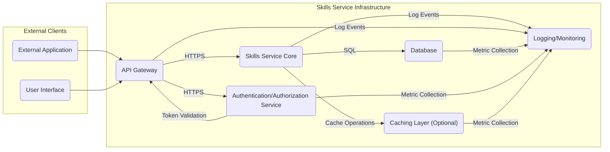
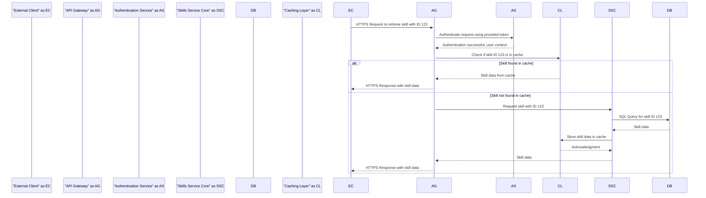
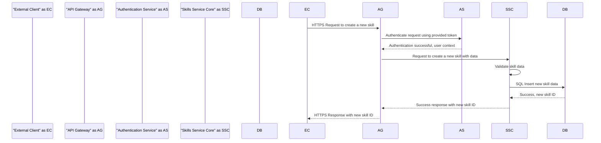

# Project Design Document: Skills Service

**Version:** 1.1
**Date:** October 26, 2023
**Author:** AI Software Architect

## 1. Introduction

This document provides an enhanced and detailed design for the Skills Service project, based on the [nationalsecurityagency/skills-service](https://github.com/nationalsecurityagency/skills-service) repository. This document aims to provide a comprehensive and refined overview of the system's architecture, components, data flow, and security considerations. This improved document will serve as a more robust foundation for subsequent threat modeling activities, offering greater clarity and detail.

## 2. Goals and Objectives

The primary goals of the Skills Service are to:

*   Provide a centralized and authoritative repository for managing and accessing information about individual skills.
*   Enable authenticated and authorized users to create, read, update, and delete skill entries programmatically and potentially through a user interface.
*   Offer a well-defined and documented API for seamless integration with other internal and potentially external applications requiring skill data.
*   Ensure the confidentiality, integrity, and availability of the skills data through robust security measures.
*   Provide a scalable, reliable, and maintainable service capable of handling growing data volumes and user traffic.

## 3. High-Level Architecture

The Skills Service adopts a microservice architecture, promoting modularity and independent deployability. Key components include:

*   **API Gateway:**  The single entry point for all external requests, responsible for routing, authentication, authorization, rate limiting, and potentially request transformation and aggregation.
*   **Skills Service Core:**  The heart of the application, responsible for implementing skill-related business logic, data validation, and interaction with the data persistence layer.
*   **Database:**  The persistent storage layer for skill data, likely a relational database such as PostgreSQL, chosen for its reliability, data integrity features, and support for complex queries.
*   **Authentication and Authorization Service:**  A dedicated and independent service responsible for verifying user identities, issuing access tokens, and enforcing access control policies across the Skills Service.
*   **Caching Layer:**  An optional but highly recommended component to significantly improve read performance by storing frequently accessed skill data in a fast, in-memory store, reducing latency and database load.
*   **Logging and Monitoring:**  Essential infrastructure for collecting, aggregating, and analyzing logs and metrics from all service components, providing operational visibility, facilitating debugging, and enabling proactive issue detection.

## 4. Component Details

### 4.1. API Gateway

*   **Purpose:**  Serves as the central point of contact for all external interactions with the Skills Service, decoupling clients from internal service implementation details.
*   **Functionality:**
    *   **Request Routing:**  Intelligently routes incoming requests to the appropriate backend service (Skills Service Core) based on defined rules and configurations.
    *   **Authentication:**  Verifies the identity of the requester, typically by validating authentication tokens (e.g., JWT) issued by the Authentication and Authorization Service.
    *   **Authorization:**  Enforces access control policies, ensuring that the authenticated requester has the necessary permissions to access the requested resource or perform the desired action.
    *   **Rate Limiting:**  Protects the backend services from being overwhelmed by excessive requests, ensuring stability and preventing denial-of-service attacks.
    *   **TLS Termination:**  Handles the encryption and decryption of HTTPS traffic, securing communication between clients and the service.
    *   **Request Transformation and Aggregation (Optional):** May modify request or response formats or aggregate data from multiple backend services before returning it to the client.
*   **Technology:**  Likely a robust and scalable API gateway solution such as Kong, Nginx with Lua and OpenResty, Traefik, or a cloud provider's managed API Gateway service (e.g., AWS API Gateway, Azure API Management, Google Cloud API Gateway). The choice depends on factors like scalability requirements, existing infrastructure, and security needs.
*   **Security Considerations:**
    *   Vulnerability to OWASP API Security Top 10 threats, requiring careful implementation of security best practices.
    *   Misconfiguration can lead to severe security vulnerabilities, such as open access or bypassing authentication.
    *   Susceptible to DDoS attacks if not properly protected with rate limiting and other mitigation techniques.
    *   Improper handling of authentication tokens can lead to security breaches.

### 4.2. Skills Service Core

*   **Purpose:**  Encapsulates the core business logic of the Skills Service, responsible for managing skill data and enforcing business rules.
*   **Functionality:**
    *   **CRUD Operations:**  Provides well-defined API endpoints (e.g., RESTful endpoints) for creating, reading, updating, and deleting skill records.
    *   **Search and Filtering:**  Offers capabilities to search and filter skills based on various criteria (e.g., name, description, category, keywords), potentially leveraging database indexing for efficient querying.
    *   **Data Validation:**  Implements rigorous data validation to ensure the integrity and consistency of skill data, preventing invalid or malicious data from being persisted.
    *   **Business Logic Enforcement:**  Implements specific business rules related to skills, such as skill dependencies, categorization hierarchies, or approval workflows.
*   **Technology:**  As indicated by the GitHub repository, this service is implemented in Go. It likely utilizes a framework like Gin, Echo, or Fiber for handling HTTP requests and routing. Interaction with the database will likely be through an ORM or database/sql package.
*   **Security Considerations:**
    *   Vulnerable to input validation vulnerabilities if not implemented correctly, potentially leading to injection attacks (e.g., SQL injection).
    *   Business logic flaws can lead to unauthorized data manipulation or inconsistencies.
    *   Dependencies should be carefully managed and regularly scanned for known vulnerabilities.
    *   Proper error handling and logging are crucial to prevent information leakage and aid in debugging security issues.

### 4.3. Database

*   **Purpose:**  Provides a reliable and persistent storage mechanism for all skill-related data.
*   **Functionality:**
    *   Stores detailed skill attributes, including name, description, category, proficiency levels, associated resources, and potentially metadata.
    *   Provides efficient mechanisms for querying, retrieving, and indexing skill data, supporting various search and filtering requirements.
    *   Ensures data consistency and durability through ACID properties (Atomicity, Consistency, Isolation, Durability).
    *   Supports backup and recovery mechanisms to prevent data loss.
*   **Technology:**  Likely a relational database like PostgreSQL, chosen for its open-source nature, robustness, advanced features (e.g., JSON support, full-text search), and strong community support. Other potential candidates could include MySQL or cloud-native database offerings.
*   **Security Considerations:**
    *   Susceptible to SQL injection vulnerabilities if data access logic within the Skills Service Core is not properly parameterized.
    *   Requires strong access control mechanisms to prevent unauthorized access to the database server and its data.
    *   Data at rest should be encrypted to protect confidentiality in case of unauthorized access to the storage media.
    *   Regular backups should be performed and stored securely to ensure data recovery in case of failures.

### 4.4. Authentication and Authorization Service

*   **Purpose:**  Provides a centralized and secure mechanism for managing user identities, authenticating users, and authorizing access to the Skills Service and potentially other applications.
*   **Functionality:**
    *   **Authentication:**  Verifies user credentials (e.g., username/password, multi-factor authentication) and issues authentication tokens (e.g., JWT).
    *   **Authorization:**  Determines if an authenticated user has the necessary permissions (roles, scopes) to perform a specific action on a resource within the Skills Service.
    *   **User Management:**  Potentially includes functionalities for managing user accounts, roles, and permissions.
    *   **Token Management:**  Handles the issuance, renewal, and revocation of access tokens.
*   **Technology:**  Could be a dedicated service built in-house or a third-party Identity Provider (IdP) solution like Keycloak, Auth0, Okta, or a cloud provider's IAM service (e.g., AWS IAM, Azure AD, Google Cloud Identity Platform). It likely utilizes standard authentication and authorization protocols like OAuth 2.0 and OpenID Connect.
*   **Security Considerations:**
    *   Vulnerabilities in the authentication process (e.g., weak password policies, susceptibility to brute-force attacks, insecure token generation or storage).
    *   Authorization flaws can lead to privilege escalation or unauthorized access to sensitive data or functionalities.
    *   Insecure storage of user credentials or cryptographic keys is a critical vulnerability.
    *   Proper implementation of token validation and revocation mechanisms is essential.

### 4.5. Caching Layer (Optional)

*   **Purpose:**  Optimizes the performance of the Skills Service by storing frequently accessed skill data in a high-speed, in-memory cache, reducing the need to query the database repeatedly.
*   **Functionality:**
    *   Stores copies of skill data based on access patterns and configured caching strategies.
    *   Reduces the load on the database, improving overall system responsiveness and scalability.
    *   Improves response times for read-heavy operations.
    *   May implement different caching strategies (e.g., read-through, write-through, write-back).
*   **Technology:**  Could be an in-memory data store like Redis or Memcached, chosen for their speed, scalability, and ease of integration.
*   **Security Considerations:**
    *   Data breaches can occur if the cache is not properly secured, as it may contain sensitive skill data.
    *   Cache poisoning attacks can lead to serving incorrect or malicious data to users.
    *   Access to the cache should be restricted to authorized services.

### 4.6. Logging and Monitoring

*   **Purpose:**  Provides crucial insights into the operational health, performance, and security of the Skills Service.
*   **Functionality:**
    *   **Log Aggregation:**  Collects logs from all components of the service (API Gateway, Skills Service Core, Authentication Service, Database), providing a centralized view of system activity.
    *   **Metric Collection:**  Gathers performance metrics (e.g., request latency, error rates, resource utilization) to monitor system health and identify potential bottlenecks.
    *   **Alerting:**  Triggers alerts based on predefined thresholds or events (e.g., high error rates, security incidents), enabling proactive issue resolution.
    *   **Dashboarding:**  Provides visualizations of logs and metrics, making it easier to understand system behavior and identify trends.
*   **Technology:**  Could involve a combination of open-source tools like Elasticsearch, Fluentd/Logstash, Kibana (EFK stack), Prometheus, Grafana, and potentially cloud provider's managed monitoring services (e.g., AWS CloudWatch, Azure Monitor, Google Cloud Monitoring).
*   **Security Considerations:**
    *   Sensitive information should be carefully filtered before being logged to avoid exposing confidential data.
    *   Access to logs and metrics should be restricted to authorized personnel.
    *   Logs should be stored securely and protected against tampering to maintain their integrity for auditing purposes.

## 5. Data Flow

A typical request flow for retrieving a skill might look like this:

A typical request flow for creating a new skill might look like this:

## 6. Security Considerations

This section provides a more detailed outline of key security considerations for the Skills Service, expanding on the previous version. These will be thoroughly explored during threat modeling sessions.

*   **Authentication and Authorization:**
    *   Enforce strong password policies and encourage the use of multi-factor authentication.
    *   Implement robust Role-Based Access Control (RBAC) to granularly control access to resources and actions based on user roles.
    *   Securely store user credentials using strong hashing algorithms with salt.
    *   Utilize industry-standard protocols like OAuth 2.0 and OpenID Connect for authentication and authorization.
    *   Regularly audit user permissions and roles.
*   **Input Validation:**
    *   Implement comprehensive input validation on all data received from external sources, including request parameters, headers, and body.
    *   Sanitize user-provided data to prevent cross-site scripting (XSS) attacks.
    *   Use parameterized queries or ORM features to prevent SQL injection vulnerabilities.
    *   Validate data types, formats, and ranges to ensure data integrity.
*   **Data Protection:**
    *   Encrypt sensitive data both in transit using HTTPS/TLS and at rest using database encryption features or encryption at the storage layer.
    *   Implement access controls to restrict access to sensitive data based on the principle of least privilege.
    *   Regularly review and update encryption keys and algorithms.
*   **API Security:**
    *   Implement rate limiting and request throttling to prevent abuse and denial-of-service attacks.
    *   Adhere to the OWASP API Security Top 10 guidelines to mitigate common API vulnerabilities.
    *   Securely manage API keys and tokens.
    *   Implement proper error handling to avoid leaking sensitive information in error messages.
*   **Dependency Management:**
    *   Maintain a Software Bill of Materials (SBOM) to track all dependencies.
    *   Regularly scan dependencies for known vulnerabilities using automated tools.
    *   Keep dependencies up-to-date with the latest security patches.
*   **Logging and Monitoring:**
    *   Implement comprehensive logging of security-related events, such as authentication attempts, authorization failures, and data modification actions.
    *   Monitor logs for suspicious activity and security breaches.
    *   Securely store and manage logs, protecting them from unauthorized access and tampering.
    *   Implement alerting mechanisms to notify security personnel of potential incidents.
*   **Infrastructure Security:**
    *   Harden the underlying infrastructure (servers, networks, containers) by following security best practices.
    *   Implement network segmentation to isolate components and limit the impact of potential breaches.
    *   Regularly patch operating systems and software to address known vulnerabilities.
    *   Use firewalls and intrusion detection/prevention systems (IDS/IPS) to protect the network.
*   **Secrets Management:**
    *   Securely store and manage sensitive secrets (e.g., database credentials, API keys, encryption keys) using dedicated secrets management solutions like HashiCorp Vault, AWS Secrets Manager, or Azure Key Vault.
    *   Avoid hardcoding secrets in the code or configuration files.
    *   Rotate secrets regularly.

## 7. Deployment

The Skills Service is envisioned to be deployed in a cloud-native environment leveraging containerization and orchestration technologies for scalability, resilience, and efficient management.

*   **Containerization:**  Docker images will be built for each service component (API Gateway, Skills Service Core, Authentication Service), ensuring consistent and reproducible deployments.
*   **Orchestration:**  Kubernetes will be used as the container orchestration platform to manage the deployment, scaling, and health of the containers, providing features like auto-scaling, self-healing, and rolling updates.
*   **Cloud Provider:**  Deployment is likely targeted for a major cloud provider such as AWS, Azure, or Google Cloud, leveraging their managed services for infrastructure, networking, and security.
*   **CI/CD Pipeline:**  A robust and automated CI/CD pipeline will be implemented using tools like Jenkins, GitLab CI, or GitHub Actions to automate the build, test, and deployment process, ensuring rapid and reliable releases.

## 8. Future Considerations

*   **Skill Versioning:**  Implement a mechanism for versioning skills to track changes and maintain a history of modifications.
*   **Skill Relationships:**  Introduce the ability to define relationships between skills (e.g., prerequisites, related skills, skill groups) to create a more interconnected knowledge graph.
*   **Integration with other systems:**  Develop more robust and flexible integration capabilities with other enterprise applications through well-defined APIs and event-driven architectures.
*   **Enhanced Search Capabilities:**  Implement more advanced search features, such as fuzzy search, semantic search, and faceted search, to improve the discoverability of skills.
*   **Auditing:**  Implement detailed auditing of all data modifications, access attempts, and administrative actions for compliance and security monitoring.
*   **GraphQL API:** Consider offering a GraphQL API as an alternative to REST for clients with specific data fetching requirements.

This improved design document provides a more detailed and comprehensive understanding of the Skills Service project. It serves as a valuable resource for threat modeling and further development efforts, offering greater clarity and addressing potential areas for improvement.
