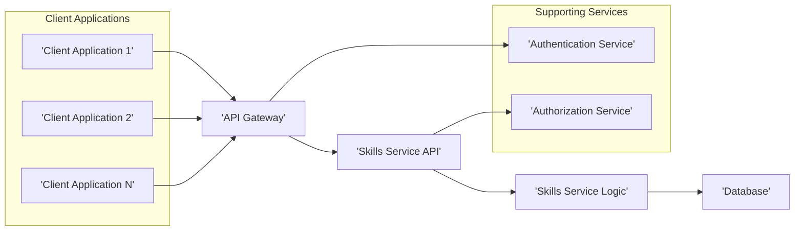
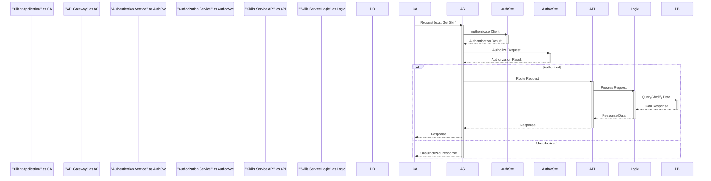
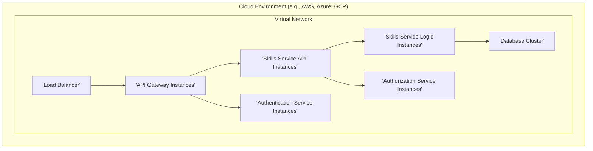

# Project Design Document: Skills Service

**Version:** 1.1
**Date:** October 26, 2023
**Author:** AI Software Architect

## 1. Introduction

This document provides an enhanced and more detailed design overview of the Skills Service project, as found on GitHub at [https://github.com/nationalsecurityagency/skills-service](https://github.com/nationalsecurityagency/skills-service). This document aims to clearly articulate the system's architecture, components, data flow, and key considerations for security and deployment. This improved document will serve as a more robust foundation for subsequent threat modeling activities.

### 1.1. Project Overview

The Skills Service is designed to manage and query information about skills. Based on the GitHub repository, it appears to provide a robust API for performing CRUD (Create, Read, Update, Delete) operations on skill data. This service likely acts as a centralized and authoritative source of truth for skill information within an organization or system, enabling various applications and services to access and utilize this data.

### 1.2. Goals

* Provide a clear, comprehensive, and more detailed architectural overview of the Skills Service.
* Identify key components and elaborate on their specific responsibilities and interactions.
* Describe the data flow within the system with greater clarity and precision.
* Highlight important security considerations with more concrete examples and potential threats.
* Outline the deployment architecture, including common technologies and configurations.

### 1.3. Scope

This document covers the high-level architecture and key components of the Skills Service as understood from the public GitHub repository. It focuses on aspects directly relevant to threat modeling, including detailed data flow, component interactions, potential security vulnerabilities, and deployment considerations. While specific implementation details within the code remain outside the primary focus, this revision provides more context based on common architectural patterns.

## 2. High-Level Architecture

The Skills Service appears to follow a well-defined microservice architecture pattern, promoting modularity and scalability.

**Components:**

* **Client Applications:** These are external applications or services that consume the Skills Service API to access and manage skill data. Examples include user interfaces, reporting tools, or other backend systems requiring skill information.
* **API Gateway:** This acts as the single entry point for all external requests to the Skills Service. Its responsibilities include:
    * **Request Routing:** Directing requests to the appropriate backend service.
    * **Authentication:** Verifying the identity of the client making the request.
    * **Authorization:** Determining if the authenticated client has permission to perform the requested action.
    * **Rate Limiting:** Protecting the service from abuse by limiting the number of requests from a client within a given timeframe.
    * **Request Transformation:** Modifying requests or responses as needed.
    * **TLS Termination:** Handling SSL/TLS encryption and decryption.
* **Skills Service API:** This component defines the public contract of the Skills Service, exposing well-defined endpoints for managing skill data. It handles:
    * **Request Reception:** Receiving requests from the API Gateway.
    * **Input Validation:** Ensuring the incoming data conforms to the expected format and constraints.
    * **Request Handling:** Delegating the actual processing to the Skills Service Logic.
    * **Response Formatting:** Structuring the response data before sending it back to the API Gateway.
* **Skills Service Logic:** This is the core of the Skills Service, containing the business logic for managing skills. It is responsible for:
    * **Data Processing:** Performing operations on skill data based on requests.
    * **Business Rule Enforcement:** Ensuring that all operations adhere to defined business rules and constraints.
    * **Data Access:** Interacting with the Database to retrieve or persist skill data.
* **Database:** This component provides persistent storage for the Skills Service's data, including:
    * **Skill Definitions:**  Detailed information about each skill (name, description, etc.).
    * **Skill Relationships:**  Information about how skills relate to each other (e.g., dependencies, categories).
    * **Potentially User Skill Profiles:** If the service manages user skills, this component would store that data.
* **Authentication Service:** A dedicated service responsible for verifying the identity of users or applications attempting to access the Skills Service. The API Gateway likely interacts with this service.
* **Authorization Service:** A dedicated service responsible for determining if an authenticated user or application has the necessary permissions to perform a specific action on the Skills Service. The Skills Service API likely interacts with this service.

## 3. Data Flow

The typical data flow for interacting with the Skills Service involves a more detailed sequence of steps:

1. A **Client Application** initiates a request (e.g., to retrieve details of a specific skill) and sends it to the **API Gateway**.
2. The **API Gateway** receives the request and first interacts with the **Authentication Service** to verify the client's identity.
3. Upon successful authentication, the **API Gateway** then interacts with the **Authorization Service** to determine if the client is authorized to perform the requested action on the specific resource.
4. If authorized, the **API Gateway** routes the request to the appropriate endpoint in the **Skills Service API**.
5. The **Skills Service API** component receives the request and performs initial input validation.
6. The **Skills Service API** then passes the validated request to the **Skills Service Logic**.
7. The **Skills Service Logic** processes the request, potentially performing further business logic validation.
8. The **Skills Service Logic** interacts with the **Database** to retrieve or modify the required skill data.
9. The **Database** executes the query or modification and returns the result to the **Skills Service Logic**.
10. The **Skills Service Logic** processes the data received from the database and prepares the response.
11. The **Skills Service Logic** returns the response data to the **Skills Service API**.
12. The **Skills Service API** formats the response according to the defined API contract.
13. The **Skills Service API** sends the formatted response back to the **API Gateway**.
14. The **API Gateway** may perform additional processing (e.g., adding headers) and then forwards the response to the originating **Client Application**.

## 4. Security Considerations

Security is a critical aspect of the Skills Service. Here are more detailed security considerations, including potential threats:

* **Authentication:** Ensuring only legitimate clients can access the service.
    * **Mechanisms:** OAuth 2.0 for delegated authorization, JWT (JSON Web Tokens) for stateless authentication, API keys for trusted applications, Mutual TLS for enhanced security between services.
    * **Potential Threats:** Brute-force attacks on login credentials, compromised API keys, replay attacks.
* **Authorization:** Controlling what actions authenticated clients are permitted to perform.
    * **Mechanisms:** Role-Based Access Control (RBAC) to assign permissions based on roles, Attribute-Based Access Control (ABAC) for more fine-grained control based on attributes, Policy-Based Access Control (PBAC).
    * **Potential Threats:** Privilege escalation, unauthorized data access or modification.
* **Data Validation:** Preventing malicious data from entering the system.
    * **Implementation:** Strict input validation on all API endpoints, using schemas to define expected data formats, sanitizing user-provided input to prevent injection attacks (e.g., SQL injection, NoSQL injection, Cross-Site Scripting (XSS)).
    * **Potential Threats:** Injection attacks leading to data breaches or service disruption.
* **Data Protection in Transit:** Securing data as it travels between components.
    * **Implementation:** Enforcing HTTPS/TLS for all API communication, using secure protocols for internal communication between services (e.g., gRPC with TLS).
    * **Potential Threats:** Man-in-the-middle attacks, eavesdropping.
* **Data Protection at Rest:** Protecting data when it is stored.
    * **Implementation:** Encryption at rest for the database using technologies like Transparent Data Encryption (TDE), encrypting sensitive data fields within the application layer.
    * **Potential Threats:** Unauthorized access to stored data, data breaches from compromised storage.
* **Rate Limiting:** Protecting the service from denial-of-service attacks and abuse.
    * **Implementation:** Implementing rate limits at the API Gateway based on IP address, user, or API key, using techniques like token bucket or leaky bucket algorithms.
    * **Potential Threats:** Distributed Denial of Service (DDoS) attacks, resource exhaustion.
* **Logging and Auditing:** Tracking security-related events for monitoring and forensic analysis.
    * **Implementation:** Centralized logging of authentication attempts, authorization decisions, data access, and modifications, including timestamps, user identifiers, and affected resources.
    * **Potential Threats:** Lack of visibility into security incidents, difficulty in identifying and responding to breaches.
* **Dependency Management:** Ensuring third-party libraries and dependencies are secure.
    * **Implementation:** Regularly scanning dependencies for known vulnerabilities using tools like OWASP Dependency-Check, keeping dependencies up-to-date with security patches.
    * **Potential Threats:** Exploitation of known vulnerabilities in dependencies.
* **API Security Best Practices:** Adhering to general API security principles.
    * **Implementation:** Proper handling of authentication tokens, protection against Cross-Site Request Forgery (CSRF) attacks, secure coding practices.
    * **Potential Threats:** Session hijacking, CSRF attacks.

## 5. Deployment Architecture

The Skills Service is likely deployed in a cloud-native environment leveraging containerization and orchestration for scalability and resilience.

**Components:**

* **Cloud Environment:** A public cloud provider (e.g., AWS, Azure, GCP) provides the underlying infrastructure.
* **Virtual Network:**  A logically isolated network within the cloud environment to host the service components.
* **Load Balancer:** Distributes incoming traffic across multiple instances of the API Gateway for high availability and scalability. This could be an Application Load Balancer (Layer 7) for intelligent routing.
* **API Gateway Instances:** Multiple instances of the API Gateway deployed for redundancy and to handle varying traffic loads.
* **Skills Service API Instances:** Multiple instances of the API layer to handle incoming requests concurrently.
* **Skills Service Logic Instances:** Multiple instances of the core logic for scalability and resilience, allowing for independent scaling based on processing demands.
* **Database Cluster:** A highly available and scalable database system, potentially using a managed database service with replication and failover capabilities.
* **Authentication Service Instances:** Multiple instances of the Authentication Service for high availability.
* **Authorization Service Instances:** Multiple instances of the Authorization Service for high availability.

**Deployment Considerations:**

* **Containerization:** Docker is used to package the service components into containers for consistent deployment across different environments.
* **Orchestration:** Kubernetes is likely used to manage the deployment, scaling, and health of the containers, providing features like auto-scaling, self-healing, and rolling updates.
* **Service Discovery:** A mechanism for services to locate each other (e.g., Kubernetes DNS, Consul, or a cloud provider's service discovery).
* **Configuration Management:** Externalized configuration using tools like HashiCorp Consul or cloud provider configuration services.
* **Monitoring and Alerting:** Comprehensive monitoring of application performance, infrastructure metrics, and security events using tools like Prometheus, Grafana, and cloud provider monitoring services. Alerting mechanisms are in place to notify operators of critical issues.
* **CI/CD Pipeline:** An automated CI/CD pipeline (e.g., Jenkins, GitLab CI, GitHub Actions) is used for building, testing, and deploying updates to the service in a repeatable and reliable manner. Infrastructure-as-Code (IaC) tools like Terraform or CloudFormation are used to manage the infrastructure.

## 6. Technology Stack (Inferred)

Based on common practices and the architecture described, the following technologies are likely involved:

* **Programming Language:**  Likely a language well-suited for backend microservices, such as Java (with Spring Boot), Go, Python (with Flask or FastAPI), or Node.js (with Express.js).
* **API Framework:** A framework for building RESTful APIs, aligning with the chosen programming language (e.g., Spring WebFlux/MVC, Gin, Flask-RESTful, Express).
* **Database:**  Potentially a relational database like PostgreSQL or MySQL for structured skill data, or a NoSQL database like MongoDB or Cassandra if the data model is more flexible.
* **API Gateway:** A dedicated API Gateway solution like Kong, Tyk, Ambassador, or a cloud provider's API Gateway (e.g., AWS API Gateway, Azure API Management, Google Cloud API Gateway).
* **Authentication/Authorization:**  Solutions like Keycloak, Auth0, Okta, or custom-built services using libraries like Spring Security or Passport.js.
* **Containerization:** Docker.
* **Orchestration:** Kubernetes.
* **Service Mesh:** Potentially a service mesh like Istio or Linkerd for managing inter-service communication, security, and observability.
* **Message Broker (Optional):**  A message broker like Kafka or RabbitMQ for asynchronous communication between services if needed for certain functionalities.
* **Cloud Provider:**  Likely AWS, Azure, or GCP, influencing the specific managed services used.

## 7. Assumptions and Constraints

* **Statelessness:** The Skills Service API and Logic layers are assumed to be stateless to enable horizontal scaling and resilience. Session state, if required, is managed externally.
* **RESTful API Design:** The service is assumed to expose a RESTful API over HTTPS, adhering to common REST principles.
* **Secure Development Practices:** It is assumed that secure coding practices are followed throughout the development lifecycle, including regular security reviews and penetration testing.
* **Well-Defined API Contracts:**  Clear and well-documented API contracts (e.g., using OpenAPI/Swagger) are assumed for communication between services.
* **Idempotency:**  Critical API endpoints (especially those modifying data) are ideally idempotent to handle retries gracefully.
* **Error Handling:**  Robust error handling and reporting mechanisms are in place.

## 8. Future Considerations

* **Skill Versioning and History:** Implementing mechanisms to manage different versions of skills and track changes over time. *Example: Allowing users to view the evolution of a skill definition.*
* **Skill Recommendations:**  Adding functionality to recommend relevant skills based on user profiles or job requirements. *Example: Suggesting skills a user might need to learn for a specific career path.*
* **Integration with Learning Platforms:** Integrating with learning management systems (LMS) to track skill development and certifications. *Example: Automatically updating a user's skill profile upon completion of a relevant course.*
* **Skill Gap Analysis:** Providing tools to analyze skill gaps within teams or organizations. *Example: Identifying missing skills required for a new project.*
* **Event-Driven Architecture for Notifications:** Implementing an event-driven architecture to notify other systems of skill changes. *Example: Triggering a workflow in another system when a new skill is added.*

This enhanced design document provides a more detailed and comprehensive understanding of the Skills Service architecture, offering a stronger foundation for effective threat modeling. The added details about component responsibilities, data flow, security considerations, and deployment architecture will enable a more thorough identification and mitigation of potential vulnerabilities.