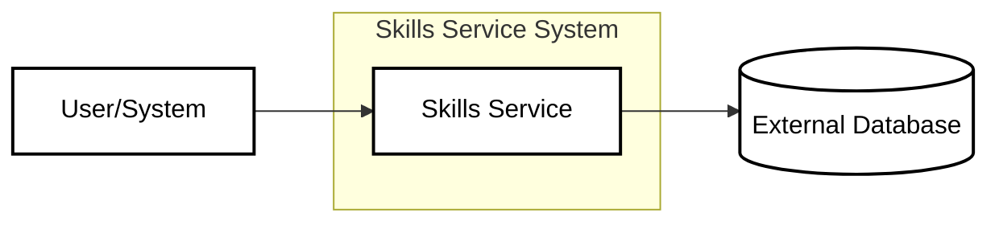
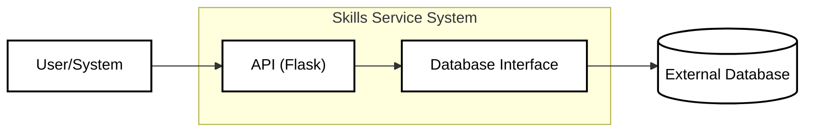
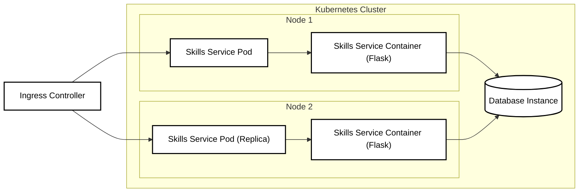
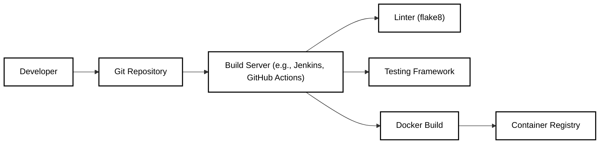

Okay, let's create a design document for the NSA's `skills-service` repository. I'll follow the instructions precisely, focusing on creating a document suitable for later threat modeling.

```markdown
# Project Design Document: Skills Service

## BUSINESS POSTURE

The `skills-service` appears to be a component within a larger system, likely related to managing and tracking skills, potentially for personnel or automated agents within the National Security Agency (NSA).  Given the NSA's mission, we can infer the following business priorities and goals:

Priorities:

*   Maintain high availability and reliability of the service.  Downtime could impact critical operations.
*   Ensure data integrity and confidentiality.  Skills data, especially if linked to individuals or capabilities, is highly sensitive.
*   Provide accurate and up-to-date information. Decisions based on this data must be reliable.
*   Support efficient searching and retrieval of skills information.
*   Scalability to handle a potentially large number of skills, users, and related data.
*   Compliance with relevant government regulations and security policies.

Goals:

*   Provide a centralized repository for skills information.
*   Enable efficient management of skills data.
*   Facilitate analysis and reporting on skills.
*   Potentially integrate with other systems (e.g., HR, tasking, resource allocation).

Business Risks:

*   Unauthorized access to skills data, leading to disclosure of sensitive information.
*   Data breaches or leaks, potentially revealing capabilities or vulnerabilities.
*   Data corruption or loss, impacting operational effectiveness.
*   Denial-of-service attacks, disrupting access to the service.
*   Insider threats, where authorized users misuse their access.
*   Integration failures with other systems, leading to data inconsistencies or operational gaps.
*   Non-compliance with security regulations, resulting in legal or reputational damage.

## SECURITY POSTURE

Based on the repository contents and common practices, we can identify the following existing security controls and accepted risks:

Existing Security Controls:

*   security control: Code linting (using `flake8` as indicated in `requirements.txt`). Implemented in build process.
*   security control: Use of Python, a generally memory-safe language, reducing risks of buffer overflows. Implemented in code.
*   security control: Use of a framework like Flask, which provides some built-in security features (though these need to be configured correctly). Implemented in code.
*   security control: Dependency management using `requirements.txt`, allowing for tracking and updating of libraries. Implemented in build process.
*   security control: Containerization using Docker, providing some isolation and portability. Implemented in deployment.

Accepted Risks:

*   accepted risk: The repository does not appear to include explicit authentication or authorization mechanisms. This suggests that these are handled externally, perhaps by a gateway or another service. This is acceptable *only if* those external mechanisms are robust and well-defined.
*   accepted risk: The level of input validation is unclear from the provided code. While Flask provides some basic protection, comprehensive input validation is crucial to prevent injection attacks. This risk is acceptable only if thorough input validation is implemented and tested.
*   accepted risk: The repository does not explicitly address logging and auditing. This is acceptable *only if* logging and auditing are handled at another layer (e.g., infrastructure, API gateway).
*   accepted risk: The database interaction layer's security (e.g., prevention of SQL injection) depends heavily on how the database is used and configured. This is acceptable *only if* secure database practices are followed.
*   accepted risk: Lack of explicit error handling and secure exception management. This is acceptable *only if* error handling is implemented and tested.

Recommended Security Controls:

*   Implement comprehensive input validation using a library like `Marshmallow` or `Pydantic`.
*   Implement robust authentication and authorization, either directly within the service or through integration with an external identity provider.
*   Implement detailed logging and auditing, including security-relevant events.
*   Use parameterized queries or an ORM to prevent SQL injection.
*   Implement secure error handling to avoid information leakage.
*   Add security scanning tools (SAST, DAST) to the build pipeline.
*   Implement rate limiting to mitigate denial-of-service attacks.
*   Harden the Docker container configuration, following best practices (e.g., non-root user, minimal privileges).
*   Implement HTTPS for all communication.

Security Requirements:

*   Authentication: The system must authenticate all users and services accessing the API. This could be achieved through API keys, JWT tokens, or integration with an existing identity provider (e.g., LDAP, Active Directory).
*   Authorization: The system must enforce role-based access control (RBAC) to restrict access to sensitive data and operations based on user roles.
*   Input Validation: All input received by the API must be validated against a strict schema to prevent injection attacks and ensure data integrity. This includes validating data types, lengths, formats, and allowed values.
*   Cryptography: Sensitive data, both in transit and at rest, must be protected using strong encryption. This includes using HTTPS for all API communication and encrypting data stored in the database.
*   Auditing: All security-relevant events (e.g., authentication attempts, authorization decisions, data access) must be logged and audited.

## DESIGN

### C4 CONTEXT



Context Diagram Element List:

*   Element:
    *   Name: User/System
    *   Type: External User/System
    *   Description: Represents users or other systems that interact with the Skills Service.
    *   Responsibilities: Initiates requests to the Skills Service to retrieve, create, update, or delete skills data.
    *   Security controls: Authentication and authorization are enforced before accessing the Skills Service (assumed to be handled externally).

*   Element:
    *   Name: Skills Service
    *   Type: Internal System
    *   Description: The core component responsible for managing skills data.
    *   Responsibilities: Provides an API for interacting with skills data, handles data storage and retrieval, enforces business logic.
    *   Security controls: Input validation, internal security checks (to be implemented).

*   Element:
    *   Name: External Database
    *   Type: External System
    *   Description: The database used to store skills data.
    *   Responsibilities: Persistently stores skills data.
    *   Security controls: Database access control, encryption at rest (assumed), parameterized queries (to be implemented).

### C4 CONTAINER



Container Diagram Element List:

*   Element:
    *   Name: User/System
    *   Type: External User/System
    *   Description: Represents users or other systems that interact with the Skills Service.
    *   Responsibilities: Initiates requests to the Skills Service to retrieve, create, update, or delete skills data.
    *   Security controls: Authentication and authorization are enforced before accessing the Skills Service (assumed to be handled externally).

*   Element:
    *   Name: API (Flask)
    *   Type: Web Application
    *   Description: The Flask web application that provides the API for interacting with the Skills Service.
    *   Responsibilities: Handles incoming requests, performs input validation, interacts with the database interface, returns responses.
    *   Security controls: Input validation, authentication and authorization (delegated or implemented), HTTPS.

*   Element:
    *   Name: Database Interface
    *   Type: Component
    *   Description: A component that handles interaction with the external database.
    *   Responsibilities: Executes database queries, handles database connections, potentially performs data transformation.
    *   Security controls: Parameterized queries (or ORM usage), connection security.

*   Element:
    *   Name: External Database
    *   Type: External System
    *   Description: The database used to store skills data.
    *   Responsibilities: Persistently stores skills data.
    *   Security controls: Database access control, encryption at rest (assumed), parameterized queries (to be implemented).

### DEPLOYMENT

Possible Deployment Solutions:

1.  **Bare-Metal/VM Deployment:** Deploy the Flask application and database directly on a server (physical or virtual).  Least complex but less scalable and resilient.
2.  **Containerized Deployment (Docker):** Package the Flask application in a Docker container and deploy it to a container orchestration platform (e.g., Kubernetes, Docker Swarm).  More scalable and resilient.
3.  **Serverless Deployment (AWS Lambda, Azure Functions, Google Cloud Functions):** Deploy the Flask application as a serverless function.  Highly scalable and cost-effective, but may require code modifications.
4.  **Platform-as-a-Service (PaaS) Deployment (Heroku, AWS Elastic Beanstalk):** Deploy the application to a PaaS provider.  Offers a balance between ease of use and control.

Chosen Solution: Containerized Deployment (Docker on Kubernetes)

This solution provides a good balance of scalability, resilience, and manageability, aligning with the likely needs of the NSA.



Deployment Diagram Element List:

*   Element:
    *   Name: Ingress Controller
    *   Type: Infrastructure Component
    *   Description: Manages external access to the Kubernetes cluster.
    *   Responsibilities: Routes incoming traffic to the appropriate pods.
    *   Security controls: TLS termination, potentially web application firewall (WAF) integration.

*   Element:
    *   Name: Skills Service Pod
    *   Type: Kubernetes Pod
    *   Description: A Kubernetes pod running an instance of the Skills Service container.
    *   Responsibilities: Hosts the Skills Service container.
    *   Security controls: Network policies, resource limits.

*   Element:
    *   Name: Skills Service Container (Flask)
    *   Type: Docker Container
    *   Description: The Docker container containing the Flask application.
    *   Responsibilities: Runs the Skills Service application.
    *   Security controls: Container hardening (non-root user, minimal privileges).

*   Element:
    *   Name: Database Instance
    *   Type: Database
    *   Description: The database instance storing the skills data. Could be a managed database service (e.g., AWS RDS, Azure SQL Database) or a self-hosted database.
    *   Responsibilities: Stores and retrieves skills data.
    *   Security controls: Database access control, encryption at rest, network security.

*   Element:
    *   Name: Node 1, Node 2
    *   Type: Kubernetes Node
    *   Description: Physical or virtual machine that is part of Kubernetes cluster.
    *   Responsibilities: Host for Kubernetes pods.
    *   Security controls: OS hardening, network security.

### BUILD

The build process likely involves the following steps:

1.  **Code Checkout:** Retrieve the source code from the Git repository.
2.  **Dependency Installation:** Install Python dependencies using `pip` and `requirements.txt`.
3.  **Linting:** Run `flake8` to check for code style and potential errors.
4.  **Testing:** (Not present in the repository, but should be added) Run unit tests and integration tests.
5.  **Container Build:** Build the Docker image using the `Dockerfile`.
6.  **Container Push:** Push the Docker image to a container registry (e.g., Docker Hub, Amazon ECR, Azure Container Registry).


Build Process Security Controls:

*   security control: Use of a build server (e.g., Jenkins, GitHub Actions) for automated builds, ensuring consistency and repeatability.
*   security control: Code linting with `flake8` to identify potential code quality and security issues.
*   security control: Dependency management with `requirements.txt` to track and manage dependencies, allowing for vulnerability scanning.
*   security control: (Recommended) Integration of SAST tools (e.g., Bandit, SonarQube) into the build pipeline to scan for security vulnerabilities in the code.
*   security control: (Recommended) Integration of SCA tools (e.g., Snyk, Dependabot) to scan for vulnerabilities in dependencies.
*   security control: (Recommended) Container image signing to ensure the integrity of the deployed image.

## RISK ASSESSMENT

Critical Business Processes:

*   Maintaining an accurate and up-to-date inventory of skills.
*   Supporting decision-making related to personnel, resources, and capabilities.
*   Facilitating analysis and reporting on skills trends.

Data Sensitivity:

*   Skills Data: Highly sensitive, potentially revealing individual capabilities, organizational strengths and weaknesses, and strategic priorities.  The sensitivity level depends on the specific skills and how they are categorized.
*   (Potentially) Personally Identifiable Information (PII): If the skills data is linked to individuals, it becomes PII and requires additional protection under privacy regulations.

## QUESTIONS & ASSUMPTIONS

Questions:

*   What specific database is being used?
*   How are authentication and authorization handled?  Is there an existing identity provider?
*   What are the specific requirements for data retention and disposal?
*   Are there any specific compliance requirements (e.g., FedRAMP, FISMA)?
*   What are the expected load and performance requirements?
*   What are existing monitoring and alerting systems?
*   Is there any existing API gateway or reverse proxy?

Assumptions:

*   BUSINESS POSTURE: The system is critical to NSA operations and requires high availability, reliability, and security.
*   SECURITY POSTURE: Authentication and authorization are handled externally by a robust and well-defined system.  Database security (encryption, access control) is properly configured. Logging and auditing are handled at another layer.
*   DESIGN: The database schema is well-designed and optimized for performance. The system will be deployed in a containerized environment (e.g., Kubernetes). The system will be integrated with other NSA systems.