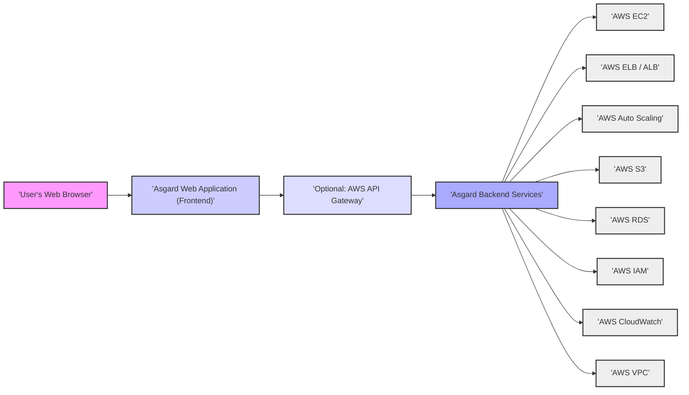

# Project Design Document: Netflix Asgard

**Version:** 1.1
**Date:** October 26, 2023
**Author:** AI Cloud & Security Architect

## 1. Introduction

This document provides an enhanced and detailed design overview of Netflix's Asgard project, an open-source, web-based tool designed to simplify cloud management and application deployments within Amazon Web Services (AWS). This document is specifically crafted to serve as a robust foundation for subsequent threat modeling activities. It comprehensively outlines the system's architecture, key components, data flow, underlying technologies, and deployment considerations.

## 2. Goals and Objectives

The primary goals of Asgard are to:

* Offer an intuitive and user-friendly web interface for managing a wide range of AWS resources.
* Streamline and simplify common AWS operational tasks, including instance lifecycle management, load balancer configuration, and application deployments.
* Act as a centralized platform for interacting with diverse AWS services, reducing the need to navigate the native AWS console directly for many common tasks.
* Significantly enhance developer productivity by abstracting away some of the inherent complexities associated with direct interaction with the AWS console and APIs.

## 3. High-Level Architecture

Asgard employs a client-server architecture, typically deployed within an AWS environment. Users interact with Asgard through a standard web browser. Asgard, acting as an intermediary, communicates with various AWS services via the official AWS API.

**Key Architectural Components:**

* **User's Web Browser:** The primary interface through which users access and interact with the Asgard application.
* **Asgard Web Application (Frontend):**  The client-side application, typically developed using JavaScript frameworks. It is responsible for rendering the user interface, handling user interactions, and communicating with the backend.
* **Optional: AWS API Gateway:**  An optional component that can provide a managed, secure, and scalable entry point for API requests directed to the Asgard backend services. It can handle tasks like authentication, authorization, and rate limiting.
* **Asgard Backend Services:** The core of the Asgard application, responsible for processing user requests, orchestrating interactions with the AWS API, managing application state, and enforcing business logic. This is typically implemented using a server-side language.
* **AWS Services:** The suite of Amazon Web Services that Asgard integrates with to provide its functionality. These include, but are not limited to:
    * **EC2 (Elastic Compute Cloud):** For managing virtual server instances.
    * **ELB/ALB (Elastic Load Balancing / Application Load Balancing):** For distributing incoming network traffic across multiple instances.
    * **Auto Scaling:** For automatically adjusting the number of EC2 instances based on demand.
    * **S3 (Simple Storage Service):** For storing and retrieving objects (data).
    * **RDS (Relational Database Service):** For managing relational databases.
    * **IAM (Identity and Access Management):** For managing user identities, authentication, and authorization.
    * **CloudWatch:** For monitoring resources and applications, collecting and tracking metrics, and setting alarms.
    * **VPC (Virtual Private Cloud):** For provisioning a logically isolated section of the AWS cloud where AWS resources can be launched in a virtual network.

## 4. Detailed Component Description

### 4.1. Asgard Web Application (Frontend)

* **Technology:** Commonly built using modern JavaScript frameworks such as AngularJS or React.
* **Key Responsibilities:**
    * **User Interface Rendering:** Dynamically generates and displays the user interface components for interacting with AWS resources.
    * **User Interaction Handling:** Captures and processes user inputs and actions within the web interface.
    * **API Communication:**  Makes asynchronous API calls to the Asgard backend to initiate actions and retrieve data.
    * **Data Presentation:**  Formats and presents data received from the backend in a user-friendly manner.
    * **Client-Side Logic:** Implements client-side validation and UI-specific logic.
    * **Session Management (Client-Side):** Manages the user's session within the browser.

### 4.2. Asgard Backend Services

* **Technology:** Typically implemented using Java, often leveraging frameworks like Spring, to provide a robust and scalable backend.
* **Key Responsibilities:**
    * **Authentication and Authorization:**  Verifies user credentials and enforces authorization policies to ensure users only access resources they are permitted to manage. This often involves integration with AWS IAM for role-based access control.
    * **API Endpoint Management:** Defines and manages the API endpoints that the frontend interacts with.
    * **AWS API Interaction:**  Utilizes the AWS SDK to make programmatic calls to various AWS services based on requests received from the frontend. This involves translating user actions into specific AWS API calls.
    * **Data Transformation and Aggregation:** Processes and transforms data received from the AWS API into a format suitable for the frontend. It may also aggregate data from multiple AWS services.
    * **Business Logic Enforcement:** Implements the core business logic of Asgard, including workflows for deploying applications and managing resources.
    * **State Management (Server-Side):** Manages the application's state and user session information on the server.
    * **Asynchronous Task Handling:** Manages long-running or background tasks related to AWS operations, potentially using techniques like threading or message queues.
    * **Logging and Monitoring (Backend):**  Generates and manages logs for auditing, debugging, and monitoring the health and performance of the backend services.

## 5. Data Flow

The following diagram illustrates a typical data flow for a user action within Asgard, such as deploying a new EC2 instance:

```mermaid
graph LR
    A["'User Initiates Action in Browser'"] --> B["'Asgard Frontend: Sends API Request'"];
    B --> C["'Optional: AWS API Gateway: Request Routing & Security'"];
    C --> D["'Asgard Backend: Authentication & Authorization'"];
    D --> E{"'User Authorized?'"};
    E -- Yes --> F["'Asgard Backend: Constructs & Sends AWS API Call'"];
    F --> G["'AWS Service (e.g., EC2 API)'"];
    G --> H["'AWS Service: Processes Request'"];
    H --> I["'AWS Service: Returns Response'"];
    I --> J["'Asgard Backend: Processes AWS Response'"];
    J --> K["'Asgard Backend: Sends Response to Frontend'"];
    K --> L["'Asgard Frontend: Updates User Interface'"];
    E -- No --> M["'Asgard Backend: Sends Error Response'"];
    M --> L;
    style A fill:#f9f,stroke:#333,stroke-width:2px
    style B fill:#ccf,stroke:#333,stroke-width:2px
    style C fill:#ddf,stroke:#333,stroke-width:2px
    style D fill:#aaf,stroke:#333,stroke-width:2px
    style E fill:#ddd,stroke:#333,stroke-width:2px
    style F fill:#aaf,stroke:#333,stroke-width:2px
    style G fill:#eee,stroke:#333,stroke-width:2px
    style H fill:#eee,stroke:#333,stroke-width:2px
    style I fill:#eee,stroke:#333,stroke-width:2px
    style J fill:#aaf,stroke:#333,stroke-width:2px
    style K fill:#ccf,stroke:#333,stroke-width:2px
    style L fill:#f9f,stroke:#333,stroke-width:2px
    style M fill:#aaf,stroke:#333,stroke-width:2px
```

**Detailed Steps:**

* **User Initiates Action in Browser:** The user interacts with the Asgard web interface, for example, by clicking a button to create a new load balancer.
* **Asgard Frontend: Sends API Request:** The frontend application constructs and sends an API request to the Asgard backend, specifying the desired action and any necessary parameters.
* **Optional: AWS API Gateway: Request Routing & Security:** If implemented, the API Gateway receives the request, potentially performing tasks like authentication, authorization, rate limiting, and request routing.
* **Asgard Backend: Authentication & Authorization:** The backend services receive the request and verify the user's identity and permissions to perform the requested action on the target AWS resources. This typically involves checking IAM roles and policies associated with the user or the Asgard application itself.
* **User Authorized?:** A decision point based on the outcome of the authentication and authorization checks.
* **Asgard Backend: Constructs & Sends AWS API Call:** If the user is authorized, the backend constructs the appropriate API call using the AWS SDK, targeting the relevant AWS service (e.g., `elb.createLoadBalancer`).
* **AWS Service (e.g., EC2 API):** The designated AWS service receives the API call.
* **AWS Service: Processes Request:** The AWS service processes the request according to its defined functionality.
* **AWS Service: Returns Response:** The AWS service sends a response back to the Asgard backend, indicating the success or failure of the operation and any relevant data or status information.
* **Asgard Backend: Processes AWS Response:** The backend receives and processes the response from the AWS service. This might involve updating internal state, logging the event, or transforming the data.
* **Asgard Backend: Sends Response to Frontend:** The backend sends a response back to the frontend application, indicating the outcome of the user's action.
* **Asgard Frontend: Updates User Interface:** The frontend receives the response and updates the user interface to reflect the result of the operation, providing feedback to the user.
* **Asgard Backend: Sends Error Response:** If the user is not authorized, the backend sends an error response to the frontend, indicating the reason for the failure.

## 6. Key Technologies

* **Primary Backend Language:** Java (predominantly).
* **Backend Frameworks:** Spring Framework (commonly used for dependency injection, aspect-oriented programming, etc.).
* **Frontend Languages:** JavaScript.
* **Frontend Frameworks/Libraries:** AngularJS (historically), potentially React or other modern JavaScript frameworks.
* **AWS SDK:** AWS SDK for Java (for backend interaction with AWS services).
* **Data Storage (Optional):** Relational databases (e.g., MySQL, PostgreSQL) or NoSQL databases may be used for storing application configuration, user preferences, or other persistent data.
* **Caching Mechanisms:**  Potentially utilizes caching solutions (e.g., Redis, Memcached) to improve performance by reducing the need to repeatedly fetch data from AWS.
* **Message Queues (Optional):** May leverage message queues like Amazon SQS for asynchronous task processing and decoupling components.
* **Operating System:** Typically deployed on Linux-based operating systems within the AWS environment.

## 7. Deployment Architecture

Asgard is typically deployed within an AWS environment, leveraging various AWS services for scalability, availability, and resilience. Common deployment patterns include:

* **Compute Instances:** The Asgard backend and frontend applications are deployed on Amazon EC2 instances.
* **Load Balancing:** Elastic Load Balancing (ELB) or Application Load Balancing (ALB) is used to distribute incoming traffic across multiple Asgard instances, ensuring high availability and fault tolerance.
* **Auto Scaling:** Auto Scaling groups are configured to automatically adjust the number of Asgard instances based on demand, ensuring the application can handle varying levels of traffic.
* **Virtual Private Cloud (VPC):** Asgard is typically deployed within an Amazon VPC, providing a logically isolated network for enhanced security and control.
* **Security Groups:** Security Groups act as virtual firewalls, controlling inbound and outbound traffic to the Asgard instances.
* **IAM Roles:** AWS IAM roles are assigned to the Asgard instances, granting them the necessary permissions to interact with other AWS services securely, without the need for hardcoded credentials.
* **Optional: Containerization:** Asgard components could be containerized using Docker and orchestrated with services like Amazon ECS or EKS for improved deployment and management.

## 8. Security Considerations (Pre-Threat Modeling)

Prior to a formal threat modeling exercise, several key security considerations are apparent:

* **Authentication and Authorization Robustness:** Ensuring strong mechanisms for verifying user identities and enforcing granular access control to prevent unauthorized access and actions on AWS resources.
    *  Secure user login processes and session management to prevent session hijacking.
    *  Strict adherence to the principle of least privilege when assigning IAM roles to Asgard and its users.
    *  Protection against brute-force attacks on login mechanisms.
* **Data Protection in Transit and at Rest:** Safeguarding sensitive data exchanged between components and stored within the system.
    *  Mandatory use of HTTPS for all communication between the user's browser and the Asgard frontend, and between the frontend and backend.
    *  Encryption of sensitive data at rest if Asgard persists any sensitive information (e.g., using AWS KMS).
    *  Secure management and storage of AWS credentials used by Asgard to interact with AWS services.
* **Input Validation and Output Encoding:** Preventing common web application vulnerabilities.
    *  Thorough validation of all user inputs on both the frontend and backend to prevent injection attacks (e.g., SQL injection, command injection).
    *  Proper encoding of output displayed in the browser to mitigate cross-site scripting (XSS) vulnerabilities.
* **Secure Session Management:** Implementing secure session management practices to prevent session fixation and other session-related attacks.
* **Comprehensive Logging and Monitoring:** Maintaining detailed logs of user actions and system events for auditing, security monitoring, and incident response.
* **Dependency Management and Vulnerability Scanning:** Regularly updating third-party libraries and dependencies and performing vulnerability scans to identify and address known security flaws.
* **Infrastructure Security Hardening:**  Securing the underlying infrastructure where Asgard is deployed, including patching operating systems, configuring firewalls (Security Groups), and implementing network segmentation.
* **API Security Best Practices:**  Securing the API endpoints exposed by the Asgard backend to prevent unauthorized access and manipulation. This includes rate limiting, input validation, and proper authentication/authorization.

## 9. Assumptions and Constraints

* **AWS Dependency:** Asgard is inherently dependent on the availability and functionality of Amazon Web Services.
* **Network Requirements:** Asgard requires reliable network connectivity to access various AWS services.
* **IAM Permissions Management:** Effective management of IAM permissions is crucial for the secure operation of Asgard. Incorrectly configured permissions can lead to security vulnerabilities.
* **Open Source Nature and Community Support:** While open source, the level of active community support and maintenance can vary.
* **Complexity of AWS API:**  A good understanding of the underlying AWS APIs is necessary for developing and maintaining Asgard.

This enhanced design document provides a more detailed and comprehensive understanding of the Asgard project's architecture and functionality. This information will be invaluable for conducting a thorough and effective threat modeling exercise to identify and mitigate potential security risks.