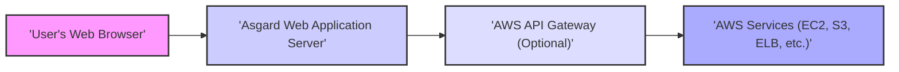

# Project Design Document: Asgard - Improved

**Version:** 1.1
**Date:** October 26, 2023
**Prepared By:** AI Software Architect

## 1. Introduction

This document provides an enhanced design overview of Netflix's Asgard project, specifically tailored for threat modeling. Asgard is a web-based platform designed to streamline cloud management and deployment within Amazon Web Services (AWS). This revised document aims for greater clarity and detail in articulating Asgard's architecture, components, and data flow, thereby facilitating a more effective and comprehensive threat modeling exercise. It serves as a critical reference point for security analysts to identify potential vulnerabilities and attack vectors.

## 2. Goals and Objectives

The core objectives of Asgard are to:

*   Offer an intuitive web interface for managing diverse AWS resources.
*   Simplify and standardize common AWS operational tasks for development and operations teams.
*   Provide a consolidated, real-time view of the organization's AWS infrastructure.
*   Empower teams with self-service capabilities for application deployment and management.
*   Reduce the complexity and learning curve associated with direct interaction with the native AWS console.

## 3. High-Level Architecture

Asgard employs a traditional client-server architecture. Users interact with a web browser client, which communicates with a Java-based backend server application hosted within a secure environment. The backend interacts with various AWS services through the official AWS SDK, leveraging configured credentials.

**Architectural Components:**

*   **User's Web Browser:** The primary interface for user interaction with Asgard, rendering the UI and handling user input.
*   **Asgard Web Application Server:** The central backend component responsible for business logic, authentication, authorization, and interaction with AWS.
*   **AWS API Gateway (Optional):**  A managed service that can act as a front door for the Asgard backend, providing features like authentication, authorization, and traffic management.
*   **AWS Services:** The suite of AWS resources (e.g., EC2 instances, S3 buckets, Elastic Load Balancers, IAM roles) that Asgard is designed to manage and interact with.

## 4. Component Details

### 4.1. User's Web Browser

*   **Functionality:**
    *   Renders the Asgard user interface, typically built using modern JavaScript frameworks.
    *   Sends authenticated HTTP requests to the Asgard Web Application Server, usually via AJAX.
    *   Receives and dynamically updates the UI based on data received from the server.
*   **Key Technologies:**
    *   HTML5
    *   CSS3
    *   JavaScript (potentially leveraging frameworks like React, Angular, or Ember.js)
    *   Browser-specific security features (e.g., Same-Origin Policy, Content Security Policy).
*   **Security Considerations:**
    *   Susceptible to client-side vulnerabilities such as Cross-Site Scripting (XSS) if the server doesn't properly sanitize output.
    *   Relies on secure HTTPS communication with the server to protect data in transit.
    *   Potential for vulnerabilities in browser extensions or plugins.

### 4.2. Asgard Web Application Server

*   **Functionality:**
    *   **Authentication:** Verifies user identities, likely through integration with an enterprise identity provider (e.g., SAML, OAuth 2.0).
    *   **Authorization:** Enforces access control policies, determining which actions users are permitted to perform based on their roles and permissions, often mapped to AWS IAM roles.
    *   **Request Handling:** Receives and processes HTTP requests from the browser, orchestrating interactions with AWS services.
    *   **AWS API Interaction:** Utilizes the AWS SDK for Java to interact with various AWS APIs, requiring secure management of AWS credentials.
    *   **Data Processing and Transformation:** Transforms data retrieved from AWS into a format suitable for presentation in the UI.
    *   **Session Management:** Manages user sessions, potentially using secure cookies or tokens.
    *   **Logging and Auditing:** Records user actions and system events for security monitoring and compliance.
*   **Key Technologies:**
    *   Java (Likely a primary language)
    *   Spring Framework (Likely for dependency injection, MVC, and security features)
    *   AWS SDK for Java (For interacting with AWS services)
    *   Application Server (e.g., Tomcat, Jetty)
    *   Database (Potentially for storing application-specific data like user preferences, audit logs, or temporary state. Examples: PostgreSQL, MySQL, or NoSQL databases).
    *   Security Libraries (e.g., for handling authentication, authorization, and preventing common web vulnerabilities).
*   **Security Considerations:**
    *   A critical component requiring robust security measures to prevent server-side attacks (e.g., SQL injection, command injection, insecure deserialization).
    *   Secure storage and management of AWS credentials are paramount.
    *   Proper implementation of authentication and authorization mechanisms is essential to prevent unauthorized access.
    *   Input validation and output encoding are crucial to mitigate injection attacks.
    *   Regular security patching and updates are necessary to address known vulnerabilities.
    *   Comprehensive logging and monitoring are vital for detecting and responding to security incidents.

### 4.3. AWS API Gateway (Optional)

*   **Functionality:**
    *   Provides a managed, scalable entry point for API requests to the Asgard backend.
    *   Can handle authentication and authorization, offloading this responsibility from the backend.
    *   Offers features like request throttling, caching, and API version management.
    *   Can enforce security policies like TLS termination and request validation.
*   **Key Technologies:**
    *   AWS API Gateway service
    *   Potentially integrated with AWS WAF (Web Application Firewall) for enhanced security.
*   **Security Considerations:**
    *   Misconfiguration of the API Gateway can introduce vulnerabilities or bypass security controls.
    *   Properly defining and enforcing authentication and authorization policies within the API Gateway is crucial.
    *   Logging and monitoring of API Gateway activity are important for security analysis.

### 4.4. AWS Services

*   **Functionality:**
    *   Provide the underlying infrastructure and services that Asgard manages and interacts with.
    *   Examples include: EC2 for virtual machines, S3 for object storage, ELB for load balancing, IAM for identity and access management, CloudFormation for infrastructure as code.
*   **Key Technologies:**
    *   A wide range of AWS services, depending on the features implemented in Asgard.
*   **Security Considerations:**
    *   Security of these services is primarily managed by AWS, but Asgard's actions can directly impact their security posture.
    *   Asgard requires appropriate IAM roles and permissions to interact with these services securely, following the principle of least privilege.
    *   Misconfiguration of AWS resources through Asgard can create security vulnerabilities.
    *   Auditing of actions performed by Asgard on these services is essential.

## 5. Data Flow

The typical data flow for a user interaction within Asgard involves the following sequence:

```mermaid
graph LR
    A["'User Initiates Action in Browser'"] --> B["'HTTP Request to Asgard Server'"];
    B --> C{"'Authentication and Authorization Check'"};
    C -- "Success" --> D["'Asgard Backend Processes Request'"];
    C -- "Failure" --> E["'Error Response to Browser'"];
    D --> F["'AWS SDK Call to Relevant AWS Service'"];
    F --> G["'AWS Service Processes Request'"];
    G --> H["'Response from AWS Service'"];
    H --> I["'Asgard Backend Processes Response'"];
    I --> J["'HTTP Response to Browser'"];
    J --> K["'Browser Updates UI'"];
    style A fill:#f9f,stroke:#333,stroke-width:2px
    style B fill:#ccf,stroke:#333,stroke-width:2px
    style C fill:#ddd,stroke:#333,stroke-width:2px
    style D fill:#ccf,stroke:#333,stroke-width:2px
    style E fill:#faa,stroke:#333,stroke-width:2px
    style F fill:#aaf,stroke:#333,stroke-width:2px
    style G fill:#aaf,stroke:#333,stroke-width:2px
    style H fill:#aaf,stroke:#333,stroke-width:2px
    style I fill:#ccf,stroke:#333,stroke-width:2px
    style J fill:#ccf,stroke:#333,stroke-width:2px
    style K fill:#f9f,stroke:#333,stroke-width:2px
```

**Detailed Data Flow Steps:**

1. **User Initiates Action in Browser:** A user interacts with the Asgard UI, triggering an action (e.g., starting an EC2 instance).
2. **HTTP Request to Asgard Server:** The browser sends an authenticated HTTP request to the Asgard Web Application Server, typically containing parameters describing the desired action.
3. **Authentication and Authorization Check:** The Asgard server verifies the user's identity and confirms they have the necessary permissions to perform the requested action, based on their assigned roles and associated AWS IAM permissions.
4. **Asgard Backend Processes Request:** If authorized, the backend logic processes the request, potentially involving data validation, business rule execution, and preparation for interaction with AWS.
5. **AWS SDK Call to Relevant AWS Service:** The Asgard server uses the AWS SDK to make a specific API call to the relevant AWS service (e.g., the EC2 service to start an instance). This call includes necessary parameters and authentication credentials.
6. **AWS Service Processes Request:** The target AWS service receives and processes the API request, performing the requested action (e.g., starting the EC2 instance).
7. **Response from AWS Service:** The AWS service sends a response back to the Asgard server, indicating the success or failure of the operation, potentially including relevant data about the outcome.
8. **Asgard Backend Processes Response:** The Asgard server processes the response from AWS, potentially updating its internal state or formatting the data for presentation in the UI.
9. **HTTP Response to Browser:** The Asgard server sends an HTTP response back to the user's browser, indicating the status of the request and any relevant data.
10. **Browser Updates UI:** The browser updates the user interface to reflect the outcome of the action, providing feedback to the user.
11. **Error Response to Browser:** If authentication or authorization fails, or if an error occurs during processing on the Asgard server or within AWS, an error response is sent to the browser, providing information about the failure.

## 6. Key Technologies

*   **Primary Programming Language:** Java (highly probable for the backend)
*   **Frontend Technologies:** JavaScript, HTML, CSS, potentially frameworks like React, Angular, or Ember.js
*   **Backend Framework:** Spring Framework (likely for dependency injection, MVC architecture, and security features)
*   **AWS Interaction Library:** AWS SDK for Java
*   **Application Server:** Tomcat, Jetty, or similar Java application server
*   **Database (Optional):** Relational databases (e.g., PostgreSQL, MySQL) or NoSQL databases (e.g., Cassandra) for application-specific data persistence.
*   **Build Tools:** Maven or Gradle for managing dependencies and building the application.
*   **Version Control System:** Git (likely)
*   **Authentication/Authorization:** Integration with enterprise identity providers (e.g., SAML, OAuth 2.0), potentially leveraging Spring Security.

## 7. Security Considerations

This section details key security considerations relevant for threat modeling Asgard.

*   **Authentication and Authorization Vulnerabilities:**
    *   Weak password policies or lack of multi-factor authentication.
    *   Bypassable authorization checks allowing unauthorized access to AWS resources.
    *   Vulnerabilities in session management leading to session hijacking.
    *   Exposure or compromise of API keys or other sensitive credentials.
*   **Injection Attacks:**
    *   SQL injection vulnerabilities in database interactions.
    *   Command injection vulnerabilities if the application executes external commands based on user input.
    *   Cross-Site Scripting (XSS) vulnerabilities due to improper input sanitization and output encoding.
*   **AWS API Security Misconfigurations:**
    *   Overly permissive IAM roles granted to the Asgard application, violating the principle of least privilege.
    *   Accidental exposure of AWS access keys or secrets within the application code or configuration.
    *   Insufficient monitoring and auditing of AWS API calls made by Asgard.
*   **Data Security Risks:**
    *   Sensitive data stored in the application database without proper encryption at rest and in transit.
    *   Insecure handling or logging of sensitive information.
    *   Lack of proper data validation leading to data corruption or security breaches.
*   **Dependency Vulnerabilities:**
    *   Use of outdated or vulnerable third-party libraries and dependencies.
    *   Lack of a robust dependency management and vulnerability scanning process.
*   **Communication Security Weaknesses:**
    *   Lack of HTTPS enforcement, leading to man-in-the-middle attacks.
    *   Insecure communication protocols used for internal communication.
*   **Error Handling and Information Disclosure:**
    *   Verbose error messages revealing sensitive information about the application or infrastructure.
*   **Denial of Service (DoS) Attacks:**
    *   Lack of rate limiting or input validation making the application susceptible to DoS attacks.
*   **Infrastructure Security:**
    *   Vulnerabilities in the underlying operating system, network configuration, or containerization platform (if used).

## 8. Deployment Model

Asgard is typically deployed within a secure and controlled environment, often within a private network or VPC within AWS.

*   **Deployment Environment:**  Likely deployed on EC2 instances within a Virtual Private Cloud (VPC).
*   **Load Balancing:**  Potentially utilizes Elastic Load Balancer (ELB) or Application Load Balancer (ALB) for distributing traffic and ensuring high availability.
*   **Network Security:**  Security Groups and Network ACLs are used to control network traffic to and from the Asgard instances.
*   **Access Control:** Access to the Asgard application is restricted to authorized users through strong authentication mechanisms, potentially integrated with corporate identity providers.
*   **Secrets Management:** Secure storage and management of AWS credentials and other secrets, potentially using services like AWS Secrets Manager or HashiCorp Vault.
*   **Monitoring and Logging:** Integration with monitoring and logging services (e.g., Amazon CloudWatch) for performance monitoring and security auditing.
*   **Updates and Patching:** Regular patching and updates of the application, operating system, and underlying infrastructure are crucial for maintaining security.

## 9. Assumptions and Constraints

*   Asgard relies on the official AWS SDK for interacting with AWS services.
*   The application follows a standard web application architecture with a distinct frontend and backend.
*   Robust authentication and authorization mechanisms are in place.
*   Secure communication protocols (HTTPS) are enforced for all client-server interactions.
*   The deployment environment is secured with appropriate network controls.

## 10. Future Considerations

*   Enhanced integration with other cloud providers or on-premises infrastructure.
*   More advanced automation and orchestration features for complex deployments.
*   Improved real-time monitoring and alerting capabilities.
*   Fine-grained access control and auditing at the resource level.
*   Adoption of containerization technologies (e.g., Docker, Kubernetes) for deployment and scalability.

This improved design document provides a more detailed and security-focused overview of the Asgard project. It is intended to be a valuable resource for conducting thorough threat modeling and identifying potential security vulnerabilities.