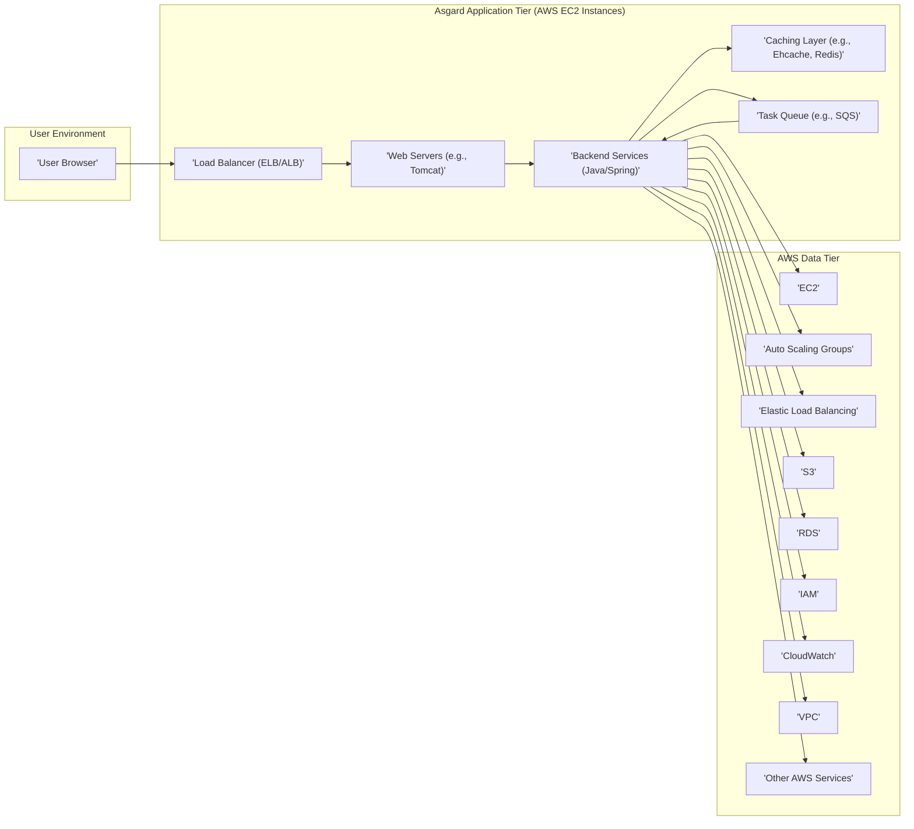
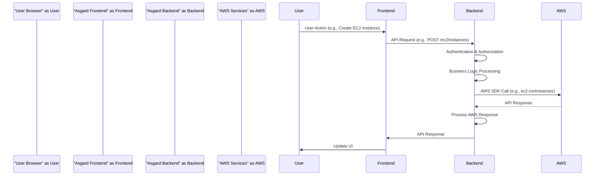

# Project Design Document: Asgard - Cloud Management UI

**Version:** 1.1
**Date:** October 26, 2023
**Author:** AI Cloud & Security Architect

## 1. Introduction

This document provides a detailed design overview of Netflix's Asgard project, a web-based tool for managing cloud resources, primarily within Amazon Web Services (AWS). This document aims to provide a comprehensive understanding of Asgard's architecture, components, and data flow, which will serve as the foundation for subsequent threat modeling activities. This revision includes more detail on component responsibilities and expands on initial security considerations.

## 2. Goals and Objectives

The primary goals of Asgard are to:

* Provide a user-friendly web interface for managing AWS resources.
* Simplify common AWS management tasks, reducing the need for direct AWS CLI or console interaction.
* Offer a centralized, organized view of AWS infrastructure across different regions and accounts.
* Enhance developer productivity by providing self-service capabilities and abstracting away some of the complexities of the AWS console.
* Promote consistency and best practices in AWS resource management.

## 3. High-Level Architecture

Asgard follows a traditional three-tier web application architecture, designed for deployment within AWS:

* **Presentation Tier (Frontend):**  The user interface, built with web technologies, handles user interaction and data visualization.
* **Application Tier (Backend):**  The core logic layer, responsible for processing user requests, interacting with AWS APIs, and enforcing business rules.
* **Data Tier (AWS Services):**  The underlying AWS infrastructure and services that Asgard manages and interacts with.

## 4. Detailed Component Description

### 4.1. Presentation Tier (Frontend)

* **Technology:** Primarily JavaScript, HTML, and CSS. Likely utilizes a component-based JavaScript framework (e.g., React, AngularJS, or similar) for building a dynamic user interface.
* **Functionality:**
    * Presents interactive views and dashboards for managing AWS resources.
    * Handles user input through forms, buttons, and other UI elements.
    * Implements client-side validation to improve user experience and reduce backend load.
    * Communicates with the backend services via asynchronous HTTP requests (typically RESTful APIs using JSON).
    * Manages user sessions and potentially handles local storage of UI state.
* **Key Components:**
    * **Views/Templates:** Define the structure and layout of different application screens (e.g., instance list, ASG configuration).
    * **Components:** Reusable UI elements that encapsulate specific functionality and presentation logic (e.g., buttons, data grids, forms).
    * **Services/API Clients:**  Modules responsible for making HTTP requests to the backend API endpoints.
    * **State Management:**  Mechanisms for managing application state (e.g., using Redux or Context API).
    * **Routing:**  Handles navigation between different views within the application.

### 4.2. Application Tier (Backend)

* **Technology:** Primarily Java, leveraging the Spring Framework for dependency injection, MVC architecture, and integration with other libraries.
* **Functionality:**
    * Receives and processes requests from the frontend.
    * Implements core business logic for managing AWS resources, often orchestrating multiple AWS API calls.
    * Interacts with various AWS services using the AWS SDK for Java, handling authentication and request/response processing.
    * Enforces authorization policies to ensure users only manage resources they have permissions for.
    * May include a caching layer to improve performance by storing frequently accessed AWS data.
    * Potentially utilizes task queues for handling asynchronous operations or long-running tasks.
* **Key Components:**
    * **API Controllers (REST Endpoints):** Expose RESTful endpoints that the frontend consumes. Handle request parsing, validation, and response formatting.
    * **Services:** Implement the core business logic for specific AWS resource types (e.g., `EC2InstanceService`, `AutoScalingService`, `IAMService`). These services often encapsulate interactions with the AWS SDK.
    * **Data Access Layer (AWS SDK Integration):**  Provides an abstraction layer over the AWS SDK, potentially adding error handling, retry logic, and logging.
    * **Authentication and Authorization Modules:**  Handles user authentication (verifying identity) and authorization (determining access rights). May integrate with identity providers or internal user management systems.
    * **Caching Layer:**  Implements caching strategies to reduce calls to AWS APIs. May use in-memory caches (e.g., Ehcache) or distributed caches (e.g., Redis).
    * **Task Queue Consumers/Workers:**  Process tasks from the task queue, enabling asynchronous operations.
    * **Configuration Management:**  Handles loading and managing application configuration.

### 4.3. Data Tier (AWS Services)

* **Technology:** A wide range of AWS services.
* **Functionality:** Provides the underlying infrastructure and services that Asgard manages and interacts with. Asgard acts as a client to these services.
* **Key Services:**
    * **EC2:**  Provisioning and managing virtual machines.
    * **Auto Scaling Groups:**  Automatically adjusting the number of EC2 instances based on demand.
    * **Elastic Load Balancing (ELB/ALB):** Distributing incoming traffic across multiple EC2 instances.
    * **S3:**  Storing and retrieving objects (e.g., application artifacts, logs).
    * **RDS:**  Managing relational databases.
    * **IAM:**  Managing user identities, authentication, and authorization for AWS resources.
    * **CloudWatch:**  Monitoring AWS resources and applications, collecting logs and metrics.
    * **VPC:**  Creating and managing isolated virtual networks within AWS.
    * **SQS (Simple Queue Service):**  A fully managed message queuing service (used for the task queue).
    * **Other AWS Services:** Asgard's functionality can be extended to manage other AWS services as needed.

## 5. Data Flow

A typical user interaction within Asgard follows this data flow:

1. **User Initiates Action:** A user interacts with the Asgard frontend in their browser (e.g., starts an EC2 instance, updates an Auto Scaling group).
2. **Frontend Sends API Request:** The frontend sends an asynchronous HTTP request (typically a POST, PUT, or DELETE request to a REST API endpoint) to the Asgard backend. The request body usually contains data in JSON format.
3. **Backend Receives and Processes Request:**
    * The request is received by an API controller in the backend.
    * The controller authenticates and authorizes the user.
    * The controller invokes the appropriate service method to handle the request.
    * The service method may interact with the caching layer to retrieve data or update the cache.
    * The service method uses the AWS SDK for Java to make one or more API calls to the relevant AWS service(s).
4. **Interaction with AWS Services:** The AWS SDK handles the communication with the AWS service API, including request signing and error handling.
5. **AWS Service Responds:** The AWS service processes the request and sends a response back to the Asgard backend.
6. **Backend Processes AWS Response:**
    * The backend service processes the response from AWS, potentially updating its internal state or the cache.
    * It may enqueue tasks to the task queue for asynchronous processing.
7. **Backend Sends API Response:** The backend sends an HTTP response back to the frontend, indicating the success or failure of the operation and potentially including updated data in JSON format.
8. **Frontend Updates UI:** The frontend receives the response and updates the user interface to reflect the changes.

## 6. Key Interactions and Communication Protocols

* **Frontend to Backend:**  Communication primarily occurs over HTTPS using RESTful APIs. Data is exchanged in JSON format. Standard HTTP methods (GET, POST, PUT, DELETE) are used to represent actions on resources.
* **Backend to AWS Services:** The backend communicates with AWS services using the AWS SDK for Java. This SDK handles the underlying communication protocols (HTTPS) and request signing required by AWS APIs. Authentication is typically handled through IAM roles assigned to the EC2 instances running the Asgard backend.
* **Inter-service Communication (within Backend):**  Communication within the backend application (between different services) is likely done through in-memory method calls within the Spring application context. For asynchronous tasks or decoupling, a message queue like SQS might be used.

## 7. Security Considerations (Detailed for Threat Modeling)

This section expands on the initial security considerations, providing more specific areas for threat modeling.

* **Authentication and Authorization:**
    * **Authentication:**
        * How are users authenticated to access the Asgard application? (e.g., corporate Single Sign-On (SSO) using SAML or OAuth 2.0, local database authentication).
        * Is multi-factor authentication (MFA) enforced?
        * How are API keys or tokens managed for programmatic access?
    * **Authorization:**
        * How is authorization implemented to control user access to specific AWS resources and actions within Asgard? (e.g., role-based access control (RBAC) mapped to IAM roles, attribute-based access control (ABAC)).
        * Is there a principle of least privilege enforced?
        * How are permissions managed and audited?
* **API Security:**
    * **Authentication and Authorization:**  Are all API endpoints protected by authentication and authorization mechanisms?
    * **Input Validation:** Is all user input validated on both the frontend and backend to prevent injection attacks (e.g., SQL injection, command injection, cross-site scripting (XSS))?
    * **Rate Limiting and Throttling:** Are there mechanisms to prevent abuse and denial-of-service attacks on the API?
    * **Output Encoding:** Is data properly encoded before being sent to the frontend to prevent XSS vulnerabilities?
    * **CORS (Cross-Origin Resource Sharing):** Is CORS configured correctly to prevent unauthorized access from other domains?
* **Data Security:**
    * **Data in Transit:** Is all communication between the frontend and backend, and between the backend and AWS services, encrypted using HTTPS (TLS)?
    * **Data at Rest:** How is sensitive data stored within Asgard (e.g., database credentials, API keys)? Is it encrypted?
    * **Secrets Management:** How are secrets (e.g., AWS access keys, database passwords) managed securely? (e.g., using AWS Secrets Manager or similar).
* **Session Management:**
    * How are user sessions managed? (e.g., using HTTP cookies, JWT tokens).
    * Are sessions invalidated after a period of inactivity?
    * Are sessions protected against hijacking?
* **Infrastructure Security:**
    * **Network Security:** Are the EC2 instances running Asgard protected by appropriate security groups and network access control lists (NACLs)?
    * **Operating System Security:** Are the operating systems of the Asgard servers hardened and regularly patched?
    * **Access Control:** Who has access to the servers and infrastructure hosting Asgard?
* **Logging and Monitoring:**
    * Are all significant user actions and system events logged for auditing and security monitoring?
    * Are logs stored securely and accessible for analysis?
    * Are there monitoring systems in place to detect suspicious activity?
* **Dependency Management:**
    * Are all third-party libraries and dependencies regularly updated to address known vulnerabilities?
    * Is there a process for vulnerability scanning of dependencies?

## 8. Deployment Architecture

Asgard is typically deployed within a robust and scalable AWS environment. A common deployment architecture includes:

* **Load Balancer (ELB/ALB):**  Distributes incoming traffic across multiple web/application server instances for high availability and scalability.
* **Web/Application Servers (EC2 Instances):**  Run the Asgard application (e.g., Tomcat instances running the Spring Boot application). These instances are typically in an Auto Scaling group for automatic scaling.
* **Caching Layer (e.g., Redis, ElastiCache):**  A distributed caching system to improve performance and reduce load on AWS APIs.
* **Task Queue (SQS):**  Used for asynchronous task processing.
* **Database (Optional):**  While Asgard primarily interacts with AWS services, a database might be used for storing user preferences, application configuration, or other metadata. This could be an RDS instance.
* **Security Groups:**  Act as virtual firewalls to control inbound and outbound traffic to the EC2 instances.
* **IAM Roles:**  Assigned to the EC2 instances to grant them the necessary permissions to interact with other AWS services securely, without needing to store AWS access keys directly on the instances.
* **VPC:**  Asgard is deployed within a Virtual Private Cloud (VPC) to provide network isolation.
* **Subnets:**  The VPC is divided into subnets (public and private) to further isolate resources.

## 9. Technology Stack

* **Programming Languages:** Java, JavaScript
* **Backend Framework:** Spring Framework (Spring Boot)
* **Frontend Framework/Libraries:** React, AngularJS, or similar
* **AWS SDK:** AWS SDK for Java
* **Web Server/Application Container:** Tomcat, Jetty, or similar
* **Caching:** Ehcache, Redis, Amazon ElastiCache
* **Message Queue:** Amazon SQS
* **Build Tools:** Maven, Gradle
* **Operating System:** Linux (likely Amazon Linux or similar)
* **Database (Optional):** Amazon RDS (MySQL, PostgreSQL, etc.)
* **Identity and Access Management:** Integration with AWS IAM

## 10. Assumptions and Constraints

* **AWS Dependency:** Asgard is inherently dependent on AWS and its services. Functionality is limited to the capabilities provided by the AWS APIs.
* **Authentication Mechanism:** The specific authentication mechanism used by Asgard will significantly impact its security. This document assumes integration with a robust identity provider.
* **Authorization Granularity:** The effectiveness of authorization controls depends on the level of granularity implemented within Asgard and its alignment with IAM policies.
* **Deployment Environment:** This document describes a typical AWS deployment. Specific deployment details may vary based on organizational needs and scale.
* **Maintenance and Updates:**  Regular maintenance and updates are crucial for addressing security vulnerabilities and ensuring compatibility with evolving AWS services.

This improved design document provides a more detailed and security-focused overview of the Asgard project, making it a more effective foundation for threat modeling activities.