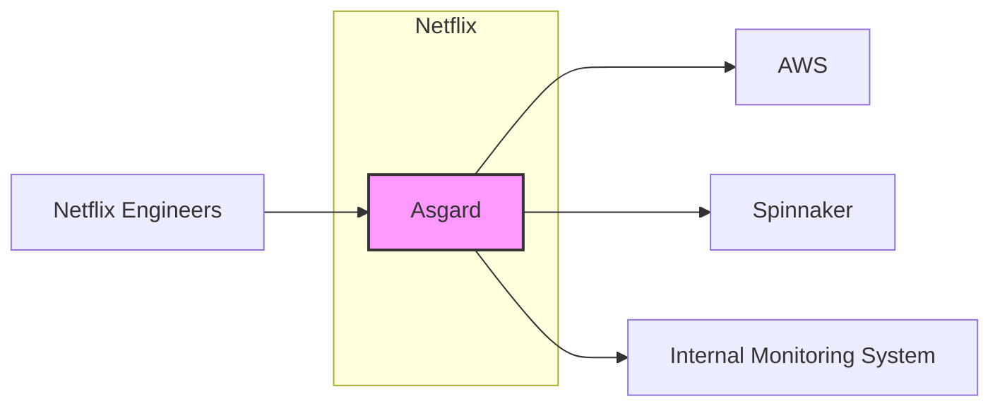
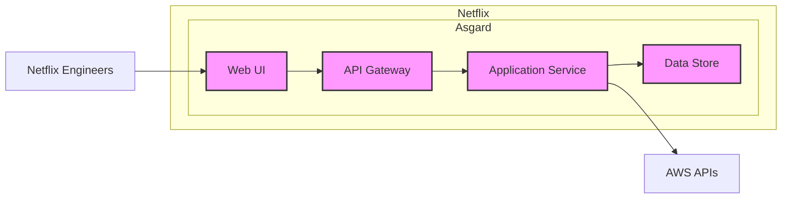
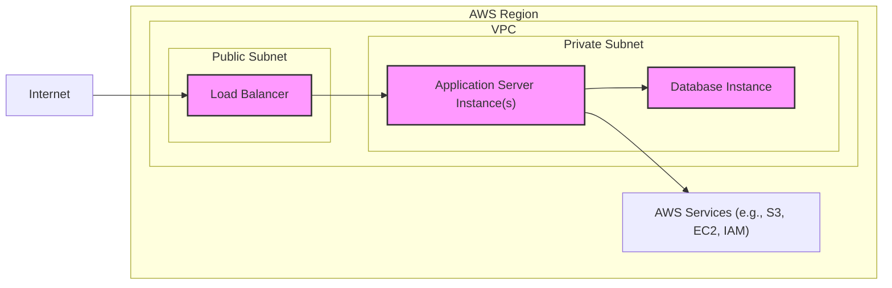
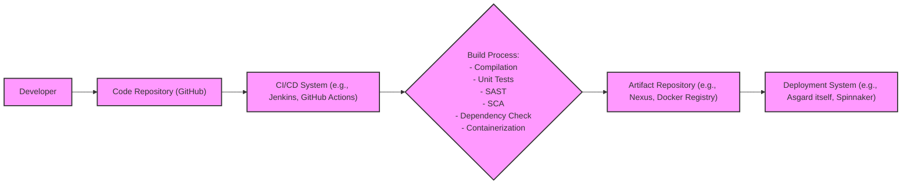

# BUSINESS POSTURE

Asgard is a web-based application deployment and management tool for Amazon Web Services (AWS). It aims to simplify the process of deploying and managing applications within the AWS cloud environment, providing a user-friendly interface for common AWS operations.

Business Priorities and Goals:
- Simplify AWS application deployment and management for Netflix engineers.
- Increase efficiency and reduce errors in deployment processes.
- Provide a centralized platform for managing AWS resources related to applications.
- Enable self-service capabilities for application teams to manage their deployments.
- Improve developer productivity by abstracting away the complexities of direct AWS API interactions.

Business Risks:
- Availability of Asgard platform can impact Netflix's ability to deploy and manage applications.
- Security vulnerabilities in Asgard could lead to unauthorized access and control over Netflix's AWS infrastructure.
- Data breaches through Asgard could expose sensitive application configurations and deployment information.
- Misconfiguration or errors introduced through Asgard could lead to service disruptions or security incidents.
- Dependence on a single tool for critical deployment processes creates a single point of failure.

# SECURITY POSTURE

Existing Security Controls:
- security control: Authentication to Asgard is likely integrated with Netflix's internal authentication systems (not explicitly detailed in the repository).
- security control: Authorization within Asgard is role-based, controlling access to different functionalities and AWS resources (not explicitly detailed in the repository).
- security control: Secure communication channels (HTTPS) are assumed for accessing the Asgard web interface.
- security control: Audit logging of actions performed within Asgard for monitoring and incident response (not explicitly detailed in the repository).

Accepted Risks:
- accepted risk: Reliance on Asgard's security posture for managing critical AWS infrastructure.
- accepted risk: Potential for vulnerabilities in Asgard's codebase to be exploited.
- accepted risk: Risk of insider threats or compromised accounts accessing Asgard.

Recommended Security Controls:
- security control: Implement multi-factor authentication (MFA) for Asgard access to enhance account security.
- security control: Conduct regular security vulnerability scanning and penetration testing of Asgard application and infrastructure.
- security control: Implement input validation and output encoding throughout the Asgard application to prevent injection attacks.
- security control: Implement robust access control lists (ACLs) and security groups for Asgard's infrastructure components.
- security control: Integrate Asgard with security information and event management (SIEM) system for real-time security monitoring and alerting.
- security control: Implement automated security checks in the software development lifecycle (SDLC) for Asgard, including static application security testing (SAST) and software composition analysis (SCA).

Security Requirements:
- Authentication:
    - Requirement: Securely authenticate users accessing Asgard web interface.
    - Requirement: Integrate with Netflix's central identity provider for user authentication.
    - Requirement: Support strong password policies and account lockout mechanisms.
- Authorization:
    - Requirement: Implement role-based access control (RBAC) to manage user permissions within Asgard.
    - Requirement: Enforce least privilege principle, granting users only necessary permissions.
    - Requirement: Control access to AWS resources based on user roles and application context.
- Input Validation:
    - Requirement: Validate all user inputs to prevent injection attacks (e.g., SQL injection, command injection, cross-site scripting).
    - Requirement: Sanitize user inputs before processing and storing them.
    - Requirement: Implement input validation on both client-side and server-side.
- Cryptography:
    - Requirement: Use HTTPS for all communication between user browsers and Asgard server.
    - Requirement: Securely store sensitive data at rest, such as API keys or credentials (if any are managed by Asgard).
    - Requirement: Implement secure key management practices for any cryptographic keys used by Asgard.

# DESIGN

## C4 CONTEXT

Context Diagram Elements:

- Element:
    - Name: Netflix Engineers
    - Type: User
    - Description: Netflix engineers who use Asgard to deploy and manage applications in AWS.
    - Responsibilities: Use Asgard to perform deployment and management tasks, configure applications, monitor application health.
    - Security controls: Multi-factor authentication for Netflix accounts, role-based access control within Netflix systems.

- Element:
    - Name: Asgard
    - Type: Software System
    - Description: Web-based application deployment and management tool for AWS.
    - Responsibilities: Provide a user interface for AWS operations, orchestrate deployments, manage application configurations, integrate with AWS APIs.
    - Security controls: Authentication, authorization, input validation, secure communication (HTTPS), audit logging.

- Element:
    - Name: AWS
    - Type: External System
    - Description: Amazon Web Services cloud platform where applications are deployed and managed.
    - Responsibilities: Provide infrastructure and services for running applications, manage compute, storage, networking, and other resources.
    - Security controls: AWS Identity and Access Management (IAM), security groups, network ACLs, encryption at rest and in transit, AWS CloudTrail logging.

- Element:
    - Name: Spinnaker
    - Type: External System
    - Description: Netflix's successor to Asgard, a more advanced continuous delivery platform.
    - Responsibilities:  Modern application deployment and management, continuous delivery pipelines, multi-cloud support.
    - Security controls: Spinnaker's own security mechanisms (authentication, authorization, etc.), integration with underlying cloud provider security controls.

- Element:
    - Name: Internal Monitoring System
    - Type: External System
    - Description: Netflix's internal monitoring and logging systems used to monitor the health and performance of applications deployed through Asgard.
    - Responsibilities: Collect metrics, logs, and traces from applications, provide dashboards and alerts, enable troubleshooting and performance analysis.
    - Security controls: Access control to monitoring data, secure data storage and transmission, audit logging of monitoring system access.

## C4 CONTAINER

Container Diagram Elements:

- Element:
    - Name: Web UI
    - Type: Web Application
    - Description: User interface for Asgard, providing a visual way for Netflix engineers to interact with the system. Built using technologies like Javascript, React, or similar.
    - Responsibilities: Present user interface, handle user interactions, communicate with API Gateway, display application and deployment information.
    - Security controls: Client-side input validation, secure session management, protection against cross-site scripting (XSS).

- Element:
    - Name: API Gateway
    - Type: Application
    - Description: Entry point for all API requests from the Web UI. Handles authentication, authorization, and request routing to the Application Service.
    - Responsibilities: Authentication and authorization of requests, rate limiting, request routing, API documentation.
    - Security controls: Authentication mechanisms, authorization policies, input validation, protection against API attacks (e.g., DDoS, injection).

- Element:
    - Name: Application Service
    - Type: Application
    - Description: Core business logic of Asgard. Processes user requests, interacts with AWS APIs, manages application state, and orchestrates deployments. Likely written in Java or similar backend language.
    - Responsibilities: Business logic execution, AWS API interaction, deployment orchestration, data management, authorization enforcement.
    - Security controls: Server-side input validation, authorization checks, secure coding practices, secure communication with Data Store and AWS APIs.

- Element:
    - Name: Data Store
    - Type: Database
    - Description: Persistent storage for Asgard's data, such as application configurations, deployment history, and user preferences. Could be a relational database (e.g., MySQL, PostgreSQL) or NoSQL database.
    - Responsibilities: Data persistence, data retrieval, data integrity, data backup and recovery.
    - Security controls: Access control to database, encryption at rest, encryption in transit, regular backups, database vulnerability scanning.

## DEPLOYMENT

Deployment Architecture Option: AWS Cloud Deployment

Deployment Diagram Elements:

- Element:
    - Name: Load Balancer
    - Type: AWS Service (Elastic Load Balancing)
    - Description: Distributes incoming traffic from the internet to the Application Server Instances. Provides high availability and scalability.
    - Responsibilities: Traffic distribution, health checks, SSL termination, DDoS protection.
    - Security controls: HTTPS termination, security groups, integration with AWS WAF (Web Application Firewall).

- Element:
    - Name: Application Server Instance(s)
    - Type: EC2 Instance(s)
    - Description: Instances running the Asgard Application Service and API Gateway containers. Deployed in a private subnet for security.
    - Responsibilities: Run Asgard application code, process requests, interact with database and AWS APIs.
    - Security controls: Security groups, hardened operating system, regular patching, intrusion detection system (IDS), access control lists (ACLs).

- Element:
    - Name: Database Instance
    - Type: AWS Service (RDS or EC2 Instance)
    - Description: Instance running the Asgard Data Store (database). Deployed in a private subnet for security.
    - Responsibilities: Persistent data storage, data management, database operations.
    - Security controls: Security groups, database access control, encryption at rest (RDS encryption), regular backups, database vulnerability scanning.

- Element:
    - Name: AWS Services (e.g., S3, EC2, IAM)
    - Type: AWS Services
    - Description: Various AWS services that Asgard interacts with to perform deployment and management tasks.
    - Responsibilities: Provide infrastructure and services for Asgard to manage, including compute, storage, identity and access management.
    - Security controls: AWS IAM policies, service-specific security controls, AWS CloudTrail logging.

## BUILD

Build Process Description:

1. Developer: Developers write and commit code changes to the Asgard codebase.
2. Code Repository (GitHub): Source code is stored and version controlled in a Git repository on GitHub.
3. CI/CD System (e.g., Jenkins, GitHub Actions): A CI/CD system is triggered by code changes to automate the build, test, and deployment pipeline.
4. Build Process:
    - Compilation: Source code is compiled into executable artifacts.
    - Unit Tests: Automated unit tests are executed to verify code functionality.
    - SAST (Static Application Security Testing): SAST tools are used to scan the source code for potential security vulnerabilities.
    - SCA (Software Composition Analysis): SCA tools are used to analyze dependencies and identify known vulnerabilities in third-party libraries.
    - Dependency Check: Tools are used to check for outdated or vulnerable dependencies.
    - Containerization: Application artifacts are packaged into container images (e.g., Docker images).
5. Artifact Repository (e.g., Nexus, Docker Registry): Built container images and other artifacts are stored in a secure artifact repository.
6. Deployment System (e.g., Asgard itself, Spinnaker): The deployment system retrieves artifacts from the repository and deploys them to the target environment (e.g., AWS).

Build Security Controls:
- security control: Secure code repository (GitHub) with access controls and audit logging.
- security control: Automated CI/CD pipeline to ensure consistent and repeatable builds.
- security control: Static Application Security Testing (SAST) to identify vulnerabilities in source code.
- security control: Software Composition Analysis (SCA) to manage and secure dependencies.
- security control: Dependency checking to identify and update vulnerable dependencies.
- security control: Container image scanning for vulnerabilities before deployment.
- security control: Secure artifact repository with access controls and vulnerability scanning.
- security control: Code signing and artifact integrity checks to ensure authenticity and prevent tampering.

# RISK ASSESSMENT

Critical Business Processes:
- Application Deployment: Asgard is critical for deploying new applications and updates to existing applications in AWS.
- Application Management: Asgard is used for managing the lifecycle of applications in AWS, including scaling, monitoring, and configuration changes.
- Infrastructure Management (indirectly): Asgard interacts with AWS infrastructure to support application deployments, making it indirectly involved in infrastructure management.

Data Sensitivity:
- Application Configuration Data: Asgard manages application configurations, which may contain sensitive information such as database connection strings, API keys, and other secrets. Sensitivity: High.
- Deployment History and Logs: Asgard stores deployment history and logs, which may contain information about application deployments and system activities. Sensitivity: Medium.
- User Credentials (indirectly): While Asgard likely integrates with Netflix's central authentication, it handles authorization and access control, indirectly dealing with user permissions. Sensitivity: Medium to High (depending on the level of access control managed within Asgard itself).
- Audit Logs: Asgard should generate audit logs of user actions, which are important for security monitoring and incident response. Sensitivity: Medium.

# QUESTIONS & ASSUMPTIONS

Questions:
- What specific authentication mechanism is used for Asgard? Is it integrated with Netflix's central identity provider?
- What level of authorization granularity is implemented within Asgard? How are roles and permissions managed?
- What type of database is used for Asgard's Data Store?
- Are there any specific compliance requirements that Asgard needs to adhere to (e.g., PCI DSS, HIPAA)?
- Is there a dedicated security team responsible for Asgard's security?
- What is the incident response plan for security incidents related to Asgard?

Assumptions:
- BUSINESS POSTURE: Asgard is a critical tool for Netflix's application deployment and management in AWS. Availability and security of Asgard are important for business continuity.
- SECURITY POSTURE: Asgard implements basic security controls like authentication and authorization. However, there is room for improvement in areas like MFA, vulnerability scanning, and automated security checks in the SDLC.
- DESIGN: Asgard follows a typical three-tier web application architecture with a Web UI, API Gateway, Application Service, and Data Store. It is deployed in AWS using standard AWS services like EC2, ELB, and RDS. The build process involves CI/CD automation and includes basic security checks.