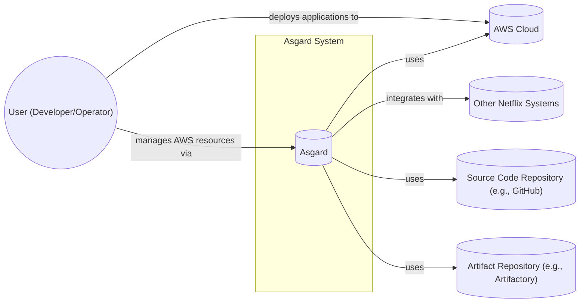
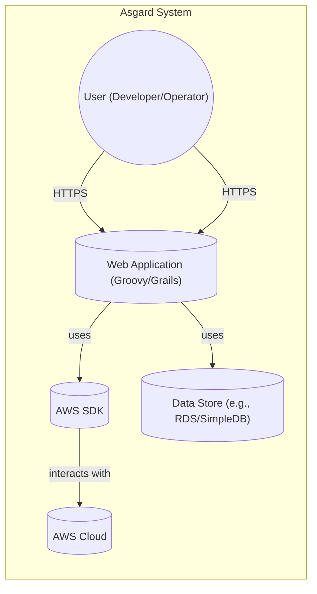
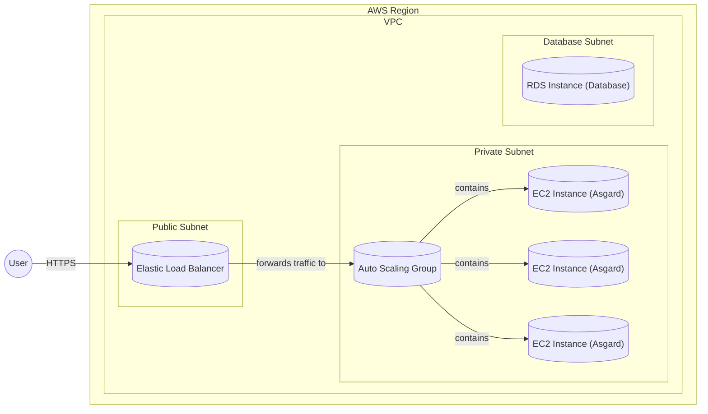
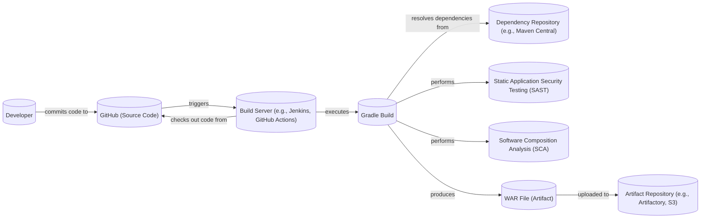

Okay, let's create a design document for Netflix's Asgard, keeping in mind its purpose and potential security considerations.

# BUSINESS POSTURE

Asgard is a web application that simplifies the deployment and management of applications on Amazon Web Services (AWS).  It was originally developed by Netflix and later open-sourced.  Given its origins and purpose, the following business priorities and goals can be inferred:

*   Priorities:
    *   Reliable and rapid application deployment:  Asgard's primary function is to streamline deployments, reducing time-to-market for new features and services.  This suggests a high priority on speed and automation.
    *   Scalability and elasticity:  Netflix operates at a massive scale. Asgard must support the deployment and management of applications that can handle significant fluctuations in traffic.
    *   Operational efficiency:  Asgard aims to reduce the operational overhead associated with managing cloud infrastructure.  This implies a focus on automation, self-service, and minimizing manual intervention.
    *   Cost optimization:  While not explicitly stated, managing cloud resources efficiently is crucial for cost control, especially at Netflix's scale. Asgard likely incorporates features to optimize resource utilization.
    *   Open Source Contribution: By open-sourcing Asgard, Netflix aims to contribute to the broader cloud community, fostering collaboration and potentially benefiting from external contributions.

*   Goals:
    *   Simplify AWS deployments:  Provide a user-friendly interface for deploying and managing applications on AWS, abstracting away some of the underlying complexity.
    *   Enable self-service deployments:  Empower developers to deploy and manage their applications independently, reducing reliance on centralized operations teams.
    *   Standardize deployment processes:  Promote consistent and repeatable deployments across different teams and applications.
    *   Integrate with existing Netflix infrastructure:  Asgard was built to work within Netflix's existing ecosystem of tools and services.

*   Business Risks:
    *   Unauthorized access:  Compromise of Asgard could grant attackers control over AWS resources, leading to data breaches, service disruptions, and significant financial losses.
    *   Deployment failures:  Errors in Asgard's deployment processes could lead to application outages, impacting Netflix's services and customer experience.
    *   Configuration errors:  Incorrect configurations within Asgard could expose vulnerabilities or lead to resource misallocation, impacting security and cost.
    *   Supply chain vulnerabilities:  Dependencies within Asgard (libraries, frameworks) could contain vulnerabilities that attackers could exploit.
    *   Lack of auditability:  Insufficient logging and auditing within Asgard could hinder incident response and compliance efforts.
    *   Data Loss: Asgard stores configurations and potentially sensitive information related to AWS deployments. Loss of this data could disrupt operations.

# SECURITY POSTURE

Based on the repository and common practices for similar applications, the following security controls and accepted risks are likely present:

*   security control: Authentication: Asgard likely uses AWS IAM (Identity and Access Management) for user authentication, leveraging existing AWS credentials and roles. Described in AWS documentation and Asgard's configuration guides.
*   security control: Authorization: Asgard probably implements role-based access control (RBAC) to restrict user actions based on their assigned permissions. This is likely integrated with AWS IAM roles and policies. Described in AWS documentation and Asgard's configuration guides.
*   security control: Input validation: Asgard should validate user inputs to prevent injection attacks and other common web vulnerabilities. Implemented within the application code.
*   security control: Encryption in transit: HTTPS is likely used to encrypt communication between users and the Asgard web interface. Implemented via web server configuration (e.g., Tomcat).
*   security control: Encryption at rest: Sensitive data stored by Asgard (e.g., AWS credentials, configuration settings) should be encrypted at rest. This might involve using AWS KMS (Key Management Service) or other encryption mechanisms. Implemented within the application and potentially leveraging AWS services.
*   security control: Auditing: Asgard likely logs user actions and system events to facilitate monitoring and incident response. This might involve integrating with AWS CloudTrail or other logging services. Implemented within the application and potentially leveraging AWS services.
*   security control: Dependency management: Asgard's build process should include mechanisms to identify and manage dependencies, including checking for known vulnerabilities. Implemented in the build process (e.g., Gradle).
*   security control: Regular security updates: The Asgard codebase and its dependencies should be regularly updated to address security vulnerabilities. This relies on the maintainers of the project and its dependencies.
*   accepted risk: Reliance on AWS security: Asgard heavily relies on the security of the underlying AWS infrastructure and services. This is a generally accepted risk when using cloud platforms, but it's important to understand the shared responsibility model.
*   accepted risk: Open-source nature: While open source offers benefits like transparency and community contributions, it also means that vulnerabilities are publicly disclosed. This requires diligent monitoring and patching.
*   accepted risk: Potential for misconfiguration: Asgard provides many configuration options, and incorrect settings could introduce security risks. This is mitigated by documentation and best practices, but the risk remains.

*   Recommended Security Controls:

    *   Implement a robust secrets management solution: Integrate with a dedicated secrets management service (e.g., AWS Secrets Manager, HashiCorp Vault) to securely store and manage sensitive credentials.
    *   Enable multi-factor authentication (MFA): Enforce MFA for all Asgard users, adding an extra layer of security beyond passwords.
    *   Implement static application security testing (SAST): Integrate SAST tools into the build pipeline to automatically scan the codebase for vulnerabilities.
    *   Implement dynamic application security testing (DAST): Perform regular DAST scans to identify vulnerabilities in the running application.
    *   Implement a web application firewall (WAF): Deploy a WAF in front of Asgard to protect against common web attacks.
    *   Implement runtime application self-protection (RASP): Consider using RASP technology to detect and prevent attacks at runtime.

*   Security Requirements:

    *   Authentication:
        *   Support for strong authentication mechanisms (e.g., AWS IAM, OAuth 2.0, SAML).
        *   Enforcement of multi-factor authentication (MFA).
        *   Secure storage and handling of user credentials.
    *   Authorization:
        *   Fine-grained role-based access control (RBAC).
        *   Principle of least privilege (users should only have access to the resources they need).
        *   Regular review and auditing of user permissions.
    *   Input Validation:
        *   Validation of all user inputs against a strict whitelist of allowed characters and formats.
        *   Protection against common web vulnerabilities (e.g., cross-site scripting (XSS), SQL injection, command injection).
    *   Cryptography:
        *   Use of strong, industry-standard cryptographic algorithms and protocols.
        *   Secure key management practices (e.g., using AWS KMS or a dedicated secrets management solution).
        *   Encryption of sensitive data in transit and at rest.
        *   Regular review and updating of cryptographic configurations.

# DESIGN

## C4 CONTEXT

*   Elements Description:
    *   User (Developer/Operator):
        *   Name: User (Developer/Operator)
        *   Type: Person
        *   Description: A developer or operator who uses Asgard to deploy and manage applications on AWS.
        *   Responsibilities: Interacts with Asgard's UI, defines deployment configurations, monitors application status.
        *   Security controls: Authentication (AWS IAM, OAuth, SAML), Authorization (RBAC), MFA.
    *   Asgard:
        *   Name: Asgard
        *   Type: Software System
        *   Description: The web application that simplifies AWS deployments and management.
        *   Responsibilities: Provides a user interface for managing AWS resources, automates deployment processes, integrates with other Netflix systems.
        *   Security controls: Input validation, encryption in transit (HTTPS), encryption at rest, auditing, dependency management.
    *   AWS Cloud:
        *   Name: AWS Cloud
        *   Type: External System
        *   Description: Amazon Web Services, the cloud platform where applications are deployed.
        *   Responsibilities: Provides compute, storage, networking, and other cloud services.
        *   Security controls: AWS IAM, AWS KMS, AWS CloudTrail, VPC security groups, network ACLs, and numerous other AWS security services.
    *   Other Netflix Systems:
        *   Name: Other Netflix Systems
        *   Type: External System
        *   Description: Other internal Netflix tools and services that Asgard might integrate with.
        *   Responsibilities: Varies depending on the specific system (e.g., monitoring, logging, CI/CD).
        *   Security controls: Dependent on the specific system; likely includes authentication, authorization, and encryption.
    *   Source Code Repository (e.g., GitHub):
        *   Name: Source Code Repository
        *   Type: External System
        *   Description: The repository where application source code is stored.
        *   Responsibilities: Version control, code collaboration.
        *   Security controls: Access controls, branch protection rules, code review processes.
    *   Artifact Repository (e.g., Artifactory):
        *   Name: Artifact Repository
        *   Type: External System
        *   Description: Repository to store build artifacts.
        *   Responsibilities: Store and manage build artifacts.
        *   Security controls: Access controls.

## C4 CONTAINER

*   Elements Description:

    *   Web Application (Groovy/Grails):
        *   Name: Web Application
        *   Type: Web Application
        *   Description: The core of Asgard, built using Groovy and Grails.  Handles user requests, interacts with the AWS SDK, and manages data persistence.
        *   Responsibilities: User interface rendering, request processing, business logic, data access.
        *   Security controls: Input validation, output encoding, session management, authentication and authorization logic, encryption of sensitive data.
    *   AWS SDK:
        *   Name: AWS SDK
        *   Type: Library
        *   Description: The official AWS SDK, used to interact with various AWS services.
        *   Responsibilities: Provides APIs for interacting with AWS services (e.g., EC2, S3, Auto Scaling).
        *   Security controls: Uses AWS IAM credentials for authentication and authorization, encrypts communication with AWS services.
    *   Data Store (e.g., RDS/SimpleDB):
        *   Name: Data Store
        *   Type: Database
        *   Description: Stores Asgard's configuration data, deployment history, and other persistent information.  Could be AWS RDS, SimpleDB, or another database.
        *   Responsibilities: Data persistence, retrieval, and management.
        *   Security controls: Access controls (database user accounts, network security), encryption at rest, regular backups.
    *   AWS Cloud:
        *   Name: AWS Cloud
        *   Type: External System
        *   Description: Amazon Web Services.
        *   Responsibilities: Provides compute, storage, networking, and other cloud services.
        *   Security controls: AWS IAM, AWS KMS, AWS CloudTrail, VPC security groups, network ACLs, and numerous other AWS security services.

## DEPLOYMENT

Asgard, being a web application, can be deployed in several ways on AWS:

1.  **EC2 Instances (Traditional):**  Deploying Asgard on one or more EC2 instances, potentially behind a load balancer. This is the most likely original deployment model.
2.  **Elastic Beanstalk:**  Using AWS Elastic Beanstalk to simplify deployment and management.  Beanstalk handles provisioning, load balancing, and scaling.
3.  **Containers (ECS/EKS):**  Containerizing Asgard using Docker and deploying it on Amazon ECS (Elastic Container Service) or EKS (Elastic Kubernetes Service).
4.  **Serverless (Lambda/API Gateway):**  While less likely for a full web application like Asgard, parts of its functionality could potentially be implemented using AWS Lambda and API Gateway.

We'll describe the **EC2 Instances (Traditional)** deployment in detail, as it's a common and likely approach for Asgard:

*   Elements Description:

    *   User:
        *   Name: User
        *   Type: Person
        *   Description: A developer or operator accessing Asgard.
        *   Responsibilities: Accesses Asgard via a web browser.
        *   Security controls: Authentication (AWS IAM, OAuth, SAML), Authorization (RBAC), MFA.
    *   Elastic Load Balancer (ELB):
        *   Name: Elastic Load Balancer
        *   Type: Load Balancer
        *   Description: Distributes incoming traffic across multiple EC2 instances running Asgard.
        *   Responsibilities: Load balancing, SSL termination (potentially), health checks.
        *   Security controls: SSL/TLS configuration, security groups, access logs.
    *   Auto Scaling Group (ASG):
        *   Name: Auto Scaling Group
        *   Type: Auto Scaling Group
        *   Description: Manages a group of EC2 instances, automatically scaling the number of instances up or down based on demand.
        *   Responsibilities: Scaling, health checks, instance replacement.
        *   Security controls: Launch configurations (specifying AMI, instance type, security groups), scaling policies.
    *   EC2 Instance (Asgard):
        *   Name: EC2 Instance (Asgard)
        *   Type: Virtual Machine
        *   Description: An EC2 instance running the Asgard web application.
        *   Responsibilities: Running the Asgard application code, handling user requests.
        *   Security controls: Security groups, IAM roles, OS-level security hardening, application-level security controls.
    *   RDS Instance (Database):
        *   Name: RDS Instance (Database)
        *   Type: Database
        *   Description: An Amazon RDS instance hosting Asgard's database.
        *   Responsibilities: Data persistence.
        *   Security controls: Security groups, database user accounts, encryption at rest, backups, parameter groups (for database configuration).
    *   VPC:
        *   Name: VPC
        *   Type: Virtual Private Cloud
        *   Description: logically isolated section of the AWS Cloud network.
        *   Responsibilities: Provides network isolation.
        *   Security controls: Security groups, network ACLs.
    *   Public Subnet:
        *   Name: Public Subnet
        *   Type: Network
        *   Description: Subnet with the route to internet.
        *   Responsibilities: Provides access from internet.
        *   Security controls: Security groups, network ACLs.
    *   Private Subnet:
        *   Name: Private Subnet
        *   Type: Network
        *   Description: Subnet without the route to internet.
        *   Responsibilities: Provides network isolation.
        *   Security controls: Security groups, network ACLs.
    *   Database Subnet:
        *   Name: Database Subnet
        *   Type: Network
        *   Description: Subnet without the route to internet.
        *   Responsibilities: Provides network isolation.
        *   Security controls: Security groups, network ACLs.

## BUILD

The Asgard build process, based on the GitHub repository, uses Gradle. Here's a breakdown of the process and relevant security considerations:

*   Process Description:

    1.  **Code Commit:** A developer commits code changes to the GitHub repository.
    2.  **Build Trigger:**  A build server (e.g., Jenkins, or potentially GitHub Actions, though the repository doesn't explicitly show this) is triggered by the code commit.
    3.  **Code Checkout:** The build server checks out the latest code from GitHub.
    4.  **Gradle Build:** The build server executes the Gradle build script.
    5.  **Dependency Resolution:** Gradle resolves project dependencies from a dependency repository (e.g., Maven Central, or a private repository).
    6.  **SAST (Recommended):**  Ideally, a SAST tool (e.g., FindBugs, SpotBugs, SonarQube) is integrated into the Gradle build to scan the code for vulnerabilities. This is *not* explicitly shown in the repository, but is a highly recommended security control.
    7.  **SCA (Recommended):** A Software Composition Analysis (SCA) tool (e.g., OWASP Dependency-Check, Snyk) should be used to analyze dependencies for known vulnerabilities. Again, this is a recommended practice.
    8.  **Artifact Creation:**  The Gradle build produces a WAR (Web Application Archive) file, which is the deployable artifact.
    9.  **Artifact Upload:** The WAR file is uploaded to an artifact repository (e.g., Artifactory, or an S3 bucket).

*   Security Controls:

    *   security control: **Dependency Management:** Gradle manages dependencies, but it's crucial to use SCA tools to identify and mitigate vulnerabilities in those dependencies.
    *   security control: **SAST (Recommended):** Integrating SAST into the build process helps identify vulnerabilities early in the development lifecycle.
    *   security control: **SCA (Recommended):** Using SCA tools helps ensure that known vulnerable dependencies are not included in the build.
    *   security control: **Build Server Security:** The build server itself should be secured, with limited access and regular security updates.
    *   security control: **Artifact Repository Security:** The artifact repository should be secured with access controls and potentially encryption.
    *   security control: **Code Signing (Recommended):**  Consider signing the WAR file to ensure its integrity and authenticity.

# RISK ASSESSMENT

*   Critical Business Processes:
    *   Application deployment and management on AWS.
    *   Rapid iteration and release of new features and services.
    *   Maintaining the availability and performance of Netflix services.
    *   Efficient utilization of AWS resources.

*   Data Sensitivity:
    *   **AWS Credentials:**  Asgard interacts with AWS APIs and therefore likely handles AWS credentials (access keys, secret keys, IAM roles). These are highly sensitive and must be protected with utmost care.  Sensitivity: **Critical**.
    *   **Deployment Configurations:**  Asgard stores configuration settings for deployments, including instance types, security groups, and other parameters.  While not as sensitive as credentials, this information could be used to exploit misconfigurations. Sensitivity: **High**.
    *   **Application Metadata:**  Asgard stores information about deployed applications, their versions, and associated resources.  This data could be valuable for reconnaissance. Sensitivity: **Medium**.
    *   **User Data:**  Asgard likely stores user information (usernames, roles, permissions).  This data should be protected to comply with privacy regulations. Sensitivity: **Medium**.
    *   **Logs:**  Asgard's logs may contain sensitive information, including details about deployments, errors, and user actions. Sensitivity: **Medium to High**, depending on the logging level and content.

# QUESTIONS & ASSUMPTIONS

*   Questions:

    *   What specific secrets management solution is used (or intended to be used) with Asgard?
    *   What are the specific logging and monitoring practices for Asgard deployments?
    *   Are there any existing integrations with other Netflix security tools (e.g., security monitoring, incident response)?
    *   What is the process for handling security vulnerabilities discovered in Asgard or its dependencies?
    *   What level of code review and security testing is performed before releases?
    *   Is there a documented disaster recovery plan for Asgard?
    *   What is current status of project? Is it actively maintained?

*   Assumptions:

    *   BUSINESS POSTURE: Assumes that Asgard is still used within Netflix, or at least that its design principles are relevant to similar internal tools. Assumes a high degree of automation and a fast-paced development environment.
    *   SECURITY POSTURE: Assumes that basic security practices (e.g., HTTPS, input validation) are implemented, even if not explicitly mentioned in the repository. Assumes reliance on AWS security services for infrastructure-level protection.
    *   DESIGN: Assumes a traditional EC2-based deployment model, as it's a common approach and aligns with the information available. Assumes that Gradle is the primary build tool. Assumes that some form of data store is used, even if the specific type is not clear.
    *   BUILD: Assumes that build process is automated.